#A.C. Futures Inc.
Status: Dead
Address: Atlas Maritime Services Ltd. Ville Farm P.O. Box 9 Sark GY9 0SB Channel Is. via Guernsey

##Incoming
INTERMEDIARY
Atlas Maritime Services Ltd.
United Kingdom

##Outgoing
REGISTERED_ADDRESSAtlas Maritime Services Ltd. Ville Farm P.O. Box 9 Sark   (via Guernsey GY9 0SE) Channel Islands United Kingdom
United Kingdom

##Graph

```mermaid
graph LR
classDef outline fill:#fff,stroke:#000,stroke-width:1px;
node1[AC Futures Inc<br>]
node2[Atlas Maritime Services Ltd<br>United Kingdom]
node2-->|INTERMEDIARY_OF|node1
node3[<br>United Kingdom]
node1-->|REGISTERED_ADDRESS|node3
class node1 outline
node2-->|REGISTERED_ADDRESS|node3
node4[Seikata Limited<br>]
node2-->|INTERMEDIARY_OF|node4
node5[Oleron Shipping Limited<br>]
node2-->|INTERMEDIARY_OF|node5
node6[Millside Limited<br>]
node2-->|INTERMEDIARY_OF|node6
node7[Oakstream Ltd<br>]
node2-->|INTERMEDIARY_OF|node7
node8[Domus International Enterprises Ltd<br>]
node2-->|INTERMEDIARY_OF|node8
node9[Eurasian Invest Ltd<br>]
node2-->|INTERMEDIARY_OF|node9
node10[UK Invest Ltd<br>]
node2-->|INTERMEDIARY_OF|node10
node11[Market Timing Limited<br>]
node2-->|INTERMEDIARY_OF|node11
node12[Dorchester Marketing Limited<br>]
node2-->|INTERMEDIARY_OF|node12
node13[Key Properties Investments Limited<br>]
node2-->|INTERMEDIARY_OF|node13
node14[Profit Research Limited<br>]
node2-->|INTERMEDIARY_OF|node14
node15[Limestone Associates Limited<br>]
node2-->|INTERMEDIARY_OF|node15
node16[ALTERNATIVE CAPITAL PARTNERS LTD<br>]
node2-->|INTERMEDIARY_OF|node16
node17[Jupiter Technology Management Limited<br>]
node2-->|INTERMEDIARY_OF|node17
node18[Inconnect International Ltd<br>]
node2-->|INTERMEDIARY_OF|node18
node19[Northstar International Enterprises Limited<br>]
node2-->|INTERMEDIARY_OF|node19
node20[Sea Eagle Maritime Ltd<br>]
node2-->|INTERMEDIARY_OF|node20
node21[SILITRON LTD<br>]
node2-->|INTERMEDIARY_OF|node21
node22[Firebrand Ltd<br>]
node2-->|INTERMEDIARY_OF|node22
node23[Global Telecommunications Systems Ltd<br>]
node2-->|INTERMEDIARY_OF|node23
node24[International Investment Partners Ltd<br>]
node2-->|INTERMEDIARY_OF|node24
node25[Domerise Limited<br>]
node2-->|INTERMEDIARY_OF|node25
node26[Dogcrest Limited<br>]
node2-->|INTERMEDIARY_OF|node26
node27[Bearspaw Limited<br>]
node2-->|INTERMEDIARY_OF|node27
node28[Sealand Marine Limited<br>]
node2-->|INTERMEDIARY_OF|node28
node29[Coast Marine Limited<br>]
node2-->|INTERMEDIARY_OF|node29
node30[Highgate Group Limited<br>]
node2-->|INTERMEDIARY_OF|node30
node31[Banockspring Limited<br>]
node2-->|INTERMEDIARY_OF|node31
node32[Equus Investments Group Limited<br>]
node2-->|INTERMEDIARY_OF|node32
node33[Blue Ribbon Holding Group Ltd<br>]
node2-->|INTERMEDIARY_OF|node33
node34[Ambersley Investments Limited<br>]
node2-->|INTERMEDIARY_OF|node34
node35[Cloverleaf Properties Limited<br>]
node2-->|INTERMEDIARY_OF|node35
node36[Aston Cross Ltd<br>]
node2-->|INTERMEDIARY_OF|node36
node37[21st Century Equities Ltd<br>]
node2-->|INTERMEDIARY_OF|node37
node38[Shikari Ltd<br>]
node2-->|INTERMEDIARY_OF|node38
node39[Galaxy Marine Limited<br>]
node2-->|INTERMEDIARY_OF|node39
node40[Greenpower Developments SA<br>]
node2-->|INTERMEDIARY_OF|node40
node41[Aquadilla SA<br>]
node2-->|INTERMEDIARY_OF|node41
node42[Reedcrest Limited<br>]
node2-->|INTERMEDIARY_OF|node42
node43[Foxglen Limited<br>]
node2-->|INTERMEDIARY_OF|node43
node44[Quorum Finance Limited<br>]
node2-->|INTERMEDIARY_OF|node44
node45[Changed Latitude Limited<br>]
node2-->|INTERMEDIARY_OF|node45
node46[4Star Investment Holdings Limited<br>]
node2-->|INTERMEDIARY_OF|node46
node47[Asset Alliance Limited<br>]
node2-->|INTERMEDIARY_OF|node47
node48[Rioja Limited<br>]
node2-->|INTERMEDIARY_OF|node48
node49[BJG Holdings Ltd<br>]
node2-->|INTERMEDIARY_OF|node49
node50[Crownworth Developments Limited<br>]
node2-->|INTERMEDIARY_OF|node50
node51[Tonbridge Management Limited<br>]
node2-->|INTERMEDIARY_OF|node51
node52[Cordillera Investments Ltd<br>]
node2-->|INTERMEDIARY_OF|node52
node53[Lidar Business Ltd<br>]
node2-->|INTERMEDIARY_OF|node53
node54[Questbridge Ltd<br>]
node2-->|INTERMEDIARY_OF|node54
node55[Astride Investments Ltd<br>]
node2-->|INTERMEDIARY_OF|node55
node56[Silverhead Limited<br>]
node2-->|INTERMEDIARY_OF|node56
node57[Media Line Consulting Limited<br>]
node2-->|INTERMEDIARY_OF|node57
node58[Great Wall Investment Holdings Limited<br>]
node2-->|INTERMEDIARY_OF|node58
node59[Cosmos Maritime Limited<br>]
node2-->|INTERMEDIARY_OF|node59
node60[Apparent Wind Limited<br>]
node2-->|INTERMEDIARY_OF|node60
node61[XTREME STAR LTD<br>]
node2-->|INTERMEDIARY_OF|node61
node62[Wappingcrest Limited<br>]
node2-->|INTERMEDIARY_OF|node62
node63[Marriots Business Services%28Kevin Brown/Gary Watkin<br>]
node2-->|INTERMEDIARY_OF|node63
node64[Messenger Investments Limited<br>]
node2-->|INTERMEDIARY_OF|node64
node65[Pulford Park Ltd<br>]
node2-->|INTERMEDIARY_OF|node65
node66[Stalco SA<br>]
node2-->|INTERMEDIARY_OF|node66
node67[Cranespring Limited<br>]
node2-->|INTERMEDIARY_OF|node67
node68[JADECREEK LTD<br>]
node2-->|INTERMEDIARY_OF|node68
node69[Piesse International Limited<br>]
node2-->|INTERMEDIARY_OF|node69
node70[Advantage Enterprises Group Limited<br>]
node2-->|INTERMEDIARY_OF|node70
node71[Winnie Yachting Limited<br>]
node2-->|INTERMEDIARY_OF|node71
node72[Roam International Limited<br>]
node2-->|INTERMEDIARY_OF|node72
node73[Irontight Holding Limited<br>]
node2-->|INTERMEDIARY_OF|node73
node74[Ocean International Group Ltd<br>]
node2-->|INTERMEDIARY_OF|node74
node75[TMI Investments Ltd<br>]
node2-->|INTERMEDIARY_OF|node75
node76[Webtrend Ltd<br>]
node2-->|INTERMEDIARY_OF|node76
node77[Poseidon Investment Holdings Limited<br>]
node2-->|INTERMEDIARY_OF|node77
node78[Lighthouse Resources Limited<br>]
node2-->|INTERMEDIARY_OF|node78
node79[Goldbridge Limited<br>]
node2-->|INTERMEDIARY_OF|node79
node80[Golden Stone Group Limited<br>]
node2-->|INTERMEDIARY_OF|node80
node81[Permian Group Ltd<br>]
node2-->|INTERMEDIARY_OF|node81
node82[Royalcrest Ltd<br>]
node2-->|INTERMEDIARY_OF|node82
node83[Middle East & Africa Investments %28BVI%29 Ltd<br>]
node2-->|INTERMEDIARY_OF|node83
node84[Redwind Ltd<br>]
node2-->|INTERMEDIARY_OF|node84
node85[Rodcom Global Limited<br>]
node2-->|INTERMEDIARY_OF|node85
node86[CREADVILLE LTD<br>]
node2-->|INTERMEDIARY_OF|node86
node87[Caviar Capital Group Limited<br>]
node2-->|INTERMEDIARY_OF|node87
node88[Hardeman Group Limited<br>]
node2-->|INTERMEDIARY_OF|node88
node89[Park Overseas Ltd<br>]
node2-->|INTERMEDIARY_OF|node89
node90[Omega Shareholdings Ltd<br>]
node2-->|INTERMEDIARY_OF|node90
node91[True Investments Group Limited<br>]
node2-->|INTERMEDIARY_OF|node91
node92[Goodenough Limited<br>]
node2-->|INTERMEDIARY_OF|node92
node93[Nottingdale Ltd<br>]
node2-->|INTERMEDIARY_OF|node93
node94[Red Sky At Night Limited<br>]
node2-->|INTERMEDIARY_OF|node94
node95[Keyinvest LTd<br>]
node2-->|INTERMEDIARY_OF|node95
node96[Blue Lines International Ltd<br>]
node2-->|INTERMEDIARY_OF|node96
node97[Lighthouse Beacon Limited<br>]
node2-->|INTERMEDIARY_OF|node97
node98[Quicksilver Group Limited<br>]
node2-->|INTERMEDIARY_OF|node98
node99[President Telecom Limited<br>]
node2-->|INTERMEDIARY_OF|node99
node100[Dogspring Limited<br>]
node2-->|INTERMEDIARY_OF|node100
node101[Amazon Shipping Limted<br>]
node2-->|INTERMEDIARY_OF|node101
node102[Duckstone Limited<br>]
node2-->|INTERMEDIARY_OF|node102
node103[Luis Overseas Inc<br>]
node2-->|INTERMEDIARY_OF|node103
node104[Kingwind Limited<br>]
node2-->|INTERMEDIARY_OF|node104
node105[Walspring Ltd<br>]
node2-->|INTERMEDIARY_OF|node105
node106[Cryo Limited<br>]
node2-->|INTERMEDIARY_OF|node106
node107[Randa Holdings SA<br>]
node2-->|INTERMEDIARY_OF|node107
node108[JOKABI LIMITED<br>]
node2-->|INTERMEDIARY_OF|node108
node109[Kalpyl Investments Co Ltd<br>]
node2-->|INTERMEDIARY_OF|node109
node110[SUNSEEKER MIDDLE EAST LIMITED<br>]
node2-->|INTERMEDIARY_OF|node110
node111[Olde English Pub Co Ltd<br>]
node2-->|INTERMEDIARY_OF|node111
node112[Strathclair Limited<br>]
node2-->|INTERMEDIARY_OF|node112
node113[Seatransport Services Limited<br>]
node2-->|INTERMEDIARY_OF|node113
node114[Ravensfield Ltd<br>]
node2-->|INTERMEDIARY_OF|node114
node115[Morgan Howard %28British Virgin Islands%29 Limited<br>]
node2-->|INTERMEDIARY_OF|node115
node116[Chesapeake-Ross Resources Ltd<br>]
node2-->|INTERMEDIARY_OF|node116
node117[T Montana Holdings Ltd<br>]
node2-->|INTERMEDIARY_OF|node117
node118[Polestar Navigation Ltd<br>]
node2-->|INTERMEDIARY_OF|node118
node119[Cavehill Commodities Limited<br>]
node2-->|INTERMEDIARY_OF|node119
node120[Preeminent Consulting Limited<br>]
node2-->|INTERMEDIARY_OF|node120
node121[PEJ 70 LIMITED<br>]
node2-->|INTERMEDIARY_OF|node121
node122[Pamaco Shipping Co Ltd<br>]
node2-->|INTERMEDIARY_OF|node122
node123[Ikos Development Ltd<br>]
node2-->|INTERMEDIARY_OF|node123
node124[24 Hour Trading Ltd<br>]
node2-->|INTERMEDIARY_OF|node124
node125[Blind Channel Limited<br>]
node2-->|INTERMEDIARY_OF|node125
node126[ASF Incorporation Limited<br>]
node2-->|INTERMEDIARY_OF|node126
node127[Three Corner Hat Investments Limited<br>]
node2-->|INTERMEDIARY_OF|node127
node128[Theriford Ltd<br>]
node2-->|INTERMEDIARY_OF|node128
node129[Nouveau Geneve Limited<br>]
node2-->|INTERMEDIARY_OF|node129
node130[Cryo Cryo Limited<br>]
node2-->|INTERMEDIARY_OF|node130
node131[Crestswift Enterprises Limited<br>]
node2-->|INTERMEDIARY_OF|node131
node132[EMBF Emerging Market Investments Ltd<br>]
node2-->|INTERMEDIARY_OF|node132
node133[Westwillow Investments Ltd<br>]
node2-->|INTERMEDIARY_OF|node133
node134[Home Run Holdings Ltd<br>]
node2-->|INTERMEDIARY_OF|node134
node135[Tweedsmuir Limited<br>]
node2-->|INTERMEDIARY_OF|node135
node136[Aegean Cruises Limited<br>]
node2-->|INTERMEDIARY_OF|node136
node137[Contreman Limited<br>]
node2-->|INTERMEDIARY_OF|node137
node138[Rangeview Enterprises Limited<br>]
node2-->|INTERMEDIARY_OF|node138
node139[Real-T- Limited<br>]
node2-->|INTERMEDIARY_OF|node139
node140[Baku Dodson Timon Limited<br>]
node2-->|INTERMEDIARY_OF|node140
node141[Maxconsult Group Ltd<br>]
node2-->|INTERMEDIARY_OF|node141
node142[Astralsafe Investments Limited<br>]
node2-->|INTERMEDIARY_OF|node142
node143[Richemont Investment Group Limited<br>]
node2-->|INTERMEDIARY_OF|node143
node144[Pleiades Holdings Ltd<br>]
node2-->|INTERMEDIARY_OF|node144
node145[Mayorcrest Limited<br>]
node2-->|INTERMEDIARY_OF|node145
node146[Castleford Group Limited<br>]
node2-->|INTERMEDIARY_OF|node146
node147[Indiport Ltd<br>]
node2-->|INTERMEDIARY_OF|node147
node148[Lettercrest Ltd<br>]
node2-->|INTERMEDIARY_OF|node148
node149[Woodford Capital Partners Limited<br>]
node2-->|INTERMEDIARY_OF|node149
node150[Astra Research Limited<br>]
node2-->|INTERMEDIARY_OF|node150
node151[Elmar Marine Limited<br>]
node2-->|INTERMEDIARY_OF|node151
node152[Pressworth Limited<br>]
node2-->|INTERMEDIARY_OF|node152
node153[Italian Properties Limited<br>]
node2-->|INTERMEDIARY_OF|node153
node154[HOLMESTAR LTD<br>]
node2-->|INTERMEDIARY_OF|node154
node155[Pure Profit Trading Limited<br>]
node2-->|INTERMEDIARY_OF|node155
node156[Alex Engineering Ltd<br>]
node2-->|INTERMEDIARY_OF|node156
node157[Brigantine Marine Limited<br>]
node2-->|INTERMEDIARY_OF|node157
node158[Ensign Maritime Ltd<br>]
node2-->|INTERMEDIARY_OF|node158
node159[Dans Le Vent SA<br>]
node2-->|INTERMEDIARY_OF|node159
node160[Cobbold International Limited<br>]
node2-->|INTERMEDIARY_OF|node160
node161[Jasleen Holdings Ltd<br>]
node2-->|INTERMEDIARY_OF|node161
node162[Maxco International Limited<br>]
node2-->|INTERMEDIARY_OF|node162
node163[Alexandra Property Holdings Limited<br>]
node2-->|INTERMEDIARY_OF|node163
node164[Northhall Limited<br>]
node2-->|INTERMEDIARY_OF|node164
node165[Rubicon For Trade And Industry Limited<br>]
node2-->|INTERMEDIARY_OF|node165
node166[Creaton Services Limited<br>]
node2-->|INTERMEDIARY_OF|node166
node167[Hawksbrook Ltd<br>]
node2-->|INTERMEDIARY_OF|node167
node168[HYDINE LIMITED<br>]
node2-->|INTERMEDIARY_OF|node168
node169[Algernon Holdings Limited<br>]
node2-->|INTERMEDIARY_OF|node169
node170[Harmondsworth Limited<br>]
node2-->|INTERMEDIARY_OF|node170
node171[Starlight Shipping Limited<br>]
node2-->|INTERMEDIARY_OF|node171
node172[THE BELGIAN FOOD COMPANY HOLDINGS LTD<br>]
node2-->|INTERMEDIARY_OF|node172
node173[Spymar Limited<br>]
node2-->|INTERMEDIARY_OF|node173
node174[Deltacrest Developments Ltd<br>]
node2-->|INTERMEDIARY_OF|node174
node175[Rutland Estates Limited<br>]
node2-->|INTERMEDIARY_OF|node175
node176[Atlas Maritime Services Ltd<br>]
node2-->|INTERMEDIARY_OF|node176
node177[Delano Two Limited<br>]
node2-->|INTERMEDIARY_OF|node177
node2-->|INTERMEDIARY_OF|node1
node178[Illingsworth Ltd<br>]
node2-->|INTERMEDIARY_OF|node178
node179[JBB Holding SA<br>]
node2-->|INTERMEDIARY_OF|node179
node180[Forays Investments Ltd<br>]
node2-->|INTERMEDIARY_OF|node180
node181[Paramount Western Group Ltd<br>]
node2-->|INTERMEDIARY_OF|node181
node182[Worthport Limited<br>]
node2-->|INTERMEDIARY_OF|node182
node183[Goldhawk Limited<br>]
node2-->|INTERMEDIARY_OF|node183
node184[Mykonos Rhapsody Limited<br>]
node2-->|INTERMEDIARY_OF|node184
node185[Smith Benson Limited<br>]
node2-->|INTERMEDIARY_OF|node185
node186[Bigger Share Limited<br>]
node2-->|INTERMEDIARY_OF|node186
node187[Right Way Group Limited<br>]
node2-->|INTERMEDIARY_OF|node187
node188[Sagewood Limited<br>]
node2-->|INTERMEDIARY_OF|node188
node189[Delta Trading Ventures Limited<br>]
node2-->|INTERMEDIARY_OF|node189
node190[Banyan Property Limited<br>]
node2-->|INTERMEDIARY_OF|node190
node191[Central Effects Limited<br>]
node2-->|INTERMEDIARY_OF|node191
node192[Siekoso Limited<br>]
node2-->|INTERMEDIARY_OF|node192
node193[Boo Limited<br>]
node2-->|INTERMEDIARY_OF|node193
node194[Farma Pro Limited<br>]
node2-->|INTERMEDIARY_OF|node194
```
