#ANGEL CONSULTANTS LTD.
Status: Active
Address: M.R.D ATTN M VAL SAVILL ESQ BP 172 98003 MONACO CEDEX PRINCIPALITY OF MONACO *S.I.*

##Incoming
INTERMEDIARY
SAVILL-MF, VAL
M.R.D ATTN M VAL SAVILL ESQ BP 172 98003 MONACO CEDEX PRINCIPALITY OF MONACO *S.I.*
Monaco

##Graph

```mermaid
graph LR
classDef outline fill:#fff,stroke:#000,stroke-width:1px;
node1[ANGEL CONSULTANTS LTD<br>]
node2[SAVILL-MF, VAL<br>Monaco]
node2-->|INTERMEDIARY_OF|node1
class node1 outline
node3[FORTUNE SERVICES LTD<br>]
node2-->|INTERMEDIARY_OF|node3
node4[FOXFIN SERVICES LTD<br>]
node2-->|INTERMEDIARY_OF|node4
node5[REDSAND  LTD<br>]
node2-->|INTERMEDIARY_OF|node5
node6[BIOLAKE CONSULTANTS LTD<br>]
node2-->|INTERMEDIARY_OF|node6
node7[TONICOM LTD<br>]
node2-->|INTERMEDIARY_OF|node7
node8[PERFECT FUTURE LTD<br>]
node2-->|INTERMEDIARY_OF|node8
node9[ANGEL ADVISORS LTD<br>]
node2-->|INTERMEDIARY_OF|node9
node10[EDENSMITH FINANCE LTD<br>]
node2-->|INTERMEDIARY_OF|node10
node11[ROMASIA SERVICES LTD<br>]
node2-->|INTERMEDIARY_OF|node11
node12[COMATOM LTD<br>]
node2-->|INTERMEDIARY_OF|node12
node13[NEWEARTH MANAGEMENT LTD<br>]
node2-->|INTERMEDIARY_OF|node13
node14[ASSETS FORTUNE MANAGEMENT LTD<br>]
node2-->|INTERMEDIARY_OF|node14
node15[MEDIA ASSETS PARTNERS LTD<br>]
node2-->|INTERMEDIARY_OF|node15
node16[DAISYWOOD TRADING LTD<br>]
node2-->|INTERMEDIARY_OF|node16
node17[WESTMOUNT CONSULTANTS LTD<br>]
node2-->|INTERMEDIARY_OF|node17
node18[SPIRIT FINANCE LTD<br>]
node2-->|INTERMEDIARY_OF|node18
node19[BAYARD FINANCE LTD<br>]
node2-->|INTERMEDIARY_OF|node19
node20[CALLISTO FINANCE LTD<br>]
node2-->|INTERMEDIARY_OF|node20
node21[PETRUS CONSULTANT LTD<br>]
node2-->|INTERMEDIARY_OF|node21
node22[VINCEPARK FINANCE LTD<br>]
node2-->|INTERMEDIARY_OF|node22
node23[STONEMOUNTAIN LIMITED<br>]
node2-->|INTERMEDIARY_OF|node23
node24[ALLSTAR CONSULTANTS LTD<br>]
node2-->|INTERMEDIARY_OF|node24
node25[LOVELANDS SERVICES LTD<br>]
node2-->|INTERMEDIARY_OF|node25
node26[CYPRIUS CONSULTANTS LTD<br>]
node2-->|INTERMEDIARY_OF|node26
node27[MACAPE LTD<br>]
node2-->|INTERMEDIARY_OF|node27
node28[KLONDIKE HOLDINGS CORP<br>]
node2-->|INTERMEDIARY_OF|node28
node29[ENGINEERING SYSTEMS LTD<br>]
node2-->|INTERMEDIARY_OF|node29
node30[TUTICOLORS LTD<br>]
node2-->|INTERMEDIARY_OF|node30
node31[BLUESKY SERVICES LTD<br>]
node2-->|INTERMEDIARY_OF|node31
node32[ABCHURCHMED LTD<br>]
node2-->|INTERMEDIARY_OF|node32
node33[SEREDCAT LIMITED<br>]
node2-->|INTERMEDIARY_OF|node33
node34[GRANIT CONSULTANTS LTD<br>]
node2-->|INTERMEDIARY_OF|node34
node35[NEWHEAVEN FINANCE LTD<br>]
node2-->|INTERMEDIARY_OF|node35
node36[BRISEB SERVICES LTD<br>]
node2-->|INTERMEDIARY_OF|node36
node2-->|INTERMEDIARY_OF|node10
node37[SATELITE PROGRAM MANAGEMENT LTD<br>]
node2-->|INTERMEDIARY_OF|node37
node38[INTERMEDIA EXPORT CORPORATION LTD<br>]
node2-->|INTERMEDIARY_OF|node38
node2-->|INTERMEDIARY_OF|node1
node39[GOLDLAKE CONSULTANTS LTD<br>]
node2-->|INTERMEDIARY_OF|node39
node40[ART DECORATION LTD<br>]
node2-->|INTERMEDIARY_OF|node40
node41[TUTTICOLORI CONSULTANTS LTD<br>]
node2-->|INTERMEDIARY_OF|node41
node42[REDESERT LTD<br>]
node2-->|INTERMEDIARY_OF|node42
node43[STELLAFIN FINANCE LTD CORP<br>]
node2-->|INTERMEDIARY_OF|node43
node44[VALROSA PROPERTIES LTD<br>]
node2-->|INTERMEDIARY_OF|node44
node2-->|INTERMEDIARY_OF|node25
node2-->|INTERMEDIARY_OF|node38
node2-->|INTERMEDIARY_OF|node1
node2-->|INTERMEDIARY_OF|node37
node2-->|INTERMEDIARY_OF|node32
node2-->|INTERMEDIARY_OF|node27
node45[IKAT SERVICES LTD<br>]
node2-->|INTERMEDIARY_OF|node45
node46[LUYIT ACT LTD<br>]
node2-->|INTERMEDIARY_OF|node46
node47[ADVISORSMED CORP<br>]
node2-->|INTERMEDIARY_OF|node47
node2-->|INTERMEDIARY_OF|node10
node2-->|INTERMEDIARY_OF|node26
node48[REDSAND LTD<br>]
node2-->|INTERMEDIARY_OF|node48
node2-->|INTERMEDIARY_OF|node23
node2-->|INTERMEDIARY_OF|node31
node2-->|INTERMEDIARY_OF|node40
node2-->|INTERMEDIARY_OF|node30
node2-->|INTERMEDIARY_OF|node35
node49[STONEHEAVEN CONSULTANTS CORP<br>]
node2-->|INTERMEDIARY_OF|node49
```
