#BACON OVERSEAS S. A.
Status: Defaulted
Address: BRIGHT SIDE S.A. RUTA 8 KM. 17500 LOCAL 207  CP 91600  ZONAMÉRICA-MONTEVIDEO URUGUAY *S.I.*

##Incoming
INTERMEDIARY
BRIGHT SIDE S.A.
BRIGHT SIDE S.A. AV. 18 DE JULIO 878; PISO 12 ESCRITORIO 1204 MONTEVIDEO; URUGUAY CP  11100 *S.I.*
Uruguay

##Graph

```mermaid
graph LR
classDef outline fill:#fff,stroke:#000,stroke-width:1px;
node1[BACON OVERSEAS S A<br>]
node2[BRIGHT SIDE SA<br>Uruguay]
node2-->|INTERMEDIARY_OF|node1
class node1 outline
node3[STARMY PROPERTIES CORP<br>]
node2-->|INTERMEDIARY_OF|node3
node4[MERIDEN SERVICES CORP<br>]
node2-->|INTERMEDIARY_OF|node4
node5[RODSUN HOLDINGS TEAM SA<br>]
node2-->|INTERMEDIARY_OF|node5
node6[BEDIOR PROPERTIES SA<br>]
node2-->|INTERMEDIARY_OF|node6
node7[GLORIA TRADERS CAPITAL SA<br>]
node2-->|INTERMEDIARY_OF|node7
node8[HORECA SUPPLIES INC<br>]
node2-->|INTERMEDIARY_OF|node8
node9[ORION ENTERPRISES GROUP INC<br>]
node2-->|INTERMEDIARY_OF|node9
node10[BALEAR GROUP SA<br>]
node2-->|INTERMEDIARY_OF|node10
node11[CHASE HERO ENTERPRISES SA<br>]
node2-->|INTERMEDIARY_OF|node11
node12[MILLARD MARINE SA<br>]
node2-->|INTERMEDIARY_OF|node12
node13[VANDOME TRADING INC<br>]
node2-->|INTERMEDIARY_OF|node13
node14[UNISUR REAL ESTATES INC<br>]
node2-->|INTERMEDIARY_OF|node14
node15[SUMICH INC<br>]
node2-->|INTERMEDIARY_OF|node15
node16[KEYWOOD MANAGEMENT CORP<br>]
node2-->|INTERMEDIARY_OF|node16
node17[PRUDENCIA TRADING GROUP SA<br>]
node2-->|INTERMEDIARY_OF|node17
node18[FORTELIO INVESTMENTS SA<br>]
node2-->|INTERMEDIARY_OF|node18
node19[CAPRI COMMERCE SA<br>]
node2-->|INTERMEDIARY_OF|node19
node20[FEMORA SERVICES SA<br>]
node2-->|INTERMEDIARY_OF|node20
node21[PASSORA TRADING SA<br>]
node2-->|INTERMEDIARY_OF|node21
node22[OPRA GLOBAL SA<br>]
node2-->|INTERMEDIARY_OF|node22
node23[CHIWAY HOLDINGS SA<br>]
node2-->|INTERMEDIARY_OF|node23
node24[RAPIER TRADE SA<br>]
node2-->|INTERMEDIARY_OF|node24
node25[ROSAL TRADING SA<br>]
node2-->|INTERMEDIARY_OF|node25
node26[SUNQUIST ASSETS SA<br>]
node2-->|INTERMEDIARY_OF|node26
node27[ROSANTOS ASSETS CORP<br>]
node2-->|INTERMEDIARY_OF|node27
node28[PENCO ASSETS SA<br>]
node2-->|INTERMEDIARY_OF|node28
node29[GALEN CONSULTING LTD<br>]
node2-->|INTERMEDIARY_OF|node29
node30[VAREX MANAGEMENT SA<br>]
node2-->|INTERMEDIARY_OF|node30
node31[STAR HOLDINGS LTD<br>]
node2-->|INTERMEDIARY_OF|node31
node32[BARNEHURST INC<br>]
node2-->|INTERMEDIARY_OF|node32
node33[MIKRON SA<br>]
node2-->|INTERMEDIARY_OF|node33
node34[SUNDBY INVESTMENTS INC<br>]
node2-->|INTERMEDIARY_OF|node34
node35[DELPHY ASSETS INVEST SA<br>]
node2-->|INTERMEDIARY_OF|node35
node36[NEWELL TRADING SA<br>]
node2-->|INTERMEDIARY_OF|node36
node37[EVOLUTION SA<br>]
node2-->|INTERMEDIARY_OF|node37
node38[BONAVITA SA<br>]
node2-->|INTERMEDIARY_OF|node38
node39[GILMORE ASSOCIATES CORP<br>]
node2-->|INTERMEDIARY_OF|node39
node40[PUEBLA TRADING SA<br>]
node2-->|INTERMEDIARY_OF|node40
node41[DEMAR INVEST SA<br>]
node2-->|INTERMEDIARY_OF|node41
node42[MEDIACOM SERVICES SA<br>]
node2-->|INTERMEDIARY_OF|node42
node43[CATIVA INVEST ASSOCIATES SA<br>]
node2-->|INTERMEDIARY_OF|node43
node44[Jifside Limited<br>]
node2-->|INTERMEDIARY_OF|node44
node45[VINTON SA<br>]
node2-->|INTERMEDIARY_OF|node45
node46[SETLAND HOLDING SA<br>]
node2-->|INTERMEDIARY_OF|node46
node47[AVESTA GROUP SA<br>]
node2-->|INTERMEDIARY_OF|node47
node48[DALSTON SERVICES SA <br>]
node2-->|INTERMEDIARY_OF|node48
node49[COMPAÑÍA UNO SA<br>]
node2-->|INTERMEDIARY_OF|node49
node50[JESTER SERVICES SA<br>]
node2-->|INTERMEDIARY_OF|node50
node51[SIRASA GROUP SA<br>]
node2-->|INTERMEDIARY_OF|node51
node52[WATCHES SA<br>]
node2-->|INTERMEDIARY_OF|node52
node53[AQUAMARINE SERVICES GROUP INC<br>]
node2-->|INTERMEDIARY_OF|node53
node54[Z & A MULTICOPY OVERSEAS SA<br>]
node2-->|INTERMEDIARY_OF|node54
node55[PASTER HOLDINGS SA<br>]
node2-->|INTERMEDIARY_OF|node55
node56[GUADALUPE PROPERTY SERVICES INC<br>]
node2-->|INTERMEDIARY_OF|node56
node57[ORILLAC MARINE CORP<br>]
node2-->|INTERMEDIARY_OF|node57
node58[MMG MOTORS CORP<br>]
node2-->|INTERMEDIARY_OF|node58
node59[BEECHCRAFT FINANCE INCORPORATED<br>]
node2-->|INTERMEDIARY_OF|node59
node60[ENSON TRADING INC<br>]
node2-->|INTERMEDIARY_OF|node60
node61[VERONA ENTERPRISES GROUP INC<br>]
node2-->|INTERMEDIARY_OF|node61
node62[PENTOR REAL ESTATES CORPORATION<br>]
node2-->|INTERMEDIARY_OF|node62
node63[BARBAL COMPANY SA<br>]
node2-->|INTERMEDIARY_OF|node63
node64[DIXONVILLE MANAGEMENT INC<br>]
node2-->|INTERMEDIARY_OF|node64
node65[KENNION PACIFIC LTD<br>]
node2-->|INTERMEDIARY_OF|node65
node66[REGENT PROPERTIES GLOBAL CORP<br>]
node2-->|INTERMEDIARY_OF|node66
node67[INVERSORA DEGOLMAR SA<br>]
node2-->|INTERMEDIARY_OF|node67
node68[ELIMARE INVERSIONES SA<br>]
node2-->|INTERMEDIARY_OF|node68
node69[PRINGLE PROPERTIES LIMITED<br>]
node2-->|INTERMEDIARY_OF|node69
node70[ZIGGER OVERSEAS LTD<br>]
node2-->|INTERMEDIARY_OF|node70
node71[VERMONT FINANCIAL LTD<br>]
node2-->|INTERMEDIARY_OF|node71
node72[INVECOR INVESTMENTS SA<br>]
node2-->|INTERMEDIARY_OF|node72
node73[BORACRI LTD<br>]
node2-->|INTERMEDIARY_OF|node73
node74[SOLAR PARK CORP<br>]
node2-->|INTERMEDIARY_OF|node74
node75[LOWELL PROPERTIES LIMITED<br>]
node2-->|INTERMEDIARY_OF|node75
node76[INTERACTIVE NETWORKS INC<br>]
node2-->|INTERMEDIARY_OF|node76
node77[AVELINO DEVELOPMENT SA<br>]
node2-->|INTERMEDIARY_OF|node77
node78[CHELVEY SERVICES CORPORATION<br>]
node2-->|INTERMEDIARY_OF|node78
node79[TENFIELD DIGITAL INC<br>]
node2-->|INTERMEDIARY_OF|node79
node80[TRUTH OVERSEAS LTD<br>]
node2-->|INTERMEDIARY_OF|node80
node81[BLUE TRAFFIC CORPORATION SA<br>]
node2-->|INTERMEDIARY_OF|node81
node82[ACTIVE PROPERTIES INC<br>]
node2-->|INTERMEDIARY_OF|node82
node83[AMAZON HOLDING GROUP SA<br>]
node2-->|INTERMEDIARY_OF|node83
node84[IDEA FACTORY HOLDING CO LTD<br>]
node2-->|INTERMEDIARY_OF|node84
node85[KANSUN FINANCE SA<br>]
node2-->|INTERMEDIARY_OF|node85
node86[HARBOR SOLUTIONS SA<br>]
node2-->|INTERMEDIARY_OF|node86
node87[FAVOUR PEACE MANAGEMENT LTD<br>]
node2-->|INTERMEDIARY_OF|node87
node88[ALCO TRADE & INVEST INC<br>]
node2-->|INTERMEDIARY_OF|node88
node89[AZAROS INVESTING INC<br>]
node2-->|INTERMEDIARY_OF|node89
node90[MICREL LTD<br>]
node2-->|INTERMEDIARY_OF|node90
node91[RAFT GROVE LTD<br>]
node2-->|INTERMEDIARY_OF|node91
node92[CAFFERTY TRADING LTD<br>]
node2-->|INTERMEDIARY_OF|node92
node93[FINANCIERA CROSS SA<br>]
node2-->|INTERMEDIARY_OF|node93
node94[COMPANIA DARTEL LTD<br>]
node2-->|INTERMEDIARY_OF|node94
node95[SOCCER MANAGEMENT GROUP SA<br>]
node2-->|INTERMEDIARY_OF|node95
node96[CHERRY MANAGEMENT OVERSEAS SA<br>]
node2-->|INTERMEDIARY_OF|node96
node97[ALPEN MANAGEMENT ASSET CORP<br>]
node2-->|INTERMEDIARY_OF|node97
node98[GLOBAL TRADE CAPITAL SA<br>]
node2-->|INTERMEDIARY_OF|node98
node99[FOLLET COMPANY SA<br>]
node2-->|INTERMEDIARY_OF|node99
node100[PEDRO SANTANA SA<br>]
node2-->|INTERMEDIARY_OF|node100
node101[HILLTOP PARK CORPORATION<br>]
node2-->|INTERMEDIARY_OF|node101
node102[TRADE IDEAS INC<br>]
node2-->|INTERMEDIARY_OF|node102
node103[EASTBAY COMPANY LTD<br>]
node2-->|INTERMEDIARY_OF|node103
node104[PUKARA CAPITAL LTD<br>]
node2-->|INTERMEDIARY_OF|node104
node105[IDEA FACTORY LANGUAGES INC<br>]
node2-->|INTERMEDIARY_OF|node105
node106[FOREST UP SA<br>]
node2-->|INTERMEDIARY_OF|node106
node107[SUNTRAS SA<br>]
node2-->|INTERMEDIARY_OF|node107
node108[CAPRION LIMITED<br>]
node2-->|INTERMEDIARY_OF|node108
node109[SPANOS FINANCIAL LTD<br>]
node2-->|INTERMEDIARY_OF|node109
node110[PETROLEOS DEL SUR SA<br>]
node2-->|INTERMEDIARY_OF|node110
node111[SAURAL TRADE CORPORATION<br>]
node2-->|INTERMEDIARY_OF|node111
node112[SIBEL FINANCIAL INC<br>]
node2-->|INTERMEDIARY_OF|node112
node113[TARGO SERVICES LTD<br>]
node2-->|INTERMEDIARY_OF|node113
node114[DALSTON INVEST & CO LTD<br>]
node2-->|INTERMEDIARY_OF|node114
node115[QUINAM INTERNATIONAL LIMITED<br>]
node2-->|INTERMEDIARY_OF|node115
node116[INTERACTIVE NETWORKS INTERNATIONAL INC<br>]
node2-->|INTERMEDIARY_OF|node116
node117[IBERVILLE FINANCIAL CORPORATION<br>]
node2-->|INTERMEDIARY_OF|node117
node118[MULTIPOLE COMMUNICATIONS INTERNATIONAL SA<br>]
node2-->|INTERMEDIARY_OF|node118
node119[SUMMA VENEZUELA LIMITED CORPORATION<br>]
node2-->|INTERMEDIARY_OF|node119
node120[KEMPTON ESTATES LIMITED<br>]
node2-->|INTERMEDIARY_OF|node120
node121[BANNER MANAGEMENT CORP<br>]
node2-->|INTERMEDIARY_OF|node121
node122[AYMAR HOLDING LTD<br>]
node2-->|INTERMEDIARY_OF|node122
node123[ZENITH INVEST HOLDINGS CORP<br>]
node2-->|INTERMEDIARY_OF|node123
node124[ARAUCANO GLOBAL LIMITED<br>]
node2-->|INTERMEDIARY_OF|node124
node125[TANFORD HOLDINGS INC<br>]
node2-->|INTERMEDIARY_OF|node125
node126[ZOE DEVELOPMENT ASSETS INCORPORATED<br>]
node2-->|INTERMEDIARY_OF|node126
node127[IMPERIA HOLDING LTD<br>]
node2-->|INTERMEDIARY_OF|node127
node128[DHC URUGUAY SA<br>]
node2-->|INTERMEDIARY_OF|node128
node129[JECABA HOLDING CORP<br>]
node2-->|INTERMEDIARY_OF|node129
node130[PREMIUM INTERNATIONAL LTD<br>]
node2-->|INTERMEDIARY_OF|node130
node131[HAMRS PROPERTIES LTD<br>]
node2-->|INTERMEDIARY_OF|node131
node132[KENNER CONSULTANTS CORPORATION<br>]
node2-->|INTERMEDIARY_OF|node132
node133[JOYCE TRADING INC<br>]
node2-->|INTERMEDIARY_OF|node133
node134[LUCY CO INVESTMENTS GROUP SA<br>]
node2-->|INTERMEDIARY_OF|node134
node135[ARTECH FINANCIAL LTD<br>]
node2-->|INTERMEDIARY_OF|node135
node136[ANARELLO ASSETS SA<br>]
node2-->|INTERMEDIARY_OF|node136
node137[BESTWORLD TRADING SA<br>]
node2-->|INTERMEDIARY_OF|node137
node138[STOPES OVERSEAS SA<br>]
node2-->|INTERMEDIARY_OF|node138
node139[Petroleos del Sur Limited<br>]
node2-->|INTERMEDIARY_OF|node139
node140[RAINWOOD HOLDINGS LTD<br>]
node2-->|INTERMEDIARY_OF|node140
node141[NIKOR CONSULTING SA<br>]
node2-->|INTERMEDIARY_OF|node141
node142[KRENER CAPITAL SA<br>]
node2-->|INTERMEDIARY_OF|node142
node143[CHAGALL CONSULTING SA<br>]
node2-->|INTERMEDIARY_OF|node143
node144[SHELTER SERVICES SA<br>]
node2-->|INTERMEDIARY_OF|node144
node145[SOLARIS EQUITIES SA<br>]
node2-->|INTERMEDIARY_OF|node145
node146[VENTURE EQUITIES SA<br>]
node2-->|INTERMEDIARY_OF|node146
node147[HONESTY MANAGEMENT LIMITED<br>]
node2-->|INTERMEDIARY_OF|node147
node148[VENTURA MANAGEMENT SA<br>]
node2-->|INTERMEDIARY_OF|node148
node149[DOMEX ASSOCIATES INC<br>]
node2-->|INTERMEDIARY_OF|node149
node150[LAKES ASSOCIATES SA<br>]
node2-->|INTERMEDIARY_OF|node150
node151[IBERICA SERVICES INC<br>]
node2-->|INTERMEDIARY_OF|node151
node152[KERMON COMPANY LTD<br>]
node2-->|INTERMEDIARY_OF|node152
node153[MATTEL CONSULTANTS INC<br>]
node2-->|INTERMEDIARY_OF|node153
node154[COURTNEY PACIFIC LTD<br>]
node2-->|INTERMEDIARY_OF|node154
node155[SAXON FINANCIAL LTD<br>]
node2-->|INTERMEDIARY_OF|node155
node156[SUNRISE TRADING ASSOCIATES LIMITED<br>]
node2-->|INTERMEDIARY_OF|node156
node157[GULLA PROPERTIES SA<br>]
node2-->|INTERMEDIARY_OF|node157
node158[SILICON PACIFIC SA<br>]
node2-->|INTERMEDIARY_OF|node158
node159[ARKO MANAGEMENT INVESTMENT LTD<br>]
node2-->|INTERMEDIARY_OF|node159
node160[LAKESHORE FINANCE SA<br>]
node2-->|INTERMEDIARY_OF|node160
node161[AVATEX TRADING SA<br>]
node2-->|INTERMEDIARY_OF|node161
node162[OXFORD MARKETING GROUP LTD<br>]
node2-->|INTERMEDIARY_OF|node162
node163[WESTAL MANAGEMENT SA<br>]
node2-->|INTERMEDIARY_OF|node163
node164[LAXXO TRADING LTD<br>]
node2-->|INTERMEDIARY_OF|node164
node165[LUGASOL CONSTRUCCIONES SA<br>]
node2-->|INTERMEDIARY_OF|node165
node166[HOPE HOLDINGS SA<br>]
node2-->|INTERMEDIARY_OF|node166
node167[DARREL EQUITIES SA<br>]
node2-->|INTERMEDIARY_OF|node167
node168[BALTIC FINANCIAL SA<br>]
node2-->|INTERMEDIARY_OF|node168
node169[CLERK ASSOCIATES SA<br>]
node2-->|INTERMEDIARY_OF|node169
node170[TRUSSEL HOLDINGS SA<br>]
node2-->|INTERMEDIARY_OF|node170
node171[PURPLE TRADING SA<br>]
node2-->|INTERMEDIARY_OF|node171
node172[CARPENTER OVERSEAS SA<br>]
node2-->|INTERMEDIARY_OF|node172
node173[BRANARD CORPORATION<br>]
node2-->|INTERMEDIARY_OF|node173
node174[CHRISTEN DEVELOPMENT SA<br>]
node2-->|INTERMEDIARY_OF|node174
node175[COSTA BRAVA MANAGEMENT CORP<br>]
node2-->|INTERMEDIARY_OF|node175
node176[ANDRIES CAPITAL SA<br>]
node2-->|INTERMEDIARY_OF|node176
node177[HUNTER ASSOCIATES SA<br>]
node2-->|INTERMEDIARY_OF|node177
node178[TANIR DEVELOPMENT SA<br>]
node2-->|INTERMEDIARY_OF|node178
node179[SALFIELD SA<br>]
node2-->|INTERMEDIARY_OF|node179
node180[GENTILLE OVERSEAS CORP<br>]
node2-->|INTERMEDIARY_OF|node180
node181[LENNOX DEVELOPMENT SA<br>]
node2-->|INTERMEDIARY_OF|node181
node182[TUNNED OVERSEAS SA<br>]
node2-->|INTERMEDIARY_OF|node182
node183[IBERVIL SA<br>]
node2-->|INTERMEDIARY_OF|node183
node184[EUROSTAR EQUITIES SA<br>]
node2-->|INTERMEDIARY_OF|node184
node185[ZEALAN FINANCIAL SA<br>]
node2-->|INTERMEDIARY_OF|node185
node186[AXESS INTERNATIONAL SA<br>]
node2-->|INTERMEDIARY_OF|node186
node187[BASIC CONSULTING SA<br>]
node2-->|INTERMEDIARY_OF|node187
node188[ESTELLE MANAGEMENT INC<br>]
node2-->|INTERMEDIARY_OF|node188
node189[DAVOI PANAMÁ SA<br>]
node2-->|INTERMEDIARY_OF|node189
node2-->|INTERMEDIARY_OF|node1
node190[ADVISORY BUSINESS SA<br>]
node2-->|INTERMEDIARY_OF|node190
node191[EXITPORT ENTERPRISES SA<br>]
node2-->|INTERMEDIARY_OF|node191
node192[LONDPARK SA<br>]
node2-->|INTERMEDIARY_OF|node192
node193[STERMAND SA<br>]
node2-->|INTERMEDIARY_OF|node193
node194[VINDELSOL SA<br>]
node2-->|INTERMEDIARY_OF|node194
node195[NASITA CORP<br>]
node2-->|INTERMEDIARY_OF|node195
node196[MATINSOL SA<br>]
node2-->|INTERMEDIARY_OF|node196
node197[BISOUX MANAGEMENT SA<br>]
node2-->|INTERMEDIARY_OF|node197
node198[GUILSER FINANCE INC<br>]
node2-->|INTERMEDIARY_OF|node198
node199[MONT NATURE SA<br>]
node2-->|INTERMEDIARY_OF|node199
node200[KILROY DEVELOPMENT SA<br>]
node2-->|INTERMEDIARY_OF|node200
node201[REPEAR GROUP LLC<br>]
node2-->|INTERMEDIARY_OF|node201
node202[VERONA CONSULTANTS SA<br>]
node2-->|INTERMEDIARY_OF|node202
node203[MAXWEL PACIFIC SA<br>]
node2-->|INTERMEDIARY_OF|node203
node204[DECANTER GROUP CORP<br>]
node2-->|INTERMEDIARY_OF|node204
node205[STAR DAY CORPORATION SA<br>]
node2-->|INTERMEDIARY_OF|node205
node206[RASCHEL GROUP LC<br>]
node2-->|INTERMEDIARY_OF|node206
node207[JAGAN INTERNATIONAL ENTERPRISES INCORPORATED<br>]
node2-->|INTERMEDIARY_OF|node207
node208[MEGA REAL CORP<br>]
node2-->|INTERMEDIARY_OF|node208
node209[Port Island Limited<br>]
node2-->|INTERMEDIARY_OF|node209
node210[PIMOT SA<br>]
node2-->|INTERMEDIARY_OF|node210
node211[CENTERGOLD AGENTS SA<br>]
node2-->|INTERMEDIARY_OF|node211
node212[DESTON GROUP SA<br>]
node2-->|INTERMEDIARY_OF|node212
node213[TECGARDEN INVERSORA SA<br>]
node2-->|INTERMEDIARY_OF|node213
node214[BUZZCARD HOLDINGS SA<br>]
node2-->|INTERMEDIARY_OF|node214
node215[VANNER SERVICES LTD<br>]
node2-->|INTERMEDIARY_OF|node215
node216[GUARDIAN UNIVERSAL LIMITED<br>]
node2-->|INTERMEDIARY_OF|node216
node217[JAMBO OVERSEAS SA<br>]
node2-->|INTERMEDIARY_OF|node217
node218[BART CENTURY LIMITED<br>]
node2-->|INTERMEDIARY_OF|node218
```
