#Best Reward Holdings Limited
Company_Type: Standard Company under IBC Act
Status: Dead
Address: KT First Secretary Ltd. 2804, China Resources Building 26 Harbour Road Wanchai Hong Kong

##Incoming
INTERMEDIARY
KT First Secretary Limited
Hong Kong

##Outgoing
REGISTERED_ADDRESSKT First Secretary Ltd. 2804, China Resources Building 26 Harbour Road Wanchai Hong Kong
Hong Kong

##Graph

```mermaid
graph LR
classDef outline fill:#fff,stroke:#000,stroke-width:1px;
node1[Best Reward Holdings Limited<br>]
node2[KT First Secretary Limited<br>Hong Kong]
node2-->|INTERMEDIARY_OF|node1
node3[<br>Hong Kong]
node1-->|REGISTERED_ADDRESS|node3
class node1 outline
node2-->|REGISTERED_ADDRESS|node3
node4[SUPER SIGN INVESTMENT LIMITED<br>]
node2-->|INTERMEDIARY_OF|node4
node5[Kevin Jewellery Limited<br>]
node2-->|INTERMEDIARY_OF|node5
node6[Formosa International %28BVI%29 Co Ltd<br>]
node2-->|INTERMEDIARY_OF|node6
node7[Giant Ace International Group Limited<br>]
node2-->|INTERMEDIARY_OF|node7
node8[Majestic Star Limited<br>]
node2-->|INTERMEDIARY_OF|node8
node9[Willowside Limited<br>]
node2-->|INTERMEDIARY_OF|node9
node10[Pan Asian Commercial Holdings Ltd<br>]
node2-->|INTERMEDIARY_OF|node10
node11[Drewton Holdings Limited<br>]
node2-->|INTERMEDIARY_OF|node11
node12[Kin Yip Overseas Limited<br>]
node2-->|INTERMEDIARY_OF|node12
node13[Diagonal Trading Limited<br>]
node2-->|INTERMEDIARY_OF|node13
node14[Equatorial Traders Ltd<br>]
node2-->|INTERMEDIARY_OF|node14
node15[South China Sea Holdings Ltd<br>]
node2-->|INTERMEDIARY_OF|node15
node16[John Strand Inc<br>]
node2-->|INTERMEDIARY_OF|node16
node17[Kennedy Tang & Co %28Kennedy/Cindy Yiu/Swiss Lam%29<br>]
node2-->|INTERMEDIARY_OF|node17
node18[Unitech Capital Asset Limited<br>]
node2-->|INTERMEDIARY_OF|node18
node19[United Fortune Financial Management Limited<br>]
node2-->|INTERMEDIARY_OF|node19
node20[Emperor Holding Group Ltd<br>]
node2-->|INTERMEDIARY_OF|node20
node21[Snowdon Worldwide Limited<br>]
node2-->|INTERMEDIARY_OF|node21
node22[Blossom Island Limited<br>]
node2-->|INTERMEDIARY_OF|node22
node23[Enrich Dragon Limited<br>]
node2-->|INTERMEDIARY_OF|node23
node24[Best Island Limited<br>]
node2-->|INTERMEDIARY_OF|node24
node25[Shogun Infotainment Technology Inc<br>]
node2-->|INTERMEDIARY_OF|node25
node26[Pacific Coast Ltd<br>]
node2-->|INTERMEDIARY_OF|node26
node27[Far & Middle East Co Ltd<br>]
node2-->|INTERMEDIARY_OF|node27
node28[Peking Saga Limited<br>]
node2-->|INTERMEDIARY_OF|node28
node29[Lafayette Services Limited<br>]
node2-->|INTERMEDIARY_OF|node29
node30[D D B Incorporated<br>]
node2-->|INTERMEDIARY_OF|node30
node31[Accessasia Co Group Ltd<br>]
node2-->|INTERMEDIARY_OF|node31
node32[Pacific Global Investments Limited<br>]
node2-->|INTERMEDIARY_OF|node32
node33[Lafite Holdings Limited<br>]
node2-->|INTERMEDIARY_OF|node33
node34[Glorious Mark International Limited<br>]
node2-->|INTERMEDIARY_OF|node34
node35[Joyluck Holdings Limited<br>]
node2-->|INTERMEDIARY_OF|node35
node36[GridWorks Inc<br>]
node2-->|INTERMEDIARY_OF|node36
node37[Yue Mic Ka Holding Limited<br>]
node2-->|INTERMEDIARY_OF|node37
node38[Hoi Ning Investment %28Holdings%29 Limited<br>]
node2-->|INTERMEDIARY_OF|node38
node39[Star Champion Limited<br>]
node2-->|INTERMEDIARY_OF|node39
node40[Richard King Holdings Limited<br>]
node2-->|INTERMEDIARY_OF|node40
node41[Lucky Overseas Enterprises Ltd<br>]
node2-->|INTERMEDIARY_OF|node41
node42[Lucky Development Overseas Limited<br>]
node2-->|INTERMEDIARY_OF|node42
node43[Lucky Holdings Overseas Limited<br>]
node2-->|INTERMEDIARY_OF|node43
node44[Global Shine Limited<br>]
node2-->|INTERMEDIARY_OF|node44
node45[Billion Success Holdings Ltd<br>]
node2-->|INTERMEDIARY_OF|node45
node46[Galaxy Gain Ltd<br>]
node2-->|INTERMEDIARY_OF|node46
node47[Tropic Tide Ltd<br>]
node2-->|INTERMEDIARY_OF|node47
node48[2010 Limited<br>]
node2-->|INTERMEDIARY_OF|node48
node49[Highly Accessable Limited<br>]
node2-->|INTERMEDIARY_OF|node49
node50[Ranwick Group Limited<br>]
node2-->|INTERMEDIARY_OF|node50
node51[Wellsford Agents Limited<br>]
node2-->|INTERMEDIARY_OF|node51
node52[Rosey Prospect Investments Limited<br>]
node2-->|INTERMEDIARY_OF|node52
node53[Everbest Worldwide Investments Ltd<br>]
node2-->|INTERMEDIARY_OF|node53
node54[Kosligen Holding Limited<br>]
node2-->|INTERMEDIARY_OF|node54
node55[Plenty Harvest Limited<br>]
node2-->|INTERMEDIARY_OF|node55
node56[East Blossom Limited<br>]
node2-->|INTERMEDIARY_OF|node56
node57[Best Harvest Limited<br>]
node2-->|INTERMEDIARY_OF|node57
node58[East Winner Limited<br>]
node2-->|INTERMEDIARY_OF|node58
node59[Merchant Square Limited<br>]
node2-->|INTERMEDIARY_OF|node59
node60[Easley Inc<br>]
node2-->|INTERMEDIARY_OF|node60
node61[Shiny Harbour Limited<br>]
node2-->|INTERMEDIARY_OF|node61
node62[Brijo Management Limited<br>]
node2-->|INTERMEDIARY_OF|node62
node63[Maxi Rich Limited<br>]
node2-->|INTERMEDIARY_OF|node63
node64[BHP International Holdings Limited<br>]
node2-->|INTERMEDIARY_OF|node64
node2-->|INTERMEDIARY_OF|node1
node65[Sino Venture Development Limited<br>]
node2-->|INTERMEDIARY_OF|node65
node66[Unitech Pacific Alliance Limited<br>]
node2-->|INTERMEDIARY_OF|node66
node67[KT First Secretary Limited<br>]
node2-->|INTERMEDIARY_OF|node67
node68[Brooksford Ltd<br>]
node2-->|INTERMEDIARY_OF|node68
node69[Lampus Holding Co Limited<br>]
node2-->|INTERMEDIARY_OF|node69
node70[DM International Company Limited<br>]
node2-->|INTERMEDIARY_OF|node70
node71[Accelerated Profits Limited<br>]
node2-->|INTERMEDIARY_OF|node71
node72[Amplified Investments Ltd<br>]
node2-->|INTERMEDIARY_OF|node72
node73[Golden Luck International Investments Ltd<br>]
node2-->|INTERMEDIARY_OF|node73
node74[Genetech Assets Limited<br>]
node2-->|INTERMEDIARY_OF|node74
node75[Tec-Hill %28Asia Pacific%29 Limited<br>]
node2-->|INTERMEDIARY_OF|node75
node76[Fortune King Investors Limited<br>]
node2-->|INTERMEDIARY_OF|node76
node77[Verzon Limited<br>]
node2-->|INTERMEDIARY_OF|node77
node78[Universal Capital Group Limited<br>]
node2-->|INTERMEDIARY_OF|node78
node79[Gibsonton Limited<br>]
node2-->|INTERMEDIARY_OF|node79
node80[Pearl Good Limited<br>]
node2-->|INTERMEDIARY_OF|node80
node81[Asia Pacific Infotainment Ltd<br>]
node2-->|INTERMEDIARY_OF|node81
node82[Legendary Investments Ltd<br>]
node2-->|INTERMEDIARY_OF|node82
node83[Global Shine Holdings Limited<br>]
node2-->|INTERMEDIARY_OF|node83
node84[East Dragon International Limited<br>]
node2-->|INTERMEDIARY_OF|node84
node85[Regency Apartments Limited<br>]
node2-->|INTERMEDIARY_OF|node85
node86[Macro-Egg Group Co, Ltd<br>]
node2-->|INTERMEDIARY_OF|node86
node87[Macro-Egg Group %28China%29 Co, Ltd<br>]
node2-->|INTERMEDIARY_OF|node87
node88[Macro-Egg Development & Management Co, Ltd<br>]
node2-->|INTERMEDIARY_OF|node88
node89[Biotech Enterprise Limited<br>]
node2-->|INTERMEDIARY_OF|node89
node90[Rich Harvest Global Investments Ltd<br>]
node2-->|INTERMEDIARY_OF|node90
node91[Golden Dragon International Holdings Ltd<br>]
node2-->|INTERMEDIARY_OF|node91
node92[Top Fortune Global Investments Ltd<br>]
node2-->|INTERMEDIARY_OF|node92
node93[Rich Group Limited<br>]
node2-->|INTERMEDIARY_OF|node93
node94[KTCY Holdings Limited<br>]
node2-->|INTERMEDIARY_OF|node94
node95[Smart Link Universal Limited<br>]
node2-->|INTERMEDIARY_OF|node95
node96[Power Source Services Limited<br>]
node2-->|INTERMEDIARY_OF|node96
node97[TP Tools Company Limited<br>]
node2-->|INTERMEDIARY_OF|node97
node98[Al Muallim Limited<br>]
node2-->|INTERMEDIARY_OF|node98
node99[Sanwa Trading Limited<br>]
node2-->|INTERMEDIARY_OF|node99
node100[Star Luck Group Limited<br>]
node2-->|INTERMEDIARY_OF|node100
node101[Ferrybridge Properties Limited<br>]
node2-->|INTERMEDIARY_OF|node101
node102[Asian Eagle Investments Ltd<br>]
node2-->|INTERMEDIARY_OF|node102
node103[Rebeau Investments Holdings Limited<br>]
node2-->|INTERMEDIARY_OF|node103
node104[MS Group EBM Hong Kong Limited<br>]
node2-->|INTERMEDIARY_OF|node104
node105[China Superstructure Consultancy Limited<br>]
node2-->|INTERMEDIARY_OF|node105
node106[Jassim Consultants Limited<br>]
node2-->|INTERMEDIARY_OF|node106
node107[Mimosa Holdings International Limited<br>]
node2-->|INTERMEDIARY_OF|node107
node108[Spaark Group International Inc<br>]
node2-->|INTERMEDIARY_OF|node108
node109[Choiceland Limited<br>]
node2-->|INTERMEDIARY_OF|node109
node110[BH Marketing Ltd<br>]
node2-->|INTERMEDIARY_OF|node110
node111[Greensview Limited<br>]
node2-->|INTERMEDIARY_OF|node111
node112[Johnsondale Limited<br>]
node2-->|INTERMEDIARY_OF|node112
node113[Gladbrook Group Limited<br>]
node2-->|INTERMEDIARY_OF|node113
node114[Bonavista Investments Limited<br>]
node2-->|INTERMEDIARY_OF|node114
node115[Best Profit International Ltd<br>]
node2-->|INTERMEDIARY_OF|node115
node116[Quantum Power Limited<br>]
node2-->|INTERMEDIARY_OF|node116
```
