#Bozos Ltd
Status: Active
Address: CCA INTERSERV LTD 120; ST. URSULA STREET; VLT 1236 VAT REG NO: MT 1734-7234 VALLETTA MALTA

##Incoming
SHAREHOLDER
Alessandro Elmi
Italy

SHAREHOLDER
Alessandro Elmi
Italy

SHAREHOLDER
Andrea Alessandro Napoli
Italy

INTERMEDIARY
CHETCUTI CAUCHI
CCA INTERSERV LTD 120; ST. URSULA STREET; VLT 1236 VAT REG NO: MT 1734-7234 VALLETTA MALTA
Malta

##Graph

```mermaid
graph LR
classDef outline fill:#fff,stroke:#000,stroke-width:1px;
node1[Bozos Ltd<br>]
node2[Alessandro Elmi<br>Italy]
node2-->|SHAREHOLDER_OF|node1
node2-->|SHAREHOLDER_OF|node1
node3[Andrea Alessandro Napoli<br>Italy]
node3-->|SHAREHOLDER_OF|node1
node4[CHETCUTI CAUCHI<br>Malta]
node4-->|INTERMEDIARY_OF|node1
class node1 outline
node5[<br>Italy]
node2-->|REGISTERED_ADDRESS|node5
node2-->|SHAREHOLDER_OF|node1
node2-->|SHAREHOLDER_OF|node1
node2-->|REGISTERED_ADDRESS|node5
node2-->|SHAREHOLDER_OF|node1
node2-->|SHAREHOLDER_OF|node1
node3-->|REGISTERED_ADDRESS|node5
node3-->|SHAREHOLDER_OF|node1
node6[ECI Group SA<br>]
node4-->|INTERMEDIARY_OF|node6
node7[WINRAD Ltd<br>]
node4-->|INTERMEDIARY_OF|node7
node8[EC International Consultants Ltd<br>]
node4-->|INTERMEDIARY_OF|node8
node9[KEYMAN CONTACTS SA<br>]
node4-->|INTERMEDIARY_OF|node9
node10[AB Consulting Group Ltd<br>]
node4-->|INTERMEDIARY_OF|node10
node11[VALCO HOLDINGS LTD<br>]
node4-->|INTERMEDIARY_OF|node11
node12[YANG INTERNATIONAL SERVICES LTD<br>]
node4-->|INTERMEDIARY_OF|node12
node13[New Future Consultants, SA<br>]
node4-->|INTERMEDIARY_OF|node13
node14[Omeqa-SS Ltd<br>]
node4-->|INTERMEDIARY_OF|node14
node15[Dorns Ltd<br>]
node4-->|INTERMEDIARY_OF|node15
node16[Guide Services Company Ltd<br>]
node4-->|INTERMEDIARY_OF|node16
node17[WOODTIGER Ltd<br>]
node4-->|INTERMEDIARY_OF|node17
node18[Advanced Management Systems Ltd<br>]
node4-->|INTERMEDIARY_OF|node18
node19[Sundell Merchants group Limited<br>]
node4-->|INTERMEDIARY_OF|node19
node20[THEMIS EBT Ltd<br>]
node4-->|INTERMEDIARY_OF|node20
node21[Amagen International Properties Ltd<br>]
node4-->|INTERMEDIARY_OF|node21
node22[ORU Investments Ltd<br>]
node4-->|INTERMEDIARY_OF|node22
node23[Alpha Consulting Industries Ltd<br>]
node4-->|INTERMEDIARY_OF|node23
node24[Venark Maritime Investments Ltd<br>]
node4-->|INTERMEDIARY_OF|node24
node25[Festinvest Ltd<br>]
node4-->|INTERMEDIARY_OF|node25
node26[Townley Holdings Ltd<br>]
node4-->|INTERMEDIARY_OF|node26
node27[Game Scale Ltd<br>]
node4-->|INTERMEDIARY_OF|node27
node28[Living Holidays Ltd<br>]
node4-->|INTERMEDIARY_OF|node28
node29[Seba%27 Ibhra Azjenda Ltd<br>]
node4-->|INTERMEDIARY_OF|node29
node30[Goldeneye Finance Services SA<br>]
node4-->|INTERMEDIARY_OF|node30
node31[KFIG Ltd<br>]
node4-->|INTERMEDIARY_OF|node31
node32[MK Investments Holding Ltd<br>]
node4-->|INTERMEDIARY_OF|node32
node33[Lacerta Group Ltd<br>]
node4-->|INTERMEDIARY_OF|node33
node34[Coal Market Ltd<br>]
node4-->|INTERMEDIARY_OF|node34
node35[Consultoria Confiable Ltd<br>]
node4-->|INTERMEDIARY_OF|node35
node36[In the Name of the Father Ltd<br>]
node4-->|INTERMEDIARY_OF|node36
node37[HEERA LIMITED<br>]
node4-->|INTERMEDIARY_OF|node37
node4-->|INTERMEDIARY_OF|node1
node38[Ellie P Ltd<br>]
node4-->|INTERMEDIARY_OF|node38
node39[Century Energy Portfolio International Ltd<br>]
node4-->|INTERMEDIARY_OF|node39
node40[Desipac Ltd<br>]
node4-->|INTERMEDIARY_OF|node40
```
