#CAVE HOLDINGS INC.
Status: Dissolved
Address: HSBC TRUSTEE (C.I.) LIMITED  HSBC HOUSE; ESPLANADE ST. HELIER; JERSEY; JE1 1GT CHANNEL ISLANDS

##Incoming
INTERMEDIARY
HSBC TRUSTEE (C.I.) LIMITED
HSBC TRUSTEE (C.I.) LIMITED P.O. BOX 88 1 GRENVILLE STREET ST. HELIER, JERSEY JE4 9PF CHANNEL ISLANDS UNITED KINGDOM *S.I.*
Jersey;United Kingdom

##Graph

```mermaid
graph LR
classDef outline fill:#fff,stroke:#000,stroke-width:1px;
node1[CAVE HOLDINGS INC<br>]
node2[HSBC TRUSTEE %28CI%29 LIMITED<br>Jersey United Kingdom]
node2-->|INTERMEDIARY_OF|node1
class node1 outline
node3[FAMEGRA INC<br>]
node2-->|INTERMEDIARY_OF|node3
node4[XERXES VENTURE CAPITAL FUND LIMITED<br>]
node2-->|INTERMEDIARY_OF|node4
node5[STRUDWICK LIMITED<br>]
node2-->|INTERMEDIARY_OF|node5
node6[HORTON LIMITED<br>]
node2-->|INTERMEDIARY_OF|node6
node7[SUNRISE INVESTMENTS COMPANY LIMITED<br>]
node2-->|INTERMEDIARY_OF|node7
node8[FAIRBORN INVESTMENTS LIMITED<br>]
node2-->|INTERMEDIARY_OF|node8
node9[ATHERTON FINANCE LIMITED<br>]
node2-->|INTERMEDIARY_OF|node9
node10[OCTAGON FINANCE LIMITED<br>]
node2-->|INTERMEDIARY_OF|node10
node11[BROMPTON HOLDINGS LIMITED<br>]
node2-->|INTERMEDIARY_OF|node11
node12[DORINTEX SA<br>]
node2-->|INTERMEDIARY_OF|node12
node13[COLOMBUS COMPANY LIMITED<br>]
node2-->|INTERMEDIARY_OF|node13
node14[SHUNYO HOLDINGS LIMITED<br>]
node2-->|INTERMEDIARY_OF|node14
node15[ORYX FINANCE LIMITED<br>]
node2-->|INTERMEDIARY_OF|node15
node16[NORTHPOINT FINANCE LIMITED<br>]
node2-->|INTERMEDIARY_OF|node16
node17[MINTHORPE LIMITED<br>]
node2-->|INTERMEDIARY_OF|node17
node18[ANTON INTERNATIONAL LIMITED<br>]
node2-->|INTERMEDIARY_OF|node18
node19[ALICANTE HOLDINGS SA<br>]
node2-->|INTERMEDIARY_OF|node19
node20[RONWIN LIMITED<br>]
node2-->|INTERMEDIARY_OF|node20
node21[HENDALE LIMITED<br>]
node2-->|INTERMEDIARY_OF|node21
node22[JAYE INVESTMENTS HOLDINGS LIMITED<br>]
node2-->|INTERMEDIARY_OF|node22
node23[HENMARCIA LIMITED<br>]
node2-->|INTERMEDIARY_OF|node23
node24[QUATAR MANAGEMENT LIMITED<br>]
node2-->|INTERMEDIARY_OF|node24
node25[BONNIE INVESTMENTS LIMITED<br>]
node2-->|INTERMEDIARY_OF|node25
node26[COSMIC FINANCE LTD<br>]
node2-->|INTERMEDIARY_OF|node26
node27[WKK INVESTMENT HOLDINGS LIMITED<br>]
node2-->|INTERMEDIARY_OF|node27
node28[PEAK INVESTMENTS LIMITED<br>]
node2-->|INTERMEDIARY_OF|node28
node29[TECHNICAL CONSULTING SERVICES LIMITED<br>]
node2-->|INTERMEDIARY_OF|node29
node30[WINGS INC<br>]
node2-->|INTERMEDIARY_OF|node30
node31[WRENTHAM LIMITED<br>]
node2-->|INTERMEDIARY_OF|node31
node32[ADINA INVESTMENTS LIMITED<br>]
node2-->|INTERMEDIARY_OF|node32
node33[KURTWOOD LIMITED<br>]
node2-->|INTERMEDIARY_OF|node33
node34[ELTON MANAGEMENT LIMITED<br>]
node2-->|INTERMEDIARY_OF|node34
node35[ESMOR HOLDINGS LIMITED<br>]
node2-->|INTERMEDIARY_OF|node35
node36[HELM INVEST INC<br>]
node2-->|INTERMEDIARY_OF|node36
node37[ELDRIDGE LIMITED<br>]
node2-->|INTERMEDIARY_OF|node37
node38[MYRON LIMITED<br>]
node2-->|INTERMEDIARY_OF|node38
node39[SPEAR FINANCE LIMITED<br>]
node2-->|INTERMEDIARY_OF|node39
node40[KENWAY INVESTMENTS LIMITED<br>]
node2-->|INTERMEDIARY_OF|node40
node41[OASIS LIMITED<br>]
node2-->|INTERMEDIARY_OF|node41
node42[GEMGARY INVESTMENTS INC<br>]
node2-->|INTERMEDIARY_OF|node42
node43[WINDRIDGE HOLDINGS INC<br>]
node2-->|INTERMEDIARY_OF|node43
node44[NORFOLK HOLDINGS INC<br>]
node2-->|INTERMEDIARY_OF|node44
node45[ALI BONGO SA<br>]
node2-->|INTERMEDIARY_OF|node45
node46[DANA HOLDINGS S A<br>]
node2-->|INTERMEDIARY_OF|node46
node47[RADCON CONSULTANTS S A<br>]
node2-->|INTERMEDIARY_OF|node47
node48[SUNRISE INVESTMENTS SA<br>]
node2-->|INTERMEDIARY_OF|node48
node49[VALIANT MARITIME INC<br>]
node2-->|INTERMEDIARY_OF|node49
node50[THEKLA PROPERTIES SA<br>]
node2-->|INTERMEDIARY_OF|node50
node51[OAKWOOD NAVIGATION CO INC<br>]
node2-->|INTERMEDIARY_OF|node51
node52[MINUETTE INC<br>]
node2-->|INTERMEDIARY_OF|node52
node53[AUSTRALASIAN OVERSEAS INVESTMENTS LIMITED<br>]
node2-->|INTERMEDIARY_OF|node53
node54[HOLBROOK LIMITED<br>]
node2-->|INTERMEDIARY_OF|node54
node55[FELIX INVESTMENTS LIMITED<br>]
node2-->|INTERMEDIARY_OF|node55
node56[PEACOCK FINANCE LIMITED<br>]
node2-->|INTERMEDIARY_OF|node56
node57[STURGATE INVESTMENTS LIMITED<br>]
node2-->|INTERMEDIARY_OF|node57
node58[MERCURY PROPERTY HOLDINGS LTD<br>]
node2-->|INTERMEDIARY_OF|node58
node59[SHOGUN DEVELOPMENTS LIMITED<br>]
node2-->|INTERMEDIARY_OF|node59
node60[SUNBOW VENTURES LIMITED<br>]
node2-->|INTERMEDIARY_OF|node60
node61[NOVAPOL HOLDINGS LIMITED<br>]
node2-->|INTERMEDIARY_OF|node61
node62[PINEWOOD FINANCE LIMITED<br>]
node2-->|INTERMEDIARY_OF|node62
node63[CHADNEY FINANCE LTD<br>]
node2-->|INTERMEDIARY_OF|node63
node64[DARRIEN FINANCE LIMITED<br>]
node2-->|INTERMEDIARY_OF|node64
node65[LANYON INVESTMENTS LIMITED<br>]
node2-->|INTERMEDIARY_OF|node65
node66[CHANBILL INVESTMENTS LIMITED<br>]
node2-->|INTERMEDIARY_OF|node66
node67[SHERILYN INVESTMENTS LIMITED<br>]
node2-->|INTERMEDIARY_OF|node67
node68[OCCVEST SA<br>]
node2-->|INTERMEDIARY_OF|node68
node69[ASIA HOLDINGS AND INVESTMENTS COMPANY LIMITED<br>]
node2-->|INTERMEDIARY_OF|node69
node70[CASIOPEA ENTERPRISES LIMITED<br>]
node2-->|INTERMEDIARY_OF|node70
node71[OXENFORD ENTERPRISES LIMITED<br>]
node2-->|INTERMEDIARY_OF|node71
node72[GT PROPERTY COMPANY LIMITED<br>]
node2-->|INTERMEDIARY_OF|node72
node73[PEI LIMITED<br>]
node2-->|INTERMEDIARY_OF|node73
node74[NORTHPOINT ASIA LIMITED<br>]
node2-->|INTERMEDIARY_OF|node74
node75[CARENA PROPERTIES LIMITED<br>]
node2-->|INTERMEDIARY_OF|node75
node76[HEDGELAND PROPERTY HOLDINGS LTD<br>]
node2-->|INTERMEDIARY_OF|node76
node77[HONEYBOURNE LIMITED<br>]
node2-->|INTERMEDIARY_OF|node77
node78[OAKBORNE LIMITED<br>]
node2-->|INTERMEDIARY_OF|node78
node79[HOMELEIGH LIMITED<br>]
node2-->|INTERMEDIARY_OF|node79
node80[THE GOW LIMITED<br>]
node2-->|INTERMEDIARY_OF|node80
node81[LEDWIN INVESTMENTS LIMITED<br>]
node2-->|INTERMEDIARY_OF|node81
node82[FERNSIDE INVESTMENT HOLDINGS LIMITED<br>]
node2-->|INTERMEDIARY_OF|node82
node83[JUNE HOLDINGS SA<br>]
node2-->|INTERMEDIARY_OF|node83
node84[OKEFORD CONSULTANTS LIMITED<br>]
node2-->|INTERMEDIARY_OF|node84
node85[BURNSIDE HOLDINGS SERVICES LIMITED<br>]
node2-->|INTERMEDIARY_OF|node85
node86[CITY CENTRE INVESTMENTS HOLDINGS LIMITED<br>]
node2-->|INTERMEDIARY_OF|node86
node87[ALDAHFER LIMITED<br>]
node2-->|INTERMEDIARY_OF|node87
node88[LEIGHFIELD HOLDINGS LIMITED<br>]
node2-->|INTERMEDIARY_OF|node88
node89[ALMEY INVESTMENTS LIMITED<br>]
node2-->|INTERMEDIARY_OF|node89
node90[KINCROFT PROPERTIES LIMITED<br>]
node2-->|INTERMEDIARY_OF|node90
node91[CHEMVEST HOLDINGS LIMITED<br>]
node2-->|INTERMEDIARY_OF|node91
node92[THE VON STEIFF COMPANY LIMITED<br>]
node2-->|INTERMEDIARY_OF|node92
node93[NEW CAVENDISH HOLDINGS LIMITED<br>]
node2-->|INTERMEDIARY_OF|node93
node94[GREEN OAKS LIMITED<br>]
node2-->|INTERMEDIARY_OF|node94
node95[AGYTE SYSTEMS LIMITED<br>]
node2-->|INTERMEDIARY_OF|node95
node96[VERNCO HOLDINGS LIMITED<br>]
node2-->|INTERMEDIARY_OF|node96
node97[CHOYCE PROPERTIES LIMITED<br>]
node2-->|INTERMEDIARY_OF|node97
node98[BELLEVILLE DEVELOPMENTS LIMITED<br>]
node2-->|INTERMEDIARY_OF|node98
node99[STROMBOLES TECH DEVELOPMENT INC<br>]
node2-->|INTERMEDIARY_OF|node99
node100[TRECORDA TRADING LIMITED<br>]
node2-->|INTERMEDIARY_OF|node100
node101[GLENWOOD INVESTMENTS LIMITED<br>]
node2-->|INTERMEDIARY_OF|node101
node102[ORCHID EQUITY LTD<br>]
node2-->|INTERMEDIARY_OF|node102
node103[HOLLYLAKE LIMITED<br>]
node2-->|INTERMEDIARY_OF|node103
node104[CORNHALL HOLDINGS LIMITED<br>]
node2-->|INTERMEDIARY_OF|node104
node105[WHITEHART HOLDINGS LIMITED<br>]
node2-->|INTERMEDIARY_OF|node105
node106[ZIMON LIMITED<br>]
node2-->|INTERMEDIARY_OF|node106
node107[BODMIN SEEDS LIMITED<br>]
node2-->|INTERMEDIARY_OF|node107
node108[WOODCLIFF PROPERTIES LIMITED<br>]
node2-->|INTERMEDIARY_OF|node108
node109[TERPET INVESTMENTS S A<br>]
node2-->|INTERMEDIARY_OF|node109
node110[OVERALL INVESTMENTS SA<br>]
node2-->|INTERMEDIARY_OF|node110
node111[FALSTAFF FOUNDATION<br>]
node2-->|INTERMEDIARY_OF|node111
node112[WINDMILL ASSOCIATES INC<br>]
node2-->|INTERMEDIARY_OF|node112
node113[Alavan Global Assets Ltd<br>]
node2-->|INTERMEDIARY_OF|node113
node114[PEVERIL PROPERTIES LIMITED<br>]
node2-->|INTERMEDIARY_OF|node114
node115[SURELUCK INCORPORATED<br>]
node2-->|INTERMEDIARY_OF|node115
node116[SAN INVESTMENT HOLDINGS INC<br>]
node2-->|INTERMEDIARY_OF|node116
node117[ORIOLE INVESTMENTS AND PROPERTIES INC<br>]
node2-->|INTERMEDIARY_OF|node117
node118[TREW INVESTMENTS INC<br>]
node2-->|INTERMEDIARY_OF|node118
node119[FIRECREST INVESTMENT AND PROPERTIES INC<br>]
node2-->|INTERMEDIARY_OF|node119
node120[CORPORACION CABO DE HORNOS<br>]
node2-->|INTERMEDIARY_OF|node120
node121[CHAUNCEY LIMITED<br>]
node2-->|INTERMEDIARY_OF|node121
node122[COLLINGTON LIMITED<br>]
node2-->|INTERMEDIARY_OF|node122
node123[LUKE FINANCE LIMITED<br>]
node2-->|INTERMEDIARY_OF|node123
node124[CLAYMORE FINANCE LIMITED<br>]
node2-->|INTERMEDIARY_OF|node124
node125[JADESTONE INTERNATIONAL LIMITED<br>]
node2-->|INTERMEDIARY_OF|node125
node126[CANNING ENTERPRISES INC<br>]
node2-->|INTERMEDIARY_OF|node126
node127[LAVINA PROPERTIES LIMITED<br>]
node2-->|INTERMEDIARY_OF|node127
node128[PRIORY INVESTMENTS HOLDINGS LIMITED<br>]
node2-->|INTERMEDIARY_OF|node128
node129[BEECHVALE LIMITED<br>]
node2-->|INTERMEDIARY_OF|node129
node130[ALEXA ENTERPRISES INC<br>]
node2-->|INTERMEDIARY_OF|node130
node131[PLEASANT  PROPERTIES SA<br>]
node2-->|INTERMEDIARY_OF|node131
node132[JARDINE HOLDINGS INC<br>]
node2-->|INTERMEDIARY_OF|node132
node133[BARBURN INC<br>]
node2-->|INTERMEDIARY_OF|node133
node134[MAHASAHA INC<br>]
node2-->|INTERMEDIARY_OF|node134
node135[QUEENSTON PARKWAY HOLDINGS INC<br>]
node2-->|INTERMEDIARY_OF|node135
node136[AZTEC COMPANY LIMITED<br>]
node2-->|INTERMEDIARY_OF|node136
node137[PANTHEON SERVICES CORPORATION<br>]
node2-->|INTERMEDIARY_OF|node137
node138[LANPORT LIMITED<br>]
node2-->|INTERMEDIARY_OF|node138
node139[WAVECREST INC<br>]
node2-->|INTERMEDIARY_OF|node139
node140[SAUDI INVESTMENT GROUP MANAGEMENT ADVISORY SERVICES INC<br>]
node2-->|INTERMEDIARY_OF|node140
node141[VENCAB LIMITED<br>]
node2-->|INTERMEDIARY_OF|node141
node142[BURNSIDE CONSULTANTS LIMITED<br>]
node2-->|INTERMEDIARY_OF|node142
node143[JUBILEE PROPERTY HOLDINGS LIMITED<br>]
node2-->|INTERMEDIARY_OF|node143
node144[YATEEM INVESTMENTS S A<br>]
node2-->|INTERMEDIARY_OF|node144
node145[HANLEYFORD INVESTMENTS SA<br>]
node2-->|INTERMEDIARY_OF|node145
node146[CASTLETOWN PROPERTY CORP<br>]
node2-->|INTERMEDIARY_OF|node146
node147[PATCH INVESTMENT PROPERTIES S A<br>]
node2-->|INTERMEDIARY_OF|node147
node148[C D INTERTRADE SA<br>]
node2-->|INTERMEDIARY_OF|node148
node149[NELL GWYNN PROPERTIES SA<br>]
node2-->|INTERMEDIARY_OF|node149
node150[WINDLESTRAW INVESTMENTS SA<br>]
node2-->|INTERMEDIARY_OF|node150
node151[SIDORIA SA<br>]
node2-->|INTERMEDIARY_OF|node151
node152[VALETTA CONSULTANTS INC<br>]
node2-->|INTERMEDIARY_OF|node152
node2-->|INTERMEDIARY_OF|node1
node153[WRANGELL SA<br>]
node2-->|INTERMEDIARY_OF|node153
node154[R G HOLDINGS INC<br>]
node2-->|INTERMEDIARY_OF|node154
node155[ANDRAKE INC<br>]
node2-->|INTERMEDIARY_OF|node155
node156[SYCAMORE INVESTMENTS INC<br>]
node2-->|INTERMEDIARY_OF|node156
node157[DINARD MERCHANTS SA<br>]
node2-->|INTERMEDIARY_OF|node157
node158[GLENCOE INC<br>]
node2-->|INTERMEDIARY_OF|node158
node159[TROY PROPERTIES SA<br>]
node2-->|INTERMEDIARY_OF|node159
node160[CARMEL PROPERTY INC<br>]
node2-->|INTERMEDIARY_OF|node160
node161[ADEL INVESTMENTS CORPORATION<br>]
node2-->|INTERMEDIARY_OF|node161
node162[SQUIRREL HOLDINGS SA<br>]
node2-->|INTERMEDIARY_OF|node162
node163[SEAVIEW INTERNATIONAL INC<br>]
node2-->|INTERMEDIARY_OF|node163
node164[FIRDALE INVESTMENTS SA<br>]
node2-->|INTERMEDIARY_OF|node164
node165[BRACKEN HOLDINGS SA<br>]
node2-->|INTERMEDIARY_OF|node165
node166[GARDEN PROPERTIES INC<br>]
node2-->|INTERMEDIARY_OF|node166
node167[MIDVALE CONSULTANTS SA<br>]
node2-->|INTERMEDIARY_OF|node167
node168[CABEX ENTERPRISES SA<br>]
node2-->|INTERMEDIARY_OF|node168
node169[GEMOS FINANCE SA<br>]
node2-->|INTERMEDIARY_OF|node169
node170[PETRONELE INC<br>]
node2-->|INTERMEDIARY_OF|node170
node171[TRUSSLY HOLDING SA<br>]
node2-->|INTERMEDIARY_OF|node171
```
