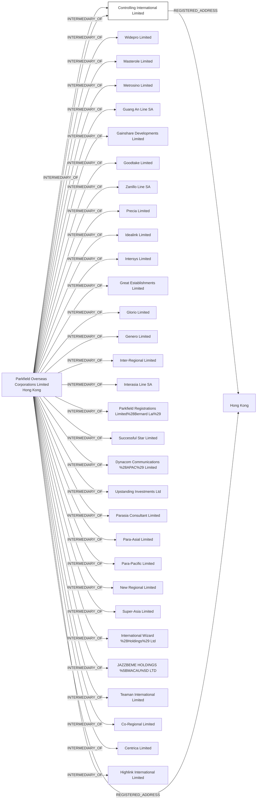

#Controlling International Limited
Status: Dead
Address: Parkfield Overseas Corporations Limited Room 2805 Ho King Commercial Centre No. 2 Fa Yuen Street Mongkok Hong Kong RT BVI

##Incoming
INTERMEDIARY
Parkfield Overseas Corporations Limited
Hong Kong

##Outgoing
REGISTERED_ADDRESSParkfield Overseas Corporations Limited Room 2805 Ho King Commercial Centre No. 2 Fa Yuen Street Mongkok Hong Kong
Hong Kong

##Graph
