#DIAMOND HILL INC
Status: Active
Address: CHU KWING & CO. CERTIFIED PUBLIC ACCOUNTANTS UNIT 11; 9/F; WAYSON COMMERCIAL BUILDING 28 CONNAUGHT ROAD WEST HONG KONG

##Incoming
SHAREHOLDER
WANG BO
China

INTERMEDIARY
CHU KWING & CO. CERTIFIED PUBLIC ACCOUNTANTS
CHU KWING & CO. CERTIFIED PUBLIC ACCOUNTANTS UNIT 11; 9/F; WAYSON COMMERCIAL BUILDING 28 CONNAUGHT ROAD WEST HONG KONG
Hong Kong

##Graph

```mermaid
graph LR
classDef outline fill:#fff,stroke:#000,stroke-width:1px;
node1[DIAMOND HILL INC<br>]
node2[WANG BO<br>China]
node2-->|SHAREHOLDER_OF|node1
node3[CHU KWING & CO CERTIFIED PUBLIC ACCOUNTANTS<br>Hong Kong]
node3-->|INTERMEDIARY_OF|node1
class node1 outline
node4[<br>China]
node2-->|REGISTERED_ADDRESS|node4
node2-->|SHAREHOLDER_OF|node1
node5[MASTERMIND HOLDINGS INC<br>]
node2-->|SHAREHOLDER_OF|node5
node6[UNIVERSAL LOGISTICS INC<br>]
node2-->|SHAREHOLDER_OF|node6
node7[CHINA PACIFIC MARITIME LIMITED<br>]
node3-->|INTERMEDIARY_OF|node7
node8[RICH-FOREVER SHIPPING INC<br>]
node3-->|INTERMEDIARY_OF|node8
node9[FULLY SKY INVESTMENTS LIMITED<br>]
node3-->|INTERMEDIARY_OF|node9
node10[GOLD CALLA ENTERPRISES LTD<br>]
node3-->|INTERMEDIARY_OF|node10
node11[KEEN MIND INVESTMENT LTD<br>]
node3-->|INTERMEDIARY_OF|node11
node12[MERRY OCEAN SHIPPING LIMITED<br>]
node3-->|INTERMEDIARY_OF|node12
node13[GOLD MOUNTAIN INTERNATIONAL ENERGY TECHNOLOGY %28HK%29 CO, LIMITED<br>]
node3-->|INTERMEDIARY_OF|node13
node14[Hong Kong Quanfu International Petroleum Technology Limited<br>]
node3-->|INTERMEDIARY_OF|node14
node15[Kshirsagar Navigation Limited<br>]
node3-->|INTERMEDIARY_OF|node15
node16[MASTER ELEMENT LTD<br>]
node3-->|INTERMEDIARY_OF|node16
node17[OCEAN HONOR LTD<br>]
node3-->|INTERMEDIARY_OF|node17
node18[BRIGHT PEAK ENTERPRISES LTD<br>]
node3-->|INTERMEDIARY_OF|node18
node19[SINCERE SHIPPING CO, LTD<br>]
node3-->|INTERMEDIARY_OF|node19
node20[DALIAN SUNTIME LIMITED<br>]
node3-->|INTERMEDIARY_OF|node20
node21[SHINNING RICH SHIPPING CO, LTD<br>]
node3-->|INTERMEDIARY_OF|node21
node22[HIGH-RICH SHIPPING CO, LTD<br>]
node3-->|INTERMEDIARY_OF|node22
node23[GREAT JOY LIMITED<br>]
node3-->|INTERMEDIARY_OF|node23
node24[EAGLE OCEAN INTERNATIONAL LTD<br>]
node3-->|INTERMEDIARY_OF|node24
node25[GOLDEN RICH ENTERPRISES INC<br>]
node3-->|INTERMEDIARY_OF|node25
node26[Hanker Success Marine Limited<br>]
node3-->|INTERMEDIARY_OF|node26
node27[IVY LAND GROUP LIMITED<br>]
node3-->|INTERMEDIARY_OF|node27
node28[WIN LEGEND INVESTMENT LTD<br>]
node3-->|INTERMEDIARY_OF|node28
node29[J&P MARITIME CONSULTING CO, LIMITED<br>]
node3-->|INTERMEDIARY_OF|node29
node30[OCEAN TRANS GROUP LIMITED<br>]
node3-->|INTERMEDIARY_OF|node30
node31[SINO TREASURE ENTERPRISES LTD<br>]
node3-->|INTERMEDIARY_OF|node31
node32[SUCCESS BUSINESS HOLDINGS LTD<br>]
node3-->|INTERMEDIARY_OF|node32
node33[GOTO SHIPPING INTERNATIONAL LIMITED<br>]
node3-->|INTERMEDIARY_OF|node33
node34[WANG YUAN INTERNATIONAL LIMITED<br>]
node3-->|INTERMEDIARY_OF|node34
node35[TOP SHINE INTERNATIONAL LTD<br>]
node3-->|INTERMEDIARY_OF|node35
node36[BO-RICH SHIPPING CO, LIMITED<br>]
node3-->|INTERMEDIARY_OF|node36
node37[BEST FOCUS DEVELOPMENT LTD<br>]
node3-->|INTERMEDIARY_OF|node37
node38[MILLION PROSPER INVESTMENTS LIMITED<br>]
node3-->|INTERMEDIARY_OF|node38
node39[SEA FAME MANAGEMENT LIMITED<br>]
node3-->|INTERMEDIARY_OF|node39
node40[JOY LAND LIMITED<br>]
node3-->|INTERMEDIARY_OF|node40
node41[OWELL SHIPPING LIMITED<br>]
node3-->|INTERMEDIARY_OF|node41
node42[WIN DAY INTERNATIONAL SHIPPING  CO, LIMITED<br>]
node3-->|INTERMEDIARY_OF|node42
node43[RICH JOINT ENTERPRISES LTD<br>]
node3-->|INTERMEDIARY_OF|node43
node44[Young Spirit Development Co, Ltd<br>]
node3-->|INTERMEDIARY_OF|node44
node45[OCEAN WAY INTERNATIONAL LTD<br>]
node3-->|INTERMEDIARY_OF|node45
node46[PARKO GROUP LIMITED<br>]
node3-->|INTERMEDIARY_OF|node46
node47[SKY TOWER GROUP LTD<br>]
node3-->|INTERMEDIARY_OF|node47
node48[WHITE CYPRESS HOLDINGS LIMITED<br>]
node3-->|INTERMEDIARY_OF|node48
node49[Partan International Limited<br>]
node3-->|INTERMEDIARY_OF|node49
node50[NEW PARADISE LTD<br>]
node3-->|INTERMEDIARY_OF|node50
node51[TOP BILLION LIMITED<br>]
node3-->|INTERMEDIARY_OF|node51
node52[Dong Guan ShenRong Industrial Co, Ltd<br>]
node3-->|INTERMEDIARY_OF|node52
node53[GUANG YU LIMITED<br>]
node3-->|INTERMEDIARY_OF|node53
node54[Golden Light Shipping Co, Limited<br>]
node3-->|INTERMEDIARY_OF|node54
node55[ORIENTAL SUCCESS INVESTMENTS LIMITED<br>]
node3-->|INTERMEDIARY_OF|node55
node56[HAI TIAN LTD<br>]
node3-->|INTERMEDIARY_OF|node56
node57[Minercoal Investment Ltd<br>]
node3-->|INTERMEDIARY_OF|node57
node58[PEAK VALLEY INVESTMENT LIMITED<br>]
node3-->|INTERMEDIARY_OF|node58
node59[ORIENTAL HARMONY INVESTMENT LTD<br>]
node3-->|INTERMEDIARY_OF|node59
node60[Seventh Sense Holding Limited<br>]
node3-->|INTERMEDIARY_OF|node60
node61[Beltruno Limited<br>]
node3-->|INTERMEDIARY_OF|node61
node62[CST NA JIN MINING HOLDINGS CO, LTD<br>]
node3-->|INTERMEDIARY_OF|node62
node63[STAR GRACE HOLDINGS LTD<br>]
node3-->|INTERMEDIARY_OF|node63
node64[CHELLONA INVESTMENT INC<br>]
node3-->|INTERMEDIARY_OF|node64
node65[VAST TOP DEVELOPMENT LTD<br>]
node3-->|INTERMEDIARY_OF|node65
node66[Wuhua Investment Limited<br>]
node3-->|INTERMEDIARY_OF|node66
node67[SUNWAY GOOD CONSULTANT LTD<br>]
node3-->|INTERMEDIARY_OF|node67
node68[SINOWAY TIMBER INC<br>]
node3-->|INTERMEDIARY_OF|node68
node69[JUMBO WORLD GROUP LTD<br>]
node3-->|INTERMEDIARY_OF|node69
node70[FORTUNE REACH INVESTMENTS LIMITED<br>]
node3-->|INTERMEDIARY_OF|node70
node71[JUN LEI INTERNATIONAL LIMITED<br>]
node3-->|INTERMEDIARY_OF|node71
node72[CLASSIC GOLD GROUP LIMITED<br>]
node3-->|INTERMEDIARY_OF|node72
node73[Hongfeng Industrial Co, Limited<br>]
node3-->|INTERMEDIARY_OF|node73
node74[Top Games Holdings Inc<br>]
node3-->|INTERMEDIARY_OF|node74
node75[GAIN GLOBAL INTERNATIONAL SHIPPING CO, LIMITED<br>]
node3-->|INTERMEDIARY_OF|node75
node76[EILEEN MANAGEMENT LIMITED<br>]
node3-->|INTERMEDIARY_OF|node76
node77[Panda World Limited<br>]
node3-->|INTERMEDIARY_OF|node77
node78[George Joan Holdings Limited<br>]
node3-->|INTERMEDIARY_OF|node78
node79[ANGEL METAL COMPANY LIMITED<br>]
node3-->|INTERMEDIARY_OF|node79
node3-->|INTERMEDIARY_OF|node6
node80[Great Marine Company Limited<br>]
node3-->|INTERMEDIARY_OF|node80
node3-->|INTERMEDIARY_OF|node1
node81[CPM INC<br>]
node3-->|INTERMEDIARY_OF|node81
node3-->|INTERMEDIARY_OF|node5
node82[GENERAL CAPITAL INC<br>]
node3-->|INTERMEDIARY_OF|node82
node83[GLINT INVESTMENT LIMITED<br>]
node3-->|INTERMEDIARY_OF|node83
node84[Charott Global Limited<br>]
node3-->|INTERMEDIARY_OF|node84
node85[Top Games Inc<br>]
node3-->|INTERMEDIARY_OF|node85
node86[SINOWAY BULK INC<br>]
node3-->|INTERMEDIARY_OF|node86
node87[Bellona Holdings Limited<br>]
node3-->|INTERMEDIARY_OF|node87
node88[IG Inc<br>]
node3-->|INTERMEDIARY_OF|node88
node89[Gold Bridge Holdings Limited<br>]
node3-->|INTERMEDIARY_OF|node89
node90[TANDEM HOLDINGS LIMITED<br>]
node3-->|INTERMEDIARY_OF|node90
node91[Professional Language Service Limited<br>]
node3-->|INTERMEDIARY_OF|node91
node92[GOLD TOP INTERNATIONAL LTD<br>]
node3-->|INTERMEDIARY_OF|node92
node93[SINO GOLD GROUP LIMITED<br>]
node3-->|INTERMEDIARY_OF|node93
node94[UNITED RICH DEVELOPMENT LTD<br>]
node3-->|INTERMEDIARY_OF|node94
node95[NEPOCH HOLDINGS LTD<br>]
node3-->|INTERMEDIARY_OF|node95
node96[MULTI FOCUS TRADING LTD<br>]
node3-->|INTERMEDIARY_OF|node96
node97[SINOWAY GRANITE INC<br>]
node3-->|INTERMEDIARY_OF|node97
node98[HUWA IP HOLDING LTD<br>]
node3-->|INTERMEDIARY_OF|node98
node99[Megalink International Pty Ltd<br>]
node3-->|INTERMEDIARY_OF|node99
node100[Wontop Holdings Inc<br>]
node3-->|INTERMEDIARY_OF|node100
node101[SINOWAY CHARTERING %28GROUP%29 LIMITED<br>]
node3-->|INTERMEDIARY_OF|node101
node102[Seatrain %28Hong Kong%29 Limited<br>]
node3-->|INTERMEDIARY_OF|node102
node103[Mandarine Ocean Ltd<br>]
node3-->|INTERMEDIARY_OF|node103
node104[BAODEAN HOLDING LIMITED<br>]
node3-->|INTERMEDIARY_OF|node104
node105[NEW SILK ROAD SHIPPING LIMITED<br>]
node3-->|INTERMEDIARY_OF|node105
node106[CREATIVE CONCEPT GROUP LIMITED<br>]
node3-->|INTERMEDIARY_OF|node106
node107[BEAUTY LAND LIMITED<br>]
node3-->|INTERMEDIARY_OF|node107
node108[VENTERINGS LTD<br>]
node3-->|INTERMEDIARY_OF|node108
node109[MARCH CHEMICAL INVESTMENT CO, LIMITED<br>]
node3-->|INTERMEDIARY_OF|node109
node110[KING GLORY INTERNATIONAL SHIPPING CO, LIMITED<br>]
node3-->|INTERMEDIARY_OF|node110
node111[RELIGHT INTERNATIONAL CO, LIMITED<br>]
node3-->|INTERMEDIARY_OF|node111
node112[YANTAI INSPECTION TRADE CO, LIMITED<br>]
node3-->|INTERMEDIARY_OF|node112
node113[JIAQING SHIPPING CO, LTD<br>]
node3-->|INTERMEDIARY_OF|node113
node114[SUPER WINNER GROUP LIMITED<br>]
node3-->|INTERMEDIARY_OF|node114
node3-->|INTERMEDIARY_OF|node101
node115[Honyane Group Inc<br>]
node3-->|INTERMEDIARY_OF|node115
node116[QUESHIRE CORP<br>]
node3-->|INTERMEDIARY_OF|node116
node117[MSL Shipping Co, Limited<br>]
node3-->|INTERMEDIARY_OF|node117
node118[LILAC GROUP LIMITED<br>]
node3-->|INTERMEDIARY_OF|node118
node119[KOLA GROUP LTD<br>]
node3-->|INTERMEDIARY_OF|node119
node120[NOVA LTD<br>]
node3-->|INTERMEDIARY_OF|node120
node121[WONDERLAND HOLDINGS LIMITED<br>]
node3-->|INTERMEDIARY_OF|node121
node122[SUCCESS ICON LTD<br>]
node3-->|INTERMEDIARY_OF|node122
node123[Gold Tiger Outdoor Sports Enterprises Limited<br>]
node3-->|INTERMEDIARY_OF|node123
node124[TRINITY TALE GROUP LIMITED<br>]
node3-->|INTERMEDIARY_OF|node124
node125[China Pacific Maritime Inc<br>]
node3-->|INTERMEDIARY_OF|node125
node126[KEEP TOP INVESTMENTS LIMITED<br>]
node3-->|INTERMEDIARY_OF|node126
node127[YE XIN INVESTMENTS LIMITED<br>]
node3-->|INTERMEDIARY_OF|node127
node128[SMOOTHIE GOODIE LTD<br>]
node3-->|INTERMEDIARY_OF|node128
```
