#DILIGENCE DEDICATED ENTERPRISES LTD.
Status: Defaulted
Address: O.S.R. CONSULTANTS & SECRETARIES LIMITED UNITS C&D; 14/F.; NEICH TOWER; 128 GLOUCESTER ROAD; WANCHAI; HONG KONG.

##Incoming
SHAREHOLDER
YAM, Kit
China

INTERMEDIARY
O.S.R. CONSULTANTS & SECRETARIES LIMITED
O.S.R. CONSULTANTS & SECRETARIES LIMITED UNITS C&D; 14/F.; NEICH TOWER; 128 GLOUCESTER ROAD; WANCHAI; HONG KONG.
Hong Kong

##Graph

```mermaid
graph LR
classDef outline fill:#fff,stroke:#000,stroke-width:1px;
node1[DILIGENCE DEDICATED ENTERPRISES LTD<br>]
node2[YAM, Kit<br>China]
node2-->|SHAREHOLDER_OF|node1
node3[OSR CONSULTANTS & SECRETARIES LIMITED<br>Hong Kong]
node3-->|INTERMEDIARY_OF|node1
class node1 outline
node4[<br>China]
node2-->|REGISTERED_ADDRESS|node4
node2-->|SHAREHOLDER_OF|node1
node5[MAX GAIN FINANCE LTD<br>]
node3-->|INTERMEDIARY_OF|node5
node6[GOLDEN PALMS DEVELOPMENT LTD<br>]
node3-->|INTERMEDIARY_OF|node6
node7[JENTOP HOLDINGS LTD<br>]
node3-->|INTERMEDIARY_OF|node7
node8[NEAT WORLD HOLDINGS LTD<br>]
node3-->|INTERMEDIARY_OF|node8
node9[NEW CONCORD DEVELOPMENT LIMITED<br>]
node3-->|INTERMEDIARY_OF|node9
node10[ASIA WIN GROUP LTD<br>]
node3-->|INTERMEDIARY_OF|node10
node11[WELL KEEN INVESTMENTS LIMITED<br>]
node3-->|INTERMEDIARY_OF|node11
node12[APEC %28CHINA%29 ASSET MANAGEMENT LIMITED<br>]
node3-->|INTERMEDIARY_OF|node12
node13[GOLD LANE MANAGEMENT LIMITED<br>]
node3-->|INTERMEDIARY_OF|node13
node14[HAPPY KIND LIMITED<br>]
node3-->|INTERMEDIARY_OF|node14
node15[MASTERISE TRADING LIMITED<br>]
node3-->|INTERMEDIARY_OF|node15
node16[WING HING KNITTING FACTORY LIMITED<br>]
node3-->|INTERMEDIARY_OF|node16
node17[CHERISH LIMITED<br>]
node3-->|INTERMEDIARY_OF|node17
node18[GOODTOP INTERNATIONAL LIMITED<br>]
node3-->|INTERMEDIARY_OF|node18
node19[JOBO INTERNATIONAL LIMITED<br>]
node3-->|INTERMEDIARY_OF|node19
node20[SHEEN ASSET HOLDINGS LIMITED<br>]
node3-->|INTERMEDIARY_OF|node20
node21[WICO LTD<br>]
node3-->|INTERMEDIARY_OF|node21
node22[GOLD RIDGE INTERNATIONAL RESOURCES LIMITED<br>]
node3-->|INTERMEDIARY_OF|node22
node23[LICK SUN INTERNATIONAL LIMITED<br>]
node3-->|INTERMEDIARY_OF|node23
node24[TOP SUCCESS INVESTMENTS LTD<br>]
node3-->|INTERMEDIARY_OF|node24
node25[PACIFIC CYBER NETWORK LTD<br>]
node3-->|INTERMEDIARY_OF|node25
node26[BRIGHT YOUNG HOLDINGS LIMITED<br>]
node3-->|INTERMEDIARY_OF|node26
node27[LOYAL UNION LTD<br>]
node3-->|INTERMEDIARY_OF|node27
node28[MASTER UNION INVESTMENT HOLDINGS LTD<br>]
node3-->|INTERMEDIARY_OF|node28
node29[BILL PEAK INVESTMENTS LTD<br>]
node3-->|INTERMEDIARY_OF|node29
node30[SANDAL EAGLE LIMITED<br>]
node3-->|INTERMEDIARY_OF|node30
node31[CARLIDAX TRADING COMPANY LIMITED<br>]
node3-->|INTERMEDIARY_OF|node31
node32[DRAGON HEART DEVELOPMENT LIMITED<br>]
node3-->|INTERMEDIARY_OF|node32
node33[INTER WAY LIMITED<br>]
node3-->|INTERMEDIARY_OF|node33
node34[NICE BOND INVESTMENT LTD<br>]
node3-->|INTERMEDIARY_OF|node34
node35[VINCENT & JACLYN INVESTMENT LIMITED<br>]
node3-->|INTERMEDIARY_OF|node35
node36[WILKEN INVESTMENT LIMITED<br>]
node3-->|INTERMEDIARY_OF|node36
node37[FORCE LINK GROUP LTD<br>]
node3-->|INTERMEDIARY_OF|node37
node38[WELL JADE INTERNATIONAL LTD<br>]
node3-->|INTERMEDIARY_OF|node38
node39[GOLDEN CLOUD HOLDINGS GROUP LTD<br>]
node3-->|INTERMEDIARY_OF|node39
node40[DEANON INVESTMENTS LTD %28WITH CHINESE CHARACTERS%29<br>]
node3-->|INTERMEDIARY_OF|node40
node41[GOLD CHOICE MANAGEMENT LTD<br>]
node3-->|INTERMEDIARY_OF|node41
node42[HARVEST EAGLE ENTERPRISES LTD<br>]
node3-->|INTERMEDIARY_OF|node42
node43[PROSWELL INTERNATIONAL INVESTMENT LTD<br>]
node3-->|INTERMEDIARY_OF|node43
node44[FIRST LINK INVESTMENT LTD<br>]
node3-->|INTERMEDIARY_OF|node44
node45[GOLDBOND BUSINESS MANAGEMENT LIMITED<br>]
node3-->|INTERMEDIARY_OF|node45
node46[GOLDBOND ASSET MANAGEMENT LIMITED<br>]
node3-->|INTERMEDIARY_OF|node46
node47[METRO SCORE LIMITED<br>]
node3-->|INTERMEDIARY_OF|node47
node48[KINGBIRD INTERNATIONAL DEVELOPMENT LTD<br>]
node3-->|INTERMEDIARY_OF|node48
node49[KWUN LOY HOLDINGS LTD<br>]
node3-->|INTERMEDIARY_OF|node49
node50[FUND GRACE DEVELOPMENT LTD<br>]
node3-->|INTERMEDIARY_OF|node50
node51[SOUTHERN BRAVE RESOURCES LTD<br>]
node3-->|INTERMEDIARY_OF|node51
node52[KEEN HEALTH LTD<br>]
node3-->|INTERMEDIARY_OF|node52
node53[VICKMAN ENTERPRISES LTD<br>]
node3-->|INTERMEDIARY_OF|node53
node54[WELL CHEERS INTERNATIONAL INVESTMENTS LTD<br>]
node3-->|INTERMEDIARY_OF|node54
node55[TEAMLAND LTD<br>]
node3-->|INTERMEDIARY_OF|node55
node56[GLOBAL WORSHIP INTERNATIONAL LTD<br>]
node3-->|INTERMEDIARY_OF|node56
node57[GOLDEN GALLERY ENTERPRISES LTD<br>]
node3-->|INTERMEDIARY_OF|node57
node58[GREEN OCEAN GROUP LIMITED<br>]
node3-->|INTERMEDIARY_OF|node58
node59[CANWISH INVESTMENT LTD<br>]
node3-->|INTERMEDIARY_OF|node59
node60[CHOY YONG INVESTMENTS LIMITED<br>]
node3-->|INTERMEDIARY_OF|node60
node61[DUWAH HOLDINGS LTD<br>]
node3-->|INTERMEDIARY_OF|node61
node62[SKYRIDE LTD<br>]
node3-->|INTERMEDIARY_OF|node62
node63[KURO LIMITED<br>]
node3-->|INTERMEDIARY_OF|node63
node64[UNION CHINA INTERNATIONAL LTD<br>]
node3-->|INTERMEDIARY_OF|node64
node65[MEAD LAKE INVESTMENTS LIMITED<br>]
node3-->|INTERMEDIARY_OF|node65
node66[BIG VISION INTERNATIONAL LIMITED<br>]
node3-->|INTERMEDIARY_OF|node66
node67[LEE TAI GROUP LTD<br>]
node3-->|INTERMEDIARY_OF|node67
node68[EFFORT DEVELOPMENT LIMITED<br>]
node3-->|INTERMEDIARY_OF|node68
node69[LUKA AIM GROUP LTD<br>]
node3-->|INTERMEDIARY_OF|node69
node70[CHINA UNION INTERNATIONAL TECHNOLOGY INC<br>]
node3-->|INTERMEDIARY_OF|node70
node71[SHINNING EFFORT GROUP LIMITED<br>]
node3-->|INTERMEDIARY_OF|node71
node72[ALLIED GOLDEN INVESTMENT LTD<br>]
node3-->|INTERMEDIARY_OF|node72
node73[ACEYORK INVESTMENT LTD<br>]
node3-->|INTERMEDIARY_OF|node73
node74[SUPER GLAMOR INVESTMENT LTD<br>]
node3-->|INTERMEDIARY_OF|node74
node75[HARBOUR SIDE GROUP LIMITED<br>]
node3-->|INTERMEDIARY_OF|node75
node76[CARSON TREASURE LTD<br>]
node3-->|INTERMEDIARY_OF|node76
node77[KANDA ENTERPRISES LIMITED<br>]
node3-->|INTERMEDIARY_OF|node77
node78[BRIGHTEN VIEW INTERNATIONAL LTD<br>]
node3-->|INTERMEDIARY_OF|node78
node79[BILLION PORT MANAGEMENT LIMITED<br>]
node3-->|INTERMEDIARY_OF|node79
node80[SUPER CHAMPION GROUP LTD<br>]
node3-->|INTERMEDIARY_OF|node80
node81[SUCCESS EASE INVESTMENTS LIMITED<br>]
node3-->|INTERMEDIARY_OF|node81
node82[CYBER FORCER GROUP LTD<br>]
node3-->|INTERMEDIARY_OF|node82
node83[WISE SKY CONSULTANT LTD<br>]
node3-->|INTERMEDIARY_OF|node83
node84[KONTEX ENTERPRISES LIMITED<br>]
node3-->|INTERMEDIARY_OF|node84
node85[HAPPY WINNER GROUP LTD<br>]
node3-->|INTERMEDIARY_OF|node85
node86[GRANDE AMOR ENTERPRISES LTD<br>]
node3-->|INTERMEDIARY_OF|node86
node87[AQUA KING HOLDINGS LIMITED<br>]
node3-->|INTERMEDIARY_OF|node87
node88[BLOSSOM ZONE LIMITED<br>]
node3-->|INTERMEDIARY_OF|node88
node89[WEALTHY COIN INVESTMENTS LTD<br>]
node3-->|INTERMEDIARY_OF|node89
node90[SUCCESS KEY DEVELOPMENT LTD<br>]
node3-->|INTERMEDIARY_OF|node90
node91[CHU DYNASTY HK LIMITED<br>]
node3-->|INTERMEDIARY_OF|node91
node92[CVM INTERNATIONAL LIMITED<br>]
node3-->|INTERMEDIARY_OF|node92
node93[NOBLE PLACE ENTERPRISES LIMITED<br>]
node3-->|INTERMEDIARY_OF|node93
node94[GOLDEN LANDSCAPE INTERNATIONAL LIMITED<br>]
node3-->|INTERMEDIARY_OF|node94
node95[PRIME FULL TRADING LIMITED<br>]
node3-->|INTERMEDIARY_OF|node95
node96[CHEE FUNG SHING LIMITED<br>]
node3-->|INTERMEDIARY_OF|node96
node97[WOODCRAFTS INVESTMENTS LTD<br>]
node3-->|INTERMEDIARY_OF|node97
node98[FORTUNE EASE HOLDINGS LTD<br>]
node3-->|INTERMEDIARY_OF|node98
node99[AJUN GROUP LIMITED<br>]
node3-->|INTERMEDIARY_OF|node99
node100[ASIA GLOBAL COMPANY LIMITED<br>]
node3-->|INTERMEDIARY_OF|node100
node101[JUMBO ASSET TRADING LIMITED<br>]
node3-->|INTERMEDIARY_OF|node101
node102[MOST RICH INTERNATIONAL LTD<br>]
node3-->|INTERMEDIARY_OF|node102
node103[17 SCIENCE DEVELOPMENT LIMITED<br>]
node3-->|INTERMEDIARY_OF|node103
node104[ALLIED BUSINESS DEVELOPMENT LTD<br>]
node3-->|INTERMEDIARY_OF|node104
node105[UPWAY SUN INVESTMENT LTD<br>]
node3-->|INTERMEDIARY_OF|node105
node106[TRUE WILL BVI%29 LIMITED<br>]
node3-->|INTERMEDIARY_OF|node106
node107[WEALTHY CREATION HOLDINGS LTD<br>]
node3-->|INTERMEDIARY_OF|node107
node108[GRAND SMOOTH GROUP LTD<br>]
node3-->|INTERMEDIARY_OF|node108
node109[PCJ International Venture Limited<br>]
node3-->|INTERMEDIARY_OF|node109
node110[INITIAL GARDEN LTD<br>]
node3-->|INTERMEDIARY_OF|node110
node111[VICTORY CAPTAIN GROUP LTD<br>]
node3-->|INTERMEDIARY_OF|node111
node112[INFINITE BONUS LIMITED<br>]
node3-->|INTERMEDIARY_OF|node112
node113[WELL CITY CONSULTANT LTD<br>]
node3-->|INTERMEDIARY_OF|node113
node114[JUMBO MARCH INVESTMENTS LIMITED<br>]
node3-->|INTERMEDIARY_OF|node114
node115[PUBLIC MANAGEMENT LTD<br>]
node3-->|INTERMEDIARY_OF|node115
node3-->|INTERMEDIARY_OF|node1
node116[MAIN CITY INTERNATIONAL LIMITED<br>]
node3-->|INTERMEDIARY_OF|node116
node117[FORTUNE MIX INVESTMENTS LTD<br>]
node3-->|INTERMEDIARY_OF|node117
node118[GREAT AIMS HOLDINGS LIMITED<br>]
node3-->|INTERMEDIARY_OF|node118
node119[WEALTH PLANNER TRADING LTD<br>]
node3-->|INTERMEDIARY_OF|node119
node120[WIN VICTORY GROUP LIMITED<br>]
node3-->|INTERMEDIARY_OF|node120
node121[MILLION BRIGHT HOLDINGS LIMITED<br>]
node3-->|INTERMEDIARY_OF|node121
node122[NICE KING GROUP LTD<br>]
node3-->|INTERMEDIARY_OF|node122
node123[OCEAN YORK DEVELOPMENT LIMITED<br>]
node3-->|INTERMEDIARY_OF|node123
node124[CVM MARKETING LIMITED<br>]
node3-->|INTERMEDIARY_OF|node124
node125[POWER JET INVESTMENTS LTD<br>]
node3-->|INTERMEDIARY_OF|node125
node126[NICE TONE ENTERPRISES LTD<br>]
node3-->|INTERMEDIARY_OF|node126
node127[HUGE VIEW TRADING LTD<br>]
node3-->|INTERMEDIARY_OF|node127
node128[TRUE TALENT MANAGEMENT LIMITED<br>]
node3-->|INTERMEDIARY_OF|node128
node129[FAMOUS ONE DEVELOPMENT LTD<br>]
node3-->|INTERMEDIARY_OF|node129
node130[CONSON ASIA HOLDINGS LIMITED<br>]
node3-->|INTERMEDIARY_OF|node130
node131[WORLDWIDE GOLD INVESTMENTS LTD<br>]
node3-->|INTERMEDIARY_OF|node131
node132[DREAMY WORLD HOLDINGS LIMITED<br>]
node3-->|INTERMEDIARY_OF|node132
node133[ACE BONUS GROUP LIMITED<br>]
node3-->|INTERMEDIARY_OF|node133
node134[VOICE KEY GROUP LIMITED<br>]
node3-->|INTERMEDIARY_OF|node134
node135[ADVANCESEC INTERNATIONAL HOLDINGS LIMITED<br>]
node3-->|INTERMEDIARY_OF|node135
node136[CHOI HING ENTERPRISES LTD<br>]
node3-->|INTERMEDIARY_OF|node136
node137[CHEER STAR INTERNATIONAL ENTERPRISES LTD<br>]
node3-->|INTERMEDIARY_OF|node137
node138[EXCELLENT GAIN LIMITED<br>]
node3-->|INTERMEDIARY_OF|node138
node139[SILKFAIR INTERNATIONAL INVESTMENT LTD<br>]
node3-->|INTERMEDIARY_OF|node139
node140[ETERNAL LUCK LTD<br>]
node3-->|INTERMEDIARY_OF|node140
node141[TOMWISE LTD<br>]
node3-->|INTERMEDIARY_OF|node141
node142[TOP SHING INTERNATIONAL DEVELOPMENT LTD<br>]
node3-->|INTERMEDIARY_OF|node142
node143[GOLDEN CONCORD LIMITED<br>]
node3-->|INTERMEDIARY_OF|node143
node144[TOP FIRST LIMITED<br>]
node3-->|INTERMEDIARY_OF|node144
node145[RICH SUN INVESTMENTS HOLDINGS LTD<br>]
node3-->|INTERMEDIARY_OF|node145
node146[PRIME WAY FINANCE LTD<br>]
node3-->|INTERMEDIARY_OF|node146
node147[BLANCHI TRADING CORP<br>]
node3-->|INTERMEDIARY_OF|node147
node148[MAX MILLION HOLDINGS LTD<br>]
node3-->|INTERMEDIARY_OF|node148
node149[CITY ELEMENTS HOLDINGS LIMITED<br>]
node3-->|INTERMEDIARY_OF|node149
node150[HONOR RAY INVESTMENTS LIMITED<br>]
node3-->|INTERMEDIARY_OF|node150
node151[AMAX DEVELOPMENT LTD<br>]
node3-->|INTERMEDIARY_OF|node151
node152[THOUSAND WAY INVESTMENTS LTD<br>]
node3-->|INTERMEDIARY_OF|node152
node153[STEP PACIFIC DEVELOPMENT LIMITED<br>]
node3-->|INTERMEDIARY_OF|node153
node154[JOINT DELIGHT LIMITED<br>]
node3-->|INTERMEDIARY_OF|node154
node155[CHAMPION TONE DEVELOPMENT LIMITED<br>]
node3-->|INTERMEDIARY_OF|node155
node156[BLOSSOM  BUSINESS CONSULTANT LIMITED<br>]
node3-->|INTERMEDIARY_OF|node156
node157[LINK TARGET INVESTMENTS LTD<br>]
node3-->|INTERMEDIARY_OF|node157
```
