#EXCELLENT SKILL TECHNOLOGIES LTD.
Status: Defaulted
Address: CHAN CHI KEUNG & CO. UNIT A; 2/F; TRUST TOWER; 68 JOHNSTON ROAD; WANCHAI HONG KONG

##Incoming
SHAREHOLDER
THE BEARER

INTERMEDIARY
CHAN CHI KEUNG & CO.
CHAN CHI KEUNG & CO. UNIT A; 2/F; TRUST TOWER; 68 JOHNSTON ROAD; WANCHAI HONG KONG
Hong Kong

##Graph

```mermaid
graph LR
classDef outline fill:#fff,stroke:#000,stroke-width:1px;
node1[EXCELLENT SKILL TECHNOLOGIES LTD<br>]
node2[THE BEARER<br>None]
node2-->|SHAREHOLDER_OF|node1
node3[CHAN CHI KEUNG & CO<br>Hong Kong]
node3-->|INTERMEDIARY_OF|node1
class node1 outline
node2-->|SHAREHOLDER_OF|node1
node4[MAXWISE LIMITED<br>]
node3-->|INTERMEDIARY_OF|node4
node5[EMPIRE MARK INVESTMENTS LTD<br>]
node3-->|INTERMEDIARY_OF|node5
node6[SKILLTECH GROUP LIMITED<br>]
node3-->|INTERMEDIARY_OF|node6
node7[FORTUNE PEARL INVESTMENT LTD<br>]
node3-->|INTERMEDIARY_OF|node7
node8[BLOSSOM TIME INDUSTRIAL LTD<br>]
node3-->|INTERMEDIARY_OF|node8
node9[GOLDAIM INTERNATIONAL INVESTMENT LTD<br>]
node3-->|INTERMEDIARY_OF|node9
node10[WHOLE RISE DEVELOPMENT LTD<br>]
node3-->|INTERMEDIARY_OF|node10
node11[BEST WONDER INTERNATIONAL LTD<br>]
node3-->|INTERMEDIARY_OF|node11
node3-->|INTERMEDIARY_OF|node1
node12[TIAN-HONG PROPERTY CO, LTD<br>]
node3-->|INTERMEDIARY_OF|node12
node13[XIN-HUA CONSTRUCTION INVESTMENT CO, LTD<br>]
node3-->|INTERMEDIARY_OF|node13
node14[CGS APPAREL INTERNATIONAL INC<br>]
node3-->|INTERMEDIARY_OF|node14
node15[SMART SCENE TRADING LTD<br>]
node3-->|INTERMEDIARY_OF|node15
node16[CHINA TOHIGH INTERNATIONAL HOLDINGS CO, LIMITED<br>]
node3-->|INTERMEDIARY_OF|node16
node17[SEARCH INTERNATIONAL HOLDINGS CO, LTD<br>]
node3-->|INTERMEDIARY_OF|node17
node18[OCEANWIDE INTERNATIONAL PROPERTY CO, LIMITED<br>]
node3-->|INTERMEDIARY_OF|node18
node19[OCEANWIDE INTERNATIONAL CONSTRUCTION INVESTMENT CO, LTD<br>]
node3-->|INTERMEDIARY_OF|node19
node20[TOHIGH INTERNATIONAL PROPERTY CO, LTD<br>]
node3-->|INTERMEDIARY_OF|node20
node21[GLENDORGAL HOTEL MANAGEMENT CO, LTD<br>]
node3-->|INTERMEDIARY_OF|node21
node22[XIN-HUA INTERNATIONAL PROPERTY CO, LTD<br>]
node3-->|INTERMEDIARY_OF|node22
node23[TIM WAH INTERNATIONAL LIMITED<br>]
node3-->|INTERMEDIARY_OF|node23
node24[SENSE LEGEND TECHNOLOGIES LIMITED<br>]
node3-->|INTERMEDIARY_OF|node24
node25[OCEAN LAND ENTERPRISES LIMITED<br>]
node3-->|INTERMEDIARY_OF|node25
node26[TENG YI METAL RECYCLING CO LTD<br>]
node3-->|INTERMEDIARY_OF|node26
node27[LOVEGOOD INTERNATIONAL LTD<br>]
node3-->|INTERMEDIARY_OF|node27
node28[DIAMOND SEA DEVELOPMENT LTD<br>]
node3-->|INTERMEDIARY_OF|node28
node29[LUXURIANT GROWING TECHNOLOGY LIMITED<br>]
node3-->|INTERMEDIARY_OF|node29
node30[ACTIVE MINDS INTERNATIONAL LIMITED<br>]
node3-->|INTERMEDIARY_OF|node30
node31[HOME BEST INTERNATIONAL LIMITED<br>]
node3-->|INTERMEDIARY_OF|node31
node32[NEODONTICS INCORPORATION LIMITED<br>]
node3-->|INTERMEDIARY_OF|node32
node33[TMI TECHNOLOGIES INC<br>]
node3-->|INTERMEDIARY_OF|node33
node34[ACTION JOIN INVESTMENTS LIMITED<br>]
node3-->|INTERMEDIARY_OF|node34
node35[PISCOM Ltd<br>]
node3-->|INTERMEDIARY_OF|node35
node36[PRIMA %28SHANGHAI%29 CO, LTD<br>]
node3-->|INTERMEDIARY_OF|node36
node37[FINE OCEAN GROUP LTD<br>]
node3-->|INTERMEDIARY_OF|node37
node38[LEADER PROFIT LIMITED<br>]
node3-->|INTERMEDIARY_OF|node38
node39[Sunseng Investment Co, Ltd<br>]
node3-->|INTERMEDIARY_OF|node39
node40[BEST LANE INTERNATIONAL LIMITED<br>]
node3-->|INTERMEDIARY_OF|node40
node41[BRILLIANT WORLD GROUP LTD<br>]
node3-->|INTERMEDIARY_OF|node41
node42[WIDE PROSPER INTERNATIONAL LTD<br>]
node3-->|INTERMEDIARY_OF|node42
node43[SKYFORD GROUP LIMITED<br>]
node3-->|INTERMEDIARY_OF|node43
node44[VVOV HOLDINGS LIMITED<br>]
node3-->|INTERMEDIARY_OF|node44
```
