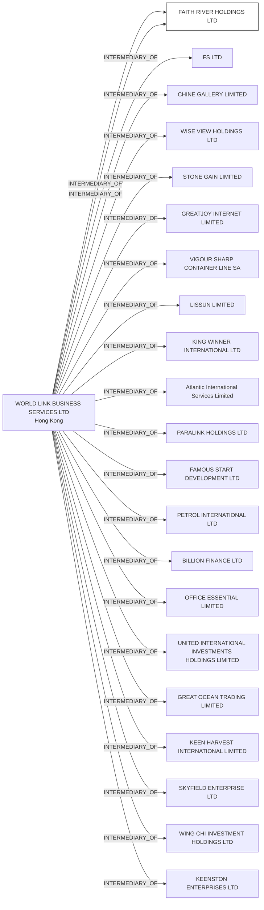

#FAITH RIVER HOLDINGS LTD.
Status: Defaulted
Address: WORLD LINK BUSINESS SERVICES LTD 5/F., FAR EAST CONSORTIUM BUILDING 121 DES VOEUX ROAD C. CENTRAL HONG KONG

##Incoming
INTERMEDIARY
WORLD LINK BUSINESS SERVICES LTD
WORLD LINK BUSINESS SERVICES LTD 5/F., FAR EAST CONSORTIUM BUILDING 121 DES VOEUX ROAD C. CENTRAL HONG KONG
Hong Kong

##Graph
