#FRESH FOOD LIMITED
Status: Defaulted
Address: ME PHILIPPE SCHMIDT C/O STRATEGIS SERVICES SAM 2, RUE DES IRIS MC 98000 MONACO

##Incoming
SHAREHOLDER
THE BEARER

INTERMEDIARY
SCHMIDT,  PHILIPPE

##Graph

```mermaid
graph LR
classDef outline fill:#fff,stroke:#000,stroke-width:1px;
node1[FRESH FOOD LIMITED<br>]
node2[THE BEARER<br>None]
node2-->|SHAREHOLDER_OF|node1
node3[SCHMIDT,  PHILIPPE<br>None]
node3-->|INTERMEDIARY_OF|node1
class node1 outline
node2-->|SHAREHOLDER_OF|node1
node4[IERISSOS CORPORATION<br>]
node3-->|INTERMEDIARY_OF|node4
node5[VALE INC<br>]
node3-->|INTERMEDIARY_OF|node5
node6[ECOCOM LTD<br>]
node3-->|INTERMEDIARY_OF|node6
node7[BREWTON BUSINESS SA<br>]
node3-->|INTERMEDIARY_OF|node7
node8[RIVERTON INVESTMENTS INC<br>]
node3-->|INTERMEDIARY_OF|node8
node9[WAF WORLDWIDE ALLFINANCE CORP<br>]
node3-->|INTERMEDIARY_OF|node9
node10[KAJEGH INVESTMENTS CORP<br>]
node3-->|INTERMEDIARY_OF|node10
node11[FONDATION LAVA<br>]
node3-->|INTERMEDIARY_OF|node11
node12[FONDATION GEMAFRA<br>]
node3-->|INTERMEDIARY_OF|node12
node13[ARTEL HOLDING GROUP LIMITED<br>]
node3-->|INTERMEDIARY_OF|node13
node14[HORRIS INTERNATIONAL COMPANY SA<br>]
node3-->|INTERMEDIARY_OF|node14
node15[VASTWAY EQUITIES CORP<br>]
node3-->|INTERMEDIARY_OF|node15
node16[WINGERS INTERNATIONAL SA<br>]
node3-->|INTERMEDIARY_OF|node16
node17[FINSON COMPANY INC<br>]
node3-->|INTERMEDIARY_OF|node17
node18[HOUTH CONSULTANTS SA<br>]
node3-->|INTERMEDIARY_OF|node18
node19[LAMBURN EQUITIES LIMITED<br>]
node3-->|INTERMEDIARY_OF|node19
node20[STRATEGIS SERVICES INTERNATIONAL SA<br>]
node3-->|INTERMEDIARY_OF|node20
node21[QUEZAL REAL ESTATES SA<br>]
node3-->|INTERMEDIARY_OF|node21
node22[ORSTON PROPERTIES SA<br>]
node3-->|INTERMEDIARY_OF|node22
node23[CETREK INVESTMENTS LTD<br>]
node3-->|INTERMEDIARY_OF|node23
node24[POWERHILL ENGINEERING SA<br>]
node3-->|INTERMEDIARY_OF|node24
node25[BRENLAN INVESTMENTS LIMITED<br>]
node3-->|INTERMEDIARY_OF|node25
node26[LABIN TRADING SA<br>]
node3-->|INTERMEDIARY_OF|node26
node27[BAKER EQUITIES SA<br>]
node3-->|INTERMEDIARY_OF|node27
node28[PERVAL HOLDING CORPORATION<br>]
node3-->|INTERMEDIARY_OF|node28
node29[VERDIS REAL ESTATE SA<br>]
node3-->|INTERMEDIARY_OF|node29
node30[GRINEL MANAGEMENT INC<br>]
node3-->|INTERMEDIARY_OF|node30
node31[ZANS INVESTMENTS CORP<br>]
node3-->|INTERMEDIARY_OF|node31
node32[FINAVEST SA<br>]
node3-->|INTERMEDIARY_OF|node32
node33[MAXAM SERVICES LTD<br>]
node3-->|INTERMEDIARY_OF|node33
node34[REVAL PROPERTIES LTD<br>]
node3-->|INTERMEDIARY_OF|node34
node35[MATESA HOLDING INC<br>]
node3-->|INTERMEDIARY_OF|node35
node36[INVESTIGATOR SA<br>]
node3-->|INTERMEDIARY_OF|node36
node37[NEWTOWN PROPERTIES LTD<br>]
node3-->|INTERMEDIARY_OF|node37
node38[ILKES EQUITIES INC<br>]
node3-->|INTERMEDIARY_OF|node38
node39[WOODRIFF EQUITIES CORP<br>]
node3-->|INTERMEDIARY_OF|node39
node40[ASTON DBS SA<br>]
node3-->|INTERMEDIARY_OF|node40
node41[STRATSTONE REAL ESTATES SA<br>]
node3-->|INTERMEDIARY_OF|node41
node42[COLM ASSOCIATES INCORPORATED<br>]
node3-->|INTERMEDIARY_OF|node42
node43[QUAINS EQUITIES CORPORATION<br>]
node3-->|INTERMEDIARY_OF|node43
node44[COIGH EQUITIES INC<br>]
node3-->|INTERMEDIARY_OF|node44
node45[VALE PROPERTIES INC<br>]
node3-->|INTERMEDIARY_OF|node45
node46[ANZEN HOLDINGS ASSOCIATES INC<br>]
node3-->|INTERMEDIARY_OF|node46
node47[BONNELL INTERNATIONAL SA<br>]
node3-->|INTERMEDIARY_OF|node47
node48[IPS INTERNATIONAL PROJECT SUPPORT LTD<br>]
node3-->|INTERMEDIARY_OF|node48
node49[FREMER MANAGEMENT CORP<br>]
node3-->|INTERMEDIARY_OF|node49
node50[BLERSTON HOLDING INC<br>]
node3-->|INTERMEDIARY_OF|node50
node51[FULCHER INVESTMENTS CORP<br>]
node3-->|INTERMEDIARY_OF|node51
node52[FORUM INTERNATIONAL SERVICES MANAGEMENT SA<br>]
node3-->|INTERMEDIARY_OF|node52
node3-->|INTERMEDIARY_OF|node6
node53[ATANOS LIMITED<br>]
node3-->|INTERMEDIARY_OF|node53
node54[ALEXANDER LTD<br>]
node3-->|INTERMEDIARY_OF|node54
node55[DHF INTERNATIONAL LTD<br>]
node3-->|INTERMEDIARY_OF|node55
node56[VAR ASSET MANAGEMENT INC<br>]
node3-->|INTERMEDIARY_OF|node56
node57[MAVI GROUP SA<br>]
node3-->|INTERMEDIARY_OF|node57
node58[ELEVEN PARK PALACE LIMITED<br>]
node3-->|INTERMEDIARY_OF|node58
node59[ACROPOLE ASSET MANAGEMENT LTD<br>]
node3-->|INTERMEDIARY_OF|node59
node60[STRATEGIS SERVICES AND MANAGEMENT SA<br>]
node3-->|INTERMEDIARY_OF|node60
node61[GASPAR LIMITED<br>]
node3-->|INTERMEDIARY_OF|node61
node62[SUSSMANN OVERSEAS LTD<br>]
node3-->|INTERMEDIARY_OF|node62
node63[FERT LTD<br>]
node3-->|INTERMEDIARY_OF|node63
node64[REVINDA ASSET LTD<br>]
node3-->|INTERMEDIARY_OF|node64
node65[KUL LTD<br>]
node3-->|INTERMEDIARY_OF|node65
node66[CHANTALEX LIMITED<br>]
node3-->|INTERMEDIARY_OF|node66
node67[VENT D%27HIVER LTD<br>]
node3-->|INTERMEDIARY_OF|node67
node68[CHICKEN INN LTD<br>]
node3-->|INTERMEDIARY_OF|node68
node69[PENNY LTD<br>]
node3-->|INTERMEDIARY_OF|node69
node70[HISMAN LTD<br>]
node3-->|INTERMEDIARY_OF|node70
node71[YEMI LIMITED<br>]
node3-->|INTERMEDIARY_OF|node71
node72[FUTUREX INVESTMENTS SA<br>]
node3-->|INTERMEDIARY_OF|node72
node73[PAGANUM LTD<br>]
node3-->|INTERMEDIARY_OF|node73
node74[VISAL INVESTMENTS LTD<br>]
node3-->|INTERMEDIARY_OF|node74
node75[NIARKOS HOLDING LIMITED<br>]
node3-->|INTERMEDIARY_OF|node75
node3-->|INTERMEDIARY_OF|node1
node76[CRISMAR LTD<br>]
node3-->|INTERMEDIARY_OF|node76
node77[FLAMEN LTD<br>]
node3-->|INTERMEDIARY_OF|node77
node78[SOUTH TRANSOIL HOLDING LTD<br>]
node3-->|INTERMEDIARY_OF|node78
node79[CENTRUM PROPERTIES SA<br>]
node3-->|INTERMEDIARY_OF|node79
node80[BRODY CONSULTING INC<br>]
node3-->|INTERMEDIARY_OF|node80
node81[GALBERT EQUITIES INC<br>]
node3-->|INTERMEDIARY_OF|node81
node82[Black Diamond International Limited<br>]
node3-->|INTERMEDIARY_OF|node82
node83[COVEN MANAGEMENT SA<br>]
node3-->|INTERMEDIARY_OF|node83
node84[DROGHEDA PROPERTIES SA<br>]
node3-->|INTERMEDIARY_OF|node84
node85[DEEPDALE INVESTMENTS LIMITED<br>]
node3-->|INTERMEDIARY_OF|node85
node86[MAGALCHIA SA<br>]
node3-->|INTERMEDIARY_OF|node86
node87[BLUEFIN CAPITAL INC<br>]
node3-->|INTERMEDIARY_OF|node87
node88[ALELSI LIMITED<br>]
node3-->|INTERMEDIARY_OF|node88
node89[STRATEGIS SERVICES LTD SA<br>]
node3-->|INTERMEDIARY_OF|node89
```
