#FULL GAIN RESOURCES LIMITED
Status: Defaulted
Address: GOOD CORPORATE ADVISORY LIMITED ROOM 2102; HANG SENG NORTH POINT BUILDING; 341 KING’S ROAD; NORTH POINT; HONG KONG

##Incoming
INTERMEDIARY
GOOD CORPORATE ADVISORY LIMITED
GOOD CORPORATE ADVISORY LIMITED ROOM 2102; HANG SENG NORTH POINT BUILDING; 341 KING’S ROAD; NORTH POINT; HONG KONG
Hong Kong

##Graph

```mermaid
graph LR
classDef outline fill:#fff,stroke:#000,stroke-width:1px;
node1[FULL GAIN RESOURCES LIMITED<br>]
node2[GOOD CORPORATE ADVISORY LIMITED<br>Hong Kong]
node2-->|INTERMEDIARY_OF|node1
class node1 outline
node3[BOSS CONCEPT GROUP LIMITED<br>]
node2-->|INTERMEDIARY_OF|node3
node4[ERIKA HOLDING COMPANY LIMITED<br>]
node2-->|INTERMEDIARY_OF|node4
node5[RICH MOST INVESTMENTS LTD<br>]
node2-->|INTERMEDIARY_OF|node5
node6[GLOBAL GREEN MANAGEMENT ASIA LIMITED<br>]
node2-->|INTERMEDIARY_OF|node6
node7[JOINT PROGRESS INTERNATIONAL LIMITED<br>]
node2-->|INTERMEDIARY_OF|node7
node8[JIYOU INTERNATIONAL HOLDINGS COMPANY LIMITED<br>]
node2-->|INTERMEDIARY_OF|node8
node9[PAG GLOBAL GREEN ASIA LIMITED<br>]
node2-->|INTERMEDIARY_OF|node9
node10[ALAL HERAM FINANCIAL MANAGEMENT LIMITED<br>]
node2-->|INTERMEDIARY_OF|node10
node11[SAIGON DEVELOPMENT COMPANY LIMITED<br>]
node2-->|INTERMEDIARY_OF|node11
node12[WAGGON DEVELOPMENT LIMITED<br>]
node2-->|INTERMEDIARY_OF|node12
node13[WEALTHY TOWER LIMITED<br>]
node2-->|INTERMEDIARY_OF|node13
node14[KING ERA GROUP LTD<br>]
node2-->|INTERMEDIARY_OF|node14
node15[LILITY INVESTMENT LTD<br>]
node2-->|INTERMEDIARY_OF|node15
node16[JIN SHENG MINING GROUP LIMITED<br>]
node2-->|INTERMEDIARY_OF|node16
node17[GlobalEdu International & Consultancy Limited<br>]
node2-->|INTERMEDIARY_OF|node17
node18[LEADER OCEAN MANAGEMENT LTD<br>]
node2-->|INTERMEDIARY_OF|node18
node19[SOUTH LUCK HOLDINGS LIMITED<br>]
node2-->|INTERMEDIARY_OF|node19
node20[DAISY LAND DEVELOPMENT LTD<br>]
node2-->|INTERMEDIARY_OF|node20
node21[WINDSOR PEARL DEVELOPMENT LTD<br>]
node2-->|INTERMEDIARY_OF|node21
node22[HONOUR STAND GROUP LTD<br>]
node2-->|INTERMEDIARY_OF|node22
node23[TOP GOOD DEVELOPMENT LTD<br>]
node2-->|INTERMEDIARY_OF|node23
node24[CAPITOL HOLDINGS LTD<br>]
node2-->|INTERMEDIARY_OF|node24
node25[FAMOUS WORLD ENTERPRISES LTD<br>]
node2-->|INTERMEDIARY_OF|node25
node26[FANTASY OCEAN DEVELOPMENT LIMITED<br>]
node2-->|INTERMEDIARY_OF|node26
node27[WINNING CHANNEL INTERNATIONAL LTD<br>]
node2-->|INTERMEDIARY_OF|node27
node28[BERON TRADING LIMITED<br>]
node2-->|INTERMEDIARY_OF|node28
node29[KEEN WILL LTD<br>]
node2-->|INTERMEDIARY_OF|node29
node30[SANO TRADING LIMITED<br>]
node2-->|INTERMEDIARY_OF|node30
node31[HAPPY GLORY LIMITED<br>]
node2-->|INTERMEDIARY_OF|node31
node32[TOPKEY MANAGEMENT LIMITED<br>]
node2-->|INTERMEDIARY_OF|node32
node33[FAITHFUL NICE TRADING LIMITED<br>]
node2-->|INTERMEDIARY_OF|node33
node34[MILE KING LIMITED<br>]
node2-->|INTERMEDIARY_OF|node34
node35[FORMEI ENTERPRISES LTD<br>]
node2-->|INTERMEDIARY_OF|node35
node36[ANGRA ENERGY TECHNOLOGY INC<br>]
node2-->|INTERMEDIARY_OF|node36
node37[DAYWISE TRADING LTD<br>]
node2-->|INTERMEDIARY_OF|node37
node38[TOP MARCUS INTERNATIONAL LIMITED<br>]
node2-->|INTERMEDIARY_OF|node38
node39[SUN MORE LTD<br>]
node2-->|INTERMEDIARY_OF|node39
node40[FANTASTIC VISION LTD<br>]
node2-->|INTERMEDIARY_OF|node40
node41[SILVER CITY MANAGEMENT LIMITED<br>]
node2-->|INTERMEDIARY_OF|node41
node42[FinQuest Consultants Limited<br>]
node2-->|INTERMEDIARY_OF|node42
node43[WAPEKA TRADING LTD<br>]
node2-->|INTERMEDIARY_OF|node43
node44[SKY BLUE ENTERPRISES LIMITED<br>]
node2-->|INTERMEDIARY_OF|node44
node45[VIVOLAND CORPORATION<br>]
node2-->|INTERMEDIARY_OF|node45
node46[URIT LTD<br>]
node2-->|INTERMEDIARY_OF|node46
node47[BIG LIGHT LIMITED<br>]
node2-->|INTERMEDIARY_OF|node47
node48[GOOGOL INVESTMENT LIMITED<br>]
node2-->|INTERMEDIARY_OF|node48
node49[LEON ENTERTAINMENT GROUP LIMITED<br>]
node2-->|INTERMEDIARY_OF|node49
node50[BUFF INVESTMENT LIMITED<br>]
node2-->|INTERMEDIARY_OF|node50
node51[GAO SHENG LIMITED<br>]
node2-->|INTERMEDIARY_OF|node51
node52[YUEN HUI LTD<br>]
node2-->|INTERMEDIARY_OF|node52
node53[HONESTY BUSINESS LTD<br>]
node2-->|INTERMEDIARY_OF|node53
node54[GARARRI INTERNATIONAL LIMITED<br>]
node2-->|INTERMEDIARY_OF|node54
node55[JOYCO CAPITAL LIMITED<br>]
node2-->|INTERMEDIARY_OF|node55
node56[TEMAN HOLDINGS LIMITED<br>]
node2-->|INTERMEDIARY_OF|node56
node57[FUMAN RESOURCES LIMITED<br>]
node2-->|INTERMEDIARY_OF|node57
node58[UNIQUELY SUCCESS LIMITED<br>]
node2-->|INTERMEDIARY_OF|node58
node59[ERIKA GROUP LIMITED<br>]
node2-->|INTERMEDIARY_OF|node59
node2-->|INTERMEDIARY_OF|node1
node60[RICH CHARTER INVESTMENTS LIMITED<br>]
node2-->|INTERMEDIARY_OF|node60
node61[GRAND SUNNY GROUP LIMITED<br>]
node2-->|INTERMEDIARY_OF|node61
node62[Fantastic Moves International Inc<br>]
node2-->|INTERMEDIARY_OF|node62
node63[FUSION STYLE INVESTMENTS LIMITED<br>]
node2-->|INTERMEDIARY_OF|node63
node64[GRAND ADVANTAGE INTERNATIONAL LTD<br>]
node2-->|INTERMEDIARY_OF|node64
node65[ALLIANCE ASIA DEVELOPMENT LIMITED<br>]
node2-->|INTERMEDIARY_OF|node65
node66[BUILD SUCCESS INTERNATIONAL LTD<br>]
node2-->|INTERMEDIARY_OF|node66
node67[Rongchang Properties Holding Ltd<br>]
node2-->|INTERMEDIARY_OF|node67
node68[BRIGHTNESS PALACE HOLDINGS LTD<br>]
node2-->|INTERMEDIARY_OF|node68
node69[PACON INVESTMENTS LIMITED<br>]
node2-->|INTERMEDIARY_OF|node69
node70[GST HOLDINGS LIMITED<br>]
node2-->|INTERMEDIARY_OF|node70
node71[YAO YANG INVESTMENTS LTD<br>]
node2-->|INTERMEDIARY_OF|node71
node72[TOP LUXURY INTERNATIONAL LIMITED<br>]
node2-->|INTERMEDIARY_OF|node72
node73[Rongchang Corporate Investment Ltd<br>]
node2-->|INTERMEDIARY_OF|node73
node74[LOGPAT LIMITED<br>]
node2-->|INTERMEDIARY_OF|node74
node75[Alfredulla Corporation<br>]
node2-->|INTERMEDIARY_OF|node75
node76[GST SHIPPING COMPANY LIMITED<br>]
node2-->|INTERMEDIARY_OF|node76
node77[LOGPAT HOLDINGS LIMITED<br>]
node2-->|INTERMEDIARY_OF|node77
node78[SUNRISE %28ASIA%29 ENTERPRISES LIMITED<br>]
node2-->|INTERMEDIARY_OF|node78
node79[HANA HOLDINGS LIMITED<br>]
node2-->|INTERMEDIARY_OF|node79
node80[TOP BLOSSOM HOLDINGS LIMITED<br>]
node2-->|INTERMEDIARY_OF|node80
node81[SIU TAI LIMITED<br>]
node2-->|INTERMEDIARY_OF|node81
node82[GOLDEN TALENT LIMITED<br>]
node2-->|INTERMEDIARY_OF|node82
node83[FinQuest Holdings Limited<br>]
node2-->|INTERMEDIARY_OF|node83
node84[HUGE CONCEPT HOLDINGS LTD<br>]
node2-->|INTERMEDIARY_OF|node84
node85[WOOD ART INTERNATIONAL CORPORATION<br>]
node2-->|INTERMEDIARY_OF|node85
node86[EK GROUP DEVELOPMENT LIMITED<br>]
node2-->|INTERMEDIARY_OF|node86
node87[NEW YATAI INVESTMENT GROUP LIMITED<br>]
node2-->|INTERMEDIARY_OF|node87
node88[SINO TARGET LIMITED<br>]
node2-->|INTERMEDIARY_OF|node88
```
