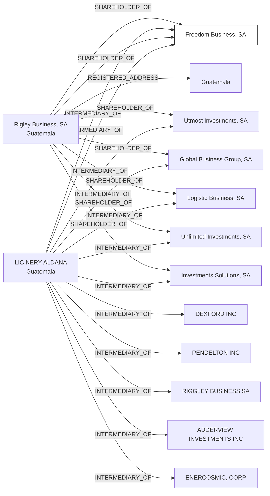

#Freedom Business, S.A.
Status: Defaulted
Address: CORPOLARIOS  LIC. NERY ALDANA 12 CALLE 1-25 ZONA 10 EDIFICIO GEMINIS 10; TORRE NORTE OFICINA 1604 GUATEMALA; GUATEMALA

##Incoming
SHAREHOLDER
Rigley Business, S.A.
Guatemala

INTERMEDIARY
LIC. NERY ALDANA
Guatemala

##Graph
