#GRACEFUL SINCERE ENTERPRISES LIMITED
Status: Defaulted
Address: ALLBRIGHT LAW OFFICES(HANGZHOU) 5/F; BLOCK A; HUAHONG BUILDING; NO.238 TIANMUSHAN ROAD; HANGZHOU CITY ZHEJIANG PROVINCE.; P.R. CHINA 310005 *S.I.*

##Incoming
SHAREHOLDER
MONG SING MANAGEMENT LTD.
British Virgin Islands

INTERMEDIARY
ALLBRIGHT LAW OFFICES (HANGZHOU)
ALLBRIGHT LAW OFFICES(HANGZHOU) 5/F; BLOCK A; HUAHONG BUILDING; NO.238 TIANMUSHAN ROAD; HANGZHOU CITY ZHEJIANG PROVINCE.; P.R. CHINA 310005 *S.I.*
China

##Graph

```mermaid
graph LR
classDef outline fill:#fff,stroke:#000,stroke-width:1px;
node1[GRACEFUL SINCERE ENTERPRISES LIMITED<br>]
node2[MONG SING MANAGEMENT LTD<br>British Virgin Islands]
node2-->|SHAREHOLDER_OF|node1
node3[ALLBRIGHT LAW OFFICES %28HANGZHOU%29<br>China]
node3-->|INTERMEDIARY_OF|node1
class node1 outline
node4[<br>British Virgin Islands]
node2-->|REGISTERED_ADDRESS|node4
node2-->|SHAREHOLDER_OF|node1
node5[PRIDE BEST HOLDINGS LIMITED<br>]
node3-->|INTERMEDIARY_OF|node5
node6[EHarmony International Limited<br>]
node3-->|INTERMEDIARY_OF|node6
node7[FAME SMART HOLDING LTD<br>]
node3-->|INTERMEDIARY_OF|node7
node8[BEAUTY BLESS INVESTMENT LTD<br>]
node3-->|INTERMEDIARY_OF|node8
node9[GOLDEN BAMBOO TECHNOLOGY LTD<br>]
node3-->|INTERMEDIARY_OF|node9
node10[EVER WISDOM CONSULTANTS LIMITED<br>]
node3-->|INTERMEDIARY_OF|node10
node11[SPRINGSTER GROUP LTD<br>]
node3-->|INTERMEDIARY_OF|node11
node12[YAT INTERNATIONAL LIMITED<br>]
node3-->|INTERMEDIARY_OF|node12
node13[SUNNY RICH INVESTMENT LIMITED<br>]
node3-->|INTERMEDIARY_OF|node13
node14[LUKA VILLA INVESTMENTS LIMITED<br>]
node3-->|INTERMEDIARY_OF|node14
node15[MOON SMILE HOLDINGS LIMITED<br>]
node3-->|INTERMEDIARY_OF|node15
node16[KUNYUAN CAPITAL LIMITED<br>]
node3-->|INTERMEDIARY_OF|node16
node17[GRACE TONE TRADING LIMITED<br>]
node3-->|INTERMEDIARY_OF|node17
node18[FIRST METAL INTERNATIONAL CO, LTD<br>]
node3-->|INTERMEDIARY_OF|node18
node19[WORLD ORIENT HOLDINGS LTD<br>]
node3-->|INTERMEDIARY_OF|node19
node20[MASTER TOP DEVELOPMENT LTD<br>]
node3-->|INTERMEDIARY_OF|node20
node21[SUPERB FANCY LIMITED<br>]
node3-->|INTERMEDIARY_OF|node21
node22[COLOUR WORLD INTERNATIONAL LTD<br>]
node3-->|INTERMEDIARY_OF|node22
node23[INVESTGAIN POWER LIMITED<br>]
node3-->|INTERMEDIARY_OF|node23
node24[CHANNEL BEST ENTERPRISES LIMITED<br>]
node3-->|INTERMEDIARY_OF|node24
node25[MSB INTERNATIONAL TRADING LIMITED<br>]
node3-->|INTERMEDIARY_OF|node25
node26[SPECIAL TEXTILE HOLDING LIMITED<br>]
node3-->|INTERMEDIARY_OF|node26
node27[SUPERQUALITY FINANCE LIMITED<br>]
node3-->|INTERMEDIARY_OF|node27
node28[WAN FU GROUP LTD<br>]
node3-->|INTERMEDIARY_OF|node28
node29[FORTUNE CROSS GROUP LTD<br>]
node3-->|INTERMEDIARY_OF|node29
node30[WEBI INVESTMENT LIMITED<br>]
node3-->|INTERMEDIARY_OF|node30
node31[AO XIANG TECHNOLOGIES LIMITED<br>]
node3-->|INTERMEDIARY_OF|node31
node32[MONG SING MANAGEMENT LTD<br>]
node3-->|INTERMEDIARY_OF|node32
node33[CHINA MARK GARDEN PRODUCTS HOLDING LIMITED<br>]
node3-->|INTERMEDIARY_OF|node33
node34[FU WING MANAGEMENT LTD<br>]
node3-->|INTERMEDIARY_OF|node34
node35[GRAND HOPE FINANCE LIMITED<br>]
node3-->|INTERMEDIARY_OF|node35
node36[GIANT DRAGON HOLDINGS LTD<br>]
node3-->|INTERMEDIARY_OF|node36
node37[ISLAND STAR LIMITED<br>]
node3-->|INTERMEDIARY_OF|node37
node38[SUPER STAR ENTERPRISES LIMITED<br>]
node3-->|INTERMEDIARY_OF|node38
node39[GOLDEN BRIDGE LIMITED<br>]
node3-->|INTERMEDIARY_OF|node39
node40[HARRISON INTERNATIONAL LTD<br>]
node3-->|INTERMEDIARY_OF|node40
node41[KINGFAIR HOLDINGS LTD<br>]
node3-->|INTERMEDIARY_OF|node41
node42[NEWLAND DEVELOPMENT LIMITED<br>]
node3-->|INTERMEDIARY_OF|node42
node43[MONTEBELLO FINANCE LTD<br>]
node3-->|INTERMEDIARY_OF|node43
node44[HIGH TUNE INTERNATIONAL LIMITED<br>]
node3-->|INTERMEDIARY_OF|node44
node45[LANDSCAL INVESTMENT LIMITED<br>]
node3-->|INTERMEDIARY_OF|node45
node46[GREEN LAND INVESTMENT LTD<br>]
node3-->|INTERMEDIARY_OF|node46
node47[Zhong Hui Yuan Investment Co, Limited<br>]
node3-->|INTERMEDIARY_OF|node47
node48[GREAD OCEAN LTD<br>]
node3-->|INTERMEDIARY_OF|node48
node49[GOLDEN SEA DEVELOPMENT LIMITED<br>]
node3-->|INTERMEDIARY_OF|node49
node50[CRYSTAL SKY HOLDINGS LTD<br>]
node3-->|INTERMEDIARY_OF|node50
node51[SAN JIANG INTERNATIONAL LTD<br>]
node3-->|INTERMEDIARY_OF|node51
node52[GOLD ALLIANCE LIMITED<br>]
node3-->|INTERMEDIARY_OF|node52
node53[CHEER GOLD DEVELOPMENT LTD<br>]
node3-->|INTERMEDIARY_OF|node53
node54[HILTON STAR LIMITED<br>]
node3-->|INTERMEDIARY_OF|node54
node55[RICH TIME TRADING LIMITED<br>]
node3-->|INTERMEDIARY_OF|node55
node56[MAGIC DREAM ENTERPRISES LTD<br>]
node3-->|INTERMEDIARY_OF|node56
node57[GOLDEN NATURE INVESTMENTS LTD<br>]
node3-->|INTERMEDIARY_OF|node57
node58[OCEAN SHELL ENTERPRISES LIMITED<br>]
node3-->|INTERMEDIARY_OF|node58
node59[Top Mondial Holdings Ltd<br>]
node3-->|INTERMEDIARY_OF|node59
node60[GOLDEN BIN HAI HOLDING LTD<br>]
node3-->|INTERMEDIARY_OF|node60
node61[FORTUNE EXPRESS DEVELOPMENT LIMITED<br>]
node3-->|INTERMEDIARY_OF|node61
node62[JADE VICTORY INTERNATIONAL LIMITED<br>]
node3-->|INTERMEDIARY_OF|node62
node63[MAJOR TALENT LIMITED<br>]
node3-->|INTERMEDIARY_OF|node63
node64[SUN RED INVESTMENTS LIMITED<br>]
node3-->|INTERMEDIARY_OF|node64
node65[Hailiang %28Africa%29 Mineral Investment Co, Ltd<br>]
node3-->|INTERMEDIARY_OF|node65
node66[YRD Enterprise Commercial Confederation Limited<br>]
node3-->|INTERMEDIARY_OF|node66
node67[ZONE STAR TRADING LIMITED<br>]
node3-->|INTERMEDIARY_OF|node67
node68[DOUBLE GOLD TECHNOLOGY LTD<br>]
node3-->|INTERMEDIARY_OF|node68
node69[HYESUNG INTERNATIONAL LIMITED<br>]
node3-->|INTERMEDIARY_OF|node69
node70[FORBOSS BUSINESS MENTOR CENTER LLC<br>]
node3-->|INTERMEDIARY_OF|node70
node71[STONE HOLDING LTD<br>]
node3-->|INTERMEDIARY_OF|node71
node72[INTEGRITY GROUP LIMITED<br>]
node3-->|INTERMEDIARY_OF|node72
node73[RAINBOW GROUP LTD<br>]
node3-->|INTERMEDIARY_OF|node73
node74[Zhong Hong Yuan Investment Co, Limited<br>]
node3-->|INTERMEDIARY_OF|node74
node75[GREAT VALUE GROUP LIMITED<br>]
node3-->|INTERMEDIARY_OF|node75
node76[RED ENERGY DEVELOPMENT LTD<br>]
node3-->|INTERMEDIARY_OF|node76
node77[COMBO CONSULTANT LIMITED<br>]
node3-->|INTERMEDIARY_OF|node77
node78[NEW MINGDE LIMITED<br>]
node3-->|INTERMEDIARY_OF|node78
node79[PACIFIC EAGLE ENTERPRISES LTD<br>]
node3-->|INTERMEDIARY_OF|node79
node80[HAO JIANG CO, LIMITED<br>]
node3-->|INTERMEDIARY_OF|node80
node81[TEAM UP LIMITED<br>]
node3-->|INTERMEDIARY_OF|node81
node82[NEW TIMES INVESTMENT LIMITED<br>]
node3-->|INTERMEDIARY_OF|node82
node83[BEAMING INVESTMENT LIMITED<br>]
node3-->|INTERMEDIARY_OF|node83
node84[GOLDEN OPPORTUNITY INTERNATIONAL LIMITED<br>]
node3-->|INTERMEDIARY_OF|node84
node85[DREAM LAND GROUP LTD<br>]
node3-->|INTERMEDIARY_OF|node85
node86[RICHSTAR INTERNATIONAL HOLDING LIMITED<br>]
node3-->|INTERMEDIARY_OF|node86
node87[GALORE INTERNATIONAL LIMITED<br>]
node3-->|INTERMEDIARY_OF|node87
node88[CHINA ECONOMIC DEVELOPMENT RESERCHER CENTER LLC<br>]
node3-->|INTERMEDIARY_OF|node88
node3-->|INTERMEDIARY_OF|node1
node89[PERFECT TOP HOLDINGS LIMITED<br>]
node3-->|INTERMEDIARY_OF|node89
node90[Sunflower %28CHINA%29 Investment Ltd<br>]
node3-->|INTERMEDIARY_OF|node90
node91[PRIMA WORLD INVESTMENTS LIMITED<br>]
node3-->|INTERMEDIARY_OF|node91
node92[SWAN SEA DEVELOPMENT LTD<br>]
node3-->|INTERMEDIARY_OF|node92
node93[JOYFUL HUGE HOLDINGS LIMITED<br>]
node3-->|INTERMEDIARY_OF|node93
node94[TRUE ESSENCE INVESTMENT LIMITED<br>]
node3-->|INTERMEDIARY_OF|node94
node95[DEEP BLUE GROUP LIMITED<br>]
node3-->|INTERMEDIARY_OF|node95
node96[DIAMOND SEA ENTERPRISES LTD<br>]
node3-->|INTERMEDIARY_OF|node96
node97[FUNSWAY HOLDINGS LTD<br>]
node3-->|INTERMEDIARY_OF|node97
node98[SHINING STAR INVESTMENT LIMITED<br>]
node3-->|INTERMEDIARY_OF|node98
node99[STARFIELD GROUP LTD<br>]
node3-->|INTERMEDIARY_OF|node99
node100[VAST INVESTMENT LIMITED<br>]
node3-->|INTERMEDIARY_OF|node100
node101[KENBO HOLDING LIMITED<br>]
node3-->|INTERMEDIARY_OF|node101
node102[SHINE PEARL DEVELOPMENT LTD<br>]
node3-->|INTERMEDIARY_OF|node102
node103[FLOSTER INVESTMENT LTD<br>]
node3-->|INTERMEDIARY_OF|node103
node104[GOOD BROTHERS FINANCE LIMITED<br>]
node3-->|INTERMEDIARY_OF|node104
node105[WEILIN HOLDINGS LTD<br>]
node3-->|INTERMEDIARY_OF|node105
node106[FAMOUS YIELD LTD<br>]
node3-->|INTERMEDIARY_OF|node106
node107[GOLDEN WISHES GROUP LTD<br>]
node3-->|INTERMEDIARY_OF|node107
node108[SIGMA International Trade Co, Limited<br>]
node3-->|INTERMEDIARY_OF|node108
node109[SUMMER BREEZE INTERNATIONAL LIMITED<br>]
node3-->|INTERMEDIARY_OF|node109
node110[CHEERFUL TRADING LIMITED<br>]
node3-->|INTERMEDIARY_OF|node110
node111[WIN RUNNER ENTERPRISES LIMITED<br>]
node3-->|INTERMEDIARY_OF|node111
node112[LEOPARD TECHNOLOGY LTD<br>]
node3-->|INTERMEDIARY_OF|node112
node113[ELEGANT GALLERY LIMITED<br>]
node3-->|INTERMEDIARY_OF|node113
node114[SUPER GOAL ENTERPRISES LTD<br>]
node3-->|INTERMEDIARY_OF|node114
node115[PANORAMIC INVESTMENT LIMITED<br>]
node3-->|INTERMEDIARY_OF|node115
node116[GRAND INVESTMENT CO, LIMITED<br>]
node3-->|INTERMEDIARY_OF|node116
node117[HERO HORSE LIMITED<br>]
node3-->|INTERMEDIARY_OF|node117
node118[FULL BLOOM INTERNATIONAL LIMITED<br>]
node3-->|INTERMEDIARY_OF|node118
node119[MEIBANG INTERNATIONAL HOLDING LIMITED<br>]
node3-->|INTERMEDIARY_OF|node119
node120[UNIVERSAL ART DEVELOPMENT LTD<br>]
node3-->|INTERMEDIARY_OF|node120
node121[Rongsheng Holdings Limited<br>]
node3-->|INTERMEDIARY_OF|node121
node122[Grand Fortune Industry Group Limited<br>]
node3-->|INTERMEDIARY_OF|node122
node123[HANSE INTERNATIONAL COOPERATION LIMITED<br>]
node3-->|INTERMEDIARY_OF|node123
```
