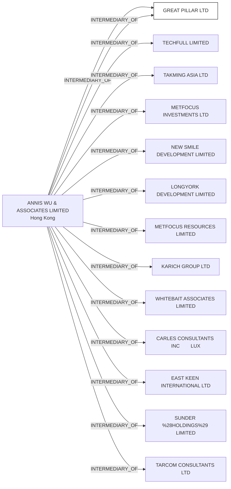

#GREAT PILLAR LTD.
Status: Defaulted
Address: ANNIS WU & ASSOCIATES LIMITED ROOM 9C, TRUST TOWER 68 JOHNSTON ROAD WANCHAI HONG KONG

##Incoming
INTERMEDIARY
ANNIS WU & ASSOCIATES LIMITED
ANNIS WU & ASSOCIATES LIMITED ROOM 9C, TRUST TOWER 68 JOHNSTON ROAD WANCHAI HONG KONG
Hong Kong

##Graph
