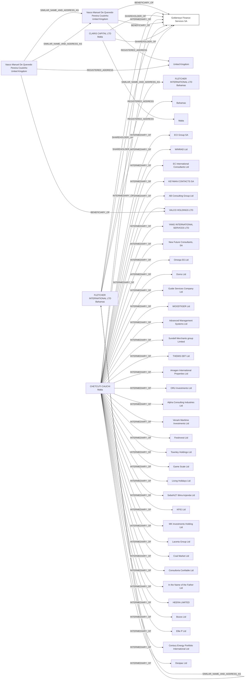

#Goldeneye Finance Services S.A.
Status: In transition
Address: CCA INTERSERV LTD 120; ST. URSULA STREET; VLT 1236 VAT REG NO: MT 1734-7234 VALLETTA MALTA

##Incoming
BENEFICIARY
Vasco Manuel De Quevedo Pereira Coutinho
United Kingdom

SHAREHOLDER
FLETCHER INTERNATIONAL LTD
Bahamas

SHAREHOLDER
CLARIS CAPITAL LTD
Malta

INTERMEDIARY
CHETCUTI CAUCHI
CCA INTERSERV LTD 120; ST. URSULA STREET; VLT 1236 VAT REG NO: MT 1734-7234 VALLETTA MALTA
Malta

##Graph
