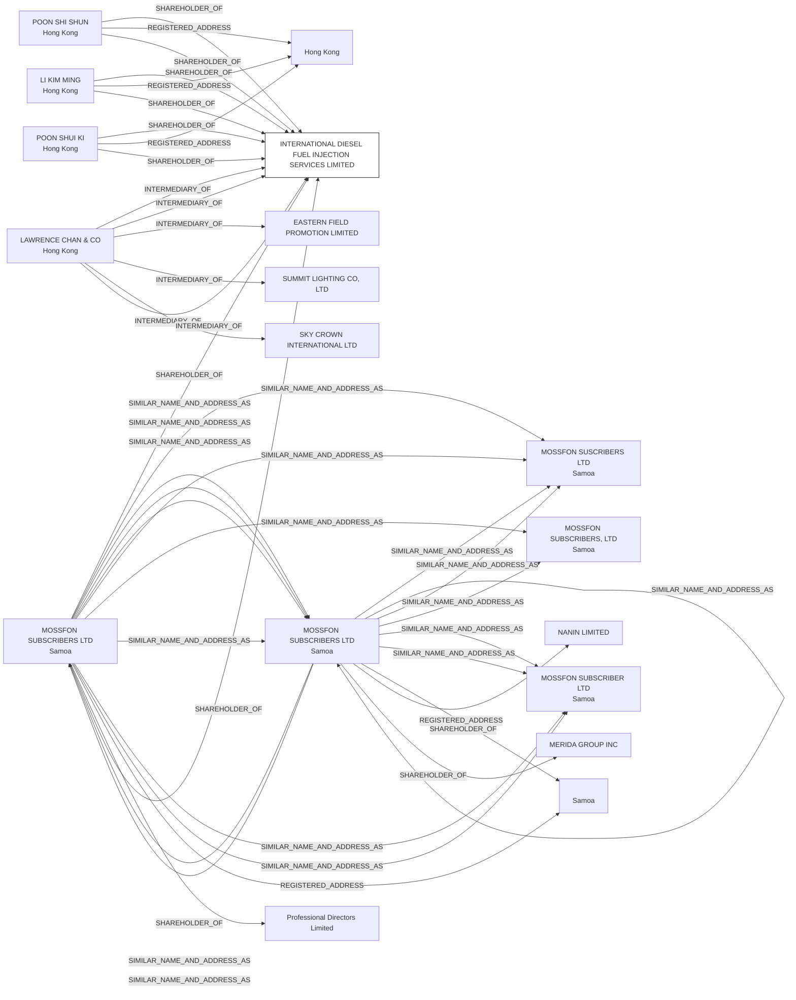

#INTERNATIONAL DIESEL FUEL INJECTION SERVICES LIMITED
Status: Active
Address: LAWRENCE CHAN & CO. CERTIFIED PUBLIC ACCOUNTANTS SUITE 601A; FOURSEAS BUILDING 208-212 NATHAN ROAD TSIMSHATSUI; KOWLOON HONG KONG

##Incoming
SHAREHOLDER
POON SHI SHUN
Hong Kong

SHAREHOLDER
MOSSFON SUBSCRIBERS LTD
Samoa

SHAREHOLDER
LI KIM MING
Hong Kong

SHAREHOLDER
POON SHUI KI
Hong Kong

INTERMEDIARY
LAWRENCE CHAN & CO.
LAWRENCE CHAN & CO. CERTIFIED PUBLIC ACCOUNTANTS SUITE 601A; FOURSEAS BUILDING 208-212 NATHAN ROAD TSIMSHATSUI; KOWLOON HONG KONG
Hong Kong

##Graph
