#KIDS INCORPORATED
Status: Defaulted
Address: CLONFERT HOLDINGS LIMITED 8A PITMANS ALLEY MAIN STREET  GIBRALTAR

##Incoming
SHAREHOLDER
REDMOUNT TRUST COMPANY LIMITED
Gibraltar

INTERMEDIARY
CLONFERT HOLDINGS LIMITED
CLONFERT HOLDINGS LIMITED 8A PITMANS ALLEY MAIN STREET  GIBRALTAR
Gibraltar

##Graph

```mermaid
graph LR
classDef outline fill:#fff,stroke:#000,stroke-width:1px;
node1[KIDS INCORPORATED<br>]
node2[REDMOUNT TRUST COMPANY LIMITED<br>Gibraltar]
node2-->|SHAREHOLDER_OF|node1
node3[CLONFERT HOLDINGS LIMITED<br>Gibraltar]
node3-->|INTERMEDIARY_OF|node1
class node1 outline
node2-->|SIMILAR_NAME_AND_ADDRESS_AS|node2
node4[<br>Gibraltar]
node2-->|REGISTERED_ADDRESS|node4
node5[Brandir Investments Limited<br>]
node2-->|SHAREHOLDER_OF|node5
node6[Elrond Investments Limited<br>]
node2-->|SHAREHOLDER_OF|node6
node7[Sauron Investments Limited<br>]
node2-->|SHAREHOLDER_OF|node7
node8[COMMUNITY CONSULTANTS LTD<br>]
node2-->|SHAREHOLDER_OF|node8
node9[Redoma Investments Limited<br>]
node2-->|SHAREHOLDER_OF|node9
node10[Kinsuma Investments Limited<br>]
node2-->|SHAREHOLDER_OF|node10
node11[Silmaril Investments Limited<br>]
node2-->|SHAREHOLDER_OF|node11
node12[FINCHWOOD CORP<br>]
node2-->|SHAREHOLDER_OF|node12
node2-->|SHAREHOLDER_OF|node1
node13[Palidos Investments Limited<br>]
node2-->|SHAREHOLDER_OF|node13
node14[Pippin Investments Limited<br>]
node2-->|SHAREHOLDER_OF|node14
node15[Taichi Investments Limited<br>]
node2-->|SHAREHOLDER_OF|node15
node16[Galadriel Investments Limited<br>]
node2-->|SHAREHOLDER_OF|node16
node17[Lorien Investments Limited<br>]
node2-->|SHAREHOLDER_OF|node17
node18[Valimar Investments Limited<br>]
node2-->|SHAREHOLDER_OF|node18
node19[Gimli Investments Limited<br>]
node2-->|SHAREHOLDER_OF|node19
node20[Meriadoc Investments Limited<br>]
node2-->|SHAREHOLDER_OF|node20
node21[Gondor Investments Limited<br>]
node2-->|SHAREHOLDER_OF|node21
node22[Celeborn Investments Limited<br>]
node2-->|SHAREHOLDER_OF|node22
node3-->|INTERMEDIARY_OF|node1
node3-->|INTERMEDIARY_OF|node12
node23[TERRANOVA SA<br>]
node3-->|INTERMEDIARY_OF|node23
node24[CARMEL LTD<br>]
node3-->|INTERMEDIARY_OF|node24
node3-->|INTERMEDIARY_OF|node1
node25[CAICOS LTD<br>]
node3-->|INTERMEDIARY_OF|node25
node26[KLEARVIEW MANAGEMENT LTD<br>]
node3-->|INTERMEDIARY_OF|node26
node27[KIRSTEN CORP<br>]
node3-->|INTERMEDIARY_OF|node27
node3-->|INTERMEDIARY_OF|node12
node28[TRANK PROPERTIES LIMITED<br>]
node3-->|INTERMEDIARY_OF|node28
node29[CARET HOLDINGS INVESTMENTS LIMITED<br>]
node3-->|INTERMEDIARY_OF|node29
node30[CLONFERT HOLDINGS LTD<br>]
node3-->|INTERMEDIARY_OF|node30
node31[SHEPPERTON WORLDWIDE LTD<br>]
node3-->|INTERMEDIARY_OF|node31
node32[FASTIK INC<br>]
node3-->|INTERMEDIARY_OF|node32
node33[KINMARLIN MANAGERS LTD<br>]
node3-->|INTERMEDIARY_OF|node33
node34[GOODSPEED ENTERPRISES CORPORATION<br>]
node3-->|INTERMEDIARY_OF|node34
node35[LEISURE PRODUCTS HOLDINGS LIMITED<br>]
node3-->|INTERMEDIARY_OF|node35
node36[GOLFSTREAM HOLDINGS LIMITED<br>]
node3-->|INTERMEDIARY_OF|node36
node37[CARLE INTERNATIONAL LTD<br>]
node3-->|INTERMEDIARY_OF|node37
node38[VENTURE MANAGEMENT TRADING LIMITED<br>]
node3-->|INTERMEDIARY_OF|node38
node39[RED DOG HOLDINGS LIMITED<br>]
node3-->|INTERMEDIARY_OF|node39
node40[BRIDGEPORT FINANCE LTD<br>]
node3-->|INTERMEDIARY_OF|node40
node41[LANTRADE INVESTMENTS LIMITED<br>]
node3-->|INTERMEDIARY_OF|node41
node42[HIGH GABLE LIMITED<br>]
node3-->|INTERMEDIARY_OF|node42
node43[TWIN ASHES LIMITED<br>]
node3-->|INTERMEDIARY_OF|node43
node44[PETALSHELL MANAGEMENT LIMITED<br>]
node3-->|INTERMEDIARY_OF|node44
node45[TOP VENTURE CAPITAL LIMITED<br>]
node3-->|INTERMEDIARY_OF|node45
node46[CHICHI HOLDINGS LIMITED<br>]
node3-->|INTERMEDIARY_OF|node46
node47[FILBURN FINANCE LIMITED<br>]
node3-->|INTERMEDIARY_OF|node47
node48[DELTAERO LIMITED<br>]
node3-->|INTERMEDIARY_OF|node48
node3-->|INTERMEDIARY_OF|node25
```
