#Living Holidays Ltd
Status: Active
Address: CCA INTERSERV LTD 120; ST. URSULA STREET; VLT 1236 VAT REG NO: MT 1734-7234 VALLETTA MALTA

##Incoming
BENEFICIARY
FEDERICO RODOLFO ARDUINO
Greece

SHAREHOLDER
Always International Holdings Ltd
Malta

SHAREHOLDER
CLARIS TRUSTEES & FIDUCIARIES LTD (New Name of Company) Claris Capital Ltd
Malta

INTERMEDIARY
CHETCUTI CAUCHI
CCA INTERSERV LTD 120; ST. URSULA STREET; VLT 1236 VAT REG NO: MT 1734-7234 VALLETTA MALTA
Malta

##Graph

```mermaid
graph LR
classDef outline fill:#fff,stroke:#000,stroke-width:1px;
node1[Living Holidays Ltd<br>]
node2[FEDERICO RODOLFO ARDUINO<br>Greece]
node2-->|BENEFICIARY_OF|node1
node3[Always International Holdings Ltd<br>Malta]
node3-->|SHAREHOLDER_OF|node1
node4[CLARIS TRUSTEES & FIDUCIARIES LTD %28New Name of Company%29 Claris Capital Ltd<br>Malta]
node4-->|SHAREHOLDER_OF|node1
node5[CHETCUTI CAUCHI<br>Malta]
node5-->|INTERMEDIARY_OF|node1
class node1 outline
node2-->|BENEFICIARY_OF|node1
node6[<br>Greece]
node2-->|REGISTERED_ADDRESS|node6
node7[<br>Malta]
node3-->|REGISTERED_ADDRESS|node7
node3-->|SHAREHOLDER_OF|node1
node4-->|REGISTERED_ADDRESS|node7
node8[WINRAD Ltd<br>]
node4-->|SHAREHOLDER_OF|node8
node9[Kirmann Ltd<br>]
node4-->|SHAREHOLDER_OF|node9
node10[Festinvest Ltd<br>]
node4-->|SHAREHOLDER_OF|node10
node11[Townley Holdings Ltd<br>]
node4-->|SHAREHOLDER_OF|node11
node4-->|SHAREHOLDER_OF|node1
node12[ECI Group SA<br>]
node5-->|INTERMEDIARY_OF|node12
node5-->|INTERMEDIARY_OF|node8
node13[EC International Consultants Ltd<br>]
node5-->|INTERMEDIARY_OF|node13
node14[KEYMAN CONTACTS SA<br>]
node5-->|INTERMEDIARY_OF|node14
node15[AB Consulting Group Ltd<br>]
node5-->|INTERMEDIARY_OF|node15
node16[VALCO HOLDINGS LTD<br>]
node5-->|INTERMEDIARY_OF|node16
node17[YANG INTERNATIONAL SERVICES LTD<br>]
node5-->|INTERMEDIARY_OF|node17
node18[New Future Consultants, SA<br>]
node5-->|INTERMEDIARY_OF|node18
node19[Omeqa-SS Ltd<br>]
node5-->|INTERMEDIARY_OF|node19
node20[Dorns Ltd<br>]
node5-->|INTERMEDIARY_OF|node20
node21[Guide Services Company Ltd<br>]
node5-->|INTERMEDIARY_OF|node21
node22[WOODTIGER Ltd<br>]
node5-->|INTERMEDIARY_OF|node22
node23[Advanced Management Systems Ltd<br>]
node5-->|INTERMEDIARY_OF|node23
node24[Sundell Merchants group Limited<br>]
node5-->|INTERMEDIARY_OF|node24
node25[THEMIS EBT Ltd<br>]
node5-->|INTERMEDIARY_OF|node25
node26[Amagen International Properties Ltd<br>]
node5-->|INTERMEDIARY_OF|node26
node27[ORU Investments Ltd<br>]
node5-->|INTERMEDIARY_OF|node27
node28[Alpha Consulting Industries Ltd<br>]
node5-->|INTERMEDIARY_OF|node28
node29[Venark Maritime Investments Ltd<br>]
node5-->|INTERMEDIARY_OF|node29
node5-->|INTERMEDIARY_OF|node10
node5-->|INTERMEDIARY_OF|node11
node30[Game Scale Ltd<br>]
node5-->|INTERMEDIARY_OF|node30
node5-->|INTERMEDIARY_OF|node1
node31[Seba%27 Ibhra Azjenda Ltd<br>]
node5-->|INTERMEDIARY_OF|node31
node32[Goldeneye Finance Services SA<br>]
node5-->|INTERMEDIARY_OF|node32
node33[KFIG Ltd<br>]
node5-->|INTERMEDIARY_OF|node33
node34[MK Investments Holding Ltd<br>]
node5-->|INTERMEDIARY_OF|node34
node35[Lacerta Group Ltd<br>]
node5-->|INTERMEDIARY_OF|node35
node36[Coal Market Ltd<br>]
node5-->|INTERMEDIARY_OF|node36
node37[Consultoria Confiable Ltd<br>]
node5-->|INTERMEDIARY_OF|node37
node38[In the Name of the Father Ltd<br>]
node5-->|INTERMEDIARY_OF|node38
node39[HEERA LIMITED<br>]
node5-->|INTERMEDIARY_OF|node39
node40[Bozos Ltd<br>]
node5-->|INTERMEDIARY_OF|node40
node41[Ellie P Ltd<br>]
node5-->|INTERMEDIARY_OF|node41
node42[Century Energy Portfolio International Ltd<br>]
node5-->|INTERMEDIARY_OF|node42
node43[Desipac Ltd<br>]
node5-->|INTERMEDIARY_OF|node43
```
