#MASTER EAGLE TRADING LTD.
Status: Defaulted
Address: CO-SEC ACCOUNTANCY LIMITED 4TH FLOOR; SIU YING COMMERCIAL BUILDING; 151-155 QUEEN'S ROAD CENTRAL; HONG KONG.

##Incoming
INTERMEDIARY
CO-SEC ACCOUNTANCY LIMITED
CO-SEC ACCOUNTANCY LIMITED 4TH FLOOR; SIU YING COMMERCIAL BUILDING; 151-155 QUEEN'S ROAD CENTRAL; HONG KONG.
Hong Kong

##Graph

```mermaid
graph LR
classDef outline fill:#fff,stroke:#000,stroke-width:1px;
node1[MASTER EAGLE TRADING LTD<br>]
node2[CO-SEC ACCOUNTANCY LIMITED<br>Hong Kong]
node2-->|INTERMEDIARY_OF|node1
class node1 outline
node3[UNIVERSAL CROWN LIMITED<br>]
node2-->|INTERMEDIARY_OF|node3
node4[YOUNG EAGLE INTERNATIONAL LIMITED<br>]
node2-->|INTERMEDIARY_OF|node4
node5[KOON FAI DEVELOPMENT LIMITED<br>]
node2-->|INTERMEDIARY_OF|node5
node6[KINGSFORD GROUP LTD<br>]
node2-->|INTERMEDIARY_OF|node6
node7[LEICON ENTERPRISES LTD<br>]
node2-->|INTERMEDIARY_OF|node7
node8[ACCON TRADING LIMITED<br>]
node2-->|INTERMEDIARY_OF|node8
node9[BONDER INTERNATIONAL LIMITED<br>]
node2-->|INTERMEDIARY_OF|node9
node10[POWER GLORY TRADING LTD<br>]
node2-->|INTERMEDIARY_OF|node10
node11[OCEAN WIDE FINANCE LIMITED<br>]
node2-->|INTERMEDIARY_OF|node11
node12[DOUBLE GLORY INVESTMENT GROUP LTD<br>]
node2-->|INTERMEDIARY_OF|node12
node13[JOHN SWIRE LIMITED<br>]
node2-->|INTERMEDIARY_OF|node13
node14[EASY CHANCE INTERNATIONAL LTD<br>]
node2-->|INTERMEDIARY_OF|node14
node15[FIRSTWAY INTERNATIONAL LIMITED<br>]
node2-->|INTERMEDIARY_OF|node15
node16[NICE STYLE DEVELOPMENT LTD<br>]
node2-->|INTERMEDIARY_OF|node16
node17[ASTORIA GROUP LTD<br>]
node2-->|INTERMEDIARY_OF|node17
node18[EDINBURGH ENTERPRISES LTD<br>]
node2-->|INTERMEDIARY_OF|node18
node19[JOIN VIEW GROUP LIMITED<br>]
node2-->|INTERMEDIARY_OF|node19
node20[SOUTHERN PACIFIC INTERNATIONAL LIMITED<br>]
node2-->|INTERMEDIARY_OF|node20
node21[BURKMAN ENTERPRISES LTD<br>]
node2-->|INTERMEDIARY_OF|node21
node2-->|INTERMEDIARY_OF|node1
node22[JETSFIELD DEVELOPMENT LTD %28WITH CHINESE CHARACTERS%29<br>]
node2-->|INTERMEDIARY_OF|node22
node23[SUMIDA FAITH ENTERPRISES LTD<br>]
node2-->|INTERMEDIARY_OF|node23
node24[FOCUS CENTER LIMITED<br>]
node2-->|INTERMEDIARY_OF|node24
node25[GIANT ENVIRONMENT TECHNOLOGY UK%29 LTD %5BGLOBAL CRUISES GROUP%29 LIMITED<br>]
node2-->|INTERMEDIARY_OF|node25
node26[SMART ASIA ENTERPRISES LTD<br>]
node2-->|INTERMEDIARY_OF|node26
node27[MEDIA-TEK CO, LTD<br>]
node2-->|INTERMEDIARY_OF|node27
node28[MAX WORLD GROUP LTD<br>]
node2-->|INTERMEDIARY_OF|node28
node29[MAIN FORD INVESTMENT LTD<br>]
node2-->|INTERMEDIARY_OF|node29
node30[PACIFIC FAME GROUP LTD<br>]
node2-->|INTERMEDIARY_OF|node30
node31[WEALTH FULL INTERNATIONAL LTD<br>]
node2-->|INTERMEDIARY_OF|node31
node32[INTER-ORIENTAL INVESTMENTS LTD<br>]
node2-->|INTERMEDIARY_OF|node32
node33[TEAM DRAGON ENTERPRISES LTD<br>]
node2-->|INTERMEDIARY_OF|node33
node34[DEEP GLORY INTERNATIONAL INVESTMENT LTD<br>]
node2-->|INTERMEDIARY_OF|node34
node35[FAIRING FORTUNE LTD<br>]
node2-->|INTERMEDIARY_OF|node35
node36[SMART ON INTERNATIONAL DEVELOPMENT LTD<br>]
node2-->|INTERMEDIARY_OF|node36
node37[JEBSON INTERNATIONAL ENTERPRISES LTD<br>]
node2-->|INTERMEDIARY_OF|node37
node38[EASECO SHINE INVESTMENTS LTD<br>]
node2-->|INTERMEDIARY_OF|node38
node39[GREAT STRONG INTERNATIONAL LTD<br>]
node2-->|INTERMEDIARY_OF|node39
node40[GRACE WELL INTERNATIONAL LTD<br>]
node2-->|INTERMEDIARY_OF|node40
node41[RIGHT STAR %28ASIA%29 LTD<br>]
node2-->|INTERMEDIARY_OF|node41
node42[CITY WORLD INTERNATIONAL INVESTMENT LTD<br>]
node2-->|INTERMEDIARY_OF|node42
node43[GAIN CAPITAL INVESTMENTS LTD<br>]
node2-->|INTERMEDIARY_OF|node43
node44[GOLDEN YELLOW TIGER LIMITED<br>]
node2-->|INTERMEDIARY_OF|node44
node45[TRIPLE WISHES LTD<br>]
node2-->|INTERMEDIARY_OF|node45
node46[SINO-AMERICAN BODY SCIENCE INSTITUTE LIMITED<br>]
node2-->|INTERMEDIARY_OF|node46
node47[ALL WINNERS CORPORATION<br>]
node2-->|INTERMEDIARY_OF|node47
node48[RICHLAKE DEVELOPMENT LTD<br>]
node2-->|INTERMEDIARY_OF|node48
node49[EIGHT-EIGHT COMPANY LTD<br>]
node2-->|INTERMEDIARY_OF|node49
node50[TAK HANG OVERSEAS DEVELOPMENT LIMITED<br>]
node2-->|INTERMEDIARY_OF|node50
node2-->|INTERMEDIARY_OF|node48
node51[MANEX GROUP LIMITED<br>]
node2-->|INTERMEDIARY_OF|node51
node52[KAM TAI %28CHINA%29 LIMITED<br>]
node2-->|INTERMEDIARY_OF|node52
node53[DOUBLE SUCCESS ENTERPRISES LTD<br>]
node2-->|INTERMEDIARY_OF|node53
node54[DYNAMIC TRADE LIMITED<br>]
node2-->|INTERMEDIARY_OF|node54
node55[EVER CROWN INTERNATIONAL LIMITED<br>]
node2-->|INTERMEDIARY_OF|node55
node56[ST MULTIMEDIA LIMITED<br>]
node2-->|INTERMEDIARY_OF|node56
node57[HI-STAR MARINE, INC<br>]
node2-->|INTERMEDIARY_OF|node57
node58[MALTON ASIA LIMITED<br>]
node2-->|INTERMEDIARY_OF|node58
node59[BOVA LTD<br>]
node2-->|INTERMEDIARY_OF|node59
node60[SKYFIELD DEVELOPMENT LTD<br>]
node2-->|INTERMEDIARY_OF|node60
node61[COGENT DATAWORKS LIMITED<br>]
node2-->|INTERMEDIARY_OF|node61
node62[FIVE OCEAN INTERNATIONAL LTD<br>]
node2-->|INTERMEDIARY_OF|node62
node63[DIGITAL FAITH LIMITED<br>]
node2-->|INTERMEDIARY_OF|node63
node64[YUMEN DEVELOPMENT LTD<br>]
node2-->|INTERMEDIARY_OF|node64
node65[TOP BRIGHT ENTERPRISES LTD<br>]
node2-->|INTERMEDIARY_OF|node65
node66[BAYWATER CAPITAL LTD<br>]
node2-->|INTERMEDIARY_OF|node66
node67[CREATIVE CONSULTANTS MANAGEMENT LTD<br>]
node2-->|INTERMEDIARY_OF|node67
node68[MANPEAK INVESTMENTS LTD<br>]
node2-->|INTERMEDIARY_OF|node68
node69[MILLIONAIRE FINANCE LTD<br>]
node2-->|INTERMEDIARY_OF|node69
node70[CHINA WISDOM DEVELOPMENT LIMITED<br>]
node2-->|INTERMEDIARY_OF|node70
node71[SHOREVIEW CAPITAL LTD<br>]
node2-->|INTERMEDIARY_OF|node71
node72[WELL SMART INTERNATIONAL LIMITED<br>]
node2-->|INTERMEDIARY_OF|node72
node73[KEYMAN GROUP LTD<br>]
node2-->|INTERMEDIARY_OF|node73
node74[BRAND SOURCES MANAGEMENT LIMITED<br>]
node2-->|INTERMEDIARY_OF|node74
node75[NOBLE COLLECTION HOLDINGS LTD<br>]
node2-->|INTERMEDIARY_OF|node75
node76[MORINGTON CORPORATION<br>]
node2-->|INTERMEDIARY_OF|node76
node77[FORRESTON GROUP ENTERPRISE LTD<br>]
node2-->|INTERMEDIARY_OF|node77
node78[ELITE GOAL ENTERPRISES LIMITED<br>]
node2-->|INTERMEDIARY_OF|node78
node79[MERGER GLOBAL LIMITED<br>]
node2-->|INTERMEDIARY_OF|node79
node80[RICHBEST MANAGEMENT LTD<br>]
node2-->|INTERMEDIARY_OF|node80
node81[FORDBEST LTD<br>]
node2-->|INTERMEDIARY_OF|node81
node82[JOYRANK TRADING LTD<br>]
node2-->|INTERMEDIARY_OF|node82
node83[FAIRTOP DEVELOPMENT LTD<br>]
node2-->|INTERMEDIARY_OF|node83
node84[LINKO STATES INVESTMENTS LTD<br>]
node2-->|INTERMEDIARY_OF|node84
node85[EVER EAST INVESTMENT HOLDINGS LTD<br>]
node2-->|INTERMEDIARY_OF|node85
node86[HIGH EVER INTERNATIONAL HOLDINGS LIMITED<br>]
node2-->|INTERMEDIARY_OF|node86
node87[WINTERTHUR MANAGEMENT LIMITED<br>]
node2-->|INTERMEDIARY_OF|node87
node88[MASS EMPIRE DEVELOPMENTS LTD<br>]
node2-->|INTERMEDIARY_OF|node88
node89[WIN FAST INVESTMENTS LTD<br>]
node2-->|INTERMEDIARY_OF|node89
node90[KONIC HOLDINGS LTD<br>]
node2-->|INTERMEDIARY_OF|node90
node91[KAM TAI HOLDING LIMITED<br>]
node2-->|INTERMEDIARY_OF|node91
node92[FINE BEST ENTERPRISES LIMITED<br>]
node2-->|INTERMEDIARY_OF|node92
node93[SMART COLOR ENTERPRISES LIMITED<br>]
node2-->|INTERMEDIARY_OF|node93
```
