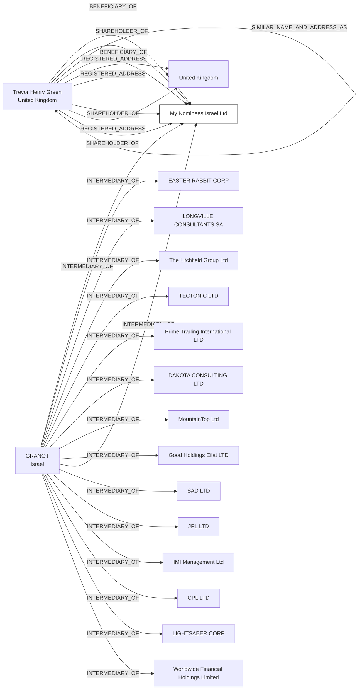

#My Nominees Israel Ltd
Status: Active
Address: GRANOT & CO. 125, MENACHEM BEGIN  ST. HAYOVEL TOWER (28TH FLOOR) P.O.B 7398 TEL AVIV  67012 ISRAEL

##Incoming
BENEFICIARY
Trevor Henry Green
United Kingdom

SHAREHOLDER
Trevor Henry Green
United Kingdom

INTERMEDIARY
GRANOT
Israel

##Graph
