#NICE ONE LIMITED
Status: Defaulted
Address: PENNING-SCHILTZ-WURTH ATTN.: MR. PIERRE-OLIVIER WURTH  18, RUE ROBERT STÜMPER  L-2557 LUXEMBOURG

##Incoming
INTERMEDIARY
PENNING-SCHILTZ-WURTH
PENNING-SCHILTZ-WURTH ATTN.: MR. PIERRE-OLIVIER WURTH  18, RUE ROBERT STÜMPER  L-2557 LUXEMBOURG
Luxembourg

##Graph

```mermaid
graph LR
classDef outline fill:#fff,stroke:#000,stroke-width:1px;
node1[NICE ONE LIMITED<br>]
node2[PENNING-SCHILTZ-WURTH<br>Luxembourg]
node2-->|INTERMEDIARY_OF|node1
class node1 outline
node3[GRACIA & CIE SA<br>]
node2-->|INTERMEDIARY_OF|node3
node4[MONZA INVEST SA<br>]
node2-->|INTERMEDIARY_OF|node4
node5[REXFORD INTERNATIONAL INC<br>]
node2-->|INTERMEDIARY_OF|node5
node6[PILICH SA<br>]
node2-->|INTERMEDIARY_OF|node6
node7[HOGAN LIMITED<br>]
node2-->|INTERMEDIARY_OF|node7
node8[VORTEX SA<br>]
node2-->|INTERMEDIARY_OF|node8
node9[IDICON CONSULTANTS SA<br>]
node2-->|INTERMEDIARY_OF|node9
node10[CHARMAYNE OVERSEAS CORP<br>]
node2-->|INTERMEDIARY_OF|node10
node11[TORRIDGE SA<br>]
node2-->|INTERMEDIARY_OF|node11
node12[HANNAH PORTFOLIO SA<br>]
node2-->|INTERMEDIARY_OF|node12
node13[INVEST CONNECTION FAMILY SA<br>]
node2-->|INTERMEDIARY_OF|node13
node14[SID LIMITED<br>]
node2-->|INTERMEDIARY_OF|node14
node15[NYLVA FINANCE SA<br>]
node2-->|INTERMEDIARY_OF|node15
node16[SCUNA SHIPPING SA<br>]
node2-->|INTERMEDIARY_OF|node16
node17[ORBITEC INC<br>]
node2-->|INTERMEDIARY_OF|node17
node18[NOSTROMO SA<br>]
node2-->|INTERMEDIARY_OF|node18
node19[RIGEL ASSOCIATES INCORPORATED<br>]
node2-->|INTERMEDIARY_OF|node19
node20[I CALL GROUP SA<br>]
node2-->|INTERMEDIARY_OF|node20
node21[MERLINO SA<br>]
node2-->|INTERMEDIARY_OF|node21
node22[CIELO AZUL ESTATES SA<br>]
node2-->|INTERMEDIARY_OF|node22
node23[TAUTON TRADING INC<br>]
node2-->|INTERMEDIARY_OF|node23
node24[NOLTEC INTERNATIONAL INC<br>]
node2-->|INTERMEDIARY_OF|node24
node25[NISSEN ASSOCIATES SA<br>]
node2-->|INTERMEDIARY_OF|node25
node26[KRONOS CORP<br>]
node2-->|INTERMEDIARY_OF|node26
node27[VILETTA SA<br>]
node2-->|INTERMEDIARY_OF|node27
node28[UMSHA BUSINESS SA<br>]
node2-->|INTERMEDIARY_OF|node28
node29[OLLOCK INC<br>]
node2-->|INTERMEDIARY_OF|node29
node30[BAYSIDE PROPERTIES LIMITED<br>]
node2-->|INTERMEDIARY_OF|node30
node31[QUO-VADIS MARITIME INC<br>]
node2-->|INTERMEDIARY_OF|node31
node32[REMOT SA<br>]
node2-->|INTERMEDIARY_OF|node32
node33[DESTINY SA<br>]
node2-->|INTERMEDIARY_OF|node33
node2-->|INTERMEDIARY_OF|node1
node34[SOUTH PLATTE LLC<br>]
node2-->|INTERMEDIARY_OF|node34
node35[VISBAN INC<br>]
node2-->|INTERMEDIARY_OF|node35
node36[GRADAS CORP<br>]
node2-->|INTERMEDIARY_OF|node36
node37[IPACAS LIMITED<br>]
node2-->|INTERMEDIARY_OF|node37
node38[ARISTOCRATIC ASSETS ASSOCIATES CO<br>]
node2-->|INTERMEDIARY_OF|node38
```
