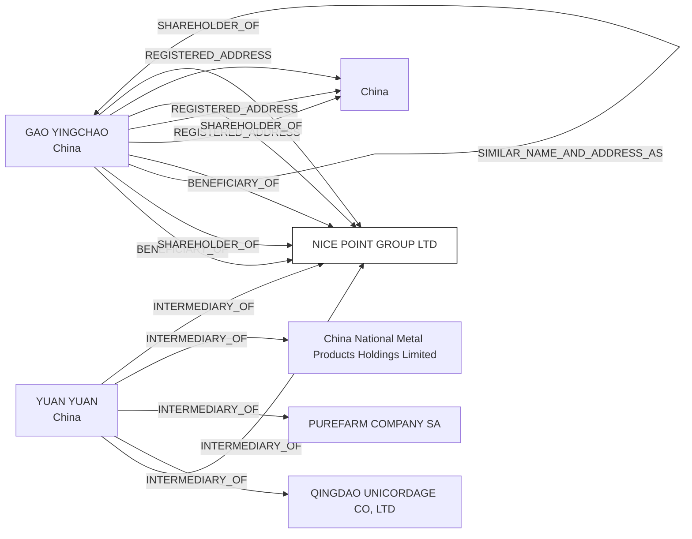

#NICE POINT GROUP LTD.
Status: Defaulted
Address: YUAN YUAN ROOM 1109A ZHONG TIAN HENG MANSION NO. 8 FUZHOU ROAD SHINAN DISTRICT QINGDAO, CHINA

##Incoming
BENEFICIARY
GAO YINGCHAO
China

SHAREHOLDER
GAO YINGCHAO
China

INTERMEDIARY
YUAN YUAN
YUAN YUAN ROOM 1109A ZHONG TIAN HENG MANSION NO. 8 FUZHOU ROAD SHINAN DISTRICT QINGDAO, CHINA
China

##Graph
