#PACIFIC SUGAR & INVESTMENT COMPANY
Status: Changed agent
Address: CARLOS MATA HANZE URBANIZACION LA RIBERA DE BATAN  NO. 130; CALLE  6TA AL LAGO KM 8 VÍA GUAYAQUIL - SAMBORONDON GUAYAQUIL; ECUADOR

##Incoming
SHAREHOLDER
UNION SQUARE FOUNDATION
Panama

INTERMEDIARY
CARLOS MATA HANZE
CARLOS MATA HANZE URBANIZACION LA RIBERA DE BATAN  NO. 130; CALLE  6TA AL LAGO KM 8 VÍA GUAYAQUIL - SAMBORONDON GUAYAQUIL; ECUADOR
Ecuador

##Graph

```mermaid
graph LR
classDef outline fill:#fff,stroke:#000,stroke-width:1px;
node1[PACIFIC SUGAR & INVESTMENT COMPANY<br>]
node2[UNION SQUARE FOUNDATION<br>Panama]
node2-->|SHAREHOLDER_OF|node1
node3[CARLOS MATA HANZE<br>Ecuador]
node3-->|INTERMEDIARY_OF|node1
class node1 outline
node4[<br>Panama]
node2-->|REGISTERED_ADDRESS|node4
node2-->|SHAREHOLDER_OF|node1
node5[SOUTHWICK HOLDINGS LTD<br>]
node3-->|INTERMEDIARY_OF|node5
node6[MFS INTERNATIONAL LIMITED<br>]
node3-->|INTERMEDIARY_OF|node6
node7[SILVERLAKE TRADING CORP<br>]
node3-->|INTERMEDIARY_OF|node7
node8[CONSTRUCORP HOLDINGS INC<br>]
node3-->|INTERMEDIARY_OF|node8
node9[WILGREG CORP<br>]
node3-->|INTERMEDIARY_OF|node9
node10[Estate Planning Consultants Ltd<br>]
node3-->|INTERMEDIARY_OF|node10
node11[VMS Holding CO<br>]
node3-->|INTERMEDIARY_OF|node11
node12[SKYFIELD INVESTMENTS INC<br>]
node3-->|INTERMEDIARY_OF|node12
node13[VMS Finance Inc<br>]
node3-->|INTERMEDIARY_OF|node13
node14[SOUTHWEST STEEL GROUP LLC<br>]
node3-->|INTERMEDIARY_OF|node14
node15[VADAL GROUP LIMITED<br>]
node3-->|INTERMEDIARY_OF|node15
node16[NORTH BOREAL CO LLC<br>]
node3-->|INTERMEDIARY_OF|node16
node17[MARE INTERNATIONAL COMPANY<br>]
node3-->|INTERMEDIARY_OF|node17
node18[TELFOUR CORPORATION<br>]
node3-->|INTERMEDIARY_OF|node18
node19[GAME ONE HOLDINGS LIMITED<br>]
node3-->|INTERMEDIARY_OF|node19
node20[SELBERRY INCORPORATED<br>]
node3-->|INTERMEDIARY_OF|node20
node21[FAIRGATE TRADING CORP<br>]
node3-->|INTERMEDIARY_OF|node21
node22[SYRAFLEUR CONSULTANTS INC<br>]
node3-->|INTERMEDIARY_OF|node22
node23[MEGAHOLDINGS LIMITED GROUP SA<br>]
node3-->|INTERMEDIARY_OF|node23
node24[ARKDALE INVESTMENTS LIMITED<br>]
node3-->|INTERMEDIARY_OF|node24
node25[ADMINISTRADORA CENTRAL DEL ECUADOR ADCENEC SA<br>]
node3-->|INTERMEDIARY_OF|node25
node26[FAIRGATE TRADING S de R L<br>]
node3-->|INTERMEDIARY_OF|node26
node27[CROMWELL INTERNATIONAL FOUNDATION<br>]
node3-->|INTERMEDIARY_OF|node27
node28[FAMANU FOUNDATION<br>]
node3-->|INTERMEDIARY_OF|node28
node29[FUNDACIÓN FRAILES<br>]
node3-->|INTERMEDIARY_OF|node29
node30[LISCARD FOUNDATION<br>]
node3-->|INTERMEDIARY_OF|node30
node31[AXFORD FOUNDATION<br>]
node3-->|INTERMEDIARY_OF|node31
node32[INTEROIL SHIPPING & TRADING S DE RL<br>]
node3-->|INTERMEDIARY_OF|node32
node33[MAYFLOWER INTERNATIONAL FOUNDATION<br>]
node3-->|INTERMEDIARY_OF|node33
node34[GRAND VIEW ASSETS LIMITED<br>]
node3-->|INTERMEDIARY_OF|node34
node35[LAKE VIEW PROPERTIES LIMITED<br>]
node3-->|INTERMEDIARY_OF|node35
node36[EATON FAMILY FOUNDATION<br>]
node3-->|INTERMEDIARY_OF|node36
node37[UNION SQUARE FOUNDATION<br>]
node3-->|INTERMEDIARY_OF|node37
node38[PORTMAN FOUNDATION<br>]
node3-->|INTERMEDIARY_OF|node38
node39[NEO CAPITAL ASSETS LIMITED<br>]
node3-->|INTERMEDIARY_OF|node39
node40[PARE FOUNDATION<br>]
node3-->|INTERMEDIARY_OF|node40
node41[NESCAR SHIPPING S de R L<br>]
node3-->|INTERMEDIARY_OF|node41
node42[MEGAHOLDINGS FOUNDATION<br>]
node3-->|INTERMEDIARY_OF|node42
node43[TUDOR FOUNDATION<br>]
node3-->|INTERMEDIARY_OF|node43
node44[FUNDACION CARTAGENA DE INDIAS<br>]
node3-->|INTERMEDIARY_OF|node44
node45[KEGEL FOUNDATION<br>]
node3-->|INTERMEDIARY_OF|node45
node46[FUNDACIÓN PROPERTIS INTERNACIONAL<br>]
node3-->|INTERMEDIARY_OF|node46
node47[GLOBAL AGRI FUND LIMITED<br>]
node3-->|INTERMEDIARY_OF|node47
node48[JALLOW LTD<br>]
node3-->|INTERMEDIARY_OF|node48
node49[PEARL PHOENIX LIMITED<br>]
node3-->|INTERMEDIARY_OF|node49
node50[HAZELBURY OVERSEAS SA<br>]
node3-->|INTERMEDIARY_OF|node50
node51[CONSTRUCORP LIMITED SA<br>]
node3-->|INTERMEDIARY_OF|node51
node52[VIELEN INVESTMENT CORP<br>]
node3-->|INTERMEDIARY_OF|node52
node53[TORQUEMADA GLOBAL CORP<br>]
node3-->|INTERMEDIARY_OF|node53
node54[ITELSA HOLDING LLC<br>]
node3-->|INTERMEDIARY_OF|node54
node55[Horizon Holding Limited<br>]
node3-->|INTERMEDIARY_OF|node55
node56[INTEROIL TRADING LIMITED<br>]
node3-->|INTERMEDIARY_OF|node56
node57[LAKE VIEW PROPERTIES LTD<br>]
node3-->|INTERMEDIARY_OF|node57
node58[HIGHRIDGE GROUP INC<br>]
node3-->|INTERMEDIARY_OF|node58
node59[GARDENROSE PROPERTIES LIMITED<br>]
node3-->|INTERMEDIARY_OF|node59
node60[MURAT FINANCE SERVICES LLC<br>]
node3-->|INTERMEDIARY_OF|node60
node61[HEAVEN INTERNATIONAL GROUP INC<br>]
node3-->|INTERMEDIARY_OF|node61
node62[WESTMINSTER PLASTICS INC LC<br>]
node3-->|INTERMEDIARY_OF|node62
node63[SAINT JERONIMO PRINTING CO LTD<br>]
node3-->|INTERMEDIARY_OF|node63
node64[AMERICA HOLDING CORP LC<br>]
node3-->|INTERMEDIARY_OF|node64
node65[DUNSTONE ENTERPRISES LTD<br>]
node3-->|INTERMEDIARY_OF|node65
node3-->|INTERMEDIARY_OF|node1
node66[MIRO ENTERPRISES LIMITED<br>]
node3-->|INTERMEDIARY_OF|node66
node67[OTEI TECHNOLOGIES %28OTEITEC%29 LLC<br>]
node3-->|INTERMEDIARY_OF|node67
node68[VENICE HOLDINGS INC LC<br>]
node3-->|INTERMEDIARY_OF|node68
node69[CONSOLVE INVESTMENTS LLC<br>]
node3-->|INTERMEDIARY_OF|node69
node70[LAWNWOOD HOLDINGS LC<br>]
node3-->|INTERMEDIARY_OF|node70
node71[LATTICE INVESTMENTS LLC<br>]
node3-->|INTERMEDIARY_OF|node71
node72[MAKALA ENTERPRISES LTD<br>]
node3-->|INTERMEDIARY_OF|node72
node73[HEATHGROVE INTERNATIONAL LLC<br>]
node3-->|INTERMEDIARY_OF|node73
node74[PARISSON BUSINESS LLC<br>]
node3-->|INTERMEDIARY_OF|node74
node75[GEBISA HOLDING LTD<br>]
node3-->|INTERMEDIARY_OF|node75
node76[FUNDACIÓN SAN JUDAS TADEO INTERNACIONAL<br>]
node3-->|INTERMEDIARY_OF|node76
node77[NESCAR SHIPPING LTD<br>]
node3-->|INTERMEDIARY_OF|node77
node78[GLOBAL RECYCLING COMPANY, GRC RECYCLERS  LLC<br>]
node3-->|INTERMEDIARY_OF|node78
```
