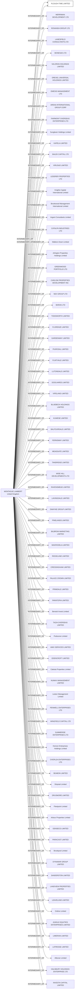

#PLOUGH TIME LIMITED
Status: Defaulted
Address: MONTAGUE LAMBERT [Mr Robert Cohen] 37/38 Haven Green Ealing London W5 2NX

##Incoming
INTERMEDIARY
MONTAGUE LAMBERT
United Kingdom

##Graph

```mermaid
graph LR
classDef outline fill:#fff,stroke:#000,stroke-width:1px;
node1[PLOUGH TIME LIMITED<br>]
node2[MONTAGUE LAMBERT<br>United Kingdom]
node2-->|INTERMEDIARY_OF|node1
class node1 outline
node3[MERRIMAN DEVELOPMENT LTD<br>]
node2-->|INTERMEDIARY_OF|node3
node4[RONANDA GROUP LTD<br>]
node2-->|INTERMEDIARY_OF|node4
node5[LANESFIELD CONSULTANTS LTD<br>]
node2-->|INTERMEDIARY_OF|node5
node6[BONESAD LTD<br>]
node2-->|INTERMEDIARY_OF|node6
node7[VALORAN HOLDINGS LIMITED<br>]
node2-->|INTERMEDIARY_OF|node7
node8[DREXEL UNIVERSAL HOLDINGS LIMITED<br>]
node2-->|INTERMEDIARY_OF|node8
node9[EMESIS MANAGEMENT LTD<br>]
node2-->|INTERMEDIARY_OF|node9
node10[ARENA INTERNATIONAL GROUP CORP<br>]
node2-->|INTERMEDIARY_OF|node10
node11[FAIRMONT OVERSEAS ENTERPRISES LTD<br>]
node2-->|INTERMEDIARY_OF|node11
node12[Sungleam Holdings Limited<br>]
node2-->|INTERMEDIARY_OF|node12
node13[KAPELA LIMITED<br>]
node2-->|INTERMEDIARY_OF|node13
node14[BALEK CAPITAL LTD<br>]
node2-->|INTERMEDIARY_OF|node14
node15[VIRUSAD LIMITED<br>]
node2-->|INTERMEDIARY_OF|node15
node16[LEDERER PROPERTIES LTD<br>]
node2-->|INTERMEDIARY_OF|node16
node17[Knights Capital International Limited<br>]
node2-->|INTERMEDIARY_OF|node17
node18[Brookwood Management International Limited<br>]
node2-->|INTERMEDIARY_OF|node18
node19[Argent Consultants Limited<br>]
node2-->|INTERMEDIARY_OF|node19
node20[CATALPA INDUSTRIES LTD<br>]
node2-->|INTERMEDIARY_OF|node20
node21[Walkers Down Limited<br>]
node2-->|INTERMEDIARY_OF|node21
node22[Arlington Properties Holdings Limited<br>]
node2-->|INTERMEDIARY_OF|node22
node23[GREENWOOD PORTFOLIO LTD<br>]
node2-->|INTERMEDIARY_OF|node23
node24[CARLOW PROPERTIES DEVELOPMENT INC<br>]
node2-->|INTERMEDIARY_OF|node24
node25[NEX GROUP LTD<br>]
node2-->|INTERMEDIARY_OF|node25
node26[BARAN LTD<br>]
node2-->|INTERMEDIARY_OF|node26
node27[TODDWORTH LIMITED<br>]
node2-->|INTERMEDIARY_OF|node27
node28[FLORENZE LIMITED<br>]
node2-->|INTERMEDIARY_OF|node28
node29[GARDENWAY LIMITED<br>]
node2-->|INTERMEDIARY_OF|node29
node30[PIUROSAL LIMITED<br>]
node2-->|INTERMEDIARY_OF|node30
node2-->|INTERMEDIARY_OF|node1
node31[FLINTVALE LIMITED<br>]
node2-->|INTERMEDIARY_OF|node31
node32[LUTONDALE LIMITED<br>]
node2-->|INTERMEDIARY_OF|node32
node33[DOOLVARES LIMITED<br>]
node2-->|INTERMEDIARY_OF|node33
node34[VIPELAND LIMITED<br>]
node2-->|INTERMEDIARY_OF|node34
node35[BLUEBECK HOLDINGS LIMITED<br>]
node2-->|INTERMEDIARY_OF|node35
node36[KUWESE LIMITED<br>]
node2-->|INTERMEDIARY_OF|node36
node37[BALFOURDALE LIMITED<br>]
node2-->|INTERMEDIARY_OF|node37
node38[FERNSWAY LIMITED<br>]
node2-->|INTERMEDIARY_OF|node38
node39[MEADGATE LIMITED<br>]
node2-->|INTERMEDIARY_OF|node39
node40[TANDRIDGE LIMITED<br>]
node2-->|INTERMEDIARY_OF|node40
node41[WISE HILL DEVELOPMENTS LTD<br>]
node2-->|INTERMEDIARY_OF|node41
node42[RAVENSMEAD LIMITED<br>]
node2-->|INTERMEDIARY_OF|node42
node43[LAVINGDALE LIMITED<br>]
node2-->|INTERMEDIARY_OF|node43
node44[DWAYNE GROUP LIMITED<br>]
node2-->|INTERMEDIARY_OF|node44
node45[PINELANDS LIMITED<br>]
node2-->|INTERMEDIARY_OF|node45
node46[BILBROW MARKETING LIMITED<br>]
node2-->|INTERMEDIARY_OF|node46
node47[MAKRODELA LIMITED<br>]
node2-->|INTERMEDIARY_OF|node47
node48[RIDGELANE LIMITED<br>]
node2-->|INTERMEDIARY_OF|node48
node49[CRESSINGHAM LIMITED<br>]
node2-->|INTERMEDIARY_OF|node49
node50[PALACE CROWN LIMITED<br>]
node2-->|INTERMEDIARY_OF|node50
node51[PRIMDALE LIMITED<br>]
node2-->|INTERMEDIARY_OF|node51
node52[PARATOPIA LIMITED<br>]
node2-->|INTERMEDIARY_OF|node52
node53[Benstol Invest Limited<br>]
node2-->|INTERMEDIARY_OF|node53
node54[TAZIA OVERSEAS LIMITED<br>]
node2-->|INTERMEDIARY_OF|node54
node55[Podscene Limited<br>]
node2-->|INTERMEDIARY_OF|node55
node56[AMIX SERVICES LIMITED<br>]
node2-->|INTERMEDIARY_OF|node56
node57[EDENCROFT LIMITED<br>]
node2-->|INTERMEDIARY_OF|node57
node58[Calesta Properties Limited<br>]
node2-->|INTERMEDIARY_OF|node58
node59[NUMAX MANAGEMENT LIMITED<br>]
node2-->|INTERMEDIARY_OF|node59
node60[Leston Management Limited<br>]
node2-->|INTERMEDIARY_OF|node60
node61[PENWELL ENTERPRISES LTD<br>]
node2-->|INTERMEDIARY_OF|node61
node62[WINGFIELD CAPITAL LTD<br>]
node2-->|INTERMEDIARY_OF|node62
node63[SUMMERISE ENTERPRISES LTD<br>]
node2-->|INTERMEDIARY_OF|node63
node64[Horizon Enterprises Holdings Limited<br>]
node2-->|INTERMEDIARY_OF|node64
node65[OVERLEA ENTERPRISES LTD<br>]
node2-->|INTERMEDIARY_OF|node65
node66[SEABON LIMITED<br>]
node2-->|INTERMEDIARY_OF|node66
node67[Shipstal Limited<br>]
node2-->|INTERMEDIARY_OF|node67
node68[DRUSMORE LIMITED<br>]
node2-->|INTERMEDIARY_OF|node68
node69[Fleetpoint Limited<br>]
node2-->|INTERMEDIARY_OF|node69
node70[Arbour Properties Limited<br>]
node2-->|INTERMEDIARY_OF|node70
node71[GENSECO LIMITED<br>]
node2-->|INTERMEDIARY_OF|node71
node72[PARACAST LIMITED<br>]
node2-->|INTERMEDIARY_OF|node72
node73[Brookpool Limited<br>]
node2-->|INTERMEDIARY_OF|node73
node74[DYNAMAR GROUP LIMITED<br>]
node2-->|INTERMEDIARY_OF|node74
node75[SANDERSTON LIMITED<br>]
node2-->|INTERMEDIARY_OF|node75
node76[LANDVIEW PROPERTIES LIMITED<br>]
node2-->|INTERMEDIARY_OF|node76
node77[LEAVELAND LIMITED<br>]
node2-->|INTERMEDIARY_OF|node77
node78[Ordine Limited<br>]
node2-->|INTERMEDIARY_OF|node78
node79[JUNGLE EQUITIES ENTERPRISES LIMITED<br>]
node2-->|INTERMEDIARY_OF|node79
node80[LIMERAIN LIMITED<br>]
node2-->|INTERMEDIARY_OF|node80
node81[LATRESSE LIMITED<br>]
node2-->|INTERMEDIARY_OF|node81
node82[Alboran Limited<br>]
node2-->|INTERMEDIARY_OF|node82
node83[HALSBURY HOLDINGS ENTERPRISE LTD<br>]
node2-->|INTERMEDIARY_OF|node83
node84[INVESTA CAPITAL LIMITED<br>]
node2-->|INTERMEDIARY_OF|node84
```