#POWER GLORY INTERNATIONAL LTD.
Status: Defaulted
Address: LENNOX BUSINESS CONSULTANTS LTD 19TH FLOOR, CAMERON COMMERCIAL CENTRE 468 HENNESSY ROAD CAUSEWAY BAY HONG KONG

##Incoming
INTERMEDIARY
LENNOX BUSINESS CONSULTANTS LTD
C.F. CHEUNG & CO. 19TH FLOOR, CAMERON COMMERCIAL CENTRE 468 HENNESSY ROAD CAUSEWAY BAY HONG KONG
Hong Kong

##Graph

```mermaid
graph LR
classDef outline fill:#fff,stroke:#000,stroke-width:1px;
node1[POWER GLORY INTERNATIONAL LTD<br>]
node2[LENNOX BUSINESS CONSULTANTS LTD<br>Hong Kong]
node2-->|INTERMEDIARY_OF|node1
class node1 outline
node3[APPLERICH DEVELOPMENT LTD<br>]
node2-->|INTERMEDIARY_OF|node3
node4[GOLDEN WILL INVESTMENT LIMITED<br>]
node2-->|INTERMEDIARY_OF|node4
node5[PERMAWIN LTD<br>]
node2-->|INTERMEDIARY_OF|node5
node6[QUEENSMART INVESTMENT LIMITED<br>]
node2-->|INTERMEDIARY_OF|node6
node7[OCEAN SPEED LIMITED<br>]
node2-->|INTERMEDIARY_OF|node7
node8[CACEA MANAGEMENT INC<br>]
node2-->|INTERMEDIARY_OF|node8
node9[TINMARK DEVELOPMENT LIMITED<br>]
node2-->|INTERMEDIARY_OF|node9
node10[BEST TOUCH LIMITED<br>]
node2-->|INTERMEDIARY_OF|node10
node11[JOYFUL PEACE LIMITED<br>]
node2-->|INTERMEDIARY_OF|node11
node12[GOLDJOY GROUP LTD<br>]
node2-->|INTERMEDIARY_OF|node12
node13[CCG & Y HOLDINGS LIMITED<br>]
node2-->|INTERMEDIARY_OF|node13
node14[MANEASE ASIA LTD<br>]
node2-->|INTERMEDIARY_OF|node14
node15[SUN WELL INVESTMENT LTD<br>]
node2-->|INTERMEDIARY_OF|node15
node16[JACKFAITH LIMITED<br>]
node2-->|INTERMEDIARY_OF|node16
node17[SUCCESS TARGET LIMITED<br>]
node2-->|INTERMEDIARY_OF|node17
node18[DOUBLE RICH INVESTMENT LTD<br>]
node2-->|INTERMEDIARY_OF|node18
node19[TOP TOWN INTERNATIONAL INVESTMENT LTD<br>]
node2-->|INTERMEDIARY_OF|node19
node20[WALKER DORN INVESTMENT LTD<br>]
node2-->|INTERMEDIARY_OF|node20
node21[TECKLE POINT INTERNATIONAL LTD<br>]
node2-->|INTERMEDIARY_OF|node21
node22[CATHAY ASIA LIMITED<br>]
node2-->|INTERMEDIARY_OF|node22
node2-->|INTERMEDIARY_OF|node1
node23[WISEMAN HOLDINGS INVESTMENT LTD<br>]
node2-->|INTERMEDIARY_OF|node23
node24[SUPER GOLD INVESTMENT LTD<br>]
node2-->|INTERMEDIARY_OF|node24
node25[ASIA LION INVESTMENTS LTD<br>]
node2-->|INTERMEDIARY_OF|node25
node26[MILLION RIGHT INTERNATIONAL LIMITED<br>]
node2-->|INTERMEDIARY_OF|node26
node27[HONG KONG EYE SPECIALIST CENTRE LIMITED<br>]
node2-->|INTERMEDIARY_OF|node27
node28[ENERGETIC TRADING LTD<br>]
node2-->|INTERMEDIARY_OF|node28
node29[ANSEN INTELLECTUAL PROPERTY LIMITED<br>]
node2-->|INTERMEDIARY_OF|node29
node30[MOOGUNGWHA TRADING COMPANY LIMITED<br>]
node2-->|INTERMEDIARY_OF|node30
node31[CONCORD ORIENTAL LIMITED<br>]
node2-->|INTERMEDIARY_OF|node31
node32[UNIRISE INTERNATIONAL HOLDINGS LIMITED<br>]
node2-->|INTERMEDIARY_OF|node32
node33[ANSEN INVESTMENT HOLDINGS LIMITED<br>]
node2-->|INTERMEDIARY_OF|node33
node34[EVER MORE WORLDWIDE LIMITED<br>]
node2-->|INTERMEDIARY_OF|node34
node35[CHARMWOOD RESOURCES LTD<br>]
node2-->|INTERMEDIARY_OF|node35
node36[ORIENTAL EAGLE LIMITED<br>]
node2-->|INTERMEDIARY_OF|node36
node37[GAINWILL INTERNATIONAL DEVELOPMENT LTD<br>]
node2-->|INTERMEDIARY_OF|node37
node38[SIMFORD HOLDING LIMITED -<br>]
node2-->|INTERMEDIARY_OF|node38
node39[UPPERMOST ENTERPRISES INC<br>]
node2-->|INTERMEDIARY_OF|node39
node40[SAMMA INTERNATIONAL GROUP LIMITED<br>]
node2-->|INTERMEDIARY_OF|node40
node41[NICE SKY DEVELOPMENT LTD<br>]
node2-->|INTERMEDIARY_OF|node41
node42[REDLAND DEVELOPMENTS LIMITED<br>]
node2-->|INTERMEDIARY_OF|node42
node43[DORINGTON INVESTMENTS LIMITED<br>]
node2-->|INTERMEDIARY_OF|node43
node44[LONSDALE LIMITED<br>]
node2-->|INTERMEDIARY_OF|node44
node45[HENWICK CONSULTANTS LIMITED<br>]
node2-->|INTERMEDIARY_OF|node45
node46[MARS BUYING SERVICES LIMITED<br>]
node2-->|INTERMEDIARY_OF|node46
node47[SEASTAR COMPANY LIMITED<br>]
node2-->|INTERMEDIARY_OF|node47
node48[SEA WEALTH LIMITED<br>]
node2-->|INTERMEDIARY_OF|node48
node49[GUANGZHOU KAI TIAN SPORT TOOL FACTORY LIMITED<br>]
node2-->|INTERMEDIARY_OF|node49
node50[DONGGUAN JANCHI FISHING TOOL PRODUCTS CO, LIMITED<br>]
node2-->|INTERMEDIARY_OF|node50
node2-->|INTERMEDIARY_OF|node48
node51[PEACE WORLD CONSULTANTS LTD<br>]
node2-->|INTERMEDIARY_OF|node51
node52[CHINA BAONENG GROUP LIMITED<br>]
node2-->|INTERMEDIARY_OF|node52
node53[Sherwood Asia Investment Limited<br>]
node2-->|INTERMEDIARY_OF|node53
node54[BEAUTY CONNECTION LTD<br>]
node2-->|INTERMEDIARY_OF|node54
node55[Eurasia Global Investments Limited<br>]
node2-->|INTERMEDIARY_OF|node55
node56[EASE GOOD INTERNATIONAL LTD<br>]
node2-->|INTERMEDIARY_OF|node56
node57[HOLY JOY INTERNATIONAL LTD<br>]
node2-->|INTERMEDIARY_OF|node57
node58[HAMPORA INVESTMENTS LIMITED<br>]
node2-->|INTERMEDIARY_OF|node58
node59[LANCEFORD TECHNOLOGY LIMITED<br>]
node2-->|INTERMEDIARY_OF|node59
node60[GLOBAL EXPRESS MANAGEMENT LTD<br>]
node2-->|INTERMEDIARY_OF|node60
node61[LAIHUA HOLDING LIMITED<br>]
node2-->|INTERMEDIARY_OF|node61
node62[Double Group Worldwide Limited<br>]
node2-->|INTERMEDIARY_OF|node62
node63[QUEENSLAND ENTERPRISES LIMITED<br>]
node2-->|INTERMEDIARY_OF|node63
node64[MAYFAIR ASIA INVESTMENT ENTERPRISES LTD<br>]
node2-->|INTERMEDIARY_OF|node64
node65[POLY SHINE LIMITED<br>]
node2-->|INTERMEDIARY_OF|node65
node66[TAIWAN SOGO COMPANY LIMITED<br>]
node2-->|INTERMEDIARY_OF|node66
node67[KARY INTERNATIONAL INVESTMENT LTD<br>]
node2-->|INTERMEDIARY_OF|node67
node68[ORIENTAL CONRAD LIMITED<br>]
node2-->|INTERMEDIARY_OF|node68
node69[RAMLEY INTERNATIONAL LTD<br>]
node2-->|INTERMEDIARY_OF|node69
node70[ASIAN JEWEL GROUP LIMITED<br>]
node2-->|INTERMEDIARY_OF|node70
node71[MARBLE HILL GROUP LIMITED<br>]
node2-->|INTERMEDIARY_OF|node71
node72[TIM PLUS TRADING LTD<br>]
node2-->|INTERMEDIARY_OF|node72
node73[IDEAL PARTNER MANAGEMENT LIMITED<br>]
node2-->|INTERMEDIARY_OF|node73
node74[GuangZhou Kai Tian Sport Tool Factory Limited<br>]
node2-->|INTERMEDIARY_OF|node74
node75[DongGuan JanChi Fishing Tool Products Co, Limited<br>]
node2-->|INTERMEDIARY_OF|node75
```
