#Penumbra Consulting Group, Inc.
Company_Type: Business Company Limited by Shares
Status: Dead
Address: Companies Incorporated 28015 Smyth Drive Valencia CA 91355 USA RT BVI

##Incoming
DIRECTOR
Ronald G.Ferguson
United States

DIRECTOR
Carroll M.Rogers
United States

DIRECTOR
Mohana S. More
United States

DIRECTOR
Shashank S. More
United States

INTERMEDIARY
Companies Incorporated
United States

##Outgoing
REGISTERED_ADDRESSCompanies Incorporated 28015 Smyth Drive Valencia CA 91355 USA
United States

##Graph

```mermaid
graph LR
classDef outline fill:#fff,stroke:#000,stroke-width:1px;
node1[Penumbra Consulting Group, Inc<br>]
node2[Ronald GFerguson<br>United States]
node2-->|DIRECTOR_OF|node1
node3[Carroll MRogers<br>United States]
node3-->|DIRECTOR_OF|node1
node4[Mohana S More<br>United States]
node4-->|DIRECTOR_OF|node1
node5[Shashank S More<br>United States]
node5-->|DIRECTOR_OF|node1
node6[Companies Incorporated<br>United States]
node6-->|INTERMEDIARY_OF|node1
node7[<br>United States]
node1-->|REGISTERED_ADDRESS|node7
class node1 outline
node2-->|DIRECTOR_OF|node1
node2-->|REGISTERED_ADDRESS|node7
node3-->|DIRECTOR_OF|node1
node3-->|REGISTERED_ADDRESS|node7
node4-->|DIRECTOR_OF|node1
node4-->|REGISTERED_ADDRESS|node7
node5-->|DIRECTOR_OF|node1
node5-->|REGISTERED_ADDRESS|node7
node6-->|REGISTERED_ADDRESS|node7
node8[LIBERTY ISLAND, INC<br>]
node6-->|INTERMEDIARY_OF|node8
node9[Henning International, Inc<br>]
node6-->|INTERMEDIARY_OF|node9
node10[TOMLIN FINANCIAL CORPORATION<br>]
node6-->|INTERMEDIARY_OF|node10
node11[FXF MULTICORP, INC<br>]
node6-->|INTERMEDIARY_OF|node11
node12[Tomo Trading Company Corporation<br>]
node6-->|INTERMEDIARY_OF|node12
node13[ZoElisa International, Inc<br>]
node6-->|INTERMEDIARY_OF|node13
node14[J%27ADORA, Inc<br>]
node6-->|INTERMEDIARY_OF|node14
node15[FES Holdings, SA<br>]
node6-->|INTERMEDIARY_OF|node15
node16[Glosectra Holdings, Ltd<br>]
node6-->|INTERMEDIARY_OF|node16
node17[Intsectra Holdings, Ltd<br>]
node6-->|INTERMEDIARY_OF|node17
node18[Firtsrtc Holdings, Ltd<br>]
node6-->|INTERMEDIARY_OF|node18
node19[Panorama Global Partners Inc<br>]
node6-->|INTERMEDIARY_OF|node19
node20[White Peaks Enterprises, Inc<br>]
node6-->|INTERMEDIARY_OF|node20
node6-->|INTERMEDIARY_OF|node1
node21[QK Healthcare Inc<br>]
node6-->|INTERMEDIARY_OF|node21
node22[KevCo, Ltd<br>]
node6-->|INTERMEDIARY_OF|node22
node23[Apex Capital Resources Incorporated<br>]
node6-->|INTERMEDIARY_OF|node23
node24[M&L Global Trading Corp<br>]
node6-->|INTERMEDIARY_OF|node24
node25[LG-Enterprises International, Inc<br>]
node6-->|INTERMEDIARY_OF|node25
node26[PrivateFX Global One, Ltd<br>]
node6-->|INTERMEDIARY_OF|node26
node27[ESCOPETRA, INC<br>]
node6-->|INTERMEDIARY_OF|node27
node28[Mead Wright, Inc<br>]
node6-->|INTERMEDIARY_OF|node28
node29[Pantum Captial Partners Ltd<br>]
node6-->|INTERMEDIARY_OF|node29
node30[Wellsbuck Corporation<br>]
node6-->|INTERMEDIARY_OF|node30
node31[AVANT BROWSER, INC<br>]
node6-->|INTERMEDIARY_OF|node31
node32[American Resource and Energy Company, Ltd<br>]
node6-->|INTERMEDIARY_OF|node32
node33[Hardanger Software, Inc<br>]
node6-->|INTERMEDIARY_OF|node33
node34[Elgin International Ventures, Inc<br>]
node6-->|INTERMEDIARY_OF|node34
node35[Hampton Consulting Business, Inc<br>]
node6-->|INTERMEDIARY_OF|node35
node36[Catranis & Sons Ltd<br>]
node6-->|INTERMEDIARY_OF|node36
node37[Private Spy International Ltd<br>]
node6-->|INTERMEDIARY_OF|node37
node38[Stratezyme International, Inc<br>]
node6-->|INTERMEDIARY_OF|node38
node39[HENRICK INVESTMENT CORPORATION<br>]
node6-->|INTERMEDIARY_OF|node39
node40[LANS FINANCIAL CORPORATION<br>]
node6-->|INTERMEDIARY_OF|node40
node41[STRONGS  MONEY FINANCIAL CORPORATION<br>]
node6-->|INTERMEDIARY_OF|node41
node42[AmeriCall, Inc<br>]
node6-->|INTERMEDIARY_OF|node42
node43[KERIGMA INVESTMENTS CORPORATION<br>]
node6-->|INTERMEDIARY_OF|node43
node44[Wizard International Trading, Inc<br>]
node6-->|INTERMEDIARY_OF|node44
node45[LOUD AND CLEAR INVESTMENTS CORPORATION<br>]
node6-->|INTERMEDIARY_OF|node45
node46[SHILOH CAPITAL INVESTMENTS CORPORATION<br>]
node6-->|INTERMEDIARY_OF|node46
node47[TMS CORPORATION<br>]
node6-->|INTERMEDIARY_OF|node47
node48[World Wide Premium Consultants, Ltd<br>]
node6-->|INTERMEDIARY_OF|node48
node49[Saegala, Ltd<br>]
node6-->|INTERMEDIARY_OF|node49
node50[TruVista, Ltd<br>]
node6-->|INTERMEDIARY_OF|node50
node51[EME Security, Inc<br>]
node6-->|INTERMEDIARY_OF|node51
node52[Museum Consulting Services, Inc<br>]
node6-->|INTERMEDIARY_OF|node52
node53[Jordanson, Max and Associates, Inc<br>]
node6-->|INTERMEDIARY_OF|node53
node54[Avison International Limited<br>]
node6-->|INTERMEDIARY_OF|node54
node55[First International Trading and Management, Inc<br>]
node6-->|INTERMEDIARY_OF|node55
node56[4i-Group Corp<br>]
node6-->|INTERMEDIARY_OF|node56
node57[CARLISLE CARIBBEAN, LTD<br>]
node6-->|INTERMEDIARY_OF|node57
node58[CE FINANCIAL LLC CORPORATION<br>]
node6-->|INTERMEDIARY_OF|node58
node59[STRATEGIC GOLD LTD<br>]
node6-->|INTERMEDIARY_OF|node59
node60[CANDLESTICK FINANCIAL CORPORATION<br>]
node6-->|INTERMEDIARY_OF|node60
node61[FOREMOST CAPITAL INTERNATIONAL LIMITED<br>]
node6-->|INTERMEDIARY_OF|node61
node62[Companies Incorporated<br>]
node6-->|INTERMEDIARY_OF|node62
node63[CTP Technology Corporation<br>]
node6-->|INTERMEDIARY_OF|node63
node64[Alternative Opportunities Investments, Inc<br>]
node6-->|INTERMEDIARY_OF|node64
node65[Chaucer Middle East Limited<br>]
node6-->|INTERMEDIARY_OF|node65
node66[FRIENDS AND FAMILY FINANCIAL GROUP CORPORATION<br>]
node6-->|INTERMEDIARY_OF|node66
node67[Autumn Light, Inc<br>]
node6-->|INTERMEDIARY_OF|node67
node68[SELF CARE SERVICES, INC<br>]
node6-->|INTERMEDIARY_OF|node68
node69[Pulchritude, Inc<br>]
node6-->|INTERMEDIARY_OF|node69
node70[FLYNN AND ASSOCIATES, INC<br>]
node6-->|INTERMEDIARY_OF|node70
node71[cccf intsnr mgnt group, Inc<br>]
node6-->|INTERMEDIARY_OF|node71
node72[EAGLE MOUNTAIN INTERNATIONAL, LTD<br>]
node6-->|INTERMEDIARY_OF|node72
node73[LMR 2 INVESTMENTS LIMITED<br>]
node6-->|INTERMEDIARY_OF|node73
node74[Oil and Energy Management Systems and Services, Ltd<br>]
node6-->|INTERMEDIARY_OF|node74
node75[GSFB Capital, Inc<br>]
node6-->|INTERMEDIARY_OF|node75
node76[Global Energy Partners, Inc<br>]
node6-->|INTERMEDIARY_OF|node76
node77[Terra Firma Capital, Inc<br>]
node6-->|INTERMEDIARY_OF|node77
node78[Rosenstein Ltd<br>]
node6-->|INTERMEDIARY_OF|node78
node79[Wireless Media, Inc<br>]
node6-->|INTERMEDIARY_OF|node79
node80[La Roca Investment Group, Inc<br>]
node6-->|INTERMEDIARY_OF|node80
node81[UK-DR Properties Ltd<br>]
node6-->|INTERMEDIARY_OF|node81
node82[Lummelunda Ltd<br>]
node6-->|INTERMEDIARY_OF|node82
node83[Meridian Digital, Inc<br>]
node6-->|INTERMEDIARY_OF|node83
node84[Euro Saudi Trading Ltd<br>]
node6-->|INTERMEDIARY_OF|node84
node85[AVANTGARDE VENTURES INC<br>]
node6-->|INTERMEDIARY_OF|node85
node86[CUANZA HOMESTEAD CAPITAL LTD<br>]
node6-->|INTERMEDIARY_OF|node86
node87[ETHERMAE INCORPORATED<br>]
node6-->|INTERMEDIARY_OF|node87
node88[COTTON LEIFER COST CONSULTANTS LTD<br>]
node6-->|INTERMEDIARY_OF|node88
node89[ARANDOR INTERNATIONAL LTD<br>]
node6-->|INTERMEDIARY_OF|node89
node90[KANG PACIFIC AIRLINE, INC <br>]
node6-->|INTERMEDIARY_OF|node90
node91[KOMNI CORPORATION<br>]
node6-->|INTERMEDIARY_OF|node91
node92[ANDRYL HOLDINGS INC<br>]
node6-->|INTERMEDIARY_OF|node92
node93[TGN Inc<br>]
node6-->|INTERMEDIARY_OF|node93
node94[International Telecom Industries SA<br>]
node6-->|INTERMEDIARY_OF|node94
node95[Cielo Internacional SA<br>]
node6-->|INTERMEDIARY_OF|node95
node96[Central Basin Offshore, Inc<br>]
node6-->|INTERMEDIARY_OF|node96
node97[SND Worldwide, LTD<br>]
node6-->|INTERMEDIARY_OF|node97
node98[Optera, Inc<br>]
node6-->|INTERMEDIARY_OF|node98
node99[Archipelago Capital Management, Inc<br>]
node6-->|INTERMEDIARY_OF|node99
node100[Dharma Capital, Inc<br>]
node6-->|INTERMEDIARY_OF|node100
node101[EMPIRE Invest Holdings, Ltd<br>]
node6-->|INTERMEDIARY_OF|node101
node102[Sirose Holdings, Ltd<br>]
node6-->|INTERMEDIARY_OF|node102
node103[Novotech, Ltd<br>]
node6-->|INTERMEDIARY_OF|node103
node104[Red Rock Ghana, Inc<br>]
node6-->|INTERMEDIARY_OF|node104
node105[Bell Capital Resources, Inc<br>]
node6-->|INTERMEDIARY_OF|node105
node106[Web Development Group Ltd<br>]
node6-->|INTERMEDIARY_OF|node106
node107[Generation Capital Holdings, Inc<br>]
node6-->|INTERMEDIARY_OF|node107
node108[Technology Resource Marketing, Inc<br>]
node6-->|INTERMEDIARY_OF|node108
node109[Win-Win Consumer Rating, Ltd<br>]
node6-->|INTERMEDIARY_OF|node109
node110[Emerson Capital Investment, Inc<br>]
node6-->|INTERMEDIARY_OF|node110
node111[Altaspera Global Services, Inc<br>]
node6-->|INTERMEDIARY_OF|node111
node112[Search Marketing, Ltd<br>]
node6-->|INTERMEDIARY_OF|node112
node113[Rio Churrascario North Africa, Inc<br>]
node6-->|INTERMEDIARY_OF|node113
node114[PyramidSoft, Inc<br>]
node6-->|INTERMEDIARY_OF|node114
node115[GHA  Incorporated<br>]
node6-->|INTERMEDIARY_OF|node115
node116[Concept International Ltd<br>]
node6-->|INTERMEDIARY_OF|node116
node117[International Biopharmaceutical Association, Inc<br>]
node6-->|INTERMEDIARY_OF|node117
node118[Investcorp Technology Ventures, LP<br>]
node6-->|INTERMEDIARY_OF|node118
node119[HomeMax, Inc<br>]
node6-->|INTERMEDIARY_OF|node119
node120[Strategic Affiliates, Inc<br>]
node6-->|INTERMEDIARY_OF|node120
node121[Great China Entertainment, Inc<br>]
node6-->|INTERMEDIARY_OF|node121
node122[Specialty Real Estate Advisors, Ltd<br>]
node6-->|INTERMEDIARY_OF|node122
node123[INTERNATIONAL BUSINESS CONGLOMERATE %28IBC%29 INC<br>]
node6-->|INTERMEDIARY_OF|node123
node124[Broad Street Investments, Inc<br>]
node6-->|INTERMEDIARY_OF|node124
node125[Agressor I, Inc<br>]
node6-->|INTERMEDIARY_OF|node125
node126[Arapex, Inc<br>]
node6-->|INTERMEDIARY_OF|node126
node127[E & D INVESTMENTS COMPANY LIMITED<br>]
node6-->|INTERMEDIARY_OF|node127
node128[ALASTAR INTERHOLDING, LTD<br>]
node6-->|INTERMEDIARY_OF|node128
node129[EcoRain Systems, Inc<br>]
node6-->|INTERMEDIARY_OF|node129
node130[PETROGROUP INTERNATIONAL LTD<br>]
node6-->|INTERMEDIARY_OF|node130
node131[VALUE OPPORTUNITIES INVESTMENTS INC<br>]
node6-->|INTERMEDIARY_OF|node131
node132[Liugong, Inc<br>]
node6-->|INTERMEDIARY_OF|node132
node133[Chi Energy Ltd<br>]
node6-->|INTERMEDIARY_OF|node133
node134[Golden Gate Education LTD<br>]
node6-->|INTERMEDIARY_OF|node134
node135[IMD EMBA 2005 INVESTMENT CO, INC<br>]
node6-->|INTERMEDIARY_OF|node135
node136[GUGA NETWORKS, INC<br>]
node6-->|INTERMEDIARY_OF|node136
node137[TINT MEDIA, INC<br>]
node6-->|INTERMEDIARY_OF|node137
node138[ARCE FINANCIAL GROUP INC<br>]
node6-->|INTERMEDIARY_OF|node138
node139[GAL CAPITAL INVESTMENTS CORPORATION<br>]
node6-->|INTERMEDIARY_OF|node139
node6-->|INTERMEDIARY_OF|node62
node140[JOSEPH CAPITAL FINANCIAL INCORPORATED<br>]
node6-->|INTERMEDIARY_OF|node140
node141[HMGQ CAPITAL FINANCIAL INCORPORATED<br>]
node6-->|INTERMEDIARY_OF|node141
node142[JOSEPH CAPITAL INVESTMENTS INCORPORATED<br>]
node6-->|INTERMEDIARY_OF|node142
node143[GABRIELA CAPITAL INCORPORATED<br>]
node6-->|INTERMEDIARY_OF|node143
node144[Alpha Equity Partners Incorporated<br>]
node6-->|INTERMEDIARY_OF|node144
node145[JOSEPH CAPITAL FUN INCORPORATED<br>]
node6-->|INTERMEDIARY_OF|node145
node146[Raven Entertainment Systems, Inc<br>]
node6-->|INTERMEDIARY_OF|node146
node147[Zpower Corp<br>]
node6-->|INTERMEDIARY_OF|node147
node148[TRIUMPH FINANCIAL GROUP, INC<br>]
node6-->|INTERMEDIARY_OF|node148
node149[GARCO INVESTMENTS, INC<br>]
node6-->|INTERMEDIARY_OF|node149
node150[WISDOM FINANCIAL GROUP CORPORATION<br>]
node6-->|INTERMEDIARY_OF|node150
node151[VCBC Holdings, Ltd<br>]
node6-->|INTERMEDIARY_OF|node151
node152[Rio Churrascario Middle East, Inc<br>]
node6-->|INTERMEDIARY_OF|node152
node153[UNIVERSAL CAPITAL VENTURES CORPORATION<br>]
node6-->|INTERMEDIARY_OF|node153
node154[CARRIBEAN ENTITIES, INC<br>]
node6-->|INTERMEDIARY_OF|node154
node155[MIRACLE INVESTMENTS  FINANCIAL CORPORATION<br>]
node6-->|INTERMEDIARY_OF|node155
node156[COLUMBUS OIL AND GAS, INC<br>]
node6-->|INTERMEDIARY_OF|node156
node157[Babylon Airways International, LTD<br>]
node6-->|INTERMEDIARY_OF|node157
node158[Virasa Technologies, Inc<br>]
node6-->|INTERMEDIARY_OF|node158
node159[Ananda Ventures, Inc<br>]
node6-->|INTERMEDIARY_OF|node159
node160[Marih Consulting, Inc<br>]
node6-->|INTERMEDIARY_OF|node160
node161[Pecunia Investcorp Corporation<br>]
node6-->|INTERMEDIARY_OF|node161
node162[L3 Builders International Corporation<br>]
node6-->|INTERMEDIARY_OF|node162
node163[Dragon Gate Partners, LTD<br>]
node6-->|INTERMEDIARY_OF|node163
node164[AGW Holdings Limited<br>]
node6-->|INTERMEDIARY_OF|node164
node165[First Family Holdings, Inc<br>]
node6-->|INTERMEDIARY_OF|node165
node166[Juneau  Consulting Ltd<br>]
node6-->|INTERMEDIARY_OF|node166
node167[Chiwogly, Inc<br>]
node6-->|INTERMEDIARY_OF|node167
node168[Golden State University, Inc<br>]
node6-->|INTERMEDIARY_OF|node168
node169[RE Capital Syndicate, Ltd<br>]
node6-->|INTERMEDIARY_OF|node169
node170[SW Rim Resources, SA<br>]
node6-->|INTERMEDIARY_OF|node170
node171[Q International, Inc<br>]
node6-->|INTERMEDIARY_OF|node171
node172[PORTOLA CONSULTANTS, INC<br>]
node6-->|INTERMEDIARY_OF|node172
node173[ORDER & PROGRESS HOLDINGS, LTD<br>]
node6-->|INTERMEDIARY_OF|node173
node174[4i-Group International Corp<br>]
node6-->|INTERMEDIARY_OF|node174
node175[Bulldog Properties, Inc<br>]
node6-->|INTERMEDIARY_OF|node175
node176[AX Consulting %28BVI%29, Inc<br>]
node6-->|INTERMEDIARY_OF|node176
node177[Jepsma International, Inc<br>]
node6-->|INTERMEDIARY_OF|node177
node178[CAB GLOBAL HOLDINGS, INC<br>]
node6-->|INTERMEDIARY_OF|node178
node179[LYH ACQUISITION CORPORATION<br>]
node6-->|INTERMEDIARY_OF|node179
node180[QUBIT COMPUTING, LTD<br>]
node6-->|INTERMEDIARY_OF|node180
node181[Web Marketing Investments Ltd<br>]
node6-->|INTERMEDIARY_OF|node181
node182[DENALI INVESTORS OFFSHORE LIMITED<br>]
node6-->|INTERMEDIARY_OF|node182
node183[DIVERSITY CAPITAL INVESTMENTS CORPORATION<br>]
node6-->|INTERMEDIARY_OF|node183
```
