#RICH CORAL HOLDINGS LIMITED
Status: Defaulted
Address: HONG KONG PROFESSIONAL SECRETARIAL LTD. UNIT 1011; WU SANG HOUSE; 655 NATHAN ROAD; KOWLOON; HONG KONG.

##Incoming
SHAREHOLDER
BREHMER THOMAS MANFRED
Hong Kong

INTERMEDIARY
HONG KONG PROFESSIONAL SECRETARIAL LTD.
HONG KONG PROFESSIONAL SECRETARIAL LTD. UNIT 1011; WU SANG HOUSE; 655 NATHAN ROAD; KOWLOON; HONG KONG.
Hong Kong

##Graph

```mermaid
graph LR
classDef outline fill:#fff,stroke:#000,stroke-width:1px;
node1[RICH CORAL HOLDINGS LIMITED<br>]
node2[BREHMER THOMAS MANFRED<br>Hong Kong]
node2-->|SHAREHOLDER_OF|node1
node3[HONG KONG PROFESSIONAL SECRETARIAL LTD<br>Hong Kong]
node3-->|INTERMEDIARY_OF|node1
class node1 outline
node4[<br>Hong Kong]
node2-->|REGISTERED_ADDRESS|node4
node2-->|SHAREHOLDER_OF|node1
node5[ARIES TALENT LIMITED<br>]
node3-->|INTERMEDIARY_OF|node5
node6[WINHOPE GLOBAL LIMITED<br>]
node3-->|INTERMEDIARY_OF|node6
node7[TOUHOU GROUP LIMITED<br>]
node3-->|INTERMEDIARY_OF|node7
node8[DRAGON LINK DEVELOPMENT LIMITED<br>]
node3-->|INTERMEDIARY_OF|node8
node9[GEOFA LTD<br>]
node3-->|INTERMEDIARY_OF|node9
node10[WINHOPE INTERNATIONAL LIMITED<br>]
node3-->|INTERMEDIARY_OF|node10
node11[TIME FAITH LIMITED<br>]
node3-->|INTERMEDIARY_OF|node11
node12[BESTEX CO, LTD<br>]
node3-->|INTERMEDIARY_OF|node12
node13[KREDITAUGENS INVESTMENT CO, LTD<br>]
node3-->|INTERMEDIARY_OF|node13
node14[BEAUTIFUL SUNSHINE ENTERPRISES LTD<br>]
node3-->|INTERMEDIARY_OF|node14
node15[ANZONE INVESTMENTS LTD<br>]
node3-->|INTERMEDIARY_OF|node15
node3-->|INTERMEDIARY_OF|node1
node16[GLORY YIELD LIMITED<br>]
node3-->|INTERMEDIARY_OF|node16
node17[YICAPITAL INVESTMENT LIMITED<br>]
node3-->|INTERMEDIARY_OF|node17
node18[BEST CREATIVE DEVELOPMENT LTD<br>]
node3-->|INTERMEDIARY_OF|node18
node19[GRACE OCEAN INTERNATIONAL LIMITED<br>]
node3-->|INTERMEDIARY_OF|node19
node20[CHEM KEY INTERNATIONAL LIMITED<br>]
node3-->|INTERMEDIARY_OF|node20
node21[JIASHIJIE LIMITED<br>]
node3-->|INTERMEDIARY_OF|node21
node22[YINGCHENG INTERNATIONAL INVESTMENT CO, LIMITED<br>]
node3-->|INTERMEDIARY_OF|node22
node23[EVER SPRING UK-USA INVESTMENTS LIMITED<br>]
node3-->|INTERMEDIARY_OF|node23
node24[TRENDY ISLAND LIMITED<br>]
node3-->|INTERMEDIARY_OF|node24
node25[GREAT NATION FINANCE LTD<br>]
node3-->|INTERMEDIARY_OF|node25
node26[CREAMTE TECHNOLOGIES CO, LTD<br>]
node3-->|INTERMEDIARY_OF|node26
node27[KEENKIT INTERNATIONAL LTD<br>]
node3-->|INTERMEDIARY_OF|node27
node28[CHINA AVIATION INVESTMENT CORP<br>]
node3-->|INTERMEDIARY_OF|node28
node29[PRECIOUS WOOD PRODUCTS LIMITED<br>]
node3-->|INTERMEDIARY_OF|node29
node30[WELLY POTTER LIMITED<br>]
node3-->|INTERMEDIARY_OF|node30
node31[CHIVAN INTERNATIONAL LIMITED<br>]
node3-->|INTERMEDIARY_OF|node31
node32[CARLTON HILL LIMITED<br>]
node3-->|INTERMEDIARY_OF|node32
node33[AESTHETICS LIMITED<br>]
node3-->|INTERMEDIARY_OF|node33
node34[ASPEN CAPITAL HOLDINGS LTD<br>]
node3-->|INTERMEDIARY_OF|node34
node35[AMERICA CHINA INVESTMENT INC<br>]
node3-->|INTERMEDIARY_OF|node35
node36[SUNNY SHINE HOLDINGS LTD<br>]
node3-->|INTERMEDIARY_OF|node36
node37[BOWIN OVERSEAS INVESTMENTS LIMITED<br>]
node3-->|INTERMEDIARY_OF|node37
node38[GIANT ENERGY DEVELOPMENT LTD<br>]
node3-->|INTERMEDIARY_OF|node38
node39[ALPHORN %28HK%29 LIMITED<br>]
node3-->|INTERMEDIARY_OF|node39
node40[Sportscorp Management China Limited<br>]
node3-->|INTERMEDIARY_OF|node40
node41[Inland Logistics Company Limited<br>]
node3-->|INTERMEDIARY_OF|node41
node42[WOMEI HOLDINGS LTD<br>]
node3-->|INTERMEDIARY_OF|node42
node43[HAILARY LTD<br>]
node3-->|INTERMEDIARY_OF|node43
node44[OCEAN MARION MANAGEMENT LTD<br>]
node3-->|INTERMEDIARY_OF|node44
node45[Sportscorp China Limited<br>]
node3-->|INTERMEDIARY_OF|node45
node46[JKYL Investment Ltd<br>]
node3-->|INTERMEDIARY_OF|node46
node47[GRAND EAGLE FINANCE LTD<br>]
node3-->|INTERMEDIARY_OF|node47
node48[WINSTART OCEAN LIMITED<br>]
node3-->|INTERMEDIARY_OF|node48
```
