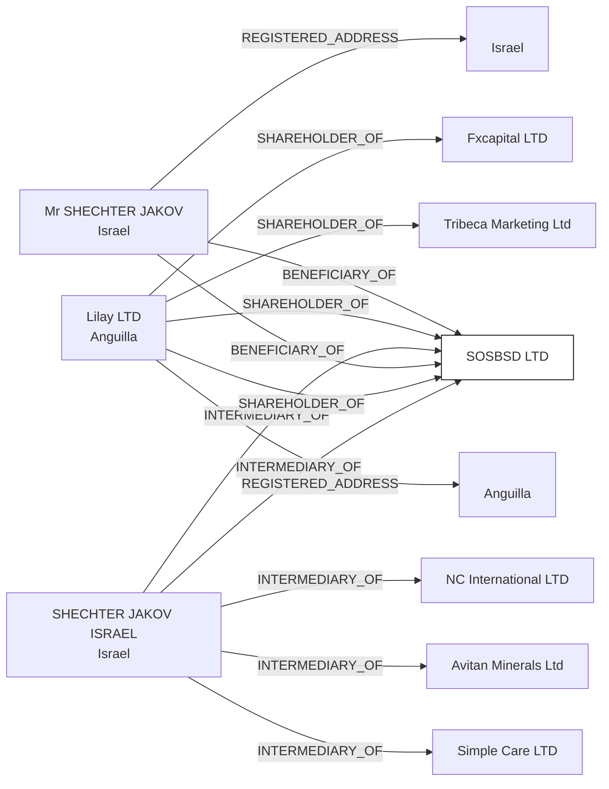

#SOS.BSD. LTD
Status: Defaulted
Address: SHECHTER JAKOV ISRAEL 11 HAALIYA HASHNIYA, BNIE-BRAK ISRAEL

##Incoming
BENEFICIARY
Mr SHECHTER JAKOV
Israel

SHAREHOLDER
Lilay LTD
Anguilla

INTERMEDIARY
SHECHTER JAKOV ISRAEL
Israel

##Graph
