#SUCCESS GROUP LTD.
Status: Active
Address: MOSSACK FONSECA & CO (PTY). MOSSFON BUILDING EAST 54TH STREET PANAMA, REP. OF PANAMA

##Incoming
SHAREHOLDER
M.F. PRIVATE HOLDINGS LIMITED
Bahamas

SHAREHOLDER
CHINA FOUNDATION
Panama

INTERMEDIARY
MOSSACK FONSECA & CO. (PTY)

##Graph

```mermaid
graph LR
classDef outline fill:#fff,stroke:#000,stroke-width:1px;
node1[SUCCESS GROUP LTD<br>]
node2[MF PRIVATE HOLDINGS LIMITED<br>Bahamas]
node2-->|SHAREHOLDER_OF|node1
node3[CHINA FOUNDATION<br>Panama]
node3-->|SHAREHOLDER_OF|node1
node4[MOSSACK FONSECA & CO %28PTY%29<br>None]
node4-->|INTERMEDIARY_OF|node1
class node1 outline
node5[MF PRIVATE HOLDINGS LIMITED<br>Bahamas]
node2-->|SIMILAR_NAME_AND_ADDRESS_AS|node5
node6[<br>Bahamas]
node2-->|REGISTERED_ADDRESS|node6
node2-->|SHAREHOLDER_OF|node1
node7[WALDORF LTD<br>]
node2-->|SHAREHOLDER_OF|node7
node8[MOSSACK FONSECA LIMITED<br>]
node2-->|SHAREHOLDER_OF|node8
node9[DENBY LTD<br>]
node2-->|SHAREHOLDER_OF|node9
node10[MOSSACK FONSECA LEGAL SERVICES, SA<br>]
node2-->|SHAREHOLDER_OF|node10
node11[CREDENCE LTD<br>]
node2-->|SHAREHOLDER_OF|node11
node12[MOSSACK FONSECA & CO %28Cyprus%29 LTD<br>]
node2-->|SHAREHOLDER_OF|node12
node13[<br>Panama]
node3-->|REGISTERED_ADDRESS|node13
node3-->|SHAREHOLDER_OF|node1
node3-->|SHAREHOLDER_OF|node11
node14[SECMARK LTD<br>]
node4-->|INTERMEDIARY_OF|node14
node15[VALSERVE LTD<br>]
node4-->|INTERMEDIARY_OF|node15
node16[SHARETON LTD<br>]
node4-->|INTERMEDIARY_OF|node16
node17[MOSSACK FONSECA & CO ASSOCIATES, SA<br>]
node4-->|INTERMEDIARY_OF|node17
node18[MF INTRANS LTD<br>]
node4-->|INTERMEDIARY_OF|node18
node19[EAGLE REAL ESTATE INC<br>]
node4-->|INTERMEDIARY_OF|node19
node20[EASTSHORE INC<br>]
node4-->|INTERMEDIARY_OF|node20
node21[SERVOGEST MANAGEMENT LTD<br>]
node4-->|INTERMEDIARY_OF|node21
node22[CHESWICK INC<br>]
node4-->|INTERMEDIARY_OF|node22
node23[NEWGEST MANAGEMENT LTD<br>]
node4-->|INTERMEDIARY_OF|node23
node24[MOSSFON NOMINEES LIMITED<br>]
node4-->|INTERMEDIARY_OF|node24
node25[ROLIKA INC<br>]
node4-->|INTERMEDIARY_OF|node25
node26[MOSSACK FONSECA & CO BVI%29 LTD<br>]
node4-->|INTERMEDIARY_OF|node26
node27[ORIONHOUSE %28URUGUAY%29 SA<br>]
node4-->|INTERMEDIARY_OF|node27
node28[MF COMPLIMENTARY SERVICES S DE RL<br>]
node4-->|INTERMEDIARY_OF|node28
node29[GLYNN ASSETS CORP<br>]
node4-->|INTERMEDIARY_OF|node29
node30[ORION REAL ESTATE INC, en inglés o BIENES RAÍCES ORION, SA<br>]
node4-->|INTERMEDIARY_OF|node30
node31[FARWORTH TRADING INC<br>]
node4-->|INTERMEDIARY_OF|node31
node32[MOSSACK FONSECA & CO,  S A<br>]
node4-->|INTERMEDIARY_OF|node32
node33[TECHNOLOGICAL INVESTMENTS INC<br>]
node4-->|INTERMEDIARY_OF|node33
node34[GUIXOLEX INC<br>]
node4-->|INTERMEDIARY_OF|node34
node35[ENDERS INC<br>]
node4-->|INTERMEDIARY_OF|node35
node36[ORION TRUST %28JERSEY%29 LIMITED - SOCIEDAD TRUST DE JERSEY<br>]
node4-->|INTERMEDIARY_OF|node36
node37[MOSSFON ASSET MANAGEMENT SA<br>]
node4-->|INTERMEDIARY_OF|node37
node38[ROCKALL INC<br>]
node4-->|INTERMEDIARY_OF|node38
node39[NEALFICUS, SA<br>]
node4-->|INTERMEDIARY_OF|node39
node4-->|INTERMEDIARY_OF|node9
node40[WHITESTONE LTD<br>]
node4-->|INTERMEDIARY_OF|node40
node41[GREAT SUCCESS LIMITED<br>]
node4-->|INTERMEDIARY_OF|node41
node42[PARKHILL LIMITED<br>]
node4-->|INTERMEDIARY_OF|node42
node43[EPSILON MANAGEMENT LTD<br>]
node4-->|INTERMEDIARY_OF|node43
node4-->|INTERMEDIARY_OF|node7
node44[FIDES MANAGEMENT & TRUST CORPORATION<br>]
node4-->|INTERMEDIARY_OF|node44
node45[INSTITUTIONAL ASSETS CORPORATION<br>]
node4-->|INTERMEDIARY_OF|node45
node46[EPSILON NOMINEES LTD<br>]
node4-->|INTERMEDIARY_OF|node46
node47[PACIFIC INTERNATIONAL VENTURES LTD<br>]
node4-->|INTERMEDIARY_OF|node47
node48[EUROSTOCK AG<br>]
node4-->|INTERMEDIARY_OF|node48
node49[KENSON CAPITAL STRATEGIES INC<br>]
node4-->|INTERMEDIARY_OF|node49
node50[BAYSEL INVEST SA<br>]
node4-->|INTERMEDIARY_OF|node50
node51[COFINVEST GMBH<br>]
node4-->|INTERMEDIARY_OF|node51
node52[MF PROPERTIES, INC<br>]
node4-->|INTERMEDIARY_OF|node52
node53[FOUNDATION MEMBERSHIP INC<br>]
node4-->|INTERMEDIARY_OF|node53
node54[ATHENAEUM HOLDINGS INC<br>]
node4-->|INTERMEDIARY_OF|node54
node55[MOSSFON INTERNATIONAL DEVELOPMENTS SA<br>]
node4-->|INTERMEDIARY_OF|node55
node56[AUCKLAND CORPORATE HOLDINGS LIMITED<br>]
node4-->|INTERMEDIARY_OF|node56
node57[MOSSFON WORLDWIDE INCORPORATORS LTD<br>]
node4-->|INTERMEDIARY_OF|node57
node58[FIRST SHAREHOLDERS LIMITED<br>]
node4-->|INTERMEDIARY_OF|node58
node59[FIRST DIRECTORS LIMITED<br>]
node4-->|INTERMEDIARY_OF|node59
node60[MOSSACK FONSECA & CO %28SAMOA%29 LIMITED<br>]
node4-->|INTERMEDIARY_OF|node60
node61[MOSSFON SUBSCRIBERS LTD<br>]
node4-->|INTERMEDIARY_OF|node61
node62[NISPER LIMITED<br>]
node4-->|INTERMEDIARY_OF|node62
node63[MOSSACK FONSECA & CO %28ASIA%29 LIMITED<br>]
node4-->|INTERMEDIARY_OF|node63
node4-->|INTERMEDIARY_OF|node44
node64[FAITH FOUNDATION<br>]
node4-->|INTERMEDIARY_OF|node64
node65[CHARITABLE AND GOODWILL FOUNDATION<br>]
node4-->|INTERMEDIARY_OF|node65
node66[MAGNANIMOUS FOUNDATION<br>]
node4-->|INTERMEDIARY_OF|node66
node67[LARGESS FOUNDATION<br>]
node4-->|INTERMEDIARY_OF|node67
node68[MUNFORD CONSULTING INC<br>]
node4-->|INTERMEDIARY_OF|node68
node69[BROTHERHOOD FOUNDATION<br>]
node4-->|INTERMEDIARY_OF|node69
node70[ZENORIA OVERSEAS INC<br>]
node4-->|INTERMEDIARY_OF|node70
node71[CHINA FOUNDATION<br>]
node4-->|INTERMEDIARY_OF|node71
node72[BENEFICENCE FOUNDATION<br>]
node4-->|INTERMEDIARY_OF|node72
node73[INTERLINE TRADING CORP S DE RL<br>]
node4-->|INTERMEDIARY_OF|node73
node74[FUNDACIÓN LA FRATERNIDAD<br>]
node4-->|INTERMEDIARY_OF|node74
node75[Aliator SA<br>]
node4-->|INTERMEDIARY_OF|node75
node76[Dubro Limited SA<br>]
node4-->|INTERMEDIARY_OF|node76
node77[MOSSACK FONSECA & CO %28EL SALVADOR%29 SA DE CV<br>]
node4-->|INTERMEDIARY_OF|node77
node78[Mossack Fonseca & Co Ecuador SA<br>]
node4-->|INTERMEDIARY_OF|node78
node79[MOSSACK FONSECA & CO %28NEW ZEALAND%29 LIMITED<br>]
node4-->|INTERMEDIARY_OF|node79
node80[KIRKSTONE HOLDINGS SA<br>]
node4-->|INTERMEDIARY_OF|node80
node81[Pandora Real Estate Agents Corp<br>]
node4-->|INTERMEDIARY_OF|node81
node82[HALDANE DEVELOPMENT SA<br>]
node4-->|INTERMEDIARY_OF|node82
node83[TORRE MOSSACK FONSECA, SA<br>]
node4-->|INTERMEDIARY_OF|node83
node84[AGIS FOUNDATION<br>]
node4-->|INTERMEDIARY_OF|node84
node85[MOSSACK FONSECA SECRETARIAL %28CYPRUS%29 LIMITED<br>]
node4-->|INTERMEDIARY_OF|node85
node86[SOLIDARITY ALLIANCE FOUNDATION<br>]
node4-->|INTERMEDIARY_OF|node86
node87[FILARDSON REAL ESTATES INC<br>]
node4-->|INTERMEDIARY_OF|node87
node88[MOSSACK FONSECA & CO %28LUXEMBOURG%29 SARL- SOCIEDAD DE LUXEMBURGO<br>]
node4-->|INTERMEDIARY_OF|node88
node89[FUNDACIÓN PLAN DE PENSIONES MOSSFON<br>]
node4-->|INTERMEDIARY_OF|node89
node90[FOUNDATION CREATORS CORP<br>]
node4-->|INTERMEDIARY_OF|node90
node91[INTERNATIONAL ACCOUNTING SERVICES ASSOCIATES INC<br>]
node4-->|INTERMEDIARY_OF|node91
node92[EDIFICIO MOSSFON SA<br>]
node4-->|INTERMEDIARY_OF|node92
node93[MOSSACK FONSECA & CO %28BAHAMAS %29 LIMITED<br>]
node4-->|INTERMEDIARY_OF|node93
node94[LANDTON FOUNDATION<br>]
node4-->|INTERMEDIARY_OF|node94
node95[MOSSACK, FONSECA & CO %28HONG KONG%29 INCORPORATED<br>]
node4-->|INTERMEDIARY_OF|node95
node96[MOSSFON HOLDINGS %28BAHAMAS%29 LIMITED<br>]
node4-->|INTERMEDIARY_OF|node96
node97[FOUNDATION GRANTORS INC<br>]
node4-->|INTERMEDIARY_OF|node97
node98[MOSSACK FONSECA & CO %28NIUE%29 LTD<br>]
node4-->|INTERMEDIARY_OF|node98
node99[M F PRIVATE HOLDINGS LIMITED<br>]
node4-->|INTERMEDIARY_OF|node99
node100[PAN-PACIFIC LIMITED<br>]
node4-->|INTERMEDIARY_OF|node100
node101[INVERSIONES LIBÉLULA S A<br>]
node4-->|INTERMEDIARY_OF|node101
node102[MF Executives Corp<br>]
node4-->|INTERMEDIARY_OF|node102
node103[RIBACKER CORPORATION<br>]
node4-->|INTERMEDIARY_OF|node103
node104[SECURE SOLUTIONS LTD<br>]
node4-->|INTERMEDIARY_OF|node104
node105[MOSSACK FONSECA & CO %28CHINA%29 LTD<br>]
node4-->|INTERMEDIARY_OF|node105
node106[MOSSACK FONSECA & CO %28NIUE%29 INC<br>]
node4-->|INTERMEDIARY_OF|node106
node107[PROPIEDADES MOSSFON, SA<br>]
node4-->|INTERMEDIARY_OF|node107
node108[MOSSFON PROTECTORSHIP SERVICES E E<br>]
node4-->|INTERMEDIARY_OF|node108
node109[MF CORPORATE SERVICES WYOMING LLC<br>]
node4-->|INTERMEDIARY_OF|node109
node110[MF WEALTH MANAGEMENT LTD<br>]
node4-->|INTERMEDIARY_OF|node110
node111[BRODY ENTERPRISES SA<br>]
node4-->|INTERMEDIARY_OF|node111
node112[MOSSFON REALTY ADMINISTRATORS LTD<br>]
node4-->|INTERMEDIARY_OF|node112
node113[ROCKROSE LTD<br>]
node4-->|INTERMEDIARY_OF|node113
node114[M F CORPORATE SERVICES %28NEVADA%29 LIMITED<br>]
node4-->|INTERMEDIARY_OF|node114
node115[INMOBILIARIA MOSSFON, SA<br>]
node4-->|INTERMEDIARY_OF|node115
node116[MF & CO %28BELIZE%29 LIMITED<br>]
node4-->|INTERMEDIARY_OF|node116
node117[Mossfon International Developments SA<br>]
node4-->|INTERMEDIARY_OF|node117
node118[WORLDWIDE INTERNATIONAL INCORPORATIONS LTD<br>]
node4-->|INTERMEDIARY_OF|node118
node4-->|INTERMEDIARY_OF|node51
node119[MOSSFON NOMINEES %28SEYCHELLES%29 LTD<br>]
node4-->|INTERMEDIARY_OF|node119
node120[BUFETE MF & CO<br>]
node4-->|INTERMEDIARY_OF|node120
node121[KASTEL LIMITED<br>]
node4-->|INTERMEDIARY_OF|node121
node122[COUNCIL ADMINISTRATORS INC<br>]
node4-->|INTERMEDIARY_OF|node122
node123[THE INTERNATIONAL TRUST COMPANY OF NIUE, INC<br>]
node4-->|INTERMEDIARY_OF|node123
node124[ALDYNE LTD<br>]
node4-->|INTERMEDIARY_OF|node124
node125[MULTINVEST LTD<br>]
node4-->|INTERMEDIARY_OF|node125
node126[AUSTRAL INVESTORS GROUP LTD<br>]
node4-->|INTERMEDIARY_OF|node126
node127[MOSSFON IMMIGRATION & NATURALIZATION SERVICES LTD<br>]
node4-->|INTERMEDIARY_OF|node127
node4-->|INTERMEDIARY_OF|node106
node128[DIREHOLD LTD<br>]
node4-->|INTERMEDIARY_OF|node128
node129[KRANDELL LIMITED<br>]
node4-->|INTERMEDIARY_OF|node129
node130[KELGAN LIMITED<br>]
node4-->|INTERMEDIARY_OF|node130
node131[CONSTANT LTD<br>]
node4-->|INTERMEDIARY_OF|node131
node4-->|INTERMEDIARY_OF|node126
node132[Parkridge, Ltd<br>]
node4-->|INTERMEDIARY_OF|node132
node133[HEMSLEY LTD<br>]
node4-->|INTERMEDIARY_OF|node133
node4-->|INTERMEDIARY_OF|node48
node134[BRAITHWAITE LIMITED<br>]
node4-->|INTERMEDIARY_OF|node134
node135[ORION INTERNATIONAL HOLDINGS LTD<br>]
node4-->|INTERMEDIARY_OF|node135
node136[KELSEY LTD<br>]
node4-->|INTERMEDIARY_OF|node136
node137[DELSTON, SA<br>]
node4-->|INTERMEDIARY_OF|node137
node138[Finas Ltd<br>]
node4-->|INTERMEDIARY_OF|node138
node139[DELANCEY LIMITED<br>]
node4-->|INTERMEDIARY_OF|node139
node140[PENDLE & BRAITHWAITE LIMITED<br>]
node4-->|INTERMEDIARY_OF|node140
node141[PENDLE LIMITED<br>]
node4-->|INTERMEDIARY_OF|node141
node142[Genesis Ltd<br>]
node4-->|INTERMEDIARY_OF|node142
node143[TORNBELL ASSOCIATES INC<br>]
node4-->|INTERMEDIARY_OF|node143
node144[SUGGEST LTD<br>]
node4-->|INTERMEDIARY_OF|node144
node145[MONFORT LTD<br>]
node4-->|INTERMEDIARY_OF|node145
node146[CHARITABLE AND GOODWILL CORP<br>]
node4-->|INTERMEDIARY_OF|node146
node147[GAIRNS LTD<br>]
node4-->|INTERMEDIARY_OF|node147
node148[DUNSTER LTD<br>]
node4-->|INTERMEDIARY_OF|node148
node149[BANFIELD LIMITED<br>]
node4-->|INTERMEDIARY_OF|node149
node150[GUDSON LIMITED<br>]
node4-->|INTERMEDIARY_OF|node150
node4-->|INTERMEDIARY_OF|node37
node151[CHADROSE LTD<br>]
node4-->|INTERMEDIARY_OF|node151
node152[DUNSTONE LTD<br>]
node4-->|INTERMEDIARY_OF|node152
node153[VALDEST LTD<br>]
node4-->|INTERMEDIARY_OF|node153
node154[PALMA CORPORATION LIMITED<br>]
node4-->|INTERMEDIARY_OF|node154
node155[HATHERLEY LIMITED<br>]
node4-->|INTERMEDIARY_OF|node155
node156[BRAVEWOOD LTD<br>]
node4-->|INTERMEDIARY_OF|node156
node4-->|INTERMEDIARY_OF|node12
node157[VALBETH CORP<br>]
node4-->|INTERMEDIARY_OF|node157
node158[MF Belize Subscriber Ltd<br>]
node4-->|INTERMEDIARY_OF|node158
node159[MOSSACK FONSECA & CO %28SEYCHELLES%29 LIMITED<br>]
node4-->|INTERMEDIARY_OF|node159
node160[EVERIDGE LTD<br>]
node4-->|INTERMEDIARY_OF|node160
node161[MOSSACK FONSECA & CO %28URUGUAY%29 LIMITED<br>]
node4-->|INTERMEDIARY_OF|node161
node162[PENDLE & BRAITHWAITE NOMINEES LIMITED<br>]
node4-->|INTERMEDIARY_OF|node162
node163[PLASCOT LIMITED<br>]
node4-->|INTERMEDIARY_OF|node163
node164[ROCKWELL LTD<br>]
node4-->|INTERMEDIARY_OF|node164
node165[KELLDYNE LTD<br>]
node4-->|INTERMEDIARY_OF|node165
node166[CASTLE FINANCE CORP<br>]
node4-->|INTERMEDIARY_OF|node166
node167[ATC INTRANS LTD<br>]
node4-->|INTERMEDIARY_OF|node167
node168[WINSLEY INC<br>]
node4-->|INTERMEDIARY_OF|node168
node169[MF INTERNATIONAL ACCOUNTING SERVICES LTD<br>]
node4-->|INTERMEDIARY_OF|node169
node170[MOSSACK FONSECA & CO %28COSTA RICA%29 LIMITED<br>]
node4-->|INTERMEDIARY_OF|node170
node171[CUSTODIAN LTD<br>]
node4-->|INTERMEDIARY_OF|node171
node4-->|INTERMEDIARY_OF|node11
node172[MOSSACK FONSECA & CO %28BRITISH ANGUILLA%29 LIMITED<br>]
node4-->|INTERMEDIARY_OF|node172
node173[MOSSACK FONSECA & CO SA - SOCIEDAD DE COSTA RICA<br>]
node4-->|INTERMEDIARY_OF|node173
node174[BELMONT SECURITIES CORPORATION<br>]
node4-->|INTERMEDIARY_OF|node174
node175[MOSSACK FONSECA & CO %28HK%29 LTD - SOCIEDAD DE HONG KONG<br>]
node4-->|INTERMEDIARY_OF|node175
node176[FOUNDATION MANAGEMENT CO INC<br>]
node4-->|INTERMEDIARY_OF|node176
node177[MOSSACK FONSECA & CO %28HK%29 LIMITED<br>]
node4-->|INTERMEDIARY_OF|node177
node178[DULCAN INC<br>]
node4-->|INTERMEDIARY_OF|node178
node179[WOODGREEN TRADING LTD<br>]
node4-->|INTERMEDIARY_OF|node179
node180[NIUE GOVERNMENT LICENSE ACCOUNT INC<br>]
node4-->|INTERMEDIARY_OF|node180
node4-->|INTERMEDIARY_OF|node1
node181[MF TREASURER - SOCIEDAD DE UK<br>]
node4-->|INTERMEDIARY_OF|node181
node182[FORBEST LTD<br>]
node4-->|INTERMEDIARY_OF|node182
node183[MOSSFON VALORES E INVERSIONES SA<br>]
node4-->|INTERMEDIARY_OF|node183
node184[MOSSACK FONSECA & ASSOCIATES, SA<br>]
node4-->|INTERMEDIARY_OF|node184
node185[RALEIGH LIMITED LIABILITY COMPANY<br>]
node4-->|INTERMEDIARY_OF|node185
node186[BANDOR LIMITED<br>]
node4-->|INTERMEDIARY_OF|node186
node187[ASIA-LATIN AMERICA TRADE CONSULTANCY INC<br>]
node4-->|INTERMEDIARY_OF|node187
node188[VERVE HOLDINGS SA<br>]
node4-->|INTERMEDIARY_OF|node188
node189[FIDES LIQUIDATORS INC<br>]
node4-->|INTERMEDIARY_OF|node189
node190[MOSSACK FONSECA CORPORATE SERVICES LTD INC<br>]
node4-->|INTERMEDIARY_OF|node190
node191[FERGUS INTERNATIONAL, SA %28SOC NOMINEE DE NEVADA%29<br>]
node4-->|INTERMEDIARY_OF|node191
node192[LIVINGSTON GROUP SA %28SOC NOMINEE DE NEVADA%29<br>]
node4-->|INTERMEDIARY_OF|node192
node193[Lanscape Corporation<br>]
node4-->|INTERMEDIARY_OF|node193
node4-->|INTERMEDIARY_OF|node49
node194[HILLARD ENTERPRISES SA %28SOC NOMINEE DE NEVADA%29<br>]
node4-->|INTERMEDIARY_OF|node194
node195[ROSELLE LIMITED<br>]
node4-->|INTERMEDIARY_OF|node195
node4-->|INTERMEDIARY_OF|node46
node196[APSLEY FOUNDATION<br>]
node4-->|INTERMEDIARY_OF|node196
node197[Mossfon Authorized Representative %28BVI%29 Limited<br>]
node4-->|INTERMEDIARY_OF|node197
node198[Mossack Fonseca & Co Panama%29, Ltd<br>]
node4-->|INTERMEDIARY_OF|node198
node4-->|INTERMEDIARY_OF|node40
node199[ORION HOUSE SECRETARIAL LIMITED<br>]
node4-->|INTERMEDIARY_OF|node199
node200[CAMILLE SERVICES, SA %28SOC NOMINEE DE NEVADA%29<br>]
node4-->|INTERMEDIARY_OF|node200
node4-->|INTERMEDIARY_OF|node47
node4-->|INTERMEDIARY_OF|node42
node4-->|INTERMEDIARY_OF|node9
node201[ZIBELI CORP<br>]
node4-->|INTERMEDIARY_OF|node201
node4-->|INTERMEDIARY_OF|node43
node4-->|INTERMEDIARY_OF|node7
node4-->|INTERMEDIARY_OF|node8
node202[MOSSFON INVESTMENT AND CONSULTING INC<br>]
node4-->|INTERMEDIARY_OF|node202
```
