#SUCCESS JOY INTERNATIONAL LTD.
Status: Defaulted
Address: INTERNATIONAL SECRETARIES LIMITED 13/F; PICO TOWER 66 GLOUCESTER ROAD WANCHAI; HONG KONG

##Incoming
INTERMEDIARY
INTERNATIONAL SECRETARIES LIMITED
INTERNATIONAL SECRETARIES LIMITED 13/F; PICO TOWER 66 GLOUCESTER ROAD WANCHAI; HONG KONG
Hong Kong

##Graph

```mermaid
graph LR
classDef outline fill:#fff,stroke:#000,stroke-width:1px;
node1[SUCCESS JOY INTERNATIONAL LTD<br>]
node2[INTERNATIONAL SECRETARIES LIMITED<br>Hong Kong]
node2-->|INTERMEDIARY_OF|node1
class node1 outline
node3[FIRST BILLION CO, LTD<br>]
node2-->|INTERMEDIARY_OF|node3
node4[PERFECT YIELD TRADING LIMITED<br>]
node2-->|INTERMEDIARY_OF|node4
node5[HAPPYFAME DEVELOPMENT LTD<br>]
node2-->|INTERMEDIARY_OF|node5
node6[CANRICH HOLDINGS LIMITED<br>]
node2-->|INTERMEDIARY_OF|node6
node7[GOLDEN TOWN INTERNATIONAL LTD<br>]
node2-->|INTERMEDIARY_OF|node7
node8[MEDLINK HOLDINGS LIMITED<br>]
node2-->|INTERMEDIARY_OF|node8
node9[GREEN POWER INTERNATIONAL LIMITED<br>]
node2-->|INTERMEDIARY_OF|node9
node10[GRACE HOPE INTERNATIONAL LTD<br>]
node2-->|INTERMEDIARY_OF|node10
node11[CHINA TALENT TRADING LIMITED<br>]
node2-->|INTERMEDIARY_OF|node11
node12[WISECO LIMITED<br>]
node2-->|INTERMEDIARY_OF|node12
node13[PERFECT RICH FINANCE LTD<br>]
node2-->|INTERMEDIARY_OF|node13
node14[TULIP RING LIMITED<br>]
node2-->|INTERMEDIARY_OF|node14
node15[WANG TAK INVESTMENTS INC<br>]
node2-->|INTERMEDIARY_OF|node15
node16[TRANSFIELD ENTERPRISES LIMITED<br>]
node2-->|INTERMEDIARY_OF|node16
node17[SMART CONCEPT HOLDING LIMITED<br>]
node2-->|INTERMEDIARY_OF|node17
node18[TRANSFIELD ASSET MANAGEMENT LIMITED<br>]
node2-->|INTERMEDIARY_OF|node18
node19[TRANSFIELD INTERNATIONAL LIMITED<br>]
node2-->|INTERMEDIARY_OF|node19
node20[KEYSTON INTERNATIONAL LTD<br>]
node2-->|INTERMEDIARY_OF|node20
node21[NATIONAL SPIRIT INVESTMENT LTD<br>]
node2-->|INTERMEDIARY_OF|node21
node22[TOP MAX INTERNATIONAL ENTERPRISES LTD<br>]
node2-->|INTERMEDIARY_OF|node22
node23[JADASON ENTERPRISES HOLDINGS LIMITED<br>]
node2-->|INTERMEDIARY_OF|node23
node24[MAXIMWIN INTERNATIONAL LIMITED<br>]
node2-->|INTERMEDIARY_OF|node24
node25[SEA BREEZE ENTERPRISES LTD<br>]
node2-->|INTERMEDIARY_OF|node25
node26[FORTUNATE INTERNATIONAL LIMITED<br>]
node2-->|INTERMEDIARY_OF|node26
node27[RICHLAND CONSULTANTS LIMITED<br>]
node2-->|INTERMEDIARY_OF|node27
node28[WORLD BIKE INTERNATIONAL %28BVI%29 LTD<br>]
node2-->|INTERMEDIARY_OF|node28
node29[GOLDSFAIR INVESTMENT & DEVELOPMENT LTD<br>]
node2-->|INTERMEDIARY_OF|node29
node30[PORCHLEY INTERNATIONAL LTD<br>]
node2-->|INTERMEDIARY_OF|node30
node31[PHLOX & DICKSON TELECOMMUNICATIONS INTERNATIONAL LTD<br>]
node2-->|INTERMEDIARY_OF|node31
node32[VOYAGER INTERNATIONAL %28BVI%29 LTD<br>]
node2-->|INTERMEDIARY_OF|node32
node33[CHINA HI-TECH DEVELOPMENT MANAGEMENT LIMITED<br>]
node2-->|INTERMEDIARY_OF|node33
node2-->|INTERMEDIARY_OF|node1
node34[CHEMLAB INTERNATIONAL LIMITED<br>]
node2-->|INTERMEDIARY_OF|node34
node35[MULTIPATH INVESTMENT CORP<br>]
node2-->|INTERMEDIARY_OF|node35
node36[PHLOX AND DICKSON TELECOMMUNICATIONS LIMITED<br>]
node2-->|INTERMEDIARY_OF|node36
node37[DENVER ASSOCIATES LTD<br>]
node2-->|INTERMEDIARY_OF|node37
node38[ESTON CONSULTANTS INC<br>]
node2-->|INTERMEDIARY_OF|node38
node39[BRYSTAL EQUITIES LIMITED<br>]
node2-->|INTERMEDIARY_OF|node39
node40[YELLOW BUTTERFLY INVESTMENTS LIMITED<br>]
node2-->|INTERMEDIARY_OF|node40
node41[HOIWIN DEVELOPMENT LTD<br>]
node2-->|INTERMEDIARY_OF|node41
node42[MUSICAL TONE ASSOCIATES CORPORATION<br>]
node2-->|INTERMEDIARY_OF|node42
node43[CHINA TELECOM %28BVI%29 LIMITED<br>]
node2-->|INTERMEDIARY_OF|node43
node44[HEEP WOH ENTERPRISES LTD<br>]
node2-->|INTERMEDIARY_OF|node44
node45[FARFIELD LIMITED<br>]
node2-->|INTERMEDIARY_OF|node45
node46[CHINA CONSULTANTS, INC<br>]
node2-->|INTERMEDIARY_OF|node46
node47[J & J INC<br>]
node2-->|INTERMEDIARY_OF|node47
node48[SPANDEX DEVELOPMENTS INC<br>]
node2-->|INTERMEDIARY_OF|node48
node49[COSMIC INTERNATIONAL INC<br>]
node2-->|INTERMEDIARY_OF|node49
node50[KOHO LIMITED<br>]
node2-->|INTERMEDIARY_OF|node50
node51[EASTLIGHT EQUITIES INC<br>]
node2-->|INTERMEDIARY_OF|node51
node52[QCS ASIA CO, LTD<br>]
node2-->|INTERMEDIARY_OF|node52
node53[SKYLOYAL DEVELOPMENT LTD<br>]
node2-->|INTERMEDIARY_OF|node53
node54[NARRA NOMINEES LIMITED<br>]
node2-->|INTERMEDIARY_OF|node54
node55[JOIN WAY LTD<br>]
node2-->|INTERMEDIARY_OF|node55
node56[UPWAY ENTERPRISES LTD<br>]
node2-->|INTERMEDIARY_OF|node56
node57[SONUS TRADING LTD<br>]
node2-->|INTERMEDIARY_OF|node57
node58[ALLERTON FINANCE LTD<br>]
node2-->|INTERMEDIARY_OF|node58
node59[GAIN DAY GROUP LTD<br>]
node2-->|INTERMEDIARY_OF|node59
node60[HYSTERIC INTERNATIONAL LIMITED<br>]
node2-->|INTERMEDIARY_OF|node60
node61[MAHOGANY NOMINEES LIMITED<br>]
node2-->|INTERMEDIARY_OF|node61
node62[GOLDEN DRAGON UNIVERSAL LIMITED<br>]
node2-->|INTERMEDIARY_OF|node62
node63[HEALTHCARE RESOURCE INTERNATIONAL LIMITED<br>]
node2-->|INTERMEDIARY_OF|node63
node64[ENDLESS GAIN UNIVERSAL LIMITED<br>]
node2-->|INTERMEDIARY_OF|node64
node65[TOPPY TRADING LTD<br>]
node2-->|INTERMEDIARY_OF|node65
node66[GLOBAL COMMODITY INSPECTION GROUP%29 CO, LTD<br>]
node2-->|INTERMEDIARY_OF|node66
node67[COOME COMPANY LIMITED<br>]
node2-->|INTERMEDIARY_OF|node67
node68[FIRST CHEER GROUP LIMITED<br>]
node2-->|INTERMEDIARY_OF|node68
node69[JADE METRO GROUP LIMITED<br>]
node2-->|INTERMEDIARY_OF|node69
node70[KITTERIC TRADING LTD<br>]
node2-->|INTERMEDIARY_OF|node70
node71[BEAUTY SMILE TRADING LTD<br>]
node2-->|INTERMEDIARY_OF|node71
node72[NEWTRON COMPANY LIMITED<br>]
node2-->|INTERMEDIARY_OF|node72
node73[PEACE GLOBE TRADING LTD<br>]
node2-->|INTERMEDIARY_OF|node73
node74[YALANE CORPORATION<br>]
node2-->|INTERMEDIARY_OF|node74
node75[BIG SILVER INVESTMENT LIMITED<br>]
node2-->|INTERMEDIARY_OF|node75
node76[LUSTROUS FUTURE DEVELOPMENT LIMITED<br>]
node2-->|INTERMEDIARY_OF|node76
node77[CYPRUS GOLD ENTERPRISES LIMITED<br>]
node2-->|INTERMEDIARY_OF|node77
node78[WINNER PARADISE HOLDINGS LIMITED<br>]
node2-->|INTERMEDIARY_OF|node78
node79[RINGO GROUP LTD<br>]
node2-->|INTERMEDIARY_OF|node79
node80[NORTON STAR LTD<br>]
node2-->|INTERMEDIARY_OF|node80
node81[HOLY CAMDEN GROUP LIMITED<br>]
node2-->|INTERMEDIARY_OF|node81
node82[WEALTHLINK FINANCE LIMITED<br>]
node2-->|INTERMEDIARY_OF|node82
node83[BEST PRAISE LTD<br>]
node2-->|INTERMEDIARY_OF|node83
node84[ASIAN OCEAN INTERNATIONAL LTD<br>]
node2-->|INTERMEDIARY_OF|node84
node85[OCEAN VILLAGE LIMITED<br>]
node2-->|INTERMEDIARY_OF|node85
node86[LONG CHAMP CAPITAL ENTERPRISES LTD<br>]
node2-->|INTERMEDIARY_OF|node86
node87[MAXTIME FINANCE LTD<br>]
node2-->|INTERMEDIARY_OF|node87
node88[China Square Industrial Limited<br>]
node2-->|INTERMEDIARY_OF|node88
node89[BARTLOCK CONSULTANT LIMITED<br>]
node2-->|INTERMEDIARY_OF|node89
node90[SILVER RICH CONSULTANTS LIMITED<br>]
node2-->|INTERMEDIARY_OF|node90
node91[TWINKLE MARCO ENTERPRISES LIMITED<br>]
node2-->|INTERMEDIARY_OF|node91
node92[YML INTERNATIONAL LIMITED<br>]
node2-->|INTERMEDIARY_OF|node92
node93[SUMMERSET  TECHNOLOGY   LTD<br>]
node2-->|INTERMEDIARY_OF|node93
node94[SUNGO ENTERPRISES LTD<br>]
node2-->|INTERMEDIARY_OF|node94
node95[IDEAL CONCEPT HOLDINGS LIMITED<br>]
node2-->|INTERMEDIARY_OF|node95
node96[PING AN LOGISTIC LIMITED<br>]
node2-->|INTERMEDIARY_OF|node96
node97[SUCCESS STAR INVESTMENTS LTD<br>]
node2-->|INTERMEDIARY_OF|node97
node98[DOUBLE UNION HOLDINGS LTD<br>]
node2-->|INTERMEDIARY_OF|node98
node99[DELIGHT MIND ENTERPRISES LIMITED<br>]
node2-->|INTERMEDIARY_OF|node99
node100[Richardson Management and Consultancy Ltd<br>]
node2-->|INTERMEDIARY_OF|node100
node101[MILLION LAND MANAGEMENT LTD<br>]
node2-->|INTERMEDIARY_OF|node101
node102[KERIA SKY GROUP LTD<br>]
node2-->|INTERMEDIARY_OF|node102
node103[Ting Co, Ltd<br>]
node2-->|INTERMEDIARY_OF|node103
node104[Rolling Grace Limited<br>]
node2-->|INTERMEDIARY_OF|node104
node105[HAPPY OCEAN TRADING LIMITED<br>]
node2-->|INTERMEDIARY_OF|node105
node106[QING HOLDINGS LTD<br>]
node2-->|INTERMEDIARY_OF|node106
node107[HIMMER WINCO MEDIA LIMITED<br>]
node2-->|INTERMEDIARY_OF|node107
node108[MEGA BONUS ENTERPRISES LTD<br>]
node2-->|INTERMEDIARY_OF|node108
node109[SUPERIOR OCEAN INTERNATIONAL LTD<br>]
node2-->|INTERMEDIARY_OF|node109
node110[Broadhaven Asia Pacific Holdings Limited<br>]
node2-->|INTERMEDIARY_OF|node110
node111[FAITH HONOR HOLDINGS LTD<br>]
node2-->|INTERMEDIARY_OF|node111
node112[HTC HOLDINGS HONG KONG LIMITED<br>]
node2-->|INTERMEDIARY_OF|node112
node113[POINT UP INVESTMENTS LTD<br>]
node2-->|INTERMEDIARY_OF|node113
node114[Voyace Shipping Co, Ltd<br>]
node2-->|INTERMEDIARY_OF|node114
node115[Fengyi International Holdings Co, Ltd<br>]
node2-->|INTERMEDIARY_OF|node115
node116[Concept I Media and Technology Company Limited<br>]
node2-->|INTERMEDIARY_OF|node116
node117[JING CHAI HOLDINGS LIMITED<br>]
node2-->|INTERMEDIARY_OF|node117
node118[RP PRODUCTS PACIFIC LTD<br>]
node2-->|INTERMEDIARY_OF|node118
node119[NEW PROSPER GROUP LTD<br>]
node2-->|INTERMEDIARY_OF|node119
node120[A&A Technology Consultant Limited<br>]
node2-->|INTERMEDIARY_OF|node120
node121[TYRO PIONEER INTERNATIONAL CO, LTD<br>]
node2-->|INTERMEDIARY_OF|node121
node122[UNITED CITY HOLDINGS LIMITED<br>]
node2-->|INTERMEDIARY_OF|node122
node123[PRIZE GAIN HOLDINGS LIMITED<br>]
node2-->|INTERMEDIARY_OF|node123
node124[GOLDEN GROW ENTERPRISES LIMITED<br>]
node2-->|INTERMEDIARY_OF|node124
node125[Jiageda Far East Co Ltd<br>]
node2-->|INTERMEDIARY_OF|node125
node126[Kailing Holdings Co, Ltd<br>]
node2-->|INTERMEDIARY_OF|node126
node127[BEST ELEMENTS INVESTMENTS LIMITED<br>]
node2-->|INTERMEDIARY_OF|node127
node128[FLAMELY ENTERPRISES LTD<br>]
node2-->|INTERMEDIARY_OF|node128
node129[BLOOMING SUN RESOURCES LTD<br>]
node2-->|INTERMEDIARY_OF|node129
node130[LAI WAH MANAGEMENT INC<br>]
node2-->|INTERMEDIARY_OF|node130
node131[ALWAYS FORTUNE HOLDINGS LIMITED<br>]
node2-->|INTERMEDIARY_OF|node131
node132[CHINA TELECOM %28TIANJIN%29 LIMITED<br>]
node2-->|INTERMEDIARY_OF|node132
node133[ENSILVER LIMITED<br>]
node2-->|INTERMEDIARY_OF|node133
node134[K & L HOLDINGS COMPANY LIMITED<br>]
node2-->|INTERMEDIARY_OF|node134
node135[TECHBORN INTERNATIONAL LTD<br>]
node2-->|INTERMEDIARY_OF|node135
node136[HAPPY TUNE NETWORK LIMITED<br>]
node2-->|INTERMEDIARY_OF|node136
node137[YUEN HING ENTERPRISES COMPANY LIMITED<br>]
node2-->|INTERMEDIARY_OF|node137
node138[TRANSFIELD PROPERTY INVESTMENT LIMITED<br>]
node2-->|INTERMEDIARY_OF|node138
node139[TRANSFIELD MARITIME LIMITED<br>]
node2-->|INTERMEDIARY_OF|node139
node140[TRANSFIELD NOMINEES LIMITED<br>]
node2-->|INTERMEDIARY_OF|node140
node141[MID-SINO HOLDINGS LIMITED<br>]
node2-->|INTERMEDIARY_OF|node141
node142[INTERNATIONAL CUSTODIAN INC<br>]
node2-->|INTERMEDIARY_OF|node142
node143[ORCHID COMMERCIAL CORPORATION<br>]
node2-->|INTERMEDIARY_OF|node143
node144[CHARLESTON ASSOCIATES INC<br>]
node2-->|INTERMEDIARY_OF|node144
node145[CLAVERLEY HOLDINGS INC<br>]
node2-->|INTERMEDIARY_OF|node145
node146[SUNFLOWER COMMERCIAL ENTERPRISES INC<br>]
node2-->|INTERMEDIARY_OF|node146
node147[INTERNATIONAL NOMINEES HOLDINGS INC<br>]
node2-->|INTERMEDIARY_OF|node147
node148[FLORAL JOY LIMITED<br>]
node2-->|INTERMEDIARY_OF|node148
node149[PRIME JOY LIMITED<br>]
node2-->|INTERMEDIARY_OF|node149
node150[RED PINE MANAGEMENT LIMITED<br>]
node2-->|INTERMEDIARY_OF|node150
node151[PRIME ALLIANCE LIMITED<br>]
node2-->|INTERMEDIARY_OF|node151
node152[RIVER SILK DEVELOPMENT LTD<br>]
node2-->|INTERMEDIARY_OF|node152
node153[HILLCREST FINANCE LTD<br>]
node2-->|INTERMEDIARY_OF|node153
node154[LIKE CHEERFUL HOLDINGS LTD<br>]
node2-->|INTERMEDIARY_OF|node154
node155[TOPLINE TRADING LIMITED<br>]
node2-->|INTERMEDIARY_OF|node155
node156[SKY SPIRIT TRADING LIMITED<br>]
node2-->|INTERMEDIARY_OF|node156
node157[WISEWIN INTERNATIONAL LIMITED<br>]
node2-->|INTERMEDIARY_OF|node157
node158[BEST CORNER INTERNATIONAL LIMITED<br>]
node2-->|INTERMEDIARY_OF|node158
node159[IDEAL CITY FINANCE LIMITED<br>]
node2-->|INTERMEDIARY_OF|node159
node160[VANBRUGH ASSOCIATES INC<br>]
node2-->|INTERMEDIARY_OF|node160
node161[ABLE PARTNERS ENTERPRISES LIMITED<br>]
node2-->|INTERMEDIARY_OF|node161
node162[COMERGE SHIPPING %28HONG KONG%29 CO, LTD<br>]
node2-->|INTERMEDIARY_OF|node162
node163[BEFORD DEVELOPMENT LTD<br>]
node2-->|INTERMEDIARY_OF|node163
node164[AFFLATVS LIMITED<br>]
node2-->|INTERMEDIARY_OF|node164
node165[GIANT EAGLE SHIPPING CONSULTANTS %28BVI%29 LIMITED<br>]
node2-->|INTERMEDIARY_OF|node165
node166[Priminds Shipping %28Hong Kong%29 Co, Limited<br>]
node2-->|INTERMEDIARY_OF|node166
node167[COMERGE AGRICULTURE TRADING CO, LTD<br>]
node2-->|INTERMEDIARY_OF|node167
node168[COMERGE CAPITAL AND INVESTMENT CO, LTD<br>]
node2-->|INTERMEDIARY_OF|node168
node169[NORBURY ENTERPRISES INC<br>]
node2-->|INTERMEDIARY_OF|node169
node170[VIOLET JADE HOLDINGS LTD<br>]
node2-->|INTERMEDIARY_OF|node170
node171[SUNNY PEAK TRADING LIMITED<br>]
node2-->|INTERMEDIARY_OF|node171
node172[OSCAR VENTURE INVESTMENT LIMITED<br>]
node2-->|INTERMEDIARY_OF|node172
node173[OCEAN CHANNEL LIMITED<br>]
node2-->|INTERMEDIARY_OF|node173
```
