#SUCCESS RUN LTD.
Status: Defaulted
Address: HO TAK SANG & CO. RM 303; EAST OCEAN CENTRE; 98 GRANVILLE ROAD; TSIMSHATSUI EAST; KOWLOON; HONG KONG

##Incoming
SHAREHOLDER
Au Ling Wai
Hong Kong

SHAREHOLDER
Chu Yiu Jo
Hong Kong

INTERMEDIARY
HO TAK SANG & CO.
HO TAK SANG & CO. RM 303; EAST OCEAN CENTRE; 98 GRANVILLE ROAD; TSIMSHATSUI EAST; KOWLOON; HONG KONG
Hong Kong

##Graph

```mermaid
graph LR
classDef outline fill:#fff,stroke:#000,stroke-width:1px;
node1[SUCCESS RUN LTD<br>]
node2[Au Ling Wai<br>Hong Kong]
node2-->|SHAREHOLDER_OF|node1
node3[Chu Yiu Jo<br>Hong Kong]
node3-->|SHAREHOLDER_OF|node1
node4[HO TAK SANG & CO<br>Hong Kong]
node4-->|INTERMEDIARY_OF|node1
class node1 outline
node5[<br>Hong Kong]
node2-->|REGISTERED_ADDRESS|node5
node2-->|SHAREHOLDER_OF|node1
node3-->|REGISTERED_ADDRESS|node5
node3-->|SHAREHOLDER_OF|node1
node6[TV New Concept Co Limited<br>]
node4-->|INTERMEDIARY_OF|node6
node7[ULTRA GOAL INTERNATIONAL LTD<br>]
node4-->|INTERMEDIARY_OF|node7
node8[CROWN RISE INVESTMENT LTD<br>]
node4-->|INTERMEDIARY_OF|node8
node9[REAL PEARL ENTERPRISES LIMITED<br>]
node4-->|INTERMEDIARY_OF|node9
node10[JUNGLE OASIS HOLDINGS LIMITED<br>]
node4-->|INTERMEDIARY_OF|node10
node11[SI HUA MEDICAL LIMITED<br>]
node4-->|INTERMEDIARY_OF|node11
node12[RENOWN DIAGNOSTIC TECHNOLOGY LIMITED<br>]
node4-->|INTERMEDIARY_OF|node12
node13[Top Advance International Trading Ltd<br>]
node4-->|INTERMEDIARY_OF|node13
node14[KOBE STAR TECHNOLOGY LTD<br>]
node4-->|INTERMEDIARY_OF|node14
node15[GALAXY PEARL INVESTMENT LIMITED<br>]
node4-->|INTERMEDIARY_OF|node15
node16[CODY STAR INVESTMENT LTD<br>]
node4-->|INTERMEDIARY_OF|node16
node17[MAX PROFIT TECHNOLOGY LTD<br>]
node4-->|INTERMEDIARY_OF|node17
node18[CITY ANGELS INVESTMENTS LTD<br>]
node4-->|INTERMEDIARY_OF|node18
node19[FUSUN GROUP LIMITED<br>]
node4-->|INTERMEDIARY_OF|node19
node20[SKY ORIENT TECHNOLOGY LTD<br>]
node4-->|INTERMEDIARY_OF|node20
node21[KING PARK INVESTMENT LIMITED<br>]
node4-->|INTERMEDIARY_OF|node21
node22[QUICK RISE ENTERPRISES LIMITED<br>]
node4-->|INTERMEDIARY_OF|node22
node23[TOPGROW GROUP LTD<br>]
node4-->|INTERMEDIARY_OF|node23
node24[AEC ENTERPRISES LIMITED<br>]
node4-->|INTERMEDIARY_OF|node24
node25[AEC ENGINEERING LIMITED<br>]
node4-->|INTERMEDIARY_OF|node25
node26[AEC HOLDINGS LIMITED<br>]
node4-->|INTERMEDIARY_OF|node26
node27[EAST OCEAN INTERNATIONAL HOLDINGS LTD<br>]
node4-->|INTERMEDIARY_OF|node27
node28[AEC DRAGON LIMITED<br>]
node4-->|INTERMEDIARY_OF|node28
node29[AEC TRANSFORMERS LIMITED<br>]
node4-->|INTERMEDIARY_OF|node29
node30[ULTRAGLAD INTERNATIONAL INVESTMENT LTD<br>]
node4-->|INTERMEDIARY_OF|node30
node31[AEC STRATEGIES LIMITED<br>]
node4-->|INTERMEDIARY_OF|node31
node32[CS INVESTMENT LIMITED<br>]
node4-->|INTERMEDIARY_OF|node32
node33[K-H GROUP LIMITED<br>]
node4-->|INTERMEDIARY_OF|node33
node34[MERRY LINK INTERNATIONAL GROUP LIMITED<br>]
node4-->|INTERMEDIARY_OF|node34
node35[DEMAINCO INTERNATIONAL LTD<br>]
node4-->|INTERMEDIARY_OF|node35
node36[RICKLE ASIA INVESTMENTS LTD<br>]
node4-->|INTERMEDIARY_OF|node36
node37[IGOR HOLDINGS LTD<br>]
node4-->|INTERMEDIARY_OF|node37
node38[AEC PACIFIC LIMITED<br>]
node4-->|INTERMEDIARY_OF|node38
node39[AEC CHINA LIMITED<br>]
node4-->|INTERMEDIARY_OF|node39
node40[AEC SWITCHGEAR LIMITED<br>]
node4-->|INTERMEDIARY_OF|node40
node41[TRIPLE R INDUSTRIES LIMITED<br>]
node4-->|INTERMEDIARY_OF|node41
node42[CLARE FINANCES GROUP LTD<br>]
node4-->|INTERMEDIARY_OF|node42
node43[HIP SHING FAT HOLDINGS LIMITED<br>]
node4-->|INTERMEDIARY_OF|node43
node44[PANNY INDUSTRIAL LTD<br>]
node4-->|INTERMEDIARY_OF|node44
node45[FULL HARVEST INTERNATIONAL DEVELOPMENT LTD<br>]
node4-->|INTERMEDIARY_OF|node45
node46[TALENT BEST INVESTMENT LTD<br>]
node4-->|INTERMEDIARY_OF|node46
node47[LLA INTERNATIONAL CONSULTANTS LIMITED<br>]
node4-->|INTERMEDIARY_OF|node47
node48[WISE CONCORD INVESTMENT LTD<br>]
node4-->|INTERMEDIARY_OF|node48
node49[BEWISE INTERNATIONAL LTD<br>]
node4-->|INTERMEDIARY_OF|node49
node50[CROWN INTERNATIONAL CONSULTANTS LIMITED<br>]
node4-->|INTERMEDIARY_OF|node50
node51[KENNICK DEVELOPMENT LTD<br>]
node4-->|INTERMEDIARY_OF|node51
node52[THETA %28CORPORATION%29 HOLDINGS LIMITED<br>]
node4-->|INTERMEDIARY_OF|node52
node53[SOMERTON INVESTMENTS LIMITED<br>]
node4-->|INTERMEDIARY_OF|node53
node54[RICH FIELD INTERNATIONAL LTD<br>]
node4-->|INTERMEDIARY_OF|node54
node55[WING YIP GROUP LIMITED<br>]
node4-->|INTERMEDIARY_OF|node55
node56[NAN SHAN HOLDING LTD<br>]
node4-->|INTERMEDIARY_OF|node56
node57[ITC GROUP DEVELOPMENT LIMITED<br>]
node4-->|INTERMEDIARY_OF|node57
node58[HERO NATION GROUP LTD<br>]
node4-->|INTERMEDIARY_OF|node58
node59[HC Holdings Limited<br>]
node4-->|INTERMEDIARY_OF|node59
node60[Sino-Electric International Investments Company Limited<br>]
node4-->|INTERMEDIARY_OF|node60
node61[HILLTOP STAR LTD<br>]
node4-->|INTERMEDIARY_OF|node61
node62[QA Asia Pacific Limited<br>]
node4-->|INTERMEDIARY_OF|node62
node63[S Infinity Co, Limited<br>]
node4-->|INTERMEDIARY_OF|node63
node64[B2B Synergy Ltd<br>]
node4-->|INTERMEDIARY_OF|node64
node65[SHINING JEWEL LTD<br>]
node4-->|INTERMEDIARY_OF|node65
node66[Forever Sino Limited<br>]
node4-->|INTERMEDIARY_OF|node66
node67[DJ Asia Holdings Limited<br>]
node4-->|INTERMEDIARY_OF|node67
node68[Harmony Concept Limited<br>]
node4-->|INTERMEDIARY_OF|node68
node69[Prospere Investment Management Limited<br>]
node4-->|INTERMEDIARY_OF|node69
node70[LOYAL CITY HOLDINGS LIMITED<br>]
node4-->|INTERMEDIARY_OF|node70
node71[Wind Projects International Ltd<br>]
node4-->|INTERMEDIARY_OF|node71
node72[La Joie De Vivre Investment Limited<br>]
node4-->|INTERMEDIARY_OF|node72
node73[GIG Visual Entertainment Limited<br>]
node4-->|INTERMEDIARY_OF|node73
node74[JOY BUSINESS INVESTMENTS LIMITED<br>]
node4-->|INTERMEDIARY_OF|node74
node75[GreenOcean International Shipping Ltd<br>]
node4-->|INTERMEDIARY_OF|node75
node76[THEME LINK INVESTMENTS LTD<br>]
node4-->|INTERMEDIARY_OF|node76
node77[BEAUTY NATURE DEVELOPMENT LIMITED<br>]
node4-->|INTERMEDIARY_OF|node77
node78[GLOBAL DESERTIFICATION LIMITED<br>]
node4-->|INTERMEDIARY_OF|node78
node79[ORIENT WELL HOLDINGS LIMITED<br>]
node4-->|INTERMEDIARY_OF|node79
node80[JOYFUL PACIFIC INVESTMENTS LIMITED<br>]
node4-->|INTERMEDIARY_OF|node80
node81[GLORY FLY DEVELOPMENT LTD<br>]
node4-->|INTERMEDIARY_OF|node81
node82[GOLDEN CARGO INVESTMENTS LIMITED<br>]
node4-->|INTERMEDIARY_OF|node82
node83[RIGHT MAX HOLDINGS LIMITED<br>]
node4-->|INTERMEDIARY_OF|node83
node84[SINO GOLD CONSULTANT LIMITED<br>]
node4-->|INTERMEDIARY_OF|node84
node85[Brotherhood International Investment Limited<br>]
node4-->|INTERMEDIARY_OF|node85
node86[UNION BRO HOLDINGS LIMITED<br>]
node4-->|INTERMEDIARY_OF|node86
node87[GREAT SUN MANAGEMENT LIMITED<br>]
node4-->|INTERMEDIARY_OF|node87
node88[SUN HAI JEWELLERY HOLDINGS LTD<br>]
node4-->|INTERMEDIARY_OF|node88
node89[FOREVER JOY LTD<br>]
node4-->|INTERMEDIARY_OF|node89
node90[CROWN PEARL INVESTMENTS LIMITED<br>]
node4-->|INTERMEDIARY_OF|node90
node91[FOCUS GROUP LIMITED<br>]
node4-->|INTERMEDIARY_OF|node91
node92[K & K ASSOCIATE LIMITED<br>]
node4-->|INTERMEDIARY_OF|node92
node93[KINSTON INTERNATIONAL GROUP LTD<br>]
node4-->|INTERMEDIARY_OF|node93
node94[ON TAI COMPANY LIMITED<br>]
node4-->|INTERMEDIARY_OF|node94
node95[ROSE FAITH INTERNATIONAL LIMITED<br>]
node4-->|INTERMEDIARY_OF|node95
node96[SWEETY DEVELOPMENT LTD<br>]
node4-->|INTERMEDIARY_OF|node96
node97[EVERGREEN INTERNATIONAL BRANDS HOLDINGS LIMITED<br>]
node4-->|INTERMEDIARY_OF|node97
node98[YANG XIN INTERNATIONAL TRADING LIMITED<br>]
node4-->|INTERMEDIARY_OF|node98
node99[SINO ON INTERNATIONAL LTD<br>]
node4-->|INTERMEDIARY_OF|node99
node100[HIGH PRODUCTION MANAGEMENT LIMITED<br>]
node4-->|INTERMEDIARY_OF|node100
node4-->|INTERMEDIARY_OF|node1
node101[FIRST SHINE INVESTMENTS LTD<br>]
node4-->|INTERMEDIARY_OF|node101
node102[PAC IMPORTS & EXPORTS LIMITED<br>]
node4-->|INTERMEDIARY_OF|node102
```
