#SWEETPEA SOLUTIONS TWO LIMITED
Status: Active
Address: GECKO CORPORATE SERVICES LIMITED 8 MOUNT PLEASANT DOUGLAS  IM1 2PM,  ISLE OF MAN

##Incoming
SHAREHOLDER
Crown Directors Limited
British Virgin Islands

INTERMEDIARY
GECKO CORPORATE SERVICES
GECKO CORPORATE SERVICES LIMITED 8 MOUNT PLEASANT DOUGLAS  IM1 2PM,  ISLE OF MAN
Isle of Man

##Graph

```mermaid
graph LR
classDef outline fill:#fff,stroke:#000,stroke-width:1px;
node1[SWEETPEA SOLUTIONS TWO LIMITED<br>]
node2[Crown Directors Limited<br>British Virgin Islands]
node2-->|SHAREHOLDER_OF|node1
node3[GECKO CORPORATE SERVICES<br>Isle of Man]
node3-->|INTERMEDIARY_OF|node1
class node1 outline
node4[<br>British Virgin Islands]
node2-->|REGISTERED_ADDRESS|node4
node2-->|SHAREHOLDER_OF|node1
node5[SWEETPEA SOLUTIONS ONE LIMITED<br>]
node2-->|SHAREHOLDER_OF|node5
node6[FORTE HOLDINGS LIMITED<br>]
node3-->|INTERMEDIARY_OF|node6
node3-->|INTERMEDIARY_OF|node5
node7[MACHINERY EXPERTS TWO LIMITED<br>]
node3-->|INTERMEDIARY_OF|node7
node8[Amaranthus Limited<br>]
node3-->|INTERMEDIARY_OF|node8
node9[Sasha Holdings Limited<br>]
node3-->|INTERMEDIARY_OF|node9
node10[Foxdale Holdings Two Limited<br>]
node3-->|INTERMEDIARY_OF|node10
node11[SEA BUSINESS SERVICES LIMITED<br>]
node3-->|INTERMEDIARY_OF|node11
node12[Petrocon Limited<br>]
node3-->|INTERMEDIARY_OF|node12
node13[FIDELITY INVESTMENTS LIMITED<br>]
node3-->|INTERMEDIARY_OF|node13
node14[FUTURE ASSET TRANSACTIONS LIMITED<br>]
node3-->|INTERMEDIARY_OF|node14
node15[APLOMB LIMITED<br>]
node3-->|INTERMEDIARY_OF|node15
node16[HAMELET LIMITED<br>]
node3-->|INTERMEDIARY_OF|node16
node17[GLOBAL TRADERS INTERNATIONAL LIMITED<br>]
node3-->|INTERMEDIARY_OF|node17
node18[MACHINERY EXPERTS ONE LIMITED<br>]
node3-->|INTERMEDIARY_OF|node18
node19[VICEROY BUILDING LIMITED<br>]
node3-->|INTERMEDIARY_OF|node19
node20[Wanniger Limited<br>]
node3-->|INTERMEDIARY_OF|node20
node21[KANTUS LIMITED<br>]
node3-->|INTERMEDIARY_OF|node21
node22[NESSA HOLDINGS TWO LIMITED<br>]
node3-->|INTERMEDIARY_OF|node22
node23[VISIBLE PERFORMANCE LIMITED<br>]
node3-->|INTERMEDIARY_OF|node23
node24[AUCKLAND VENTURES LIMITED<br>]
node3-->|INTERMEDIARY_OF|node24
node25[DOREENA DEVELOPMENTS LIMITED<br>]
node3-->|INTERMEDIARY_OF|node25
node26[MONTROSE PARTNERS INTERNATIONAL LTD<br>]
node3-->|INTERMEDIARY_OF|node26
node27[EXO COMMODITIES LIMITED<br>]
node3-->|INTERMEDIARY_OF|node27
node28[Loaghtan Solutions Limited<br>]
node3-->|INTERMEDIARY_OF|node28
node29[AMBER TWO LIMITED<br>]
node3-->|INTERMEDIARY_OF|node29
node30[GRENACHE INTERNATIONAL LIMITED<br>]
node3-->|INTERMEDIARY_OF|node30
node31[SHERIDAN CAPITAL HOLDINGS LIMITED<br>]
node3-->|INTERMEDIARY_OF|node31
node32[Magna Vitae Corporation<br>]
node3-->|INTERMEDIARY_OF|node32
node33[BEVADY LIMITED<br>]
node3-->|INTERMEDIARY_OF|node33
node34[TAVC LIMITED<br>]
node3-->|INTERMEDIARY_OF|node34
node35[Sayana Global Assets Limited<br>]
node3-->|INTERMEDIARY_OF|node35
node36[AABX LIMITED<br>]
node3-->|INTERMEDIARY_OF|node36
node37[UNIVERSAL TELEPHONE SERVICE LIMITED<br>]
node3-->|INTERMEDIARY_OF|node37
node38[ARCHPLAN CONSULTANTS LIMITED<br>]
node3-->|INTERMEDIARY_OF|node38
node39[MINERAL RESOURCES TECHNOLOGY DEVELOPMENT LIMITED<br>]
node3-->|INTERMEDIARY_OF|node39
node40[THE 888 FOUNDATION<br>]
node3-->|INTERMEDIARY_OF|node40
node41[THE MNS FOUNDATION<br>]
node3-->|INTERMEDIARY_OF|node41
node42[AMBER THREE LIMITED<br>]
node3-->|INTERMEDIARY_OF|node42
node43[ANCHOR INTERNATIONAL CAPITAL LIMITED<br>]
node3-->|INTERMEDIARY_OF|node43
node44[NORAN ENERGY LIMITED<br>]
node3-->|INTERMEDIARY_OF|node44
node45[RANG DO INCORPORATED<br>]
node3-->|INTERMEDIARY_OF|node45
node46[NESSA HOLDINGS ONE LIMITED<br>]
node3-->|INTERMEDIARY_OF|node46
node47[GLENTURRET LIMITED<br>]
node3-->|INTERMEDIARY_OF|node47
node48[MYLE – H & T CONSULTING LIMITED<br>]
node3-->|INTERMEDIARY_OF|node48
node49[HENDERIK LIMITED<br>]
node3-->|INTERMEDIARY_OF|node49
node50[BUILDING DESIGN & MANAGEMENT SERVICES LIMITED<br>]
node3-->|INTERMEDIARY_OF|node50
node51[HAUGHTON HALL HOLDINGS LIMITED<br>]
node3-->|INTERMEDIARY_OF|node51
node52[BEARING SUPPLIES LIMITED<br>]
node3-->|INTERMEDIARY_OF|node52
node53[TYLO LIMITED<br>]
node3-->|INTERMEDIARY_OF|node53
node54[M N S HOLDINGS LIMITED<br>]
node3-->|INTERMEDIARY_OF|node54
node55[GOVENSHIRE INTERNATIONAL INCORPORATED<br>]
node3-->|INTERMEDIARY_OF|node55
node56[Evergreen Grove Holdings Limited<br>]
node3-->|INTERMEDIARY_OF|node56
node57[TVB GROUP INTERNATIONAL PRIVATE LIMITED<br>]
node3-->|INTERMEDIARY_OF|node57
node58[SOUTHERN CROSS ONE LIMITED<br>]
node3-->|INTERMEDIARY_OF|node58
node59[MONIFA LIMITED<br>]
node3-->|INTERMEDIARY_OF|node59
node60[SOUTHERN CROSS TWO LIMITED<br>]
node3-->|INTERMEDIARY_OF|node60
node3-->|INTERMEDIARY_OF|node1
node61[DENISE TRADING LIMITED<br>]
node3-->|INTERMEDIARY_OF|node61
node62[LOIYAN LIMITED<br>]
node3-->|INTERMEDIARY_OF|node62
node63[Foxdale Holdings One Limited<br>]
node3-->|INTERMEDIARY_OF|node63
node64[ARCADIA FINANCE BUSINESS LIMITED<br>]
node3-->|INTERMEDIARY_OF|node64
node65[EXO CAPITAL HOLDING LIMITED<br>]
node3-->|INTERMEDIARY_OF|node65
node66[BRIDGE INTERNATIONAL TRADE LIMITED<br>]
node3-->|INTERMEDIARY_OF|node66
node67[CONTINENTAL VOIP SERVICE LIMITED<br>]
node3-->|INTERMEDIARY_OF|node67
node68[Galacticos Limited<br>]
node3-->|INTERMEDIARY_OF|node68
node69[KIMBERLY INC<br>]
node3-->|INTERMEDIARY_OF|node69
node70[WILLOW HOLDINGS LIMITED<br>]
node3-->|INTERMEDIARY_OF|node70
node71[MARTIN FIELDS LIMITED<br>]
node3-->|INTERMEDIARY_OF|node71
```
