#TYPHOON EXPLORER LTD.
Status: Defaulted
Address: TYPHOON EXPLORER LTD. BUFETE G. PRETUS DEVELOPMENT BANK OF SAMOA; LEVEL 5; BEACH ROAD. APIA; SAMOA *S.I.* APIA SAMOA

##Incoming
SHAREHOLDER
THE BEARER

INTERMEDIARY
(GENEVA CLIENT) BUFETE G. PRETUS
Spain

##Graph

```mermaid
graph LR
classDef outline fill:#fff,stroke:#000,stroke-width:1px;
node1[TYPHOON EXPLORER LTD<br>]
node2[THE BEARER<br>None]
node2-->|SHAREHOLDER_OF|node1
node3[%28GENEVA CLIENT%29 BUFETE G PRETUS<br>Spain]
node3-->|INTERMEDIARY_OF|node1
class node1 outline
node2-->|SHAREHOLDER_OF|node1
node4[FORT-BENET CORP<br>]
node3-->|INTERMEDIARY_OF|node4
node5[MKT LTD<br>]
node3-->|INTERMEDIARY_OF|node5
node6[TRANS-PACIFIC CORPORATION - ex - TRANS-PACIFIC ENTERPRISES LTD<br>]
node3-->|INTERMEDIARY_OF|node6
node7[TICTOM CORP - ex - TICTOM SECURITIES CORP<br>]
node3-->|INTERMEDIARY_OF|node7
node8[INTERNATIONAL TECHNOLOGIC SERVICES CORPORATION<br>]
node3-->|INTERMEDIARY_OF|node8
node9[PEREZ & PEREZ CORPORATION<br>]
node3-->|INTERMEDIARY_OF|node9
node10[SOFTWARE CORPORATION<br>]
node3-->|INTERMEDIARY_OF|node10
node11[BETINVEST SOCIETE ANONYME<br>]
node3-->|INTERMEDIARY_OF|node11
node12[GLUCKSTEIN INVESTMENTS GMBH<br>]
node3-->|INTERMEDIARY_OF|node12
node13[DUFLOX INVESTMENTS LTD<br>]
node3-->|INTERMEDIARY_OF|node13
node14[VANCE CORPORATION - ex - VANCE BROKERAGE INC<br>]
node3-->|INTERMEDIARY_OF|node14
node15[TEMPURA HOLDINGS LTD<br>]
node3-->|INTERMEDIARY_OF|node15
node16[KADIROI CORPORATION<br>]
node3-->|INTERMEDIARY_OF|node16
node17[GLOUCESTER INCORPORATION -  ex - GLOUCESTER INVESTMENTS LTD<br>]
node3-->|INTERMEDIARY_OF|node17
node18[NUKA BV<br>]
node3-->|INTERMEDIARY_OF|node18
node19[TIGRIS PROPERTIES LIMITED<br>]
node3-->|INTERMEDIARY_OF|node19
node20[CORDELIA CORP<br>]
node3-->|INTERMEDIARY_OF|node20
node21[WAYNE BLOOMFIELD & ASSOCIATES LTD<br>]
node3-->|INTERMEDIARY_OF|node21
node22[THE GALLERY LIMITED<br>]
node3-->|INTERMEDIARY_OF|node22
node23[CARSON HOLDINGS LIMITED -  ex - CARSON SECURITIES INC<br>]
node3-->|INTERMEDIARY_OF|node23
node24[YANTEI GROUP LTD<br>]
node3-->|INTERMEDIARY_OF|node24
node25[LEINBACH BROTHERS INC<br>]
node3-->|INTERMEDIARY_OF|node25
node26[BENINGTON PROPERTIES LIMITED<br>]
node3-->|INTERMEDIARY_OF|node26
node27[MORAFIELD & MORAFIELD LIMITED<br>]
node3-->|INTERMEDIARY_OF|node27
node28[EUROPEAN INVESTMENTS SYNDICATE LIMITED<br>]
node3-->|INTERMEDIARY_OF|node28
node29[VULCANO ASSET MANAGEMENT CORP<br>]
node3-->|INTERMEDIARY_OF|node29
node30[MATERHORN CORP<br>]
node3-->|INTERMEDIARY_OF|node30
node31[THE LITTLE FLOWER FOUNDATION INC<br>]
node3-->|INTERMEDIARY_OF|node31
node32[THE HAPPY TURTLES CORPORATION<br>]
node3-->|INTERMEDIARY_OF|node32
node33[DABELSTEIN BV<br>]
node3-->|INTERMEDIARY_OF|node33
node34[III INTERNATIONAL INVESTORS INC<br>]
node3-->|INTERMEDIARY_OF|node34
node35[EBLING MIS CORP<br>]
node3-->|INTERMEDIARY_OF|node35
node36[PALLISSER & PENDERGAST INC<br>]
node3-->|INTERMEDIARY_OF|node36
node37[GLOUCESTER INCORPORATION<br>]
node3-->|INTERMEDIARY_OF|node37
node3-->|INTERMEDIARY_OF|node24
node38[VANDERBILT GROUP INC<br>]
node3-->|INTERMEDIARY_OF|node38
node39[1889 GARDINER LTD<br>]
node3-->|INTERMEDIARY_OF|node39
node40[GLOBAL TECHNOLOGIES COM, LTD<br>]
node3-->|INTERMEDIARY_OF|node40
node41[TICTOM CORP<br>]
node3-->|INTERMEDIARY_OF|node41
node3-->|INTERMEDIARY_OF|node4
node42[WORLDWIDE TECHNOLOGIES COM, LTD<br>]
node3-->|INTERMEDIARY_OF|node42
node43[GLOBAL SATELLITE NETWORK CORP<br>]
node3-->|INTERMEDIARY_OF|node43
node3-->|INTERMEDIARY_OF|node30
node44[MKT LTD<br>]
node3-->|INTERMEDIARY_OF|node44
node45[SANTORINI GROUP LTD<br>]
node3-->|INTERMEDIARY_OF|node45
node46[CARSON HOLDINGS LIMITED<br>]
node3-->|INTERMEDIARY_OF|node46
node47[THE GOLDIE CORPORATION<br>]
node3-->|INTERMEDIARY_OF|node47
node48[VANCE CORPORATION<br>]
node3-->|INTERMEDIARY_OF|node48
node3-->|INTERMEDIARY_OF|node1
node49[MED CORPORATION INC<br>]
node3-->|INTERMEDIARY_OF|node49
node3-->|INTERMEDIARY_OF|node38
node50[OLD COUNTRY PROPERTIES LTD<br>]
node3-->|INTERMEDIARY_OF|node50
node51[THORN LTD<br>]
node3-->|INTERMEDIARY_OF|node51
node3-->|INTERMEDIARY_OF|node47
node3-->|INTERMEDIARY_OF|node39
node52[BENINGTON PROPERTIES INC<br>]
node3-->|INTERMEDIARY_OF|node52
node53[BAKER HOLDING GROUP LTD<br>]
node3-->|INTERMEDIARY_OF|node53
node54[WORLDWIDE TECHNOLOGIES  COM, LTD<br>]
node3-->|INTERMEDIARY_OF|node54
node55[SIWENNA HOLDINGS LIMITED<br>]
node3-->|INTERMEDIARY_OF|node55
node3-->|INTERMEDIARY_OF|node1
node56[BALACLAVA HOLDINGS CORP<br>]
node3-->|INTERMEDIARY_OF|node56
node3-->|INTERMEDIARY_OF|node43
node57[GLOBAL TECHNOLOGIES  COM, LTD<br>]
node3-->|INTERMEDIARY_OF|node57
node58[TOMCAT INVEST SA<br>]
node3-->|INTERMEDIARY_OF|node58
node59[MED CORPORATION INC - ex - MED-BROKERS, INC<br>]
node3-->|INTERMEDIARY_OF|node59
node60[MIDDLEWOOD GROUP INC<br>]
node3-->|INTERMEDIARY_OF|node60
node61[SANDEMAN HOLDINGS LTD<br>]
node3-->|INTERMEDIARY_OF|node61
node62[DRAGONTLY TELECOMMUNICATIONS INC<br>]
node3-->|INTERMEDIARY_OF|node62
node63[MEDITERRANEAN CONNECTION INC<br>]
node3-->|INTERMEDIARY_OF|node63
node64[ST ANDREWS INC<br>]
node3-->|INTERMEDIARY_OF|node64
node65[VAN DYK HOLDINGS LTD<br>]
node3-->|INTERMEDIARY_OF|node65
node66[ORSINGEN GMBH<br>]
node3-->|INTERMEDIARY_OF|node66
node3-->|INTERMEDIARY_OF|node36
node67[PERIGORD INVESTORS LTD<br>]
node3-->|INTERMEDIARY_OF|node67
node68[E-CHALLENGE SOCIETE ANONYME<br>]
node3-->|INTERMEDIARY_OF|node68
node69[WITTAKER BIO-TECH GMBH<br>]
node3-->|INTERMEDIARY_OF|node69
node70[TRANS-PACIFIC CORPORATION<br>]
node3-->|INTERMEDIARY_OF|node70
node3-->|INTERMEDIARY_OF|node62
node3-->|INTERMEDIARY_OF|node55
node3-->|INTERMEDIARY_OF|node18
node71[TRANTOR HOLDINGS LIMITED<br>]
node3-->|INTERMEDIARY_OF|node71
node72[WITTAKER BIO-TECH GmbH<br>]
node3-->|INTERMEDIARY_OF|node72
node3-->|INTERMEDIARY_OF|node13
node3-->|INTERMEDIARY_OF|node20
node3-->|INTERMEDIARY_OF|node50
node3-->|INTERMEDIARY_OF|node15
node3-->|INTERMEDIARY_OF|node66
node3-->|INTERMEDIARY_OF|node65
node3-->|INTERMEDIARY_OF|node19
node73[SELDON HOLDINGS LIMITED<br>]
node3-->|INTERMEDIARY_OF|node73
node3-->|INTERMEDIARY_OF|node22
node3-->|INTERMEDIARY_OF|node9
node3-->|INTERMEDIARY_OF|node60
node3-->|INTERMEDIARY_OF|node32
node74[ART BROKERS HOLDING LTD<br>]
node3-->|INTERMEDIARY_OF|node74
node75[KACHEMEK GROUP LIMITED<br>]
node3-->|INTERMEDIARY_OF|node75
node76[TRILINE INVESTMENTS, CORP<br>]
node3-->|INTERMEDIARY_OF|node76
node3-->|INTERMEDIARY_OF|node67
```
