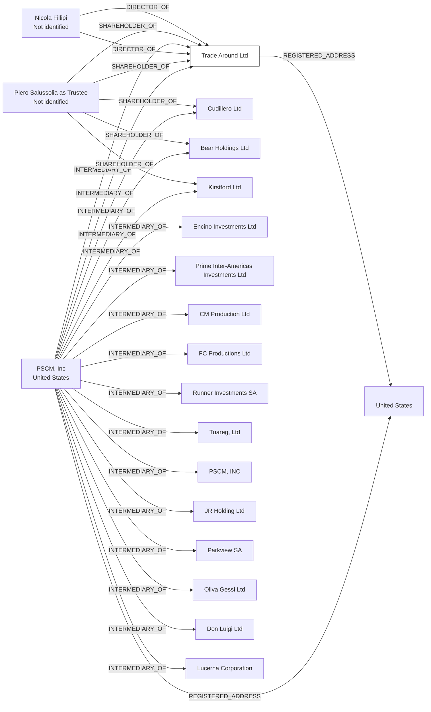

#Trade Around Ltd.
Company_Type: Standard Company under IBC Act
Status: Dead
Address: P.S.C.M., Inc. Piero Salussolia Corporate Management, Inc. 1548 Brickell Avenue Miami, Fl 33129 RT BVI

##Incoming
DIRECTOR
Nicola Fillipi
Not identified

SHAREHOLDER
Piero Salussolia as Trustee
Not identified

INTERMEDIARY
P.S.C.M., Inc.
United States

##Outgoing
REGISTERED_ADDRESSP.S.C.M., Inc. Piero Salussolia Corporate Management, Inc. 1548 Brickell Avenue Miami, Fl 33129
United States

##Graph
