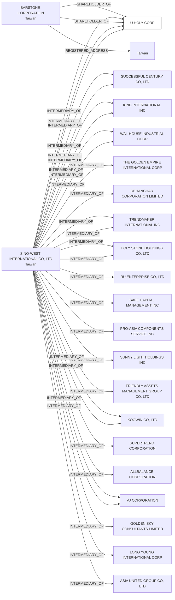

#U HOLY CORP.
Status: Defaulted
Address: SINO-WEST INTERNATIONAL CO.; LTD. 3F-6; NO. 36; SEC.3  MINSHENG E. ROAD TAIPEI; TAIWAN; R.O.C.

##Incoming
SHAREHOLDER
BARSTONE CORPORATION
Taiwan

INTERMEDIARY
SINO-WEST INTERNATIONAL CO., LTD.
SINO-WEST INTERNATIONAL CO.; LTD. 3F-6; NO. 36; SEC.3  MINSHENG E. ROAD TAIPEI; TAIWAN; R.O.C.
Taiwan

##Graph
