#U SERVICE S.A.
Status: Defaulted
Address: VARDIKOS & VARDIKOS LTD ANDREAS AVRAAMIDES; 61; STROVOLOS; 2024 NICOSIA (LEFKOSA) CYPRUS

##Incoming
INTERMEDIARY
VARDIKOS & VARDIKOS
VARDIKOS & VARDIKOS 61 ANDREA AVRAAMIDI STREET CY2024 NICOSIA, REPUBLIC OF CYPRUS NICOSIA (LEFKOSA) CYPRUS
Cyprus;Greece

##Graph

```mermaid
graph LR
classDef outline fill:#fff,stroke:#000,stroke-width:1px;
node1[U SERVICE SA<br>]
node2[VARDIKOS & VARDIKOS<br>Cyprus Greece]
node2-->|INTERMEDIARY_OF|node1
class node1 outline
node3[H & A SHIPPING ENTERPRISES SA<br>]
node2-->|INTERMEDIARY_OF|node3
node4[ARIEXPO COMPAÑIA NAVIERA, SA<br>]
node2-->|INTERMEDIARY_OF|node4
node5[ALVIA HOLDINGS SA<br>]
node2-->|INTERMEDIARY_OF|node5
node6[BELVIA HOLDINGS SA<br>]
node2-->|INTERMEDIARY_OF|node6
node7[LOWLANDS ASSOCIATES INC<br>]
node2-->|INTERMEDIARY_OF|node7
node8[ODLIN OVERSEAS CORP<br>]
node2-->|INTERMEDIARY_OF|node8
node9[CLEWY ENTERPRISES SA<br>]
node2-->|INTERMEDIARY_OF|node9
node10[SUNBARN INC<br>]
node2-->|INTERMEDIARY_OF|node10
node11[MYRIAD HOLDINGS SA<br>]
node2-->|INTERMEDIARY_OF|node11
node12[EDEM HOLDINGS ENTERPRISE SA<br>]
node2-->|INTERMEDIARY_OF|node12
node13[RICHWAY PROPERTIES SA<br>]
node2-->|INTERMEDIARY_OF|node13
node14[VILLARS INVESTMENTS LTD<br>]
node2-->|INTERMEDIARY_OF|node14
node15[INTERNATIONAL EXCLUSIVE HOLDINGS SA<br>]
node2-->|INTERMEDIARY_OF|node15
node16[COVER SA<br>]
node2-->|INTERMEDIARY_OF|node16
node17[KOPA INVESTMENTS SA<br>]
node2-->|INTERMEDIARY_OF|node17
node18[LENNOX INTERNATIONAL SERVICES SA<br>]
node2-->|INTERMEDIARY_OF|node18
node19[ALEXANDER ENTERPRISES SA<br>]
node2-->|INTERMEDIARY_OF|node19
node20[ELSIREL ENTERPRISES SA<br>]
node2-->|INTERMEDIARY_OF|node20
node21[EXCLUSIVE PROPERTIES SA<br>]
node2-->|INTERMEDIARY_OF|node21
node22[EUROASIAN TRADING SA<br>]
node2-->|INTERMEDIARY_OF|node22
node23[BELGRAVIA PROPERTIES SA<br>]
node2-->|INTERMEDIARY_OF|node23
node24[TAURUS TRADING SA<br>]
node2-->|INTERMEDIARY_OF|node24
node25[PELERINE INTERNATIONAL CORP<br>]
node2-->|INTERMEDIARY_OF|node25
node26[OCTAGON INDUSTRIAL SA<br>]
node2-->|INTERMEDIARY_OF|node26
node27[ZENTRIS RESOURCES SA<br>]
node2-->|INTERMEDIARY_OF|node27
node28[BRONSON MANAGEMENT INC<br>]
node2-->|INTERMEDIARY_OF|node28
node29[PUTNEY HOLDING SERVICES LIMITED<br>]
node2-->|INTERMEDIARY_OF|node29
node30[OLIVIA ENTERPRISES LIMITED<br>]
node2-->|INTERMEDIARY_OF|node30
node31[RODALE FINANCIAL PROPERTIES CORPORATION<br>]
node2-->|INTERMEDIARY_OF|node31
node32[ALLEUROPEAN INVESTMENTS SA<br>]
node2-->|INTERMEDIARY_OF|node32
node33[BAY POINT MANAGEMENT LIMITED<br>]
node2-->|INTERMEDIARY_OF|node33
node34[SUNDERTON RESOURCES INC<br>]
node2-->|INTERMEDIARY_OF|node34
node35[LV INTERNATIONAL BUNKERS SA<br>]
node2-->|INTERMEDIARY_OF|node35
node36[HARDSTONE INTERNATIONAL BROKERS SA<br>]
node2-->|INTERMEDIARY_OF|node36
node37[BINGERLEY INVESTMENTS SA<br>]
node2-->|INTERMEDIARY_OF|node37
node38[COURTENAY DEVELOPMENTS INC<br>]
node2-->|INTERMEDIARY_OF|node38
node39[ESCALINA INVESTMENTS SA<br>]
node2-->|INTERMEDIARY_OF|node39
node40[PORCELA IN SA<br>]
node2-->|INTERMEDIARY_OF|node40
node41[NORDANT DEVELOPMENT SA<br>]
node2-->|INTERMEDIARY_OF|node41
node42[HARDIE TRADING CORP<br>]
node2-->|INTERMEDIARY_OF|node42
node43[MILER DEVELOPMENT INC<br>]
node2-->|INTERMEDIARY_OF|node43
node44[MILLENIUM EQUITIES SA<br>]
node2-->|INTERMEDIARY_OF|node44
node45[MEDALLION SHIPPING SA<br>]
node2-->|INTERMEDIARY_OF|node45
node46[TEMPLAR DEVELOPMENT SA<br>]
node2-->|INTERMEDIARY_OF|node46
node47[UNITED TRADITION SA<br>]
node2-->|INTERMEDIARY_OF|node47
node48[HERMES HOLDINGS SA<br>]
node2-->|INTERMEDIARY_OF|node48
node49[CRONUS EQUITIES SA<br>]
node2-->|INTERMEDIARY_OF|node49
node50[REGINA HOLDINGS SA<br>]
node2-->|INTERMEDIARY_OF|node50
node51[HELLENIC SHIPPING SERVICES SA<br>]
node2-->|INTERMEDIARY_OF|node51
node52[COMBINED DEVELOPMENT & ENTERPRISES SA<br>]
node2-->|INTERMEDIARY_OF|node52
node53[PROACTIVE VENTURES SA<br>]
node2-->|INTERMEDIARY_OF|node53
node54[SPENDEX MANAGEMENT CORP<br>]
node2-->|INTERMEDIARY_OF|node54
node55[RAVINE DEVELOPMENT SA<br>]
node2-->|INTERMEDIARY_OF|node55
node2-->|INTERMEDIARY_OF|node1
node56[BELLEGROVE DEVELOPMENTS INC<br>]
node2-->|INTERMEDIARY_OF|node56
node57[PASTNER CORP<br>]
node2-->|INTERMEDIARY_OF|node57
node58[MINERVA HOLDINGS & EQUITIES SA<br>]
node2-->|INTERMEDIARY_OF|node58
node59[GALAWAY INVESTMENTS SA<br>]
node2-->|INTERMEDIARY_OF|node59
node60[NISPER MANAGEMENT CORP<br>]
node2-->|INTERMEDIARY_OF|node60
node61[MOREL ENTERPRISES SA<br>]
node2-->|INTERMEDIARY_OF|node61
node62[PRINCESS DEVELOPMENT SA<br>]
node2-->|INTERMEDIARY_OF|node62
node63[CLAPTON ENTERPRISES SA<br>]
node2-->|INTERMEDIARY_OF|node63
node64[BELVEDERE EQUITIES SA<br>]
node2-->|INTERMEDIARY_OF|node64
node65[LITEMI SA<br>]
node2-->|INTERMEDIARY_OF|node65
node66[YARLING HOLDINGS SA<br>]
node2-->|INTERMEDIARY_OF|node66
node67[PRINCESS ASSOCIATES SA<br>]
node2-->|INTERMEDIARY_OF|node67
node68[POMMEL HOLDINGS INC<br>]
node2-->|INTERMEDIARY_OF|node68
node69[BUCKSLAND INTERNATIONAL SA<br>]
node2-->|INTERMEDIARY_OF|node69
node70[ARIADNE ENTERPRISES SA<br>]
node2-->|INTERMEDIARY_OF|node70
node71[UPTREND INVESTMENT COMPANY SA<br>]
node2-->|INTERMEDIARY_OF|node71
node72[EDUCATIONAL VENTURES SA<br>]
node2-->|INTERMEDIARY_OF|node72
node73[RAMSAY COMPANY SA<br>]
node2-->|INTERMEDIARY_OF|node73
```
