#ULTRA STAR HOLDINGS S.A.
Status: Defaulted
Address: DCA CONTADORES & ASOCIADOS SARANDI 693, PISO 3 11000 MONTEVIDEO URUGUAY

##Incoming
INTERMEDIARY
DCA CONTADORES & ASOCIADOS
DCA CONTADORES & ASOCIADOS SARANDI 693, PISO 3 CASILLA DE CORREO 1271 11000 MONTEVIDEO URUGUAY
Uruguay

##Graph

```mermaid
graph LR
classDef outline fill:#fff,stroke:#000,stroke-width:1px;
node1[ULTRA STAR HOLDINGS SA<br>]
node2[DCA CONTADORES & ASOCIADOS<br>Uruguay]
node2-->|INTERMEDIARY_OF|node1
class node1 outline
node3[ZERO SYSTEMS CORPORATION<br>]
node2-->|INTERMEDIARY_OF|node3
node4[KENNIX ENTERPRISE LTD<br>]
node2-->|INTERMEDIARY_OF|node4
node5[ONYX COMPANY PORTFOLIO LTD<br>]
node2-->|INTERMEDIARY_OF|node5
node6[RENZO TEAM CORPORATION<br>]
node2-->|INTERMEDIARY_OF|node6
node7[ASPENT PORTFOLIO SA<br>]
node2-->|INTERMEDIARY_OF|node7
node8[ROCKING HOLDING CORP<br>]
node2-->|INTERMEDIARY_OF|node8
node9[DALIA PORTFOLIO SA<br>]
node2-->|INTERMEDIARY_OF|node9
node10[SUMERSET OVERSEAS, SA<br>]
node2-->|INTERMEDIARY_OF|node10
node11[ROCKFORD HOLDING GROUP SA<br>]
node2-->|INTERMEDIARY_OF|node11
node12[CUSPIDE CONSULTANTS INC<br>]
node2-->|INTERMEDIARY_OF|node12
node13[CEZANNE DEVELOPMENT HOLDINGS INC<br>]
node2-->|INTERMEDIARY_OF|node13
node14[Melrose Company Solutions Limited<br>]
node2-->|INTERMEDIARY_OF|node14
node15[OPHELIA HOLDINGS DEVELOPMENT LTD<br>]
node2-->|INTERMEDIARY_OF|node15
node16[BOATERS & SONS LTD<br>]
node2-->|INTERMEDIARY_OF|node16
node17[ONSITE HOLDINGS LIMITED<br>]
node2-->|INTERMEDIARY_OF|node17
node18[ADEN COMMERCIAL SERVICES INC<br>]
node2-->|INTERMEDIARY_OF|node18
node19[NIPAL INTERNATIONAL DEVELOPMENT CORP<br>]
node2-->|INTERMEDIARY_OF|node19
node20[LEXTER HOLDING SERVICES INC<br>]
node2-->|INTERMEDIARY_OF|node20
node21[TANSEY ENTERPRISE LTD<br>]
node2-->|INTERMEDIARY_OF|node21
node22[NORTHSIDE ASSOCIATES INC<br>]
node2-->|INTERMEDIARY_OF|node22
node23[MERCURIO ASSETS INTERNATIONAL INC<br>]
node2-->|INTERMEDIARY_OF|node23
node24[PORT LEGEND CORPORATION<br>]
node2-->|INTERMEDIARY_OF|node24
node25[Frontier Designs Corporation<br>]
node2-->|INTERMEDIARY_OF|node25
node26[QUADRIC INDUSTRIAL GROUP SA<br>]
node2-->|INTERMEDIARY_OF|node26
node27[SUNSPOT MILLS LIMITED<br>]
node2-->|INTERMEDIARY_OF|node27
node28[FIDENT PARK LTD<br>]
node2-->|INTERMEDIARY_OF|node28
node29[QUEST UNIVERSAL LTD<br>]
node2-->|INTERMEDIARY_OF|node29
node30[RODALE HOLDINGS LTD<br>]
node2-->|INTERMEDIARY_OF|node30
node31[LUCILA MANAGEMENT CORP<br>]
node2-->|INTERMEDIARY_OF|node31
node32[METRO CONSULTING PTY SA<br>]
node2-->|INTERMEDIARY_OF|node32
node33[BLUE STAR CONSULTING LIMITED<br>]
node2-->|INTERMEDIARY_OF|node33
node34[GREENLAND DOVE CONSULTING LIMITED<br>]
node2-->|INTERMEDIARY_OF|node34
node35[RIDETON MANAGEMENT CORP<br>]
node2-->|INTERMEDIARY_OF|node35
node36[DUNROSS CAPITAL INC<br>]
node2-->|INTERMEDIARY_OF|node36
node37[OPEN GROUP TRADING COMPANY, SA<br>]
node2-->|INTERMEDIARY_OF|node37
node38[GENERAL CORPORATE SERVICES GROUP LTD<br>]
node2-->|INTERMEDIARY_OF|node38
node39[PYMORE VENTURES HOLDING SA<br>]
node2-->|INTERMEDIARY_OF|node39
node40[HILLBEST FINANCIAL LTD<br>]
node2-->|INTERMEDIARY_OF|node40
node41[KENTISH GROUP CORP<br>]
node2-->|INTERMEDIARY_OF|node41
node42[CHAUNCEY HOLDINGS INC<br>]
node2-->|INTERMEDIARY_OF|node42
node43[QUAYLE CAPITAL SA<br>]
node2-->|INTERMEDIARY_OF|node43
node44[ORIGINAL CORPORATION<br>]
node2-->|INTERMEDIARY_OF|node44
node45[SURPLAY FINANCIAL LTD<br>]
node2-->|INTERMEDIARY_OF|node45
node46[AGATHUS TYCHE SA<br>]
node2-->|INTERMEDIARY_OF|node46
node47[HLB INTERNATIONAL SERVICES SA<br>]
node2-->|INTERMEDIARY_OF|node47
node48[KEARTON FINANCE SA<br>]
node2-->|INTERMEDIARY_OF|node48
node49[AVERLEY HOLDINGS INC<br>]
node2-->|INTERMEDIARY_OF|node49
node50[COLUMBIA SERVICES INC<br>]
node2-->|INTERMEDIARY_OF|node50
node51[ALAMEDA SA<br>]
node2-->|INTERMEDIARY_OF|node51
node52[BLUE TRADING CAPITAL SA<br>]
node2-->|INTERMEDIARY_OF|node52
node53[SANDSEA PORTFOLIO LIMITED<br>]
node2-->|INTERMEDIARY_OF|node53
node54[ASPENT COMPANY LTD<br>]
node2-->|INTERMEDIARY_OF|node54
node55[STARK PROPERTIES LTD<br>]
node2-->|INTERMEDIARY_OF|node55
node56[INTI GLOBAL LTD<br>]
node2-->|INTERMEDIARY_OF|node56
node57[STRATHCONON ASSETS SA<br>]
node2-->|INTERMEDIARY_OF|node57
node58[JOELLE PROPERTIES CORP<br>]
node2-->|INTERMEDIARY_OF|node58
node59[SOUTH BROTHERS BLUE SKY LTD<br>]
node2-->|INTERMEDIARY_OF|node59
node60[DANAE ALLIANCE COMPANY SA<br>]
node2-->|INTERMEDIARY_OF|node60
node61[SHAFIR HOLDING SA<br>]
node2-->|INTERMEDIARY_OF|node61
node62[ORION ALLIANCE CORPORATION SA<br>]
node2-->|INTERMEDIARY_OF|node62
node63[ALTAMIRA GLOBAL HOLDING SA<br>]
node2-->|INTERMEDIARY_OF|node63
node64[Distribuidora Rioplatense SA<br>]
node2-->|INTERMEDIARY_OF|node64
node65[Distribuidora Comercial del Sur SA<br>]
node2-->|INTERMEDIARY_OF|node65
node66[SURELYS CORPORATION<br>]
node2-->|INTERMEDIARY_OF|node66
node67[DUNLEY GROUP INC<br>]
node2-->|INTERMEDIARY_OF|node67
node68[ARTWAY LTD<br>]
node2-->|INTERMEDIARY_OF|node68
node69[MARTINSON COMPANY LIMITED<br>]
node2-->|INTERMEDIARY_OF|node69
node70[COMPTEX ENTERPRISES INC<br>]
node2-->|INTERMEDIARY_OF|node70
node71[ATOLL SERVICES GROUP INC<br>]
node2-->|INTERMEDIARY_OF|node71
node72[MERCOSUR CONSULTING & LOGISTICS GROUP LTD<br>]
node2-->|INTERMEDIARY_OF|node72
node73[MONASCRON INCORPORATED<br>]
node2-->|INTERMEDIARY_OF|node73
node74[PORT ISLAND INTERNATIONAL CORPORATION<br>]
node2-->|INTERMEDIARY_OF|node74
node75[KENNINGTON TRADING GROUP CORP<br>]
node2-->|INTERMEDIARY_OF|node75
node2-->|INTERMEDIARY_OF|node1
node76[SIENA ENTERPRISE, SA<br>]
node2-->|INTERMEDIARY_OF|node76
node77[SUMMERHILL OVERSEAS SA<br>]
node2-->|INTERMEDIARY_OF|node77
node78[ORMEL EQUITIES INC<br>]
node2-->|INTERMEDIARY_OF|node78
node79[CAP LOREN PANAMA SA<br>]
node2-->|INTERMEDIARY_OF|node79
node80[SODAY CORP<br>]
node2-->|INTERMEDIARY_OF|node80
node81[BLUEFLOWER GLOBAL LTD<br>]
node2-->|INTERMEDIARY_OF|node81
node82[ENYA COMPANY DEVELOPMENT LTD<br>]
node2-->|INTERMEDIARY_OF|node82
```
