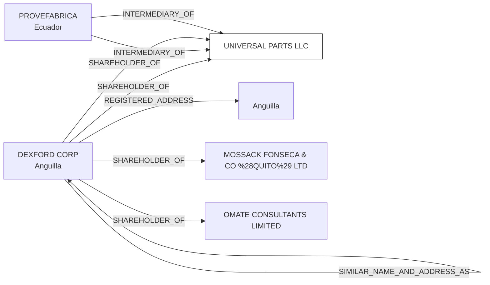

#UNIVERSAL PARTS LLC
Status: Active
Address: PROVEFABRICA C. C. PLAZA DEL RANCHO AV. EUGENIO ESPEJO 2410 Y RINCÓN DEL VALLE  BLQ 1; PISO 1; OFC 103 MIRAVALLE (VÍA TANDA) CUMBAYA-ECUADOR

##Incoming
SHAREHOLDER
DEXFORD CORP.
Anguilla

INTERMEDIARY
PROVEFABRICA
Ecuador

##Graph
