#URBAN DESIGN INTERNATIONAL, INC.
Status: Defaulted
Address: MOSSFON CORPORATE SERVICES (BERMUDA) LIMITED P.O. BOX CR 35 CRAWL CRBX HAMILTON PARISH BERMUDA *S.I.*

##Incoming
INTERMEDIARY
MOSSFON CORPORATE SERVICES (BERMUDA) LIMITED
MOSSFON CORPORATE SERVICES (BERMUDA) LIMITED P.O. BOX CR 35 CRAWL CRBX HAMILTON PARISH BERMUDA *S.I.*
Bermuda

##Graph

```mermaid
graph LR
classDef outline fill:#fff,stroke:#000,stroke-width:1px;
node1[URBAN DESIGN INTERNATIONAL, INC<br>]
node2[MOSSFON CORPORATE SERVICES %28BERMUDA%29 LIMITED<br>Bermuda]
node2-->|INTERMEDIARY_OF|node1
class node1 outline
node3[FRESH FLOWERS INTERNATIONAL LIMITED<br>]
node2-->|INTERMEDIARY_OF|node3
node4[WELL BAY CONSULTING LIMITED<br>]
node2-->|INTERMEDIARY_OF|node4
node5[THE LEARNING CENTRE LIMITED<br>]
node2-->|INTERMEDIARY_OF|node5
node6[RASBERRY PACIFIC LTD<br>]
node2-->|INTERMEDIARY_OF|node6
node7[WALK WAY SERVICES LIMITED<br>]
node2-->|INTERMEDIARY_OF|node7
node8[BLOSSOM BAY HOLDINGS LIMITED<br>]
node2-->|INTERMEDIARY_OF|node8
node9[CASTLE BRIDGE CONSULTING LIMITED<br>]
node2-->|INTERMEDIARY_OF|node9
node10[WRANGLER INVESTMENTS SERVICES LTD<br>]
node2-->|INTERMEDIARY_OF|node10
node11[ROUGEBERRY INVESTMENTS LIMITED<br>]
node2-->|INTERMEDIARY_OF|node11
node12[HOUR GLASS INTERNATIONAL LIMITED<br>]
node2-->|INTERMEDIARY_OF|node12
node13[NEWCOURT HOLDINGS LIMITED<br>]
node2-->|INTERMEDIARY_OF|node13
node14[ECOTECH LIMITED<br>]
node2-->|INTERMEDIARY_OF|node14
node15[TOWNHILL CONSULTANTS LIMITED<br>]
node2-->|INTERMEDIARY_OF|node15
node16[FLOWERS TRADING LTD<br>]
node2-->|INTERMEDIARY_OF|node16
node17[SAMSA INTERNATIONAL LIMITED<br>]
node2-->|INTERMEDIARY_OF|node17
node18[MULTINATIONAL OVERSEAS INVESTMENTS LIMITED<br>]
node2-->|INTERMEDIARY_OF|node18
node19[NORIMET TRADING LIMITED<br>]
node2-->|INTERMEDIARY_OF|node19
node20[TATMUS DEVELOPMENTS LIMITED<br>]
node2-->|INTERMEDIARY_OF|node20
node21[INTERCARE LIMITED<br>]
node2-->|INTERMEDIARY_OF|node21
node22[INEY, INC<br>]
node2-->|INTERMEDIARY_OF|node22
node23[NEW PLYMOUTH INVESTMENTS GROUP LTD<br>]
node2-->|INTERMEDIARY_OF|node23
node24[BANDEROLE INTERNATIONAL LTD<br>]
node2-->|INTERMEDIARY_OF|node24
node25[TATTOO DEVELOPMENTS LIMITED<br>]
node2-->|INTERMEDIARY_OF|node25
node26[CAESAREA INC<br>]
node2-->|INTERMEDIARY_OF|node26
node27[AL-AREEN GULF TRADING & INVESTMENTS LIMITED<br>]
node2-->|INTERMEDIARY_OF|node27
node28[NOBLE EXPLORER LTD<br>]
node2-->|INTERMEDIARY_OF|node28
node29[HOLLOWEY INTERNATIONAL LTD<br>]
node2-->|INTERMEDIARY_OF|node29
node30[FAIRYLAND PROPERTIES LIMITED<br>]
node2-->|INTERMEDIARY_OF|node30
node2-->|INTERMEDIARY_OF|node1
node31[JUNE FOX LTD<br>]
node2-->|INTERMEDIARY_OF|node31
node32[FOREST STAR INTERNATIONAL LTD<br>]
node2-->|INTERMEDIARY_OF|node32
node33[COLUMBUS GROUP SERVICE INCORPORATED<br>]
node2-->|INTERMEDIARY_OF|node33
node34[MEAD GROUP LTD<br>]
node2-->|INTERMEDIARY_OF|node34
node35[CHESTERFIELD COMMERCIAL LTD<br>]
node2-->|INTERMEDIARY_OF|node35
node36[QUADRANT SERVICES INTERNATIONAL LTD<br>]
node2-->|INTERMEDIARY_OF|node36
node37[POSTIER INTERNATIONAL, INC<br>]
node2-->|INTERMEDIARY_OF|node37
node38[TETRAGON ENTERPRISES LTD<br>]
node2-->|INTERMEDIARY_OF|node38
node39[MATCHLESS TRADING INC<br>]
node2-->|INTERMEDIARY_OF|node39
node40[HELIANTHUS LTD<br>]
node2-->|INTERMEDIARY_OF|node40
node41[KILMARNOCK INVESTMENTS LTD<br>]
node2-->|INTERMEDIARY_OF|node41
node42[PHOENIX INVESTMENT FINANCE LIMITED<br>]
node2-->|INTERMEDIARY_OF|node42
node43[BEDROCK ENTERPRISES LTD<br>]
node2-->|INTERMEDIARY_OF|node43
node44[FRANMILL BENEVOLENT COMPANY LIMITED<br>]
node2-->|INTERMEDIARY_OF|node44
node45[LIVERPOOL GROUP SERVICES INC<br>]
node2-->|INTERMEDIARY_OF|node45
node46[JINGLE INTERNATIONAL LTD<br>]
node2-->|INTERMEDIARY_OF|node46
node47[HORNCHURCH ASSOCIATES LTD<br>]
node2-->|INTERMEDIARY_OF|node47
node48[ASCENT MANAGEMENT LIMITED<br>]
node2-->|INTERMEDIARY_OF|node48
node49[NELSON TRADING INVESTMENTS LTD<br>]
node2-->|INTERMEDIARY_OF|node49
node50[MAIDA VALE ENTERPRISES LTD<br>]
node2-->|INTERMEDIARY_OF|node50
node51[W & N SURVEYS LIMITED<br>]
node2-->|INTERMEDIARY_OF|node51
node52[KACICE LTD<br>]
node2-->|INTERMEDIARY_OF|node52
node53[WHITE TIGER INTERNATIONAL, LTD<br>]
node2-->|INTERMEDIARY_OF|node53
node54[WALDEN ASSOCIATES, LTD<br>]
node2-->|INTERMEDIARY_OF|node54
node55[BLAKE INDUSTRIES   GMBH<br>]
node2-->|INTERMEDIARY_OF|node55
node56[INGLEWOOD ENTERPRISES INC<br>]
node2-->|INTERMEDIARY_OF|node56
node57[FALMOUTH PROPERTIES LTD<br>]
node2-->|INTERMEDIARY_OF|node57
node58[SUNSPRITE LIMITED<br>]
node2-->|INTERMEDIARY_OF|node58
node59[WHITE STAR INVESTMENTS, LTD<br>]
node2-->|INTERMEDIARY_OF|node59
node60[MIRAGE CAPITAL MANAGEMENT, LTD<br>]
node2-->|INTERMEDIARY_OF|node60
node61[PETROSSIAN INTERESTS, LTD<br>]
node2-->|INTERMEDIARY_OF|node61
node62[OLDROAD INTERNATIONAL INC<br>]
node2-->|INTERMEDIARY_OF|node62
node63[SUMMITT INTERNATIONAL GROUP LIMITED<br>]
node2-->|INTERMEDIARY_OF|node63
node64[BILYNDAC LTD<br>]
node2-->|INTERMEDIARY_OF|node64
node65[TOWER BRIDGE SERVICES LIMITED<br>]
node2-->|INTERMEDIARY_OF|node65
node66[HOSTALES DE MERCOSUR SA<br>]
node2-->|INTERMEDIARY_OF|node66
node67[GOLDWELL MANAGEMENT LTD<br>]
node2-->|INTERMEDIARY_OF|node67
node68[DESERT STAR INTERNATIONAL LTD<br>]
node2-->|INTERMEDIARY_OF|node68
node69[INTEXCO INVESTMENTS GROUP LTD<br>]
node2-->|INTERMEDIARY_OF|node69
node70[MILIEU LTD<br>]
node2-->|INTERMEDIARY_OF|node70
```
