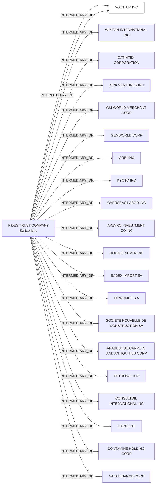

#WAKE UP INC.
Status: Dissolved
Address: FIDES TRUST COMPANY BUOBENMATT 2 6003 LUCERNE SWITZERLAND

##Incoming
INTERMEDIARY
FIDES TRUST COMPANY
Switzerland

##Graph

```mermaid
graph LR
classDef outline fill:#fff,stroke:#000,stroke-width:1px;
node1[WAKE UP INC<br>]
node2[FIDES TRUST COMPANY<br>Switzerland]
node2-->|INTERMEDIARY_OF|node1
class node1 outline
node3[WINTON INTERNATIONAL INC<br>]
node2-->|INTERMEDIARY_OF|node3
node4[CATINTEX CORPORATION<br>]
node2-->|INTERMEDIARY_OF|node4
node5[KIRK VENTURES INC<br>]
node2-->|INTERMEDIARY_OF|node5
node6[WM WORLD MERCHANT CORP<br>]
node2-->|INTERMEDIARY_OF|node6
node7[GEMWORLD CORP<br>]
node2-->|INTERMEDIARY_OF|node7
node8[ORBI INC<br>]
node2-->|INTERMEDIARY_OF|node8
node9[KYOTO INC<br>]
node2-->|INTERMEDIARY_OF|node9
node10[OVERSEAS LABOR INC<br>]
node2-->|INTERMEDIARY_OF|node10
node11[AVEYRO INVESTMENT CO INC<br>]
node2-->|INTERMEDIARY_OF|node11
node12[DOUBLE SEVEN INC<br>]
node2-->|INTERMEDIARY_OF|node12
node13[SADEX IMPORT SA<br>]
node2-->|INTERMEDIARY_OF|node13
node14[NIPROMEX S A<br>]
node2-->|INTERMEDIARY_OF|node14
node15[SOCIETE NOUVELLE DE CONSTRUCTION SA<br>]
node2-->|INTERMEDIARY_OF|node15
node16[ARABESQUE,CARPETS AND ANTIQUITIES CORP<br>]
node2-->|INTERMEDIARY_OF|node16
node2-->|INTERMEDIARY_OF|node1
node17[PETRONAL INC<br>]
node2-->|INTERMEDIARY_OF|node17
node18[CONSULTOIL INTERNATIONAL INC<br>]
node2-->|INTERMEDIARY_OF|node18
node19[EXIND INC<br>]
node2-->|INTERMEDIARY_OF|node19
node20[CONTAMINE HOLDING CORP<br>]
node2-->|INTERMEDIARY_OF|node20
node21[NAJA FINANCE CORP<br>]
node2-->|INTERMEDIARY_OF|node21
```