#YING FAT DEVELOPMENT COMPANY LIMITED
Status: Defaulted
Address: BEST CORPORATE SERVICES CONSULTING COMPANY LIMITED ROOM 1002; 10TH FLOOR TAI YAU BUILDING 181 JOHNSTON ROAD; WANCHAI HONG KONG

##Incoming
SHAREHOLDER
CHI Man Shing
Hong Kong

INTERMEDIARY
BEST CORPORATE SERVICES CONSULTING COMPANY LIMITED
BEST CORPORATE SERVICES CONSULTING COMPANY LIMITED ROOM 1002; 10TH FLOOR TAI YAU BUILDING 181 JOHNSTON ROAD; WANCHAI HONG KONG
Hong Kong

##Graph

```mermaid
graph LR
classDef outline fill:#fff,stroke:#000,stroke-width:1px;
node1[YING FAT DEVELOPMENT COMPANY LIMITED<br>]
node2[CHI Man Shing<br>Hong Kong]
node2-->|SHAREHOLDER_OF|node1
node3[BEST CORPORATE SERVICES CONSULTING COMPANY LIMITED<br>Hong Kong]
node3-->|INTERMEDIARY_OF|node1
class node1 outline
node4[<br>Hong Kong]
node2-->|REGISTERED_ADDRESS|node4
node2-->|SHAREHOLDER_OF|node1
node5[NORTEL TECHNOLOGIES LIMITED<br>]
node3-->|INTERMEDIARY_OF|node5
node6[GOLD FULL GROUP LTD<br>]
node3-->|INTERMEDIARY_OF|node6
node7[PERPETUITY ENTERPRISE LIMITED<br>]
node3-->|INTERMEDIARY_OF|node7
node8[BRIGHT HARVEST GROUP LIMITED<br>]
node3-->|INTERMEDIARY_OF|node8
node9[ENDLESS GAIN INTERNATIONAL LTD<br>]
node3-->|INTERMEDIARY_OF|node9
node10[RAVTEX INTERNATIONAL LIMITED<br>]
node3-->|INTERMEDIARY_OF|node10
node11[WAY WON INTERNATIONAL CO LIMITED<br>]
node3-->|INTERMEDIARY_OF|node11
node12[SHUN KING HOLDINGS LTD<br>]
node3-->|INTERMEDIARY_OF|node12
node13[TIME MASTER CO LIMITED<br>]
node3-->|INTERMEDIARY_OF|node13
node14[FOUR SM CO LIMITED<br>]
node3-->|INTERMEDIARY_OF|node14
node15[YING FAT SHOES FACTORY CO LIMITED<br>]
node3-->|INTERMEDIARY_OF|node15
node16[DH BRASS INTERNATIONAL LIMITED<br>]
node3-->|INTERMEDIARY_OF|node16
node17[GRAND LOYAL LIMITED<br>]
node3-->|INTERMEDIARY_OF|node17
node18[WAIGO INTERNATIONAL LIMITED<br>]
node3-->|INTERMEDIARY_OF|node18
node19[BALI TECHNOLOGY CORP<br>]
node3-->|INTERMEDIARY_OF|node19
node20[XU SUN HONG KONG%29 CO LIMITED<br>]
node3-->|INTERMEDIARY_OF|node20
node21[FORTRESS TRADING LTD<br>]
node3-->|INTERMEDIARY_OF|node21
node22[YUE LI INTERNATIONAL CO LIMITED<br>]
node3-->|INTERMEDIARY_OF|node22
node23[TEXTILE INC<br>]
node3-->|INTERMEDIARY_OF|node23
node24[ZHAN QUN INTERNATIONAL CO LIMITED<br>]
node3-->|INTERMEDIARY_OF|node24
node25[TB RESOURCES HOLDINGS LIMITED<br>]
node3-->|INTERMEDIARY_OF|node25
node26[SENSTAR ENTERPRISE LIMITED<br>]
node3-->|INTERMEDIARY_OF|node26
node27[TESTO INTERNATIONAL LTD<br>]
node3-->|INTERMEDIARY_OF|node27
node28[SINO-DIGITECH LIMITED<br>]
node3-->|INTERMEDIARY_OF|node28
node29[GLORY FORTUNE DEVELOPMENT LTD<br>]
node3-->|INTERMEDIARY_OF|node29
node30[SINO-DIGITECH HOLDINGS LIMITED<br>]
node3-->|INTERMEDIARY_OF|node30
node31[SUN LIGHT DEVELOPMENT LTD<br>]
node3-->|INTERMEDIARY_OF|node31
node32[TEXTILE WORKS LIMITED<br>]
node3-->|INTERMEDIARY_OF|node32
node33[GLORY INTERNATIONAL HOLDINGS LTD<br>]
node3-->|INTERMEDIARY_OF|node33
node34[JAZZ INTERNATIONAL LIMITED<br>]
node3-->|INTERMEDIARY_OF|node34
node35[SINO-RESOURCE IMP & EXP CO, LTD<br>]
node3-->|INTERMEDIARY_OF|node35
node36[BARCLAYS ENTERPRISES LTD<br>]
node3-->|INTERMEDIARY_OF|node36
node37[HARTON CONSULTING CO LIMITED<br>]
node3-->|INTERMEDIARY_OF|node37
node3-->|INTERMEDIARY_OF|node15
node38[ENRICH INTERNATIONAL CO LIMITED<br>]
node3-->|INTERMEDIARY_OF|node38
node39[JUNEYIH ENTERPRISE CO, LTD<br>]
node3-->|INTERMEDIARY_OF|node39
node40[ARTS SHOES CO LIMITED<br>]
node3-->|INTERMEDIARY_OF|node40
node41[LAND WELL INTERNATIONAL INVESTMENT CO LTD<br>]
node3-->|INTERMEDIARY_OF|node41
node42[MUELLAR FORGING CO INC<br>]
node3-->|INTERMEDIARY_OF|node42
node43[Simon Carmichael International Investment Company Limited<br>]
node3-->|INTERMEDIARY_OF|node43
node44[CYBERCOMM INTERNATIONAL LTD<br>]
node3-->|INTERMEDIARY_OF|node44
node45[VAST LIGHT INDUSTRIAL LIMITED<br>]
node3-->|INTERMEDIARY_OF|node45
node46[YING FUNG DEVELOPMENT LIMITED<br>]
node3-->|INTERMEDIARY_OF|node46
node47[AKO GROUP LIMITED<br>]
node3-->|INTERMEDIARY_OF|node47
node48[AK PLASTICTECH RECYCLING MANUFACTURING SDN BHD<br>]
node3-->|INTERMEDIARY_OF|node48
node49[ADVANCE TECH GROUP LTD<br>]
node3-->|INTERMEDIARY_OF|node49
node50[OPAL LAKE INVESTMENT LIMITED<br>]
node3-->|INTERMEDIARY_OF|node50
node51[HARMONY HOLDINGS LTD<br>]
node3-->|INTERMEDIARY_OF|node51
node52[GALILEO INVESTMENT LIMITED<br>]
node3-->|INTERMEDIARY_OF|node52
node53[WIDE BALL INTERNATIONAL LIMITED<br>]
node3-->|INTERMEDIARY_OF|node53
node54[WEALTHY ENTERPRISE CO LIMITED<br>]
node3-->|INTERMEDIARY_OF|node54
node55[SARASWATI TRADERS LIMITED<br>]
node3-->|INTERMEDIARY_OF|node55
node56[GENTLE WAY INTERNATIONAL LTD<br>]
node3-->|INTERMEDIARY_OF|node56
node57[NEW ENERGY ELECTRONIC ENTERPRISE CO LIMITED<br>]
node3-->|INTERMEDIARY_OF|node57
node58[GREAT WORLD GARMENT HOLDINGS LIMITED<br>]
node3-->|INTERMEDIARY_OF|node58
node59[FORTUNE WAY INVESTMENT LIMITED<br>]
node3-->|INTERMEDIARY_OF|node59
node60[PERFECT STRATEGIC LIMITED<br>]
node3-->|INTERMEDIARY_OF|node60
node61[ALL BRIGHT GROUP LIMITED<br>]
node3-->|INTERMEDIARY_OF|node61
node62[PERFECT LEGEND GROUP LTD<br>]
node3-->|INTERMEDIARY_OF|node62
node63[PRIM MODE INTERNATIONAL LIMITED<br>]
node3-->|INTERMEDIARY_OF|node63
node64[DELEI FIRE CO LIMITED<br>]
node3-->|INTERMEDIARY_OF|node64
node65[BEST POWER GROUP LIMITED<br>]
node3-->|INTERMEDIARY_OF|node65
node66[CORAL VIP CLUB LIMITED<br>]
node3-->|INTERMEDIARY_OF|node66
node67[YNY ALL SEASONS LIMITED<br>]
node3-->|INTERMEDIARY_OF|node67
node68[TANG HUA ENTERPRISE CO LIMITED<br>]
node3-->|INTERMEDIARY_OF|node68
node69[S & K INVESTMENT LIMITED<br>]
node3-->|INTERMEDIARY_OF|node69
node70[YAT WAH INTERNATIONAL LIMITED<br>]
node3-->|INTERMEDIARY_OF|node70
node71[SHINING STAR MANAGEMENT LIMITED<br>]
node3-->|INTERMEDIARY_OF|node71
node72[JAYS WORLD MANAGEMENT LTD<br>]
node3-->|INTERMEDIARY_OF|node72
node73[E-PHONE GROUP %28HOLDINGS%29 LIMITED<br>]
node3-->|INTERMEDIARY_OF|node73
node74[CHESFER HOLDINGS %28 CHINA %29 LIMITED<br>]
node3-->|INTERMEDIARY_OF|node74
node75[RALY INTERNATIONAL TRADING CO, LIMITED<br>]
node3-->|INTERMEDIARY_OF|node75
node76[BEAVER HILLS INTERNATIONAL CO LIMITED<br>]
node3-->|INTERMEDIARY_OF|node76
node77[Neotech Information System Co Ltd<br>]
node3-->|INTERMEDIARY_OF|node77
node78[TUOBANG ELECTRONICS COMPANY LIMITED<br>]
node3-->|INTERMEDIARY_OF|node78
node79[AXIOM ENGINEERING LIMITED<br>]
node3-->|INTERMEDIARY_OF|node79
node80[Cottonfield  Management Limited<br>]
node3-->|INTERMEDIARY_OF|node80
node81[Li & Partners Limited<br>]
node3-->|INTERMEDIARY_OF|node81
node82[NEW SOUND DEVELOPMENT LIMITED<br>]
node3-->|INTERMEDIARY_OF|node82
node83[ANGELSEA INVESTMENTS LIMITED<br>]
node3-->|INTERMEDIARY_OF|node83
node84[SYNTECH INVESTMENT MANAGEMENT LIMITED<br>]
node3-->|INTERMEDIARY_OF|node84
node85[Whalesys Co, Ltd<br>]
node3-->|INTERMEDIARY_OF|node85
node86[ELITE CONCEPTS LIMITED<br>]
node3-->|INTERMEDIARY_OF|node86
node87[PACIFIC STARS LIMITED<br>]
node3-->|INTERMEDIARY_OF|node87
node88[UNIVERSAL WINNER INTERNATIONAL LTD<br>]
node3-->|INTERMEDIARY_OF|node88
node89[VANGELIS CONSULTING LIMITED<br>]
node3-->|INTERMEDIARY_OF|node89
node90[DI MAY LIGHTING CO, LTD<br>]
node3-->|INTERMEDIARY_OF|node90
node91[SAN WAN INTERNATIONAL LIMITED<br>]
node3-->|INTERMEDIARY_OF|node91
node92[FULL MARGIN ENTERPRISE LTD<br>]
node3-->|INTERMEDIARY_OF|node92
node93[Ultra Bright Integral Ltd<br>]
node3-->|INTERMEDIARY_OF|node93
node94[BOARD TECHNOLOGY LIMITED<br>]
node3-->|INTERMEDIARY_OF|node94
node95[DRAGON GOAL GROUP LIMITED<br>]
node3-->|INTERMEDIARY_OF|node95
node96[SAVE-MASTER CONSULTING SERVICES LTD<br>]
node3-->|INTERMEDIARY_OF|node96
node97[NEW METRO TECHNOLOGY LTD<br>]
node3-->|INTERMEDIARY_OF|node97
node98[REAL LIGHT MANAGEMENT LIMITED<br>]
node3-->|INTERMEDIARY_OF|node98
node99[PROFIT CREATION TECHNOLOGY LIMITED<br>]
node3-->|INTERMEDIARY_OF|node99
node100[GOOD RICH TECH LIMITED<br>]
node3-->|INTERMEDIARY_OF|node100
node101[GOLDEN PRESTIGE DEVELOPMENT LTD<br>]
node3-->|INTERMEDIARY_OF|node101
node102[BLING BLING INTERNATIONAL LTD<br>]
node3-->|INTERMEDIARY_OF|node102
node103[SPECIAL WEALTH CONSULTANT LIMITED<br>]
node3-->|INTERMEDIARY_OF|node103
node104[CHANG FENG HOLDINGS LIMITED<br>]
node3-->|INTERMEDIARY_OF|node104
node105[GREAT GAIN TECHNOLOGY LIMITED<br>]
node3-->|INTERMEDIARY_OF|node105
node106[De Arko International Limited<br>]
node3-->|INTERMEDIARY_OF|node106
node107[Titanli Global Holding Company Limited<br>]
node3-->|INTERMEDIARY_OF|node107
node108[KIM JUN DEVELOPMENT LIMITED<br>]
node3-->|INTERMEDIARY_OF|node108
node109[TRUE DRAGON INVESTMENTS LTD<br>]
node3-->|INTERMEDIARY_OF|node109
node110[Joint Sure Investment Company Limited<br>]
node3-->|INTERMEDIARY_OF|node110
node111[Aziana IP Consulting Co, Ltd<br>]
node3-->|INTERMEDIARY_OF|node111
node112[WORLDWIDE GLOBAL ASSET LTD<br>]
node3-->|INTERMEDIARY_OF|node112
node113[B & A Digitech Company Limited<br>]
node3-->|INTERMEDIARY_OF|node113
node114[GENIUS CHIC LTD<br>]
node3-->|INTERMEDIARY_OF|node114
node115[FOUNTAIN RICH INTERNATIONAL LIMITED<br>]
node3-->|INTERMEDIARY_OF|node115
node116[MECHILIA ENTERPRISES LIMITED<br>]
node3-->|INTERMEDIARY_OF|node116
node117[Lianyungang Yuantai Minerals Co, Ltd<br>]
node3-->|INTERMEDIARY_OF|node117
node118[EXCELLENT STEP LIMITED<br>]
node3-->|INTERMEDIARY_OF|node118
node119[JUMBO HARVEST MANAGEMENT LIMITED<br>]
node3-->|INTERMEDIARY_OF|node119
node120[FANTASTIC LILY LIMITED<br>]
node3-->|INTERMEDIARY_OF|node120
node121[SUCCESS TARGET INTERNATIONAL LTD<br>]
node3-->|INTERMEDIARY_OF|node121
node122[FOREVER WEALTH INVESTMENT LIMITED<br>]
node3-->|INTERMEDIARY_OF|node122
node123[BRIGHTON CONSULTING COMPANY LIMITED<br>]
node3-->|INTERMEDIARY_OF|node123
node124[MAYDA TECHNOLOGY LIMITED<br>]
node3-->|INTERMEDIARY_OF|node124
node3-->|INTERMEDIARY_OF|node53
node125[GLOBAL ZONE LIMITED<br>]
node3-->|INTERMEDIARY_OF|node125
node126[NICE CAPITAL TECHNOLOGY INNOVATION LIMITED<br>]
node3-->|INTERMEDIARY_OF|node126
node127[NEW SOURCES ASIA LIMITED<br>]
node3-->|INTERMEDIARY_OF|node127
node128[OUKAI SHOES CO LIMITED<br>]
node3-->|INTERMEDIARY_OF|node128
node129[GOLDEN TIGER MANAGEMENT LIMITED<br>]
node3-->|INTERMEDIARY_OF|node129
node130[WING TAK DEVELOPMENT CO LTD<br>]
node3-->|INTERMEDIARY_OF|node130
node3-->|INTERMEDIARY_OF|node123
node131[HOI SING FURNITURE CO LIMITED<br>]
node3-->|INTERMEDIARY_OF|node131
node132[CHEUNG SING TRADING COMPANY LIMITED<br>]
node3-->|INTERMEDIARY_OF|node132
node3-->|INTERMEDIARY_OF|node40
node133[HALKICHI LIMITED<br>]
node3-->|INTERMEDIARY_OF|node133
node134[LUCKY TOP ENTERPRISES LTD<br>]
node3-->|INTERMEDIARY_OF|node134
node135[NEWLINE TEXTILE CO LIMITED<br>]
node3-->|INTERMEDIARY_OF|node135
node136[GENERAL COMMERCIAL LIGHTING CO, LTD<br>]
node3-->|INTERMEDIARY_OF|node136
node137[NEW ZHONG HAN TECHNOLOGIES INC<br>]
node3-->|INTERMEDIARY_OF|node137
node138[WAH SUN HOLDINGS LTD<br>]
node3-->|INTERMEDIARY_OF|node138
node139[TOP BRIGHT LIMITED<br>]
node3-->|INTERMEDIARY_OF|node139
node3-->|INTERMEDIARY_OF|node37
node140[SKY RICH LIMITED<br>]
node3-->|INTERMEDIARY_OF|node140
node141[WAI SHING FURNITURE CO LIMITED<br>]
node3-->|INTERMEDIARY_OF|node141
node3-->|INTERMEDIARY_OF|node38
node142[MASS DRAGON LIMITED<br>]
node3-->|INTERMEDIARY_OF|node142
node143[ASIA LINK LIMITED<br>]
node3-->|INTERMEDIARY_OF|node143
node144[DAFFO INDUSTRIAL CO LIMITED<br>]
node3-->|INTERMEDIARY_OF|node144
node145[ALIBABA INDUSTRIAL CO, LIMITED<br>]
node3-->|INTERMEDIARY_OF|node145
node146[Best Source International Limited<br>]
node3-->|INTERMEDIARY_OF|node146
node3-->|INTERMEDIARY_OF|node1
node147[GOLDEN KYLIN INVESTMENT LTD<br>]
node3-->|INTERMEDIARY_OF|node147
node148[KINCO FREIGHT LTD<br>]
node3-->|INTERMEDIARY_OF|node148
node149[Hanke Electronics & Technology Co, Ltd<br>]
node3-->|INTERMEDIARY_OF|node149
node150[N S L Technology Limited<br>]
node3-->|INTERMEDIARY_OF|node150
node151[NEW FAMOUS ENTERPRISES LIMITED<br>]
node3-->|INTERMEDIARY_OF|node151
node152[PrivateMarket Holdings Limited<br>]
node3-->|INTERMEDIARY_OF|node152
node153[LINO BUSINESS LIMITED<br>]
node3-->|INTERMEDIARY_OF|node153
node3-->|INTERMEDIARY_OF|node45
node154[Wah Sing Furniture Manufacturing Company Limited<br>]
node3-->|INTERMEDIARY_OF|node154
node155[WILLEX ENTERPRISES LIMITED<br>]
node3-->|INTERMEDIARY_OF|node155
node156[CHAMPION RISE TECHNOLOGY LIMITED<br>]
node3-->|INTERMEDIARY_OF|node156
node157[iVi Capital Canada Inc<br>]
node3-->|INTERMEDIARY_OF|node157
node158[SINCEED TECHNOLOGY LIMITED<br>]
node3-->|INTERMEDIARY_OF|node158
node159[ALLIED SUCCESS INTERNATIONAL LTD<br>]
node3-->|INTERMEDIARY_OF|node159
node160[ANDES INFORMATION TECHNOLOGY SERVICES LIMITED<br>]
node3-->|INTERMEDIARY_OF|node160
node161[EASON TRADING %28INTERNATIONAL%29 CO LTD<br>]
node3-->|INTERMEDIARY_OF|node161
```
