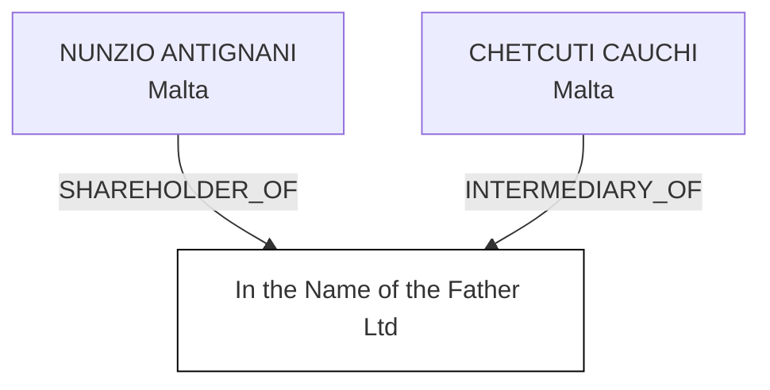

#In the Name of the Father Ltd
Status: Defaulted
Address: CCA INTERSERV LTD 120; ST. URSULA STREET; VLT 1236 VAT REG NO: MT 1734-7234 VALLETTA MALTA

--- Incoming ---
SHAREHOLDER
NUNZIO ANTIGNANI
Malta

INTERMEDIARY
CHETCUTI CAUCHI
CCA INTERSERV LTD 120; ST. URSULA STREET; VLT 1236 VAT REG NO: MT 1734-7234 VALLETTA MALTA
Malta

--- Graph ---

