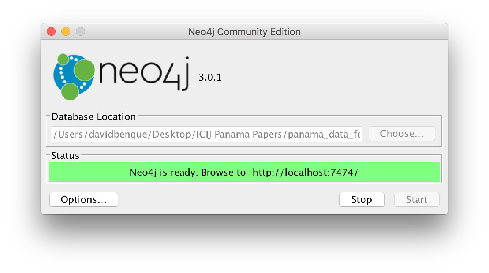

# 02-Brief Generator

The code is this folder assumes you have the [ICIJ's Neo4j database](https://offshoreleaks.icij.org/pages/database) application downloaded and running on port :7474.

 

To run the python scripts, you can replicate the conda environment with:

`conda env create -f environment.yml`

note: the datasher graphs used on the site are currently served form Amazon S3 due to the 100Mb limit on Hashbase. They will be added when we rehost at LCC MAGMD.