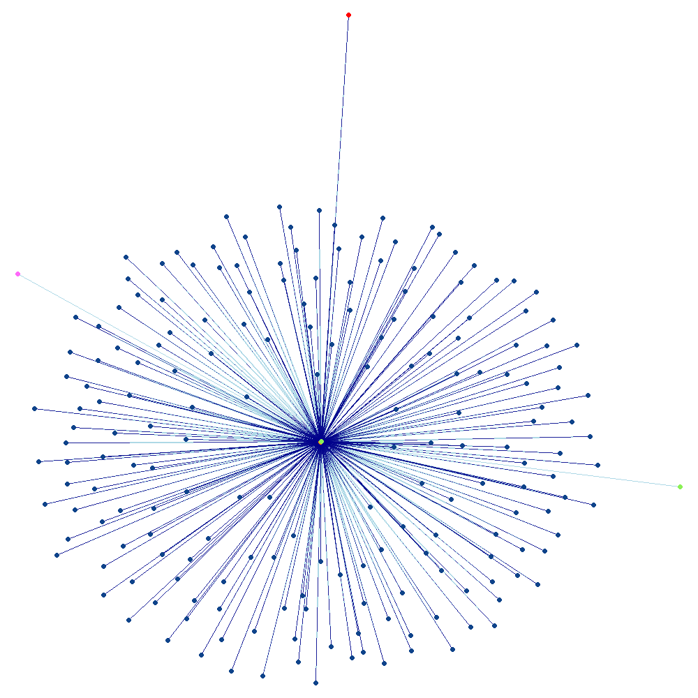

<link rel="stylesheet" type="text/css" href="../../assets/style.css">
#### [Entities of Interest](/list.html)

<link rel="stylesheet" type="text/css" href="../../assets/style.css">
#### [Entities of Interest](/list.html)

# A.C. Futures Inc.
Status: Dead
Address: Atlas Maritime Services Ltd. Ville Farm P.O. Box 9 Sark GY9 0SB Channel Is. via Guernsey

## Stakeholders
INTERMEDIARY
Atlas Maritime Services Ltd.
United Kingdom

REGISTERED_ADDRESS
Atlas Maritime Services Ltd. Ville Farm P.O. Box 9 Sark   (via Guernsey GY9 0SE) Channel Islands United Kingdom
United Kingdom

Graph Legend

• A.C. Futures Inc.
• Entities
• Intermediaries
• Officers
• Addresses

---

Graph Key

• A.C. Futures Inc.
• Entities
• Intermediaries
• Officers
• Addresses

