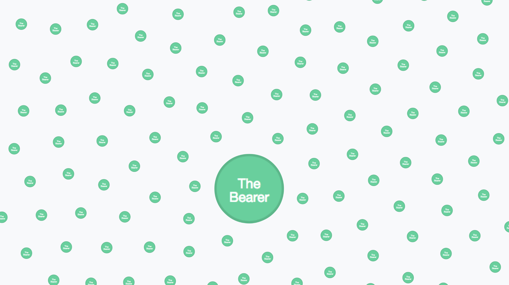

<link rel="stylesheet" type="text/css" href="../../assets/style.css">

#### [Entities of Interest](dat://ca97942d5e76114979be762b9025eb4a3e1f8e7a04b7b17f620da439800fdbbc/list.html)

_Entities of Interest_ is a publication which revisits the Panama Papers database released by the Internation Consortium of Investigative Journalists. 
it focuses on the shell companies 

The names of shell companies were selected for their evocative, poetic, or comedic qualities, and used as design briefs for creative 

It was launched on 17th June 2018 as part of [(Re)distributed Media: Leakage](https://designmuseum.org/whats-on/talks-courses-and-workshops/redistributed-media-leakage) at the Design Museum, a weekend  of talks, performances, experiments, screenings and workshops  co-curated with the [MA Graphic Media Design](magmd.uk) course at London  College of Communication (LCC).

## Contribute

### Search Tools
[ICIJ Offshore Leaks database](https://offshoreleaks.icij.org/)  
[Opencorporates](https://opencorporates.com/)  
[Companycheck](https://companycheck.co.uk/)

## References

*Entities of Interest* is based on [*SEEING-[:like]->a DIAGRAM*](http://theairpump.davidbenque.com/seeing-like-a-diagram/)  
see [project reader](https://www.are.na/david-benque-1509961916/seeing-like-a-diagram).

[*The Panama Papers: Breaking the Story of How the Rich and Powerful Hide Their Money*](https://www.frederikobermaier.com/panama-papers/)  
Book by Bastian Obermayer and Frederik Obermaier

[*Wrangling 2.6TB of data: The people and the technology behind the Panama Papers*](https://www.icij.org/blog/2016/04/data-tech-team-icij/)  
Mar Cabra

Art/Design projects about the Panama Papers and offshore finance:    
[*Loophole 4 All*](https://paolocirio.net/work/loophole-for-all)  - Paolo Cirio  
[The Great Offshore](http://rybn.org/thegreatoffshore/?ln=en&r=THE%20GREAT%20OFFSHORE) - RYBN   
[*Demystification Committee*](https://demystification.co/mmittee/)  

Other relevant links:  
[*The Download*](http://rhizome.org/editorial/tag/the-download-2), [*Urgent Archives*](https://youtu.be/XZUJA66qjf8) - Paul Soulellis  
[*Either We Inspire Or We Expire*](https://vimeo.com/129768618) - Liam Gillick and Nate Silver