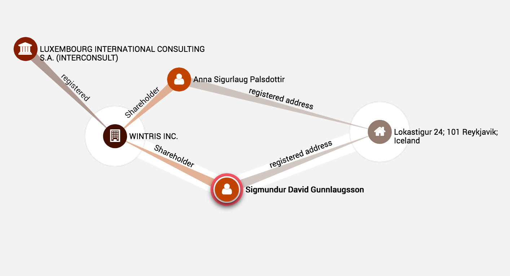
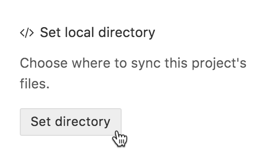
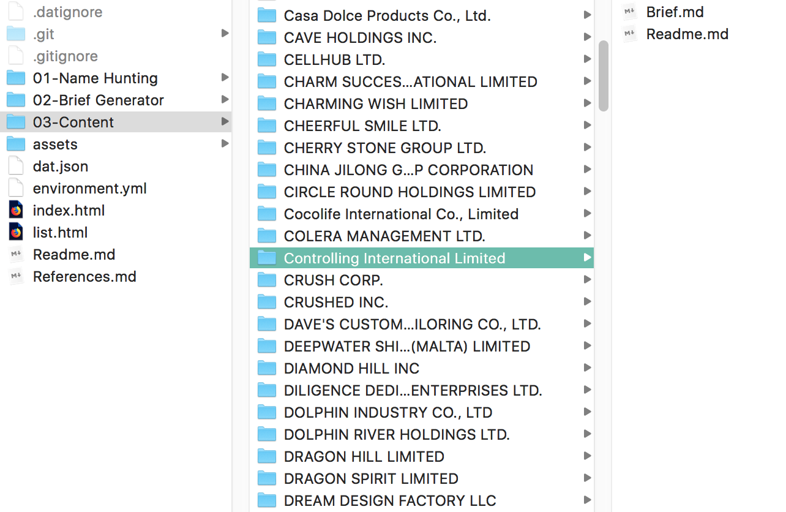

<link rel="stylesheet" type="text/css" href="assets/style.css">

#### [Entities of Interest](dat://ca97942d5e76114979be762b9025eb4a3e1f8e7a04b7b17f620da439800fdbbc/list.html)

[How to contribute](#contribute)  - [References](#references) - [Credits](#credits)

_Entities of Interest_ is a publication based on the Panama Papers graph-database released by the Internation Consortium of Investigative Journalists (ICIJ). This database is essentially a very big diagram (1.040.535 nodes connected by 3.071.104 relationships) which was used collaboratively by hundreds of journalists worldwide to 'connect the dots' between rich and powerful people, and the offshore shell companies they use to hide money from taxes. Backed by the actual documents from the leak—emails, PDFs, passport scans, etc—a few nodes and connections in this graph have led to high impact news stories, for example forcing the prime minister of Iceland to resign.

>  The connections around [Sigmundur Davíð Gunnlaugsson](https://projects.icij.org/panama-papers/power-players/?lang=en#49), former prime minister of Iceland, on the ICIJ's [*Power Players*](https://projects.icij.org/panama-papers/power-players/). (visualisation: [Linkurious](https://linkurio.us/))

Outside of these focused high-value areas of the graph, thousands of companies, "officers", and "intermediaries" did not get any press coverage; they took part in the offshore finance system without breaking any laws, or being public figures, or simply took enough care to cover their tracks. 

~~With many of the corprate entities in the data already marked as "dead", "defaulted", or otherwise de-activated at the time of the leak in 2015, the ICIJ graph is becoming a digital ruin.~~ Additionally, the leaked files themselves were not publicly released; without any of the actual evidence to substantiate investigations, the graph is a very thin layer of information. This highlights that the politics of missing data are at the heart of the Panama Papers stories, and of the offshore finance system more broadly. *Not* having your name recorded with your bank account is the ultimate luxury.

> Searching for "The Bearer" in the ICIJ graph-database ([Neo4j](https://neo4j.com/) browser)

Instead of focusing on the people, politicians, celebrities, like the [great and impactful] journalistic stories, this publication explores the 'entities' in the graph. The shell companies

taking fragments as a starting point 

The names of shell companies were selected for their evocative, poetic, or comedic qualities, 

more as evocative, poetic, or comedic statements about offshore capitalism than for their journalistic potential.

and used as design briefs for creative

|      | name                                     | status    | incorporation_date | inactivation_date |
| ---: | :--------------------------------------- | :-------- | :----------------- | :---------------- |
|    0 | Famous Dragon Development Limited        | Dead      | 26-Jul-01          | nan               |
|    1 | GOLD DIGGER INTERNATIONAL LIMITED        | Dead      | 25-May-06          | nan               |
|    2 | POWER GLORY INTERNATIONAL LTD.           | Defaulted | 15-Apr-98          | 02-Nov-01         |
|    3 | In the Name of the Father Ltd            | Defaulted | 15-Jun-11          | 06-Nov-15         |
|    4 | Pure World Oil Services LTD.             | Defaulted | 26-Mar-04          | 03-Jan-12         |
|    5 | SUCCESS PEARL LIMITED                    | Defaulted | 21-Aug-02          | 19-Jan-15         |
|    6 | FRANCE PARTAKE LAUNDRY CO., LTD.         | Defaulted | 25-Aug-03          | 02-May-08         |
|    7 | Golden Profit Investments Limited        | Dead      | 18-Nov-94          | nan               |
|    8 | PLOUGH TIME LIMITED                      | Defaulted | 16-Feb-05          | 06-Nov-08         |
|    9 | Best Business International Holding Ltd. | Dead      | 12-Jan-04          | nan               |

Entities of interest responds to the unintelligible network with a peer to peer publication  
taking ownership? 

## Contribute

You are invited to respond to any of the available names in the [list](list.html). This can involve anything from full on sleuthing to complete fabrication, from detective to screen writer.

1 - Browse the list. Small names are available, click on them to see the brief

2 - Using the [Beaker](https://beakerbrowser.com/) browser, make your own copy of this site

3 - Select a folder on your disk

4 - Locate the folder for your chosen company

5 - Add content  
You can add text directly to Readme.md, this includes html for example to embed video. You can also add image files

After you add files to this folder, the company name will become large in the list, and Readme.md will be displayed when it is clicked.

You are free to add pages, styles, etc... 

For example if you an an image file and add `` to Readme.md, this will show your image. You can modify this page as you wish, and fill out the additional information ("by:" and "date:" by default).

Markdown Cheatsheet

Search Tools:  
[ICIJ Offshore Leaks database](https://offshoreleaks.icij.org/)  
[Opencorporates](https://opencorporates.com/)  
[Companycheck](https://companycheck.co.uk/)

6 - Submit your contribution  
Either by sending the dat:// address of your copy to  
or by submitting a [pull request](https://github.com/davidbenque/Entities-of-Interest/pulls) on Github.

## References

*Entities of Interest* is based on [*SEEING-[:like]->a DIAGRAM*](http://theairpump.davidbenque.com/seeing-like-a-diagram/)
see [project reader](https://www.are.na/david-benque-1509961916/seeing-like-a-diagram).

[*The Panama Papers: Breaking the Story of How the Rich and Powerful Hide Their Money*](https://www.frederikobermaier.com/panama-papers/)
Book by Bastian Obermayer and Frederik Obermaier

[*Wrangling 2.6TB of data: The people and the technology behind the Panama Papers*](https://www.icij.org/blog/2016/04/data-tech-team-icij/)
Mar Cabra

Art/Design projects about the Panama Papers and offshore finance:
[*Loophole 4 All*](https://paolocirio.net/work/loophole-for-all)  - Paolo Cirio
[*The Great Offshore*](http://rybn.org/thegreatoffshore/?ln=en&r=THE%20GREAT%20OFFSHORE) - RYBN
[*Demystification Committee*](https://demystification.co/mmittee/)
[*Taxodus*](http://femkeherregraven.net/taxodus/) -  Femke Herregraven

Other relevant links:
[*The Download*](http://rhizome.org/editorial/tag/the-download-2), [*Urgent Archives*](https://youtu.be/XZUJA66qjf8) - Paul Soulellis
[*Either We Inspire Or We Expire*](https://vimeo.com/129768618) - Liam Gillick and Nate Silver

## Credits

*Entities of Interest* was launched on 17th June 2018 as part of [(Re)distributed Media: Leakage](https://designmuseum.org/whats-on/talks-courses-and-workshops/redistributed-media-leakage) at the Design Museum, a weekend  of talks, performances, experiments, screenings and workshops  co-curated with the [MA Graphic Media Design](magmd.uk) course at London  College of Communication (LCC).
