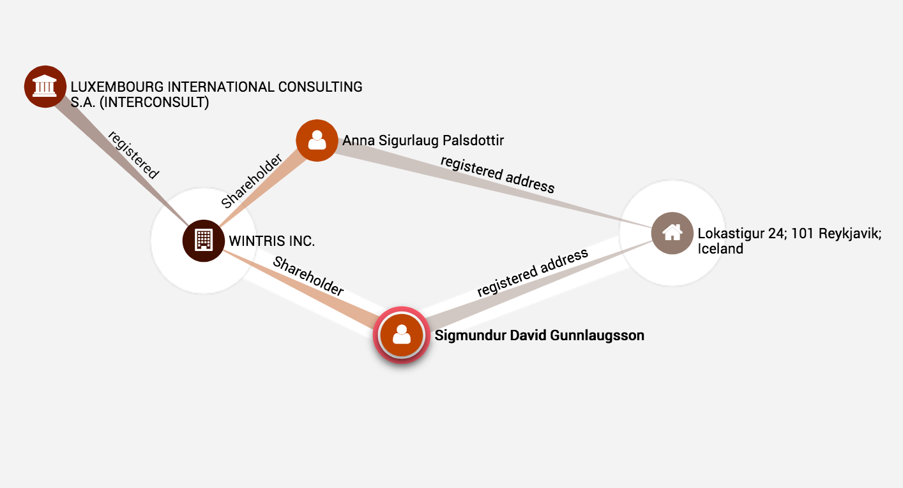
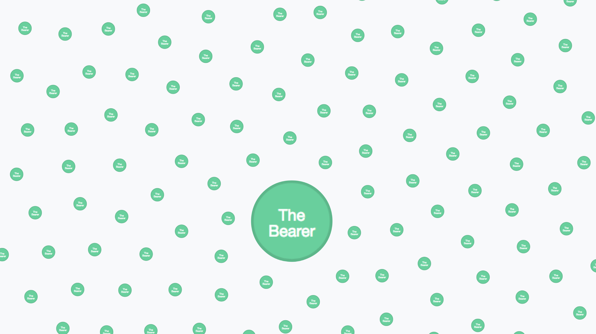
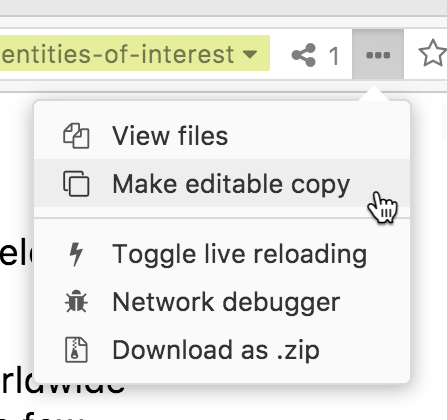
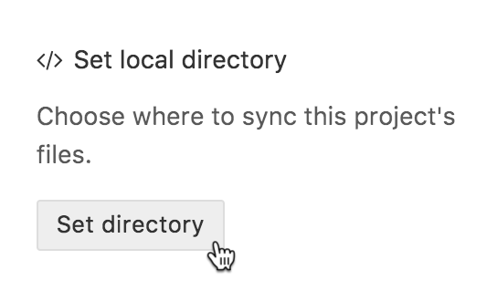
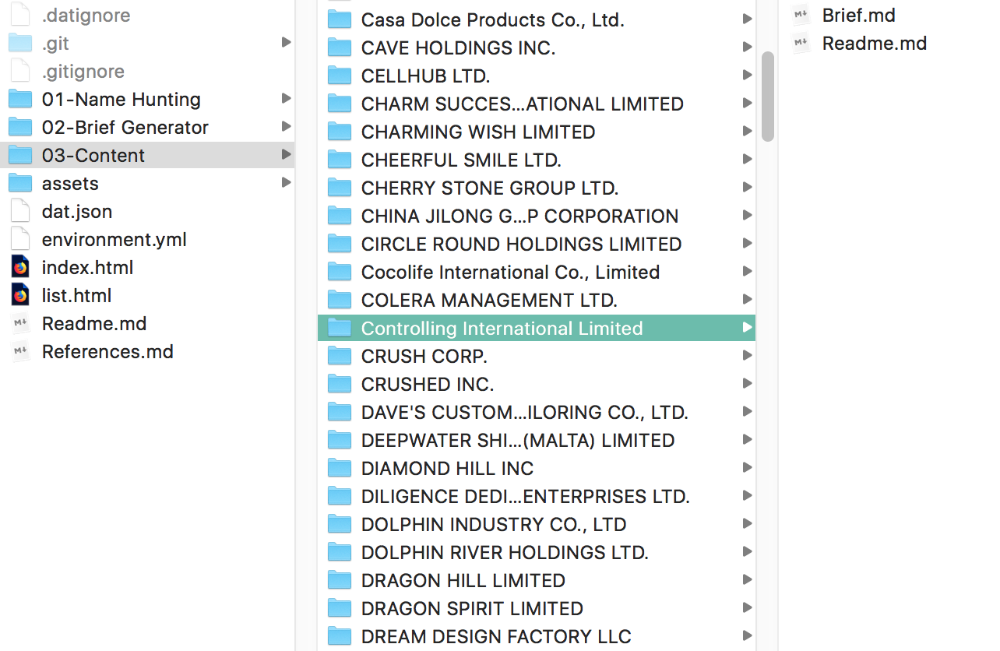

<link rel="stylesheet" type="text/css" href="assets/style.css">

#### [Entities of Interest](dat://ca97942d5e76114979be762b9025eb4a3e1f8e7a04b7b17f620da439800fdbbc/list.html)

[How to contribute](#contribute)  - [References](#references) - [Credits](#credits)

_Entities of Interest_ is a publication based on the Panama Papers graph-database released by the Internation Consortium of Investigative Journalists (ICIJ). This database is essentially a very big diagram (1.040.535 nodes connected by 3.071.104 relationships) which was used collaboratively by hundreds of journalists worldwide to 'connect the dots' between rich and powerful people, and the offshore shell companies they use to hide money from taxes. Since 2016, small parts of this graph have led to high impact news stories, for example forcing the prime minister of Iceland to resign.

>  The connections around [Sigmundur Davíð Gunnlaugsson](https://projects.icij.org/panama-papers/power-players/?lang=en#49), former prime minister of Iceland, on the ICIJ's [*Power Players*](https://projects.icij.org/panama-papers/power-players/). (visualisation: [Linkurious](https://linkurio.us/))

Outside of these focused high-impact areas of the graph, thousands of companies, "officers", and "intermediaries" did not get any press coverage; they took part in the offshore finance system without breaking any laws, or being public figures, or leaving a paper trail. Additionally, the leaked files themsleves—emails, PDFs, passport scans, etc—were not publicly released byt the ICIJ. Without any of the actual evidence, the graph of Panama Papers data is a vast but shallow web of information. This highlights that this story is not only about data being used to hold the rich and powerful to account, but also about the politics of missing data at the heart of offshore finance. *Not* having your name recorded with your bank account is the ultimate luxury.

> Searching for "The Bearer" in the ICIJ graph-database ([Neo4j](https://neo4j.com/) browser)

*Entites of Interest* is a workshop and publication which re-visits the Panama Papers database as a kind of digital ruin. It takes fragments of incomplete and outdated data as a starting point for attempts to fill in the gaps. With many of the corprate entities already marked as "dead", "defaulted", or otherwise de-activated at the time of the leak in 2015, it is unlikely that any more breaking news will come out of these data. Instead, *Entities of Interest* proposes a new, creative way to spend time with this information; an opportunity to think about the opacity of offshore finance, to speculate back, and to regain agency over it, however futile. The names of shell companies were selected for their evocative, poetic, or humorous qualities. They are presented here, along with their immediate surroundings in the graph, as design briefs inviting a response. As a counterpoint to the opaque web of the database, the results are distributed as a peer-to-peer website which anyone can explore, download, and modify. 

|      | name                                     | status    | incorporation_date | inactivation_date |
| ---: | :--------------------------------------- | :-------- | :----------------- | :---------------- |
|    0 | Famous Dragon Development Limited        | Dead      | 26-Jul-01          | nan               |
|    1 | GOLD DIGGER INTERNATIONAL LIMITED        | Dead      | 25-May-06          | nan               |
|    2 | POWER GLORY INTERNATIONAL LTD.           | Defaulted | 15-Apr-98          | 02-Nov-01         |
|    3 | In the Name of the Father Ltd            | Defaulted | 15-Jun-11          | 06-Nov-15         |
|    4 | Pure World Oil Services LTD.             | Defaulted | 26-Mar-04          | 03-Jan-12         |
|    5 | SUCCESS PEARL LIMITED                    | Defaulted | 21-Aug-02          | 19-Jan-15         |
|    6 | FRANCE PARTAKE LAUNDRY CO., LTD.         | Defaulted | 25-Aug-03          | 02-May-08         |
|    7 | Golden Profit Investments Limited        | Dead      | 18-Nov-94          | nan               |
|    8 | PLOUGH TIME LIMITED                      | Defaulted | 16-Feb-05          | 06-Nov-08         |
|    9 | Best Business International Holding Ltd. | Dead      | 12-Jan-04          | nan               |

> A sample of company names selected from the database.

## Contribute

You are invited to respond to any of the available names, the small ones in [the list](list.html).  
This can involve anything from an investigation using online [tools](#search-tools) to a complete fabrication. You can be a detective, an amateur sleuth, a screen-writer, a meme-artist, or anyone else!

1 - Browse the list. Click on a name to see the brief, this includes available information about the company and a visualisation of its neighbours in the graph.

2 - Using the [Beaker](https://beakerbrowser.com/) browser, make your own copy of this site

3 - Select a folder on your disk, this is where the website files will be downloaded. 

4 - Locate the folder for your chosen company

5 - Add content  
Once a company folder contains more that 2 files it is considered 'processed'. Its name is displayed in large type in the list, and clicking it directs to `Readme.md` instead of `Brief.md`. 

You can modify Readme.md as you wish using [markdown](https://github.com/adam-p/markdown-here/wiki/Markdown-Cheatsheet), for example by adding text or to display images you have added to the folder (``). You can also add html and css, for example to embed videos from Youtube or other sites. 

6 - Submit your contribution  
By default your contribution will only appear in your own copy of the site. If you want it to feature in the main site, you can either:  

Send a .zip of you company folder to [@magmd.uk email address?].

Submit a [pull request](https://github.com/davidbenque/Entities-of-Interest/pulls) on Github.

### Search Tools:

[ICIJ Offshore Leaks database](https://offshoreleaks.icij.org/)  
[Opencorporates](https://opencorporates.com/)  
[Companycheck](https://companycheck.co.uk/)

## References

[*The Panama Papers: Breaking the Story of How the Rich and Powerful Hide Their Money*](https://www.frederikobermaier.com/panama-papers/)
Book by Bastian Obermayer and Frederik Obermaier

[*Wrangling 2.6TB of data: The people and the technology behind the Panama Papers*](https://www.icij.org/blog/2016/04/data-tech-team-icij/)
Mar Cabra

Art/Design projects about the Panama Papers and offshore finance:
[*Loophole 4 All*](https://paolocirio.net/work/loophole-for-all)  - Paolo Cirio
[*The Great Offshore*](http://rybn.org/thegreatoffshore/?ln=en&r=THE%20GREAT%20OFFSHORE) - RYBN
[*Demystification Committee*](https://demystification.co/mmittee/)
[*Taxodus*](http://femkeherregraven.net/taxodus/) -  Femke Herregraven

Other relevant links:
[*The Download*](http://rhizome.org/editorial/tag/the-download-2), [*Urgent Archives*](https://youtu.be/XZUJA66qjf8) - Paul Soulellis
[*Either We Inspire Or We Expire*](https://vimeo.com/129768618) - Liam Gillick and Nate Silver

*Entities of Interest* is based on *SEEING-[:like]->a DIAGRAM*, see this [blog post](http://theairpump.davidbenque.com/seeing-like-a-diagram/) and [project reader](https://www.are.na/david-benque-1509961916/seeing-like-a-diagram) for more information.

## Credits

*Entities of Interest* was launched on 17th June 2018 as part of [(Re)distributed Media: Leakage](https://designmuseum.org/whats-on/talks-courses-and-workshops/redistributed-media-leakage) at the Design Museum in London, a weekend  of talks, performances, experiments, screenings and workshops  co-curated with the [MA Graphic Media Design](magmd.uk) course at London College of Communication (LCC).

Concept and design: [David Benqué](http://davidbenque.com/)  
[MAGMD](http://magmd.uk/) staff: Paul Bailey (course leader) and Tony Credland  
Workshop facilitated by MAGMD participants:  
Aadhya Baranwal  
Clara Wassak  
Hao Zhang  
Helen Taranowski  
Kit Chan  
Kwo Guo  
Qianxian Chen  
Rong Tang  
RuiQing Cao  
Shengtao Zhuang  
Sui Ki Law  
Xiaoqing Wang   